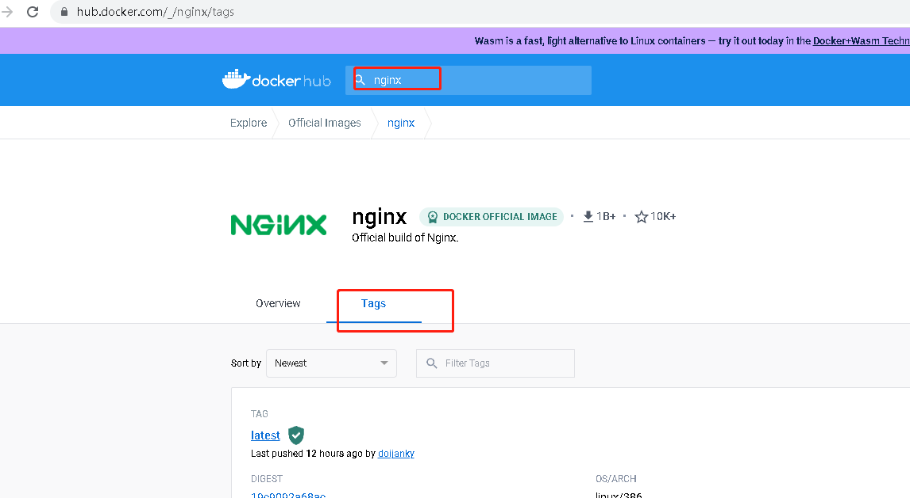

# Docker镜像和容器
关于镜像这个词，大家并不陌生，比如系统安装盘就叫镜像，另外我们常见的Ghost技术做的GHO系统镜像和这个Docker镜像非常像。我们可以将GHO镜像安装到任何计算机上，这样就拿到了跟源系统一模一样的系统。
当然Docker镜像也有它独特之处，比如它是分层的，这个后续在拉取镜像时可以看到。

Docker镜像拉取下来后，可以直接运行，运行后的东西我们叫做容器，一个镜像可以启动很多容器。

容器就是镜像启动后的状态，在Linux系统里看就是一个进程，但容器是可以进入得，就像进入了一个虚拟机里。


镜像就是Docker运行的程序，比如我们运行一个nginx镜像，那么Docker就会启动一个nginx服务。
```bash
# 配置阿里云加速器
cat > /etc/docker/daemon.json <<EOF
{
  "registry-mirrors": ["https://dhq9bx4f.mirror.aliyuncs.com"]
}
EOF

# 重启docker服务
systemctl restart docker

# 检查是否生效
docker info |grep -A 3 'Registry Mirrors'

# 拉取镜像
docker  pull  busybox
##这个busybox就是系统镜像名字，它是从hub.docker.com去拉取镜像

# 查看当前系统镜像
docker image ls
docker images

# 搜索镜像
docker search nginx

# 拉取指定版本镜像
docker pull  nginx:1.23.2
# 拉取最新版本镜像
docker pull  nginx

# 给镜像打标签
docker tag ac8efec875ce lwznginx:123
```
如果要查询镜像版本，可以访问[docker镜像官网](https://hub.docker.com/)，搜索对应的镜像名字，然后点tag进行查看  
  


容器就是镜像启动后的状态，比如我们运行一个nginx镜像，那么Docker就会启动一个nginx服务的容器。
```bash
# 拉取镜像并启动为容器，如果镜像已拉取，会直接启动；镜像未拉取，会先拉取再启动
docker run -itd nginx
##把镜像启动为容器，-i表示让容器的标准输入打开，-t表示分配一个伪终端，-d表示后台启动，要把-i -t -d 放到镜像名字前面

# 启动容器，并且在宿主机启动时自动启动
docker run -itd --restart=always nginx
##--restart=always 表示当容器退出时自动重启容器
##--restart=unless-stopped 表示容器在除了docker stop命令以外的任何情况下停止时会自动重启。

### 如果容器已经run过了，可以使用docker update命令更新其重启策略
docker update --restart=always 容器ID

# 查看容器，-a：显示所有容器（包括停止的）
docker ps -a

# 停止容器
docker stop 19e888103a8c
##后面这一串字符串为容器ID（CONTAINER ID），可以通过docker ps查看

# 删除容器。（如果容器未停止，会报错，需要加-f选项）
docker rm 19e888103a8c

# 删除镜像
docker rmi lwznginx:123
##这里因为lwznginx:123为nginx的一个tag，所以此操作只会删除此tag，并不会真正删镜像，如果该镜像没有tag，则直接删除镜像
# 或者指定镜像ID
docker rmi ac8efec875ce

# 启动容器时，给容器自定义名字
docker run --name lwz_nginx -itd nginx

# 容器运行后直接退出并删除
docker run --rm -it nginx bash -c "sleep 30"
##-c "sleep 30"表示容器运行30秒后退出并删除

# 进入容器操作nginx（基于debian系统，apt）
docker exec -it nginx bash
# 进入容器操作ubuntu（相当于虚拟机）
docker exec -it ubuntu bash
##在容器中可正常安装软件
apt update
apt install -y nginx
##在容器中查看系统版本
cat /etc/os-release

# 将容器重新打包成新镜像
[root@lwz1 ~]# docker commit -m "test nginx" -a "linyi" lwznginx nginx_debian:1.0
sha256:614188bfe1d2051b864eda3acfe2a63218b6caebe8766d4b94cb8717eed271bf
[root@lwz1 ~]# docker images
REPOSITORY     TAG       IMAGE ID       CREATED         SIZE
nginx_debian   1.0       614188bfe1d2   6 seconds ago   143MB

# 将镜像保存为一个文件
docker save nginx_debian -o nginx.img

# 将导出的镜像文件导入（已存在则覆盖）
docker load --input nginx.img

# 将容器导出为文件
docker export lwznginx > lwznginx.tar

# 将导出的容器文件导入为新的镜像
[root@lwz1 ~]# docker import - lwznginx_test < lwznginx.tar
sha256:647bc8239b05ff6093364a7e437c6b495a433dc5ed69f7894d8084611ecef75c
[root@lwz1 ~]# docker images
REPOSITORY      TAG       IMAGE ID       CREATED         SIZE
lwznginx_test   latest    647bc8239b05   4 seconds ago   141MB

## docker save和docker export的差异
docker save保存的是镜像，docker export保存的是容器
docker save会保留镜像所有的历史记录，docker export不会，即没有commit历史
docker load用来载入镜像包，docker import用来载入容器包，但两者都会恢复为镜像；
docker load不能对载入的镜像重命名，而docker import可以为镜像指定新名称。
```
```bash
# 查看容器ip地址（d4f8010cb4d0 为容器ID）
docker inspect -f '{{range .NetworkSettings.Networks}}{{.IPAddress}}{{end}}' d4f8010cb4d0
```