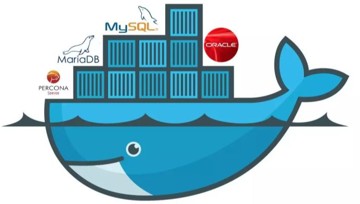
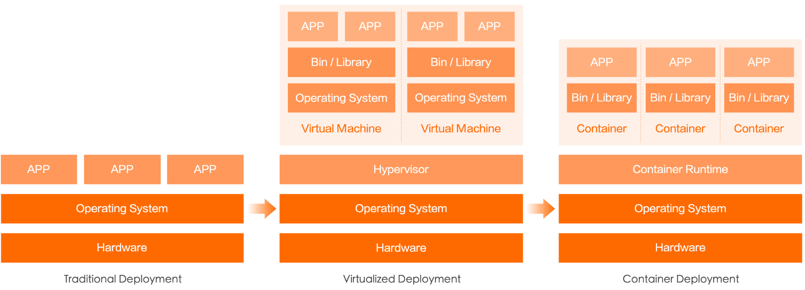
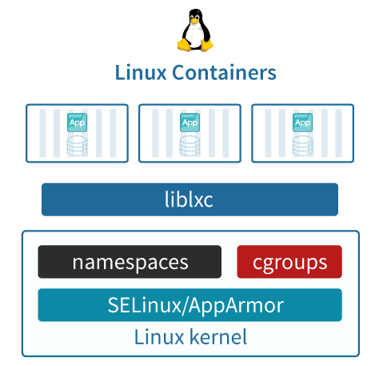
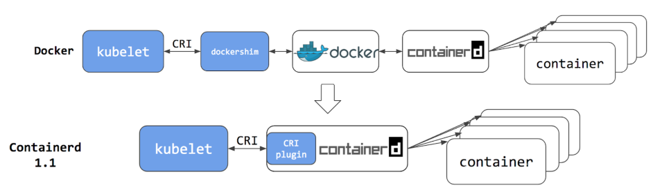

# 容器技术介绍

## 容器到底是啥
简单来说，它就是个小工具，可以把你想跑的程序，库文件啊，配置文件都一起“打包”。然后，我们在任何一个计算机的节点上，都可以使用这个打好的包。有了容器，一个命令就能把你想跑的程序跑起来，做到了一次打包，就可以到处使用。 比如我们可以把整套zabbix环境（httpd+php+mysql+zabbix-server）一起打包，然后给它搬到其它机器上直接运行。

有人把Docker和容器划等号，其实不对，Docker只是一个容器工具，而真正的容器技术是LXC（Linux Container），Docker只是更加方便地将其展现出来。  
  
容器就像上面图里的集装箱，每一个集装箱里面都是一个完整的应用，可以将其放到任意一台机器上运行起来。

## 容器与虚拟化
容器类似于虚拟化，但和虚拟化有本质区别  
  
虚拟化会使用虚拟机监控程序模拟硬件，从而使多个操作系统能够并行运行。但这不如容器轻便。  
Linux 容器在本机操作系统上运行，与所有容器共享该操作系统，因此应用和服务能够保持轻巧，并行化快速运行。Linux 容器是我们开发、部署和管理应用方式的又一次飞跃。  
Linux 容器镜像提供了可移植性和版本控制，确保能够在开发人员的笔记本电脑上运行的应用，同样也能在生产环境中正常运行。  
相较于虚拟机，Linux 容器在运行时所占用的资源更少，使用的是标准接口（启动、停止、环境变量等），并会与应用隔离开。  
此外，作为包含多个容器的大型应用的一部分时更加易于管理，而且这些多容器应用可以跨多个云环境进行编排。

## 容器基本概念
- **LXC：**  
是Linux Contain的缩写，就是Linux容器，是一个基于Linux内核功能特性实现轻量级虚拟化的技术。注意，Docker/Podman等容器技术，都是在LXC基础之上开发的三方工具。  
LXC可以在操作系统层次上为进程提供虚拟的执行环境，一个虚拟的执行环境就是一个容器。可以为容器绑定特定的cpu和memory节点，分配特定比例的cpu时间、IO时间，限制可以使用的内存大小（包括内存和是swap空间），提供device访问控制，提供独立的namespace（网络、pid、ipc、mnt、uts）。  

+ **容器的隔离：**  
容器有效地将操作系统管理的资源划分到独立的组中，并把各个独立的组进行隔离，可以让各自的组占用独立的资源，完成自己独立的任务。  
因为容器最终执行的命令也是调用统一的os api来实现，是基于整个os来实现的，所以不需要单独操作系统的编译系统、执行解释器，一切工作都是基于os 的基础上来完成的。  

    容器通过提供一种创建和进入容器的方式，让程序像跑在独立机器那样在容器中运行，并且相互之间不影响，而且还可以共享底层的资源。

- **容器的共享：** 
容器提供环境隔离的前提下，还提供了资源共享的机制，所以容器比真正kvm 虚拟机的资源要节省许多;

## 容器核心技术
- **chroot:**  
创建一个虚拟的根目录文件系统，其实质还是调用底层的文件系统，不过是建立一个虚拟的、可以跟其它容器的虚拟文件系统相互隔离、但共享底层的文件系统

+ **namespace:**  
命名空间可以提供一个进程相互隔离的独立网络空间，不同的容器间进程pid可以相同，进程并不冲突影响，但可以共享底层的计算和存储资源

- **cgroups:**  
实现了对容器的资源分配和限制，比如给容器A分配4颗CPU，8G 内存，那这个容器最多用这么多的资源。如果内存超过8G ，会启动swap，效率降低，也可能会被调
度系统给kill掉

## 企业为什么要使用容器技术
- **提升效率：**  
容器可以快速移植，这就意味着企业在开发、部署阶段快速搭建开发、测试环境，并快速部署到生产环境里。

+ **节省资源：**  
一台物理机上可以运行几百个甚至上千个容器，这如果换成传统的虚拟化技术，是根本做不到的。

- **节省运维成本：**  
使用主流的容器编排和管理工具(如，K8s），可以大大降低企业的运维成本，因为K8s本身集成了高可用、负载均衡、监控、自动修复等诸多功能，一旦上线，几乎不用花额外的运维成本。

## 跟容器相关的工具（只罗列具有代表性的）
- **Docker**  
Docker是一个开源的应用容器引擎，基于go语言开发并遵循了apache2.0协议开源。  
Docker诞生于2013年，它的出现推动了容器技术发展的步伐，使其突飞猛进、日新月异。可以说，没有Docker，就没有后续的K8s、云原生。  
学K8s之前，需要先学Docker，学会其镜像、容器、卷等概念。  

+ **Podman**  
Podman是一个开源项目，在Github上已有12k+Star，可在大多数Linux平台上使用。  
Podman是一个无守护进程的容器引擎，用于在Linux系统上开发、管理和运行OCI(Open Container Initiative)容器和容器镜像。  
Podman提供了一个与Docker兼容的命令行工具，可以简单地为docker命令取别名为podman即可使用，所以说如果你会Docker的话可以轻松上手Podman。  
目前在RHEL系统里默认自带了Podman，说明红帽公司更倾向于Podman。

- **Kubernetes（K8s)**  
    简单来说，Kubernetes 就是一个生产级别的容器编排平台和集群管理系统，不仅能够创建、调度容器，还能够监控、管理服务器，它凝聚了 Google 等大公司和开源社区的集体智慧，从而让中小型公司也可以具备轻松运维海量计算节点——也就是“云计算”的能力。

    作为世界上最大的搜索引擎，Google 拥有数量庞大的服务器集群，为了提高资源利用率和部署运维效率，它专门开发了一个集群应用管理系统，代号 Borg，在底层支持整个公司的运转。  
    2014 年，Google 内部系统要“升级换代”，从原来的 Borg 切换到 Omega，于是按照惯例，Google 会发表公开论文。在发论文的同时，把 C++ 开发的 Borg 系统用 Go 语言重写并开源，于是 Kubernetes 就这样诞生了。

    由于 Kubernetes 背后有 Borg 系统十多年生产环境经验的支持，技术底蕴深厚，理论水平也非常高，一经推出就引起了轰动。  
    然后在 2015 年，Google 又联合 Linux 基金会成立了 CNCF（Cloud Native Computing Foundation，云原生基金会），并把 Kubernetes 捐献出来作为种子项目。  
    有了 Google 和 Linux 这两大家族的保驾护航，再加上宽容开放的社区，作为 CNCF 的“头把交椅”，ubernetes 旗下很快就汇集了众多行业精英，仅用了两年的时间就打败了同期的竞争对手 Apache Mesos 和 Docker Swarm，成为了这个领域的唯一霸主。

# K8s弃用Docker
- **CRI**  
    K8s在1.5版本里，引入了一个新的接口标准：CRI（Container Runtime Interface），它主要用来规定如何调用容器运行时来管理容器和镜像，但这个接口标准和之前的Docker调用标准有不少差异，所以两者完全不兼容。这意味着，K8s可以撇开Docker，使用其它容器运行时（如rkt）。

    由于Docker用户非常庞大，K8s也意识到了直接不兼容Docker会有许多不确定风险，当时，K8s用了一个临时方案，在K8s和Docker中间开发了一个Dockershim，主要用来将Docker的接口标准转换成CRI标准。

+ **Containerd**  
    Docker意识到K8s的改变，为了迎合K8s，将Docker Engine拆分成多个模块，其中Docker Daemon部分捐献给了CNCF，也就是containerd。

    Containerd 作为 CNCF 的托管项目，自然是要符合 CRI 标准的。但 Docker 出于自己诸多原因的考虑，它只是在 Docker Engine 里调用了 containerd，外部的接口仍然保持不变，也就是说还不与 CRI 兼容。

    在当时的K8s版本里，实际上有两种方法调用容器：   
    第一种是用 CRI 接口调用 dockershim，然后 dockershim 调用 Docker，Docker 再走 containerd 去操作容器。  
    第二种是用 CRI 接口直接调用 containerd 去操作容器。  

      
    很明显，第一种方法多了两层调用，性能明显不如第二种方法。所以K8s决定将dockershim移除，所以也就不能直接使用Docker了，在外界看来就像是K8s弃用了Docker。

- **弃用dockershim**  
    2020年K8s发布1.20版本时，对外声明将在后续版本里（实际上是在22年的1.24版本里）移除dockershim，也就是取消对Docker的支持。当时，众多吃瓜群众理解错了意思，认为成了K8s弃用Docker。它实际上只是“弃用了 dockershim”这个小组件，也就是说把 dockershim 移出了 kubelet，并不是“弃用了 Docker”这个软件产品。

    这个举措对K8s 和 Docker 来说都不会有什么太大的影响，因为他们两个都早已经把下层都改成了开源的 containerd，原来的 Docker 镜像和容器仍然会正常运行，唯一的变化就是 K8s绕过了 Docker，直接调用 Docker 内部的 containerd 而已。

+ **K8s移除dockershim后对Docker的影响**  
    虽然现在 Kubernetes 不再默认绑定 Docker，但 Docker 还是能够以其他的形式与 Kubernetes 共存的。

    首先，因为容器镜像格式已经被标准化了（OCI 规范，Open Container Initiative），Docker 镜像仍然可以在 Kubernetes 里正常使用，原来的开发测试、CI/CD 流程都不需要改动，我们仍然可以拉取 Docker Hub 上的镜像，或者编写 Dockerfile 来打包应用。

    其次，Docker 是一个完整的软件产品线，不止是 containerd，它还包括了镜像构建、分发、测试等许多服务，甚至在 Docker Desktop 里还内置了 Kubernetes。单就容器开发的便利性来讲，Docker 还是暂时难以被替代的，广大云原生开发者可以在这个熟悉的环境里继续工作，利用 Docker 来开发运行在 Kubernetes 里的应用。

    再次，虽然 Kubernetes 已经不再包含 dockershim，但 Docker 公司却把这部分代码接管了过来，另建了一个叫 cri-dockerd的项目，作用也是一样的，把 Docker Engine 适配成 CRI 接口，这样 kubelet 就又可以通过它来操作 Docker 了，就仿佛是一切从未发生过。

    综合来看，Docker 虽然在容器编排战争里落败，被 Kubernetes 排挤到了角落，但它仍然具有强韧的生命力，多年来积累的众多忠实用户和数量庞大的应用镜像是它的最大资本和后盾，足以支持它在另一条不与 Kubernetes 正面交锋的道路上走下去。而对于我们这些初学者来说，Docker 方便易用，具有完善的工具链和友好的交互界面，市面上很难找到能够与它媲美的软件了，应该说是入门学习容器技术和云原生的“不二之选”。