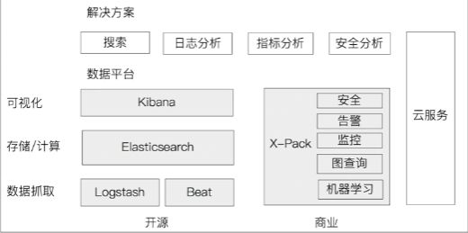
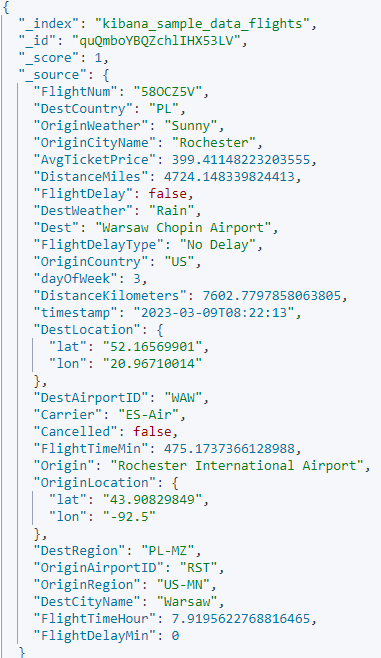

# ES介绍
Elasticsearch（后续简称ES） 是一个实时的分布式存储、搜索、分析的引擎。ES基于java开发，使用Lucene（全文检索引擎工具）作为其核心来实现所有索引和搜索功能，但是它的目的是通过简单的RESTful API来隐藏Lucene，从而使搜索变得简单。

[官网地址](https://www.elastic.co/cn/elasticsearch)

Elasticsearch是由Elastic公司开发，该公司已经上市。  
Elasticsearch社区非常活跃，有超过10w的社区成员。  
亚马逊云、阿里云、腾讯云都有提供Elasticsearch云服务。

ES主要特性：
- 海量数据的存储、分布式集群服务
- 服务与数据的高可用
- 实现水平扩展
- 近实时搜索和分析
- 性能卓越

Elasticsearch 2010年第一次发布，2012年成立公司，成立6个月，160w下载，首轮募资1000w美元。

Elastic生态
  
Logstash 2009年诞生，2013年被Elastic公司收购。  
Kibana最早基于Logstash创建的可视化工具，2013年加入Elastic公司。  
X-Pack于2018年开源。

## Elasticsearch使用场景
- **日志分析**  
将系统日志、应用日志收集起来存储到ES里，然后通过ES来分析和搜索这些日志，后面我们会将日志采集分析平台ELK，其中就用到了ES。

- **运维监控/指标分析**  
使用Elasticsearch和Kibana灵活的运用数据可视化运维看板，并在看板上展示主机信息，通过具体指标来监测主机状态，从而达到监控的目的。

- **安全分析/舆情监测**  
可通过Elasticsearch分析、检索海量历史日志，高效地完成安全审计工作。  
可以借助Elasticsearch的数据响应性能，快速感知系统中实时发生的事件，实时检索关键词，及时规避风险。

- **全文搜索**  
如果数据量很大（PB级），使用关系型数据库（如MySQL）去搜索关键字就非常慢，甚至说系统会崩溃，而如果使用ES来存储数据，并做搜索速度会非常快。这是ES的特性。

## Elasticsearch使用案例

| 产品 | 说明 |
| ---- | ---- |
| Github | 开源代码管理，搜索上千亿行代码 |
| Stack Overflow | 国外的程序异常讨论论坛，IT问题，程序的报错，提交上去，有人会跟你讨论和回答，全文检索，搜索相关问题和答案，程序报错了，就会将报错信息粘贴到里面去，搜索有没有对应的答案。|
| 维基百科 | 全文检索，搜索相关内容和答案，维基百科上会有人编辑，编辑的内容会实时更新到ES里，实时搜索相关内容和答案。|
| 携程 | 酒店订单、机票业务等，实时查询、搜索 |
| 滴滴 | 打车地图搜索，客服、运营的多维度查询 |

## Elasticsearch相关概念
- **索引 Index**  
索引可以理解成是一类文档的集合，它是存放文档的容器。  
有人把索引比喻成关系型中的库的概念，但我感觉更像是表的概念。

    索引的Mapping和Setting  
    Mapping定义文档字段的类型  
    Setting定义不同的数据分布，比如定义有多少分片、多少副本

- **类型 Type**  
之前的版本中，索引和文档中间有这个Type的概念，每个索引下可以建立多个类型，文档存储时需要指定index和type。从6.0.0开始已经被废弃，7.0开始单个索引中只能有一个类型（_doc）。  
弃用该概念的原因：  
我们虽然可以通俗的去理解Index比作 SQL 的 Database，Type比作SQL的Table。但这并不准确，因为如果在SQL中,Table 之前相互独立，同名的字段在两个表中毫无关系。  
但是在ES中，同一个Index 下不同的 Type 如果有同名的字段，他们会被 Luecence 当作同一个字段 ，并且他们的定义必须相同。所以我觉得Index现在更像一个表，
而Type字段并没有多少意义。在7.0开始，一个索引只能建一个Type为_doc，而在8.x版本里已经给隐藏了。

- **文档 Document**  
类似于关系型数据库某个表里面具体一行一行的数据记录。 文档是所有可搜索数据的最小单元。
比如，将日志记录进ES时，每一条日志就是一个文档。  
文档会被序列化成JSON格式。JSON对象由字段组成，每个字段都有对应的字段类型（如，字符串、数值、布尔、日期、二进制、范围）  
每个文档都有一个Unique ID  
以下就是一个文档的元数据  
  

- **分片 Shard**  
当使用ES集群时，一份完整的数据会分散开存到集群各个节点上，每个节点存一部分，这就是所谓的数据分片。当然，如果使用单机模式，也可以做分片，相当于是将一份数据分割开了存同一台机器上，单节点多分片没有啥意义，当然，如果想后期由单机改为集群，那有必要搞多分片。  
分片的存在解决了数据水平扩容，分片让ES可以存储巨量（上PB）的数据。  
主分片数在创建索引时，就被指定了，一旦创建，无法更改，除非进行Reindex。

- **副本 Replica**  
这个副本指的是数据分片的副本，为了保证数据高可用，需要设置副本，这个副本可以是多个，当一份数据出现异常，还有副本可以使用。在ES内部，是可以做到自动故障转移的，就是说一旦数据有问题，那么就会让其中一份副本顶上。

