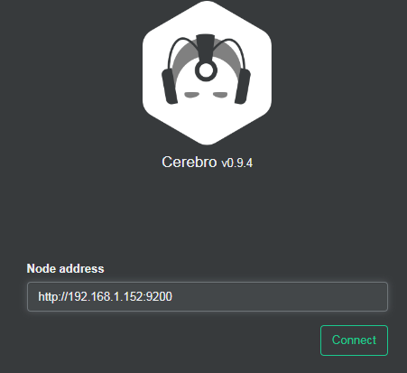
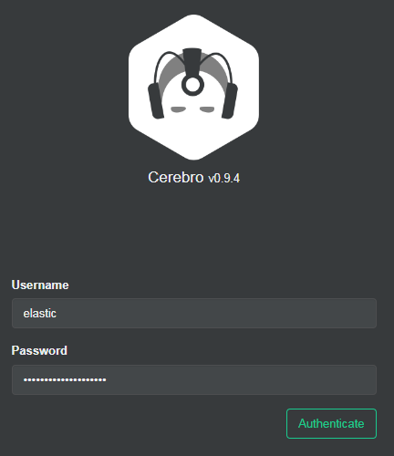
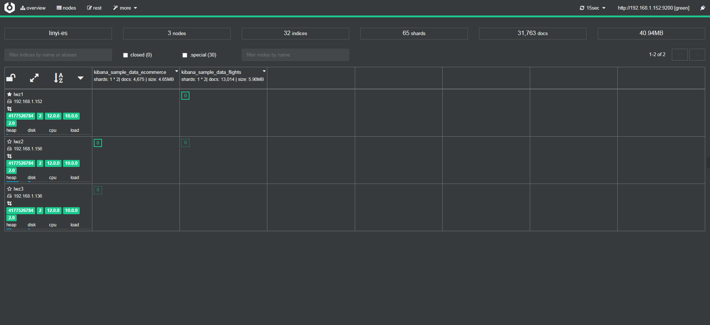

# ES集群可视化管理工具Cerebro
在任意节点上安装
```bash
# 下载、安装
wget https://github.com/lmenezes/cerebro/releases/download/v0.9.4/cerebro-0.9.4-1.noarch.rpm
yum install -y java-11-openjdk-devel.x86_64 java-11-openjdk.x86_64
yum localinstall cerebro-0.9.4-1.noarch.rpm

# 修改配置文件
vi /etc/cerebro/application.conf
##修改如下数据路径
data.path: "/var/lib/cerebro/cerebro.db"

# 启动服务
systemctl start cerebro
systemctl enable cerebro
```
浏览器访问：http://192.168.1.152:9000
用户名密码：elastic/sWoihyejRhx0*ybrJg8s  
  
  
  
- 上面的线为绿色表示正常的
- nodes：节点状态
- rest：api调用。可查看请求集群状态等信息。
