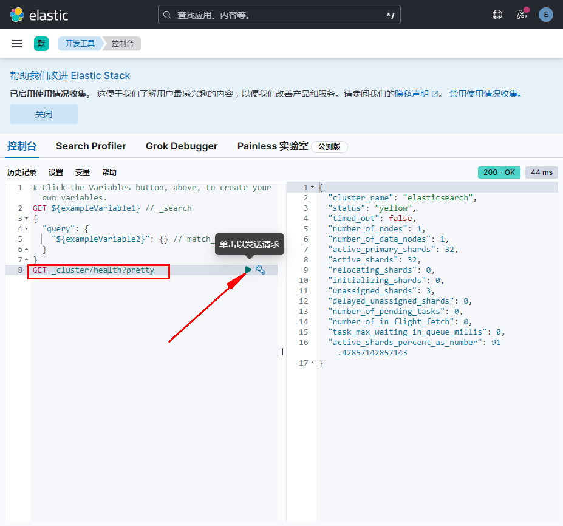

# 安装Kibana可视化ES
Kibana早期是为Logstash开发的可视化工具，于2013年被Elastic公司收购。

前面安装ES时，配置的yum仓库里就带有Kibana了，所以可以直接yum安装：
```bash
yum install --enablerepo=elasticsearch kibana -y

# 使用ES重置kibana-system用户密码
/usr/share/elasticsearch/bin/elasticsearch-reset-password -u kibana_system
##输出如下
Please confirm that you would like to continue [y/N] y
Password for the [kibana_system] user successfully reset.
New value: 9WOK8O61CBv2xpuXfCxz

# 编辑Kibana配置文件
vi /etc/kibana/kibana.yml
##将如下内容注释并修改
server.port: 5601
server.host: "0.0.0.0"
elasticsearch.hosts: ["http://192.168.1.152:9200"]
elasticsearch.username: "kibana_system"
elasticsearch.password: "9WOK8O61CBv2xpuXfCxz"
i18n.locale: "zh-CN"  ##支持中文界面

# 启动kibana
systemctl start kibana
systemctl enable kibana
```
浏览器访问：http://192.168.1.152:5601/  
  
使用elastic账号登录，密码为重置后的密码

  
找到添加数据，进入试用样例数据

  
将上图显示的样例数据安装

  
进入开发工具

  
根据图中的命令，点击命令后面的三角符号运行。  
上图中的命令示例为查看集群状态，可视化中更方便操作和查看。

