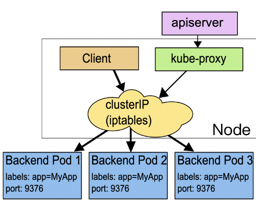
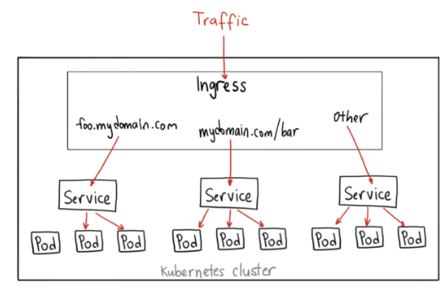
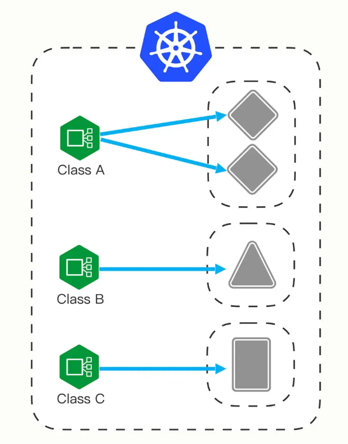

# K8s里的API对象
在K8s里，YAML用来声明API对象的，那么API对象都有哪些？我们之前接触过的pod、deployment、service、node都是，当然还有好多，可以这样查看：  
```bash
kubectl api-resources
```


## 资源对象：pod
```bash
# 获取pod列表
kubectl get pods

# 运行一个pod
kubectl run pod-demo --image=busybox

# 查看pod详情
kubectl describe pod pod-demo

# 从已知Pod导出YAML文件
kubectl get pod pod-demo -o yaml  -o yaml > pod-demo.yaml
```
### pod yaml示例
四个核心部分：apiVersion、Kind、metadata、spec  
其他部分可以不用管，也可以删掉

```yaml
vim testpod.yaml

#手动创建一个pod，直接复制下面内容
apiVersion: v1
kind: Pod
metadata:
  name: ngx-pod
  namespace: linyi
  labels:  ## labels字段非常关键，它可以添加任意数量的Key-Value，目的是为了让pod的信息更加详细
    env: dev

spec:  ##用来定义该pod更多的资源信息，比如contain, volume, storage
  containers:  ##定义容器属性
  - image: nginx:1.23.2
    imagePullPolicy: IfNotPresent  ##镜像拉取策略，三种：Always/Never/IfNotPresent，一般默认是IfNotPresent，也就是说只有本地不存在才会远程拉取镜像，可以减少网络消耗。
    name: ngx
    env:  ##定义变量，类似于Dockerfile里面的ENV指令
      - name: os
        value: "Rocky Linux"
    ports:
    - containerPort: 80
```
```bash
# 上述配置文件中的namespace没有的话，需要创建，不然会报错
kubectl create namespace linyi

# 使用yaml文件创建pod
kubectl apply -f testpod.yaml

# 查看pod（po为简写）
[root@linyi k8s]# kubectl get po -n linyi
NAME      READY   STATUS    RESTARTS   AGE
ngx-pod   1/1     Running   0          102s

# 查看pod详情。（这里有个问题，如果在虚拟机做测试，虚拟机长期挂起会导致这个pod启动有问题，重启k8s解决或重启k8s后删除这个pod重新创建）
kubectl describe po ngx-pod -n linyi

# 删除pod
kubectl delete pod ngx-pod

# 删除namespace
kubectl delete namespace linyi
```

## 资源对象：Job
可以理解成一次性运行后就退出的Pod。

先来生成一个YAML文件：
```bash
kubectl create job job-demo --image=busybox  --dry-run=client  -o yaml > job-demo.yaml
```
```yaml
# 编辑此配置
vim job-demo.yaml

apiVersion: batch/v1
kind: Job
metadata:
  name: job-demo
spec:
  template:  ##模板，基于此模板来创建pod，它用来定义pod的属性，比如container
    spec:
      restartPolicy: OnFailure ##定义Pod运行失败时的策略，可以是OnFailure和Never，其中OnFailure表示失败的话需要重启容器，Never表示失败的话不重启容器，而是重新生成一个新的Pod
      containers:
      - image: busybox
        name: job-demo
        command: ["/bin/echo"]
        args: ["hellow", "world"]
```
```bash
# 创建job
kubectl apply -f job-demo.yaml

# 查看job
kubectl get job,pod

# 查看job详情
kubectl describe job job-demo

# 删除job
kubectl delete job job-demo
```
可以看到该容器运行完成后状态就变成了Completed。

对于Job，还有几个特殊字段：
- activeDeadlineSeconds，设置 Pod 运行的超时时间。
- backoffLimit，设置 Pod 的失败重试次数。
- completions，Job 完成需要运行多少个 Pod，默认是 1 个。
- parallelism，它与 completions 相关，表示允许并发运行的 Pod 数量，避免过多占用资源。

vi  myjob.yaml
```yaml
apiVersion: batch/v1
kind: Job
metadata:
  name: sleep-job

spec:
  activeDeadlineSeconds: 15  #15s就超时
  backoffLimit: 2 #失败重试2次就放弃
  completions: 4 #要运行4个pod，才算完成
  parallelism: 2 #允许并发运行2个pod

  template:
    spec:
      restartPolicy: OnFailure
      containers:
      - image: busybox
        name: echo-job
        imagePullPolicy: IfNotPresent
        command:
          - sh
          - -c
          - sleep $(($RANDOM % 10 + 1)) && echo done  ##$(($RANDOM % 10 + 1))表示取1-10任意一个数字
```
```bash
# 创建job，并查看job情况
kubectl apply -f myjob.yaml ; kubectl get pod -w
```

## 资源对象：CronJob
CronJob简称（cj）是一种周期运行的Pod，比如有些任务需要每天执行一次，就可以使用CronJob。

先来生成一个YAML文件：
```bash
kubectl create cj cj-demo --image=busybox --schedule="" --dry-run=client  -o yaml > cj-demo.yaml
```
```yaml
# 编辑此配置
vim cj-demo.yaml

apiVersion: batch/v1
kind: CronJob
metadata:
  name: cj-demo

spec:
  schedule: '*/1 * * * *'
  jobTemplate:
    spec:
      template:
        spec:
          restartPolicy: OnFailure
          containers:
          - image: busybox
            name: cj-demo
            imagePullPolicy: IfNotPresent
            command: ["/bin/echo"]
            args: ["hello", "world"]
```
```bash
# 运行并查看
kubectl apply -f cj-demo.yaml
kubectl get cj
kubectl get pod
```

## 资源对象：ConfigMap
ConfigMap（简称cm）用来存储配置信息，比如服务端口、运行参数、文件路径等等。

示例：
```yaml
# 编辑配置
vim mycm.yaml

apiVersion: v1
kind: ConfigMap
metadata:
  name: mycm

data:
  DATABASE: 'db'
  USER: 'wp'
  PASSWORD: '123123'
  ROOT_PASSWORD: '123123'
```
```bash
# 创建cm
kubectl apply -f mycm.yaml

# 查看cm
kubectl get cm

# 查看cm详情
kubectl describe cm mycm

# 删除cm
kubectl delete cm mycm
```

在其它pod里引用ConfigMap：
```yaml
# 编辑配置
vim testpod.yaml

apiVersion: v1
kind: Pod
metadata:
  name: testpod
  labels:
    app: testpod

spec:
  containers:
  - image: mariadb:10
    name: maria
    imagePullPolicy: IfNotPresent
    ports:
    - containerPort: 3306

    envFrom:   ##将cm里的字段全部导入该pod
    - prefix: 'MARIADB_'  ##将导入的字段名前面自动加上前缀，例如MARIADB_DATABASE， MARIADB_USER
      configMapRef:  ##定义哪个cm
        name: mycm
```
验证：
```bash
kubectl exec -it testpod -- bash
## 进入pod，查看变量$MARIADB_DATABASE
```

## 资源对象：Secret
Secret和cm的结构和用法很类似，不过在 K8s里Secret 对象又细分出很多类，比如：
- 访问私有镜像仓库的认证信息
- 身份识别的凭证信息
- HTTPS 通信的证书和私钥
- 一般的机密信息（格式由用户自行解释）  

前几种我们现在暂时用不到，所以就只使用最后一种。

示例：
```yaml
# 编辑配置
vim mysecret.yaml

apiVersion: v1
kind: Secret
metadata:
  name: mysecret

data:
  user: YW1pbmc=   ## echo -n "linyi"|base64
  passwd: bGludXgxMjM=  ## echo -n "test123"|base64
```
查看
```bash
kubectl apply -f mysecret.yaml
kubectl get secret
kubectl describe secret mysecret
```
在其它pod里引用Secret
```yaml
# 编辑配置
vim testpod2.yaml
apiVersion: v1
kind: Pod
metadata:
  name: testpod2

spec:
  containers:
  - image: busybox
    name: busy
    imagePullPolicy: IfNotPresent
    command: ["/bin/sleep", "300"]

    env:
      - name: USERNAME
        valueFrom:
          secretKeyRef:
            name: mysecret
            key: user
      - name: PASSWORD
        valueFrom:
          secretKeyRef:
            name: mysecret
            key: passwd
```
查看
```bash
kubectl exec -it testpod2 -- sh
## 进去后可以 echo $PASSWORD查看变量值
```

## 资源对象：Deployment
示例
```yaml
vim ng-deploy.yaml

apiVersion: apps/v1
kind: Deployment
metadata:
  labels:
    app: myng
  name: ng-deploy
spec:
  replicas: 2 ##副本数
  selector:
    matchLabels:
      app: myng
  template:
    metadata:
      labels:
        app: myng
    spec:
      containers:
        - name: myng
          image: nginx:1.23.2
          ports:
          - name: myng-port
            containerPort: 80
```
matchLabels和labels之间的关系：  
  

```bash
# 使用YAML创建deploy
kubectl apply -f ng-deploy.yaml

# 查看deploy
kubectl get deploy

# 查看deploy详情
kubectl describe deploy ng-deploy

# 查看pod
kubectl get pod

# 删除deploy
kubectl delete deploy ng-deploy
```

## 资源对象：Service
Service（简称svc）是K8s集群中的一种资源对象，它定义了Pod的逻辑集合和访问该集合的策略。

示例：
```yaml
# 编辑配置
vim ng-svc.yaml

apiVersion: v1
kind: Service
metadata:
  name: ngx-svc
spec:
  selector:
    app: myng
  ports:
  - protocol: TCP
    port: 80
    targetPort: 80
```
```bash
# 使用YAML创建service
kubectl apply -f ng-svc.yaml

# 查看service
kubectl get svc

# 查看service详情
kubectl describe svc ngx-svc

# 删除service
kubectl delete svc ngx-svc
```

## 资源对象：Daemonset
有些场景需要在每一个node上运行Pod（比如，网络插件calico、监控、日志收集），Deployment无法做到，而Daemonset（简称ds）可以。Deamonset的目标是，在集群的每一个节点上运行且只运行一个Pod。  

Daemonset不支持使用kubectl create获取YAML模板，所以只能照葫芦画瓢了，参考Deployment的YAML编写，其实Daemonset和Deployment的差异很小，除了Kind不一样，还需要去掉replica配置。

示例：
```yaml
# 编辑配置
vim ds-demo.yaml

apiVersion: apps/v1
kind: DaemonSet
metadata:
  labels:
    app: ds-demo
  name: ds-demo
spec:
  selector:
    matchLabels:
      app: ds-demo
  template:
    metadata:
      labels:
        app: ds-demo
    spec:
      containers:
        - name: ds-demo
          image: nginx:1.23.2
          ports:
          - name: mysql-port
            containerPort: 80
```
```bash
# 使用YAML创建ds
kubectl apply -f ds-demo.yaml

# 查看ds
kubectl get ds

# 查看ds详情
kubectl describe ds ds-demo

# 查看pod
kubectl get pod

# 删除ds
kubectl delete ds ds-demo
```
但只在两个node节点上启动了pod，没有在master上启动，这是因为默认master有限制。
```bash
kubectl describe node k8s01 |grep -i 'taint'
Taints:             node-role.kubernetes.io/control-plane:NoSchedule
```
> 说明：  
> Taint叫做污点，如果某一个节点上有污点，则不会被调度运行pod。   
> 但是这个还得取决于Pod自己的一个属性：toleration（容忍），即这个Pod是否能够容忍目标节点是否有污点。  
> 为了解决此问题，我们可以在Pod上增加toleration属性，  
> 下面改一下YAML配置：
>  ```yaml
>  # 编辑配置
>  vim ds-demo.yaml
>
>  apiVersion: apps/v1
>  kind: DaemonSet
>  metadata:
>   labels:
>      app: ds-demo
>    name: ds-demo
>  spec:
>    selector:
>      matchLabels:
>        app: ds-demo
>    template:
>      metadata:
>        labels:
>          app: ds-demo
>      spec:
>        # 新增容忍污点
>        tolerations:
>          - key: node-role.kubernetes.io/control-plane
>            effect: NoSchedule
>        containers:
>          - name: ds-demo
>            image: nginx:1.23.2
>            ports:
>            - name: mysql-port
>              containerPort: 80
>
>
>  # 再次应用此YAML
>  kubectl apply -f ds-demo.yaml
>  ```


## 资源对象：Ingress/IngressClass
有了Service之后，我们可以访问这个Service的IP（clusterIP）来请求对应的Pod，但是这只能是在集群内部访问，要想实现外部访问，还需要额外的组件。  
  
要想让外部用户访问此资源，可以使用NodePort，即在node节点上暴漏一个端口出来，但是这个非常不灵活。为了解决此问题，K8s引入了一个新的API资源对象Ingress，它是一个七层的负载均衡器，类似于Nginx。  
  

三个概念：Ingress、Ingress Controller、IngressClass
- Ingress用来定义具体的路由规则，要实现什么样的访问效果；
- Ingress Controller是实现Ingress定义具体规则的工具或者叫做服务，在K8s里就是具体的Pod；
- IngressClass是介于Ingress和Ingress Controller之间的一个协调者，它存在的意义在于，当有多个Ingress Controller时，可以让Ingress和Ingress Controller彼此独立，不直接关联，而是通过IngressClass实现关联。  

  

Ingress YAML示例：
```yaml
# 编辑配置
vim mying.yaml

apiVersion: networking.k8s.io/v1
kind: Ingress
metadata:
  name: mying  ##ingress名字
  
spec:
  ingressClassName: myingc  ##定义关联的IngressClass
  
  rules:  ##定义具体的规则
  - host: linyi.com  ##访问的目标域名
    http:
      paths:
      - path: /
        pathType: Exact
        backend:  ##定义后端的service对象
          service:
            name: ngx-svc
            port:
              number: 80
```
```bash
# 查看ingress
kubectl get ing
kubectl describe ing mying
```

IngressClassYAML示例：
```yaml
# 编辑配置
vim myingc.yaml

apiVersion: networking.k8s.io/v1
kind: IngressClass
metadata:
  name: myingc

spec:
  controller: nginx.org/ingress-controller  ##定义要使用哪个controller
```
```bash
# 查看ingressclass
kubectl get ingressclass
kubectl describe ingressclass myingc
```

### 安装ingress-controller
使用Nginx官方提供的[ingress-controller](https://github.com/nginxinc/kubernetes-ingress)  

首先做一下前置工作
```bash
curl -O 'https://gitee.com/aminglinux/linux_study/raw/master/k8s/ingress.tar.gz'
tar zxf ingress.tar.gz
cd ingress
./setup.sh
##说明，执行这个脚本会部署几个ingress相关资源，包括namespace、configmap、secrect等
```
```yaml
# 编辑配置
vim ingress-controller.yaml

apiVersion: apps/v1
kind: Deployment
metadata:
  name: ngx-ing
  namespace: nginx-ingress

spec:
  replicas: 1
  selector:
    matchLabels:
      app: ngx-ing

  template:
    metadata:
      labels:
        app: ngx-ing
     #annotations:
       #prometheus.io/scrape: "true"
       #prometheus.io/port: "9113"
       #prometheus.io/scheme: http
    spec:
      serviceAccountName: nginx-ingress
      containers:
      #- image: nginx/nginx-ingress:2.2.0
      - image: nginx/nginx-ingress:2.2-alpine
        imagePullPolicy: IfNotPresent
        name: ngx-ing
        ports:
        - name: http
          containerPort: 80
        - name: https
          containerPort: 443
        - name: readiness-port
          containerPort: 8081
        - name: prometheus
          containerPort: 9113
        readinessProbe:
          httpGet:
            path: /nginx-ready
            port: readiness-port
          periodSeconds: 1
        securityContext:
          allowPrivilegeEscalation: true
          runAsUser: 101 #nginx
          capabilities:
            drop:
            - ALL
            add:
            - NET_BIND_SERVICE
        env:
        - name: POD_NAMESPACE
          valueFrom:
            fieldRef:
              fieldPath: metadata.namespace
        - name: POD_NAME
          valueFrom:
            fieldRef:
              fieldPath: metadata.name
        args:
          - -ingress-class=myingc
          - -health-status
          - -ready-status
          - -nginx-status

          - -nginx-configmaps=$(POD_NAMESPACE)/nginx-config
          - -default-server-tls-secret=$(POD_NAMESPACE)/default-server-secret
```
```bash
# 应用YAML
kubectl apply -f ingress-controller.yaml

# 查看pod、deployment
kubectl get po -n nginx-ingress
kubectl get deploy -n nginx-ingress
```
测试：
```bash
# 将ingress对应的pod端口映射到master上临时测试
kubectl port-forward -n nginx-ingress ngx-ing-547d6575c7-fhdtt 8888:80 &  

# 测试前，可以修改ng-deploy对应的两个pod里的/usr/share/nginx/html/index.html文件内容，用于区分两个pod

# 测试访问
curl -x127.0.0.1:8888 linyi.com
## 或者：
curl -H 'Host:linyi.com' http://127.0.0.1:8888
```

## API资源对象PersistentVolume/PersistentVolumeClaim/StorageClass
持久化相关

三个概念：
- **PersistentVolume（pv）**：  
是对具体存储资源的描述，比如NFS、Ceph、GlusterFS等，通过pv可以访问到具体的存储资源；
+ **PersistentVolumeClaim（pvc）**：  
Pod想要使用具体的存储资源需要对接到pvc，pvc里会定义好pod希望使用存储的属性，通过pvc再去申请合适的存储资源（pv），匹配到合适的资源后pvc和pv会进行绑定，它们两者是一一对应的；
- **StorageClass（sc）**：  
pv可以手动创建，也可以自动创建，当pv需求量非常大时，如果靠手动创建pv就非常麻烦了，sc可以实现自动创建pv，并且会将pvc和pv绑定。  
sc对象会定义两部分内容：①pv的属性，比如存储类型、大小；②创建该pv需要用到的存储插件（provisioner），这个provisioner是实现自动创建pv的关键。

### 案例一（pv手动创建）：

PV YAML示例：
```yaml
vi  testpv.yaml

apiVersion: v1
kind: PersistentVolume
metadata:
  name: testpv

spec:
  accessModes:
  - ReadWriteOnce
  capacity:
    storage: 500Mi  ##提供500Mi空间
  hostPath:
    path: /tmp/testpv/
```
说明：
accessModes定义该pv的访问权限模式，有三种：
- ReadWriteOnce：存储卷可读可写，但只能被一个节点上的 Pod 挂载;
- ReadOnlyMany：存储卷只读不可写，可以被任意节点上的 Pod 多次挂载;
- ReadWriteMany：存储卷可读可写，也可以被任意节点上的 Pod 多次挂载;

capacity 定义该存储大小。
hostPath 定义该存储访问路径。

PVC YAML示例：
```yaml
vi  testpvc.yaml

apiVersion: v1
kind: PersistentVolumeClaim
metadata:
  name: testpvc

spec:
  accessModes:
    - ReadWriteOnce
  resources:
    requests:
      storage: 100Mi  ##期望申请100Mi空间
```
```bash
# 应用pv和pvc的YAML
kubectl apply -f testpv.yaml -f testpvc.yaml

# 查看状态
kubectl get pv,pvc
```
实验： 
将testpvc的期望100Mi改为1000Mi，查看pv的STATUS