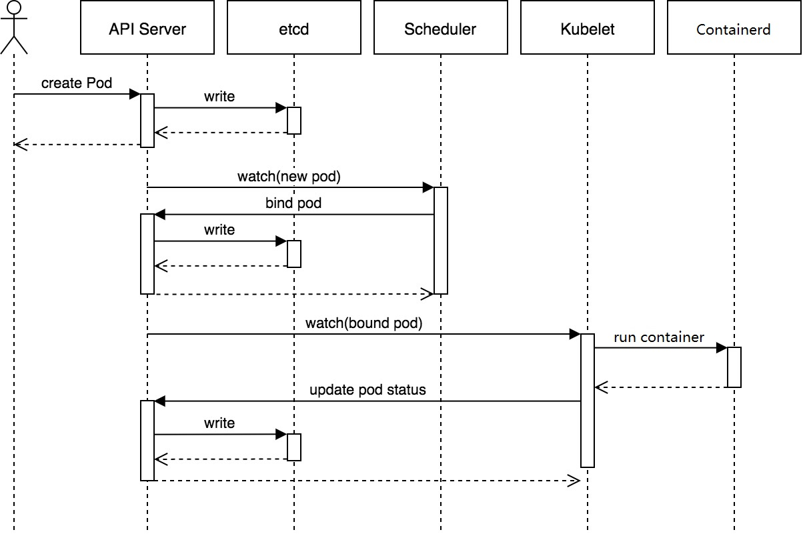
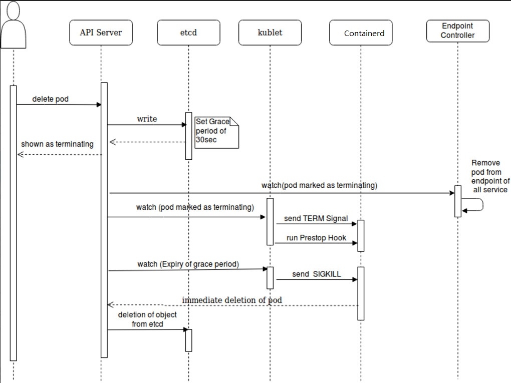
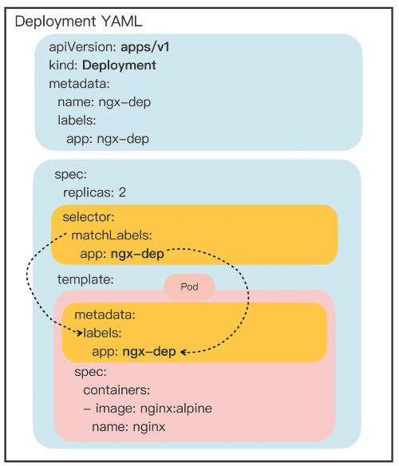
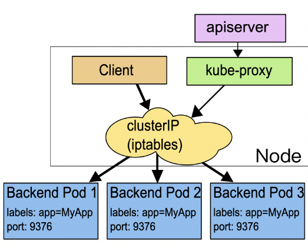
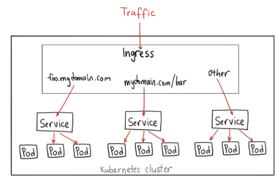
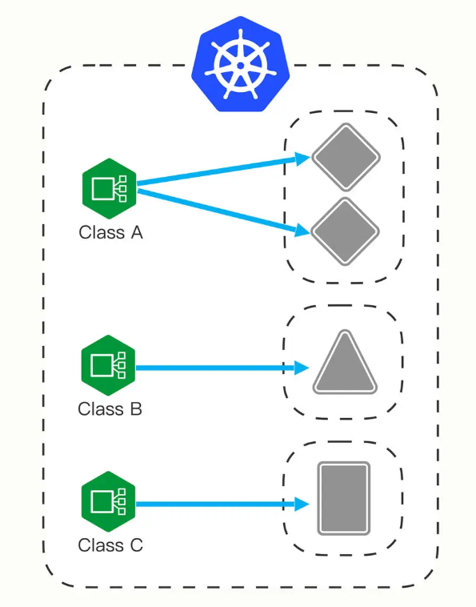

# K8s里的API对象
在K8s里，YAML用来声明API对象的，那么API对象都有哪些？我们之前接触过的pod、deployment、service、node都是，当然还有好多，可以这样查看：  
```bash
kubectl api-resources
```


## 资源对象：pod
```bash
# 获取pod列表
kubectl get pods

# 运行一个pod
kubectl run pod-demo --image=busybox

# 查看pod详情
kubectl describe pod pod-demo

# 从已知Pod导出YAML文件
kubectl get pod pod-demo -o yaml > pod-demo.yaml
```
### pod yaml示例
四个核心部分：apiVersion、Kind、metadata、spec  
其他部分可以不用管，也可以删掉

```yaml
vim testpod.yaml

#手动创建一个pod，直接复制下面内容
apiVersion: v1
kind: Pod
metadata:
  name: ngx-pod
  namespace: linyi
  labels:  ## labels字段非常关键，它可以添加任意数量的Key-Value，目的是为了让pod的信息更加详细
    env: dev

spec:  ##用来定义该pod更多的资源信息，比如contain, volume, storage
  containers:  ##定义容器属性
  - image: nginx:1.23.2
    imagePullPolicy: IfNotPresent  ##镜像拉取策略，三种：Always/Never/IfNotPresent，一般默认是IfNotPresent，也就是说只有本地不存在才会远程拉取镜像，可以减少网络消耗。
    name: ngx
    env:  ##定义变量，类似于Dockerfile里面的ENV指令
      - name: os
        value: "Rocky Linux"
    ports:
    - containerPort: 80
```
```bash
# 上述配置文件中的namespace没有的话，需要创建，不然会报错
kubectl create namespace linyi

# 使用yaml文件创建pod
kubectl apply -f testpod.yaml

# 查看pod（po为简写）
[root@linyi k8s]# kubectl get po -n linyi
NAME      READY   STATUS    RESTARTS   AGE
ngx-pod   1/1     Running   0          102s

# 查看pod详情。（这里有个问题，如果在虚拟机做测试，虚拟机长期挂起会导致这个pod启动有问题，重启k8s解决或重启k8s后删除这个pod重新创建）
kubectl describe po ngx-pod -n linyi

# 删除pod
kubectl delete pod ngx-pod

# 删除namespace
kubectl delete namespace linyi
```

## Pod原理和生命周期
### Pod原理
Pod 是在K8s集群中运行部署应用或服务的最小单元。

在同一个Pod中其实可以同时运行多个容器，这些容器能够共享网络、存储以及 CPU/内存等资源。

每个Pod都有一个特殊的被称为 “根容器” 的Pause容器。Pause容器的主要作用是为Pod中的其他容器提供一些基本的功能，比如网络和PID命名空间的共享、 负责管理Pod内其他容器的生命周期。
- 网络命名空间共享：pause容器为整个Pod创建一个网络命名空间，Pod内的其他容器都将加入这个网络命名空间。这样，Pod中的所有容器都可以共享同一个IP地址和端口空间，从而实现容器间的紧密通信。
- PID命名空间共享：pause容器充当Pod内其他容器的父容器，它们共享同一个PID命名空间。这使得Pod内的容器可以通过进程ID直接发现和相互通信，同时也使得Pod具有一个统一的生命周期。
- 生命周期管理：pause容器作为Pod中其他容器的父容器，负责协调和管理它们的生命周期。当pause容器启动时，它会成为Pod中其他容器的根容器。当pause容器终止时，所有其他容器也会被自动终止，确保了整个Pod的生命周期的一致性。
- 保持Pod状态：pause容器保持运行状态，即使Pod中的其他容器暂时停止或崩溃，也可以确保Pod保持活跃。这有助于Kubernetes更准确地监视和管理Pod的状态。

### Pod生命周期（运行状态）
Pod生命周期包括以下几个阶段：
- **Pending**：在此阶段，Pod已被创建，但尚未调度到运行节点上。此时，Pod可能还在等待被调度，或者因为某些限制（如资源不足）而无法立即调度。
- **Running**：在此阶段，Pod已被调度到一个节点，并创建了所有的容器。至少有一个容器正在运行，或者正在启动或重启。
- **Succeeded**：在此阶段，Pod中的所有容器都已成功终止，并且不会再次重启。
- **Failed**：在此阶段，Pod中的至少一个容器已经失败（退出码非零）。这意味着容器已经崩溃或以其他方式出错。
- **Unknown**：在此阶段，Pod的状态无法由Kubernetes确定。这通常是因为与Pod所在节点的通信出现问题。

除了这些基本的生命周期阶段之外，还有一些更详细的容器状态，用于描述容器在Pod生命周期中的不同阶段：
- **ContainerCreating**：容器正在创建，但尚未启动。
- **Terminating**：容器正在终止，但尚未完成。
- **Terminated**：容器已终止。
- **Waiting**：容器处于等待状态，可能是因为它正在等待其他容器启动，或者因为它正在等待资源可用。
- **Completed**：有一种Pod是一次性的，不需要一直运行，只要执行完就会是此状态。

### 创建Pod流程
  
1. 用户通过kubectl或其他API客户端提交Pod对象给API server。
2. API server尝试将Pod对象的相关信息存入etcd中，写入操作完成后API server会返回确认信息至客户端。
3. API server开始反映etcd中的状态变化。
4. 所有的Kubernetes组件均使用watch机制来跟踪检查API server上的相关变化。
5. Kube-scheduler通过其watcher观察到API server创建了新的Pod对象但尚未绑定至任何节点。
6. Kube-scheduler为Pod对象挑选一个工作节点并将结果更新至API server。
7. 调度结果由API server更新至etcd，而且API server也开始反映此Pod对象的调度结果。
8. Pod 被调度的目标工作节点上的kubelet尝试在当前节点上调用Containerd启动容器，并将容器的结果状态返回至API server。
9. API server将Pod 状态信息存入etcd。
10. 在etcd确认写操作完成后，API server将确认信息发送至相关的kubelet。

### 删除Pod流程
  
1. 请求删除Pod。
2. API server将Pod标记为Terminating状态。
3. （与第 2 步同时进行）kubelet在监控到Pod对象转为Terminating状态的同时启动Pod关闭过程。
4. （与第 2 步同时进行）Service将Endpoint摘除。
5. 如果当前Pod对象定义了preStop hook，则在其标记为Terminating后会以同步的方式执行，宽限期开始计时。
6. Pod中的容器进程收到TERM信号。
7. 宽限期结束后，若进程仍在运行，会收到SIGKILL信号。
8. kubelet请求API server将此Pod对象的宽限期设置为0，从而完成删除操作。

## Pod资源限制
### Resource Quota
资源配额Resource Quotas（简称quota）是对namespace进行资源配额，限制资源使用的一种策略。 

K8S是一个多用户架构，当多用户或者团队共享一个K8S系统时，SA使用quota防止用户（基于namespace的）的资源抢占，定义好资源分配策略。

Quota应用在Namespace上，默认情况下，没有Resource Quota的，需要另外创建Quota，并且每个Namespace最多只能有一个Quota对象。

可限定资源类型：  
- 计算资源：limits.cpu、requests.cpu、limits.memory、requests.memory  
- 存储资源，包括存储资源的总量以及指定storage class的总量  
  - requests.storage：存储资源总量，如500Gi  
  - persistentvolumeclaims：pvc的个数

对象数，即可创建的对象的个数  
- pods, replicationcontrollers, configmaps, secrets，persistentvolumeclaims，services, services.loadbalancers,services.nodeports

**注意**：  
Quota依赖于资源管理器，可以使用资源对象limits或者在创建资源对象时为pod设置资源限制（resources），如果不设置，资源对象无法创建。  
当该namespace中的任意个额度达到预设Quota时，将无法创建资源对象。

Resource Quota示例：
```bash
cat > quota.yaml <<EOF

apiVersion: v1
kind: ResourceQuota
metadata:
  namespace: linyi
  name: linyi-quota

spec:
  hard:
    pods: 50  ## 该命名空间里最多支持启动50个Pods
    requests.cpu: 0.5 ##最低保证0.5个CPU资源
    requests.memory: 512Mi ##最低保证512M内存
    limits.cpu: 5  ##最多使用5核CPU
    limits.memory: 16Gi ##最多使用16G内存
    configmaps: 20 ##最多支持20个configMaps
    persistentvolumeclaims: 20 ##最多支持20个pvc
    replicationcontrollers: 20 ##最多支持20个replicationControllers
    secrets: 20 ##最多支持20个secrets
    services: 50 ##最多支持50个services
EOF

# 生效
kubectl apply -f quota.yaml

# 查看
kubectl get quota -n linyi
```
测试：  
（为了显示限额效果，修改quota.yaml，将pod限制数改为5，其它先删除掉）
```bash
# 命令行创建deployment，指定Pod副本为7
kubectl create deployment testdp --image=nginx:1.23.2 -n linyi --replicas=7

# 查看deployment和pod
kubectl get deploy,po -n linyi

# 删除deployment
kubectl delete deploy testdp -n linyi
```

### Pod的limits和requests
Resource Quota是针对namespace下面所有的Pod的限制，而Pod自身也有限制。  

示例：
```yaml
cat > quota-pod.yaml <<EOF

apiVersion: v1
kind: Pod
metadata:
  name: quota-pod
  namespace: linyi

spec:
  containers:
  - image: nginx:1.23.2
    name: ngx
    imagePullPolicy: IfNotPresent
    ports:
    - containerPort: 80
    resources:
      limits:
        cpu: 0.5  ##限制Pod CPU资源最多使用500m，这里的0.5=500m，1=1000m
        memory: 2Gi ##限制内存资源最多使用2G
      requests:
        cpu: 200m  ##K8s要保证Pod使用的最小cpu资源为200m，如果node上资源满足不了，则不会调度到该node上
        memory: 512Mi ##K8s要保证Pod使用最小内存为512M，如果node上资源满足不了，则不会调度到该node上
EOF
```

## 资源对象：Job
可以理解成一次性运行后就退出的Pod。

先来生成一个YAML文件：
```bash
kubectl create job job-demo --image=busybox  --dry-run=client  -o yaml > job-demo.yaml
```
```yaml
# 编辑此配置
vim job-demo.yaml

apiVersion: batch/v1
kind: Job
metadata:
  name: job-demo
spec:
  template:  ##模板，基于此模板来创建pod，它用来定义pod的属性，比如container
    spec:
      restartPolicy: OnFailure ##定义Pod运行失败时的策略，可以是OnFailure和Never，其中OnFailure表示失败的话需要重启容器，Never表示失败的话不重启容器，而是重新生成一个新的Pod
      containers:
      - image: busybox
        name: job-demo
        command: ["/bin/echo"]
        args: ["hellow", "world"]
```
```bash
# 创建job
kubectl apply -f job-demo.yaml

# 查看job
kubectl get job,pod

# 查看job详情
kubectl describe job job-demo

# 删除job
kubectl delete job job-demo
```
可以看到该容器运行完成后状态就变成了Completed。

对于Job，还有几个特殊字段：
- activeDeadlineSeconds，设置 Pod 运行的超时时间。
- backoffLimit，设置 Pod 的失败重试次数。
- completions，Job 完成需要运行多少个 Pod，默认是 1 个。
- parallelism，它与 completions 相关，表示允许并发运行的 Pod 数量，避免过多占用资源。

vi  myjob.yaml
```yaml
apiVersion: batch/v1
kind: Job
metadata:
  name: sleep-job

spec:
  activeDeadlineSeconds: 15  #15s就超时
  backoffLimit: 2 #失败重试2次就放弃
  completions: 4 #要运行4个pod，才算完成
  parallelism: 2 #允许并发运行2个pod

  template:
    spec:
      restartPolicy: OnFailure
      containers:
      - image: busybox
        name: echo-job
        imagePullPolicy: IfNotPresent
        command:
          - sh
          - -c
          - sleep $(($RANDOM % 10 + 1)) && echo done  ##$(($RANDOM % 10 + 1))表示取1-10任意一个数字
```
```bash
# 创建job，并查看job情况
kubectl apply -f myjob.yaml ; kubectl get pod -w
```

## 资源对象：CronJob
CronJob简称（cj）是一种周期运行的Pod，比如有些任务需要每天执行一次，就可以使用CronJob。

先来生成一个YAML文件：
```bash
kubectl create cj cj-demo --image=busybox --schedule="" --dry-run=client  -o yaml > cj-demo.yaml
```
```yaml
# 编辑此配置
vim cj-demo.yaml

apiVersion: batch/v1
kind: CronJob
metadata:
  name: cj-demo

spec:
  schedule: '*/1 * * * *'
  jobTemplate:
    spec:
      template:
        spec:
          restartPolicy: OnFailure
          containers:
          - image: busybox
            name: cj-demo
            imagePullPolicy: IfNotPresent
            command: ["/bin/echo"]
            args: ["hello", "world"]
```
```bash
# 运行并查看
kubectl apply -f cj-demo.yaml
kubectl get cj
kubectl get pod
```

## 资源对象：ConfigMap
ConfigMap（简称cm）用来存储配置信息，比如服务端口、运行参数、文件路径等等。

示例：
```yaml
# 编辑配置
vim mycm.yaml

apiVersion: v1
kind: ConfigMap
metadata:
  name: mycm

data:
  DATABASE: 'db'
  USER: 'wp'
  PASSWORD: '123123'
  ROOT_PASSWORD: '123123'
```
```bash
# 创建cm
kubectl apply -f mycm.yaml

# 查看cm
kubectl get cm

# 查看cm详情
kubectl describe cm mycm

# 删除cm
kubectl delete cm mycm
```

在其它pod里引用ConfigMap：
```yaml
# 编辑配置
vim testpod.yaml

apiVersion: v1
kind: Pod
metadata:
  name: testpod
  labels:
    app: testpod

spec:
  containers:
  - image: mariadb:10
    name: maria
    imagePullPolicy: IfNotPresent
    ports:
    - containerPort: 3306

    envFrom:   ##将cm里的字段全部导入该pod
    - prefix: 'MARIADB_'  ##将导入的字段名前面自动加上前缀，例如MARIADB_DATABASE， MARIADB_USER
      configMapRef:  ##定义哪个cm
        name: mycm
```
验证：
```bash
kubectl exec -it testpod -- bash
## 进入pod，查看变量$MARIADB_DATABASE
```

## 资源对象：Secret
Secret和cm的结构和用法很类似，不过在 K8s里Secret 对象又细分出很多类，比如：
- 访问私有镜像仓库的认证信息
- 身份识别的凭证信息
- HTTPS 通信的证书和私钥
- 一般的机密信息（格式由用户自行解释）  

前几种我们现在暂时用不到，所以就只使用最后一种。

示例：
```yaml
# 编辑配置
vim mysecret.yaml

apiVersion: v1
kind: Secret
metadata:
  name: mysecret

data:
  user: YW1pbmc=   ## echo -n "linyi"|base64
  passwd: bGludXgxMjM=  ## echo -n "test123"|base64
```
查看
```bash
kubectl apply -f mysecret.yaml
kubectl get secret
kubectl describe secret mysecret
```
在其它pod里引用Secret
```yaml
# 编辑配置
vim testpod2.yaml
apiVersion: v1
kind: Pod
metadata:
  name: testpod2

spec:
  containers:
  - image: busybox
    name: busy
    imagePullPolicy: IfNotPresent
    command: ["/bin/sleep", "300"]

    env:
      - name: USERNAME
        valueFrom:
          secretKeyRef:
            name: mysecret
            key: user
      - name: PASSWORD
        valueFrom:
          secretKeyRef:
            name: mysecret
            key: passwd
```
查看
```bash
kubectl exec -it testpod2 -- sh
## 进去后可以 echo $PASSWORD查看变量值
```

## 资源对象：Deployment
Deployment是K8s集群中的一种资源对象，它表示一组Pod副本的集合，这些Pod副本的定义完全一致。可以理解为批量创建pod的副本集，以及能够定义Pod的启动策略。

Deployment的定义文件通常包含以下几个部分：
- apiVersion：指定API版本，例如apps/v1
- kind：指定资源类型，例如Deployment
- metadata：指定资源的元数据
- spec：指定部署的详细定义
  - replicas：指定副本数量，默认为1
  - selector：指定Pod标签选择器
  - template：指定Pod模板
    - metadata：指定Pod的元数据
    - spec：指定Pod的详细定义
      - containers：指定Pod的容器列表
        - name：指定容器的名称
        - image：指定容器的镜像
        - ports：指定容器的端口列表
          - name：指定端口的名称
          - containerPort：指定容器要监听的端口号

示例
```yaml
vim ng-deploy.yaml

apiVersion: apps/v1
kind: Deployment
metadata:
  labels:
    app: myng
  name: ng-deploy
spec:
  replicas: 2 ##副本数
  selector:
    matchLabels:
      app: myng
  template:
    metadata:
      labels:
        app: myng
    spec:
      containers:
        - name: myng
          image: nginx:1.23.2
          ports:
          - name: myng-port
            containerPort: 80
```
matchLabels和labels之间的关系：  
  

```bash
# 使用YAML创建deploy
kubectl apply -f ng-deploy.yaml

# 查看deploy
kubectl get deploy

# 查看deploy详情
kubectl describe deploy ng-deploy

# 查看pod
kubectl get pod

# 查看pod分配到哪个节点上
kubectl get po -o wide

# 删除deploy
kubectl delete deploy ng-deploy
```

## 资源对象：Service
Service（简称svc）是K8s集群中的一种资源对象，它定义了Pod的逻辑集合和访问该集合的策略。

示例：
```yaml
# 编辑配置
vim ng-svc.yaml

apiVersion: v1
kind: Service
metadata:
  name: ngx-svc
spec:
  selector:
    app: myng
  ports:
  - protocol: TCP
    port: 80
    targetPort: 80
```
```bash
# 使用YAML创建service
kubectl apply -f ng-svc.yaml

# 查看service
kubectl get svc

# 查看service详情
kubectl describe svc ngx-svc

# 删除service
kubectl delete svc ngx-svc
```

### 三种Service 类型
#### ClusterIP
该方式为默认类型，即，不定义type字段时（如上面service的示例），就是该类型。
```yaml
spec:
  selector:
    app: myng
  type: ClusterIP
  ports:
  - protocol: TCP
    port: 8080  ##service的port
    targetPort: 80  ##pod的port
```

#### NodePort
如果想直接通过k8s节点的IP直接访问到service对应的资源，可以使用NodePort，Nodeport对应的端口范围:30000-32767
```yaml
spec:
  selector:
    app: myng
  type: NodePort
  ports:
  - protocol: TCP
    port: 8080  ##service的port
    targetPort: 80  ##pod的port
    nodePort: 30009  ##可以自定义，也可以不定义，它会自动获取一个端口
```

#### LoadBalancer
这种方式，需要配合公有云资源比如阿里云、亚马逊云来实现，这里需要一个公网IP作为入口，然后来负载均衡所有的Pod。
```yaml
spec:
  selector:
    app: myng
  type: LoadBalancer
  ports:
  - protocol: TCP
    port: 8080  ##service的port
    targetPort: 80  ##pod的port
```

## 资源对象：Daemonset
有些场景需要在每一个node上运行Pod（比如，网络插件calico、监控、日志收集），Deployment无法做到，而Daemonset（简称ds）可以。Deamonset的目标是，在集群的每一个节点上运行且只运行一个Pod。  

Daemonset不支持使用kubectl create获取YAML模板，所以只能照葫芦画瓢了，参考Deployment的YAML编写，其实Daemonset和Deployment的差异很小，除了Kind不一样，还需要去掉replica配置。

示例：
```yaml
# 编辑配置
vim ds-demo.yaml

apiVersion: apps/v1
kind: DaemonSet
metadata:
  labels:
    app: ds-demo
  name: ds-demo
spec:
  selector:
    matchLabels:
      app: ds-demo
  template:
    metadata:
      labels:
        app: ds-demo
    spec:
      containers:
        - name: ds-demo
          image: nginx:1.23.2
          ports:
          - name: mysql-port
            containerPort: 80
```
```bash
# 使用YAML创建ds
kubectl apply -f ds-demo.yaml

# 查看ds
kubectl get ds

# 查看ds详情
kubectl describe ds ds-demo

# 查看pod
kubectl get pod

# 删除ds
kubectl delete ds ds-demo
```
但只在两个node节点上启动了pod，没有在master上启动，这是因为默认master有限制。
```bash
kubectl describe node k8s01 |grep -i 'taint'
Taints:             node-role.kubernetes.io/control-plane:NoSchedule
```
> 说明：  
> Taint叫做污点，如果某一个节点上有污点，则不会被调度运行pod。   
> 但是这个还得取决于Pod自己的一个属性：toleration（容忍），即这个Pod是否能够容忍目标节点是否有污点。  
> 为了解决此问题，我们可以在Pod上增加toleration属性，  
> 下面改一下YAML配置：
>  ```yaml
>  # 编辑配置
>  vim ds-demo.yaml
>
>  apiVersion: apps/v1
>  kind: DaemonSet
>  metadata:
>   labels:
>      app: ds-demo
>    name: ds-demo
>  spec:
>    selector:
>      matchLabels:
>        app: ds-demo
>    template:
>      metadata:
>        labels:
>          app: ds-demo
>      spec:
>        # 新增容忍污点
>        tolerations:
>          - key: node-role.kubernetes.io/control-plane
>            effect: NoSchedule
>        containers:
>          - name: ds-demo
>            image: nginx:1.23.2
>            ports:
>            - name: mysql-port
>              containerPort: 80
>
>
>  # 再次应用此YAML
>  kubectl apply -f ds-demo.yaml
>  ```


## 资源对象：Ingress/IngressClass
有了Service之后，我们可以访问这个Service的IP（clusterIP）来请求对应的Pod，但是这只能是在集群内部访问，要想实现外部访问，还需要额外的组件。  
  
要想让外部用户访问此资源，可以使用NodePort，即在node节点上暴漏一个端口出来，但是这个非常不灵活。为了解决此问题，K8s引入了一个新的API资源对象Ingress，它是一个七层的负载均衡器，类似于Nginx。  
  

三个概念：Ingress、Ingress Controller、IngressClass
- Ingress用来定义具体的路由规则，要实现什么样的访问效果；
- Ingress Controller是实现Ingress定义具体规则的工具或者叫做服务，在K8s里就是具体的Pod；
- IngressClass是介于Ingress和Ingress Controller之间的一个协调者，它存在的意义在于，当有多个Ingress Controller时，可以让Ingress和Ingress Controller彼此独立，不直接关联，而是通过IngressClass实现关联。  

  

Ingress YAML示例：
```yaml
# 编辑配置
vim mying.yaml

apiVersion: networking.k8s.io/v1
kind: Ingress
metadata:
  name: mying  ##ingress名字
  
spec:
  ingressClassName: myingc  ##定义关联的IngressClass
  
  rules:  ##定义具体的规则
  - host: linyi.com  ##访问的目标域名
    http:
      paths:
      - path: /
        pathType: Exact
        backend:  ##定义后端的service对象
          service:
            name: ngx-svc
            port:
              number: 80
```
```bash
# 应用
kubectl apply -f mying.yaml

# 查看ingress
kubectl get ing
kubectl describe ing mying
```

IngressClassYAML示例：
```yaml
# 编辑配置
vim myingc.yaml

apiVersion: networking.k8s.io/v1
kind: IngressClass
metadata:
  name: myingc

spec:
  controller: nginx.org/ingress-controller  ##定义要使用哪个controller
```
```bash
# 应用
kubectl apply -f myingc.yaml

# 查看ingressclass
kubectl get ingressclass
kubectl describe ingressclass myingc
```

### 安装ingress-controller
使用Nginx官方提供的[ingress-controller](https://github.com/nginxinc/kubernetes-ingress)  

首先做一下前置工作
```bash
curl -O 'https://gitee.com/aminglinux/linux_study/raw/master/k8s/ingress.tar.gz'
tar zxf ingress.tar.gz
cd ingress
./setup.sh
##说明，执行这个脚本会部署几个ingress相关资源，包括namespace、configmap、secrect等
```
```yaml
# 编辑配置
vim ingress-controller.yaml

apiVersion: apps/v1
kind: Deployment
metadata:
  name: ngx-ing
  namespace: nginx-ingress

spec:
  replicas: 1
  selector:
    matchLabels:
      app: ngx-ing

  template:
    metadata:
      labels:
        app: ngx-ing
     #annotations:
       #prometheus.io/scrape: "true"
       #prometheus.io/port: "9113"
       #prometheus.io/scheme: http
    spec:
      serviceAccountName: nginx-ingress
      containers:
      #- image: nginx/nginx-ingress:2.2.0
      - image: nginx/nginx-ingress:2.2-alpine
        imagePullPolicy: IfNotPresent
        name: ngx-ing
        ports:
        - name: http
          containerPort: 80
        - name: https
          containerPort: 443
        - name: readiness-port
          containerPort: 8081
        - name: prometheus
          containerPort: 9113
        readinessProbe:
          httpGet:
            path: /nginx-ready
            port: readiness-port
          periodSeconds: 1
        securityContext:
          allowPrivilegeEscalation: true
          runAsUser: 101 #nginx
          capabilities:
            drop:
            - ALL
            add:
            - NET_BIND_SERVICE
        env:
        - name: POD_NAMESPACE
          valueFrom:
            fieldRef:
              fieldPath: metadata.namespace
        - name: POD_NAME
          valueFrom:
            fieldRef:
              fieldPath: metadata.name
        args:
          - -ingress-class=myingc
          - -health-status
          - -ready-status
          - -nginx-status

          - -nginx-configmaps=$(POD_NAMESPACE)/nginx-config
          - -default-server-tls-secret=$(POD_NAMESPACE)/default-server-secret
```
```bash
# 应用YAML
kubectl apply -f ingress-controller.yaml

# 查看pod、deployment
kubectl get po -n nginx-ingress
kubectl get deploy -n nginx-ingress
```
等待容器running后测试：
```bash
# 将ingress对应的pod端口映射到master上临时测试
kubectl port-forward -n nginx-ingress ngx-ing-547d6575c7-fhdtt 8888:80 &  

# 测试前，可以修改ng-deploy对应的两个pod里的/usr/share/nginx/html/index.html文件内容，用于区分两个pod
[root@linyi ~]# kubectl get pod
NAME                         READY   STATUS             RESTARTS           AGE
ng-deploy-657ccd794f-h5skt   1/1     Running            0                  8m25s
ng-deploy-657ccd794f-lcdjf   1/1     Running            0                  8m25s
[root@linyi ~]# kubectl exec -it ng-deploy-657ccd794f-lcdjf -- bash

# 测试访问
curl -x127.0.0.1:8888 linyi.com
## 或者：
curl -H 'Host:linyi.com' http://127.0.0.1:8888
```
上面对ingress做端口映射，然后通过其中一个节点的IP来访问ingress只是一种临时方案。那么正常情况或者在生产环境中如何做呢？有三种常用的方案：  
- Deployment+LoadBalancer模式的Service：  
如果要把ingress部署在公有云，那用这种方式比较合适。用Deployment部署ingress-controller，创建一个type为LoadBalancer的service关联这组pod。  
大部分公有云，都会为LoadBalancer的service自动创建一个负载均衡器，通常还绑定了公网地址。  
只要把域名解析指向该地址，就实现了集群服务的对外暴露。  

+ Deployment+NodePort模式的Service：  
同样用deployment模式部署ingress-controller，并创建对应的服务，但是type为NodePort。这样，ingress就会暴露在集群节点ip的特定端口上。  
由于nodeport暴露的端口是随机端口，一般会在前面再搭建一套负载均衡器来转发请求。该方式一般用于宿主机是相对固定的环境ip地址不变的场景。  
NodePort方式暴露ingress虽然简单方便，但是NodePort多了一层NAT，在请求量级很大时可能对性能会有一定影响。

- DaemonSet+HostNetwork+nodeSelector：  
用DaemonSet结合nodeselector来部署ingress-controller到特定的node上，然后使用HostNetwork直接把该pod与宿主机node的网络打通（如，上面的临时方案kubectl port-forward），直接使用宿主机的80/443端口就能访问服务。  
这时，ingress-controller所在的node机器就很类似传统架构的边缘节点，比如机房入口的nginx服务器。该方式整个请求链路最简单，性能相对NodePort模式更好。  
缺点是由于直接利用宿主机节点的网络和端口，一个node只能部署一个ingress-controller pod。比较适合大并发的生产环境使用。


## API资源对象PersistentVolume/PersistentVolumeClaim/StorageClass
持久化相关

三个概念：
- **PersistentVolume（pv）**：  
是对具体存储资源的描述，比如NFS、Ceph、GlusterFS等，通过pv可以访问到具体的存储资源；
+ **PersistentVolumeClaim（pvc）**：  
Pod想要使用具体的存储资源需要对接到pvc，pvc里会定义好pod希望使用存储的属性，通过pvc再去申请合适的存储资源（pv），匹配到合适的资源后pvc和pv会进行绑定，它们两者是一一对应的；
- **StorageClass（sc）**：  
pv可以手动创建，也可以自动创建，当pv需求量非常大时，如果靠手动创建pv就非常麻烦了，sc可以实现自动创建pv，并且会将pvc和pv绑定。  
sc对象会定义两部分内容：①pv的属性，比如存储类型、大小；②创建该pv需要用到的存储插件（provisioner），这个provisioner是实现自动创建pv的关键。

### 案例一（pv手动创建）

PV YAML示例：
```yaml
vi  testpv.yaml

apiVersion: v1
kind: PersistentVolume
metadata:
  name: testpv

spec:
  accessModes:
  - ReadWriteOnce
  capacity:
    storage: 500Mi  ##提供500Mi空间
  hostPath:
    path: /tmp/testpv/
```
说明：
accessModes定义该pv的访问权限模式，有三种：
- ReadWriteOnce：存储卷可读可写，但只能被一个节点上的 Pod 挂载;
- ReadOnlyMany：存储卷只读不可写，可以被任意节点上的 Pod 多次挂载;
- ReadWriteMany：存储卷可读可写，也可以被任意节点上的 Pod 多次挂载;

capacity 定义该存储大小。
hostPath 定义该存储访问路径。

PVC YAML示例：
```yaml
vi  testpvc.yaml

apiVersion: v1
kind: PersistentVolumeClaim
metadata:
  name: testpvc

spec:
  accessModes:
    - ReadWriteOnce
  resources:
    requests:
      storage: 100Mi  ##期望申请100Mi空间
```
```bash
# 应用pv和pvc的YAML
kubectl apply -f testpv.yaml -f testpvc.yaml

# 查看状态
kubectl get pv,pvc
```
实验： 
将testpvc的期望100Mi改为1000Mi，查看pv的STATUS

### 案例二（pv通过sc自动创建）
为了更加贴近生产环境，需要先创建一个NFS服务器，然后通过NFS来演示sc的用法。

额外开一台虚拟机，搭建NFS服务（具体步骤略），假设NFS服务器IP地址为192.168.222.99，共享目录为/data/nfs

另外，要想使用NFS的sc，还需要安装一个NFS provisioner，它的作用是自动创建NFS的pv
github地址： https://github.com/kubernetes-sigs/nfs-subdir-external-provisioner  

```bash
# 将源码下载下来
git clone https://github.com/kubernetes-sigs/nfs-subdir-external-provisioner

cd nfs-subdir-external-provisioner/deploy

# 修改命名空间为kube-system
sed -i 's/namespace: default/namespace: kube-system/' rbac.yaml

# 创建rbac授权
kubectl apply -f rbac.yaml
```
```bash
# 修改命名空间为kube-system
sed -i 's/namespace: default/namespace: kube-system/' deployment.yaml

# 编辑deployment.yaml
vim deployment.yaml

   spec:
      serviceAccountName: nfs-client-provisioner
      containers:
        - name: nfs-client-provisioner
          image: chronolaw/nfs-subdir-external-provisioner:v4.0.2  ##改为dockerhub地址
          volumeMounts:
            - name: nfs-client-root
              mountPath: /persistentvolumes
          env:
            - name: PROVISIONER_NAME
              value: k8s-sigs.io/nfs-subdir-external-provisioner
            - name: NFS_SERVER
              value: 192.168.222.99  ##nfs服务器地址
            - name: NFS_PATH
              value: /data/nfs  ##nfs共享目录
      volumes:
        - name: nfs-client-root
          nfs:
            server: 192.168.222.99  ##nfs服务器地址
            path: /data/nfs  ##nfs共享目录
```
```bash
# 应用yaml
kubectl apply -f deployment.yaml 

# 创建storageclass
kubectl apply -f class.yaml
```

### SC YAML示例
```yaml
cat class.yaml

apiVersion: storage.k8s.io/v1
kind: StorageClass
metadata:
  name: nfs-client
provisioner: k8s-sigs.io/nfs-subdir-external-provisioner # or choose another name, must match deployment's env PROVISIONER_NAME'
parameters:
  archiveOnDelete: "false"  ##自动回收存储空间
```
有了SC，还需要一个PVC

### PVC
```yaml
vim nfs-pvc.yaml

apiVersion: v1
kind: PersistentVolumeClaim
metadata:
  name: nfs-pvc

spec:
  storageClassName: nfs-client
  accessModes:
    - ReadWriteMany

  resources:
    requests:
      storage: 500Mi
```


下面创建一个pod，来使用pvc：
```yaml
vim nfs-pod.yaml

apiVersion: v1
kind: Pod
metadata:
  name: nfs-pod
spec:
  containers:
  - name: nfs-pod
    image: nginx:1.23.2
    volumeMounts:
    - name: nfspv
      mountPath: "/usr/share/nginx/html"
  volumes:
  - name: nfspv
    persistentVolumeClaim:
      claimName: nfs-pvc
```

**总结：**  
pod想使用共享存储 ---> PVC (定义具体需求属性） --->SC （定义Provisioner）---> Provisioner（定义具体的访问存储方法） ---> NFS-server  --->  自动创建PV

## API资源对象Statefulset
Pod的有状态和无状态：  
- 无状态：指的Pod运行期间不会产生重要数据，即使有数据产生，这些数据丢失了也不影响整个应用。比如Nginx、Tomcat等应用属于无状态。
- 有状态：指的是Pod运行期间会产生重要的数据，这些数据必须要做持久化，比如MySQL、Redis、RabbitMQ等。

Deployment和Daemonset适合做无状态，而有状态也有一个对应的资源，那就是Statefulset（简称sts）。

### 搭建NFS服务用于实验
额外开一台虚拟机，搭建NFS服务（具体步骤略）  
假设NFS服务器IP地址为192.168.222.128，共享目录为/data/nfs  
```bash
# 在k8s节点中执行如下命令查看是否能够正常连接nfs，正常后再做后面的操作
showmount -e 192.168.222.128
## showmount工具在nfs-utils软件包中
yum install -y nfs-utils
```

另外，要想使用NFS的sc，还需要安装一个NFS provisioner，它的作用是自动创建NFS的pv  
github地址： https://github.com/kubernetes-sigs/nfs-subdir-external-provisioner
```bash
# 下载源码
git clone https://github.com/kubernetes-sigs/nfs-subdir-external-provisioner

cd nfs-subdir-external-provisioner/deploy

#修改命名空间为kube-system
sed -i 's/namespace: default/namespace: kube-system/' rbac.yaml

# 创建rbac授权
kubectl apply -f rbac.yaml

# 修改deployment.yaml
sed -i 's/namespace: default/namespace: kube-system/' deployment.yaml ##修改命名空间为kube-system

  ##你需要修改标红的部分 
   spec:
      serviceAccountName: nfs-client-provisioner
      containers:
        - name: nfs-client-provisioner
          image: chronolaw/nfs-subdir-external-provisioner:v4.0.2  ##改为dockerhub地址
          volumeMounts:
            - name: nfs-client-root
              mountPath: /persistentvolumes
          env:
            - name: PROVISIONER_NAME
              value: k8s-sigs.io/nfs-subdir-external-provisioner
            - name: NFS_SERVER
              value: 192.168.222.128  ##nfs服务器地址
            - name: NFS_PATH
              value: /data/nfs  ##nfs共享目录
      volumes:
        - name: nfs-client-root
          nfs:
            server: 192.168.222.128  ##nfs服务器地址
            path: /data/nfs  ##nfs共享目录


# 应用yaml
kubectl apply -f deployment.yaml 
# 创建storageclass
kubectl apply -f class.yaml
```
SC YAML示例
```yaml
cat class.yaml

apiVersion: storage.k8s.io/v1
kind: StorageClass
metadata:
  name: nfs-client
provisioner: k8s-sigs.io/nfs-subdir-external-provisioner # or choose another name, must match deployment's env PROVISIONER_NAME'
parameters:
  archiveOnDelete: "false"  ##自动回收存储空间
```

### Sts示例
```yaml
vim redis-sts.yaml

apiVersion: apps/v1
kind: StatefulSet
metadata:
  name: redis-sts

spec:
  serviceName: redis-svc ##这里要有一个serviceName，Sts必须和serice关联

  volumeClaimTemplates:
  - metadata:
      name: redis-pvc
    spec:
      storageClassName: nfs-client
      accessModes:
        - ReadWriteMany
      resources:
        requests:
          storage: 500Mi

  replicas: 2
  selector:
    matchLabels:
      app: redis-sts

  template:
    metadata:
      labels:
        app: redis-sts
    spec:
      containers:
      - image: redis:6.2
        name: redis
        ports:
        - containerPort: 6379

        volumeMounts:
        - name: redis-pvc
          mountPath: /data
```
```yaml
vim redis-svc.yaml

apiVersion: v1
kind: Service
metadata:
  name: redis-svc

spec:
  selector:
    app: redis-sts

  ports:
  - port: 6379
    protocol: TCP
    targetPort: 6379
```

```bash
# 应用两个YAML文件
kubectl apply -f redis-sts.yaml -f redis-svc.yaml
```
对于Sts的Pod，有如下特点：
- Pod名固定有序，后缀从0开始；
- “域名”固定，这个“域名”组成： Pod名.Svc名，例如 redis-sts-0.redis-svc；
- 每个Pod对应的PVC也是固定的；

**实验：**  
```bash
# ping 域名
kubectl exec -it redis-sts-0 -- bash
## 进去可以ping redis-sts-0.redis-svc 和  redis-sts-1.redis-svc
```
```bash
# 创建key
kubectl exec -it redis-sts-0 -- redis-cli

127.0.0.1:6379> set k1 'abc'
OK
127.0.0.1:6379> set k2 'bcd'
OK
```
```bash
# 模拟故障
kubectl delete pod redis-sts-0

## 删除后，它会自动重新创建同名Pod，再次进入查看redis key
kubectl exec -it redis-sts-0 -- redis-cli

127.0.0.1:6379> get k1
"abc"
127.0.0.1:6379> get k2
"bcd"
### 数据依然存在
```
关于Sts里的多个Pod之间的数据同步  
K8s并不负责Sts里的Pod间数据同步， 具体的数据同步和一致性策略取决于我们部署的有状态应用程序。不同的应用程序可能使用不同的数据同步和一致性策略。例如，关系型数据库（如 MySQL）可能使用主-从复制，而分布式数据库（如 MongoDB）可能使用一种基于分区和副本的数据同步机制。


## API资源对象Endpoint
Endpoint（简称ep）资源是和Service一一对应的，也就是说每一个Service都会对应一个Endpoint。  
Endpoint可以理解为将外部（不在当前k8s内）的服务加入到k8s内，方便k8s内部的服务访问。
```bash
# 查看ep
kubectl get ep
NAME         ENDPOINTS                           AGE
kubernetes   192.168.222.131:6443                3d5h
ngx-svc      10.18.235.159:80,10.18.236.173:80   21h

# 查看service
kubectl get svc
NAME         TYPE        CLUSTER-IP     EXTERNAL-IP   PORT(S)   AGE
kubernetes   ClusterIP   10.15.0.1      <none>        443/TCP   3d5h
ngx-svc      ClusterIP   10.15.41.113   <none>        80/TCP    21h
```
Endpoint可以理解成Service后端对应的资源。

**有时候K8s里的Pod需要访问外部资源，比如访问外部的MySQL服务，就可以定义一个对外资源的Ednpoint，然后再定义一个Service，就可以让K8s里面的其它Pod访问了。**
```yaml
vim testep.yaml

apiVersion: v1
kind: Endpoints
metadata:
  name: external-mysql
subsets:
  - addresses:
    - ip: 192.168.222.99
    ports:
      - port: 3306

-----------------
apiVersion: v1
kind: Service  ##注意，该service里并不需要定义selector，只要Service name和Endpoint name保持一致即可
metadata:
  name: external-mysql
spec:
  ports:
    - port: 3306
```
```bash
# 应用
kubectl apply -f testep.yaml

# 查看
kubectl get ep
kubectl get svc
```
安装mariadb包（需要mysql命令），然后命令行连接Service external-mysql对应的Cluster IP测试

## API资源对象NetworkPolicy
NetworkPolicy用来控制Pod与Pod之间的网络通信，它也支持针对Namespace进行限制。基于白名单模式，符合规则的对象通过，不符合的拒绝。  

应用场景举例：
- Pod A不能访问Pod B；
- 开发环境所有Pod不能访问测试命名空间；
- 提供对外访问时，限制外部IP；

```yaml
# 官方NetworkPolicy YAML示例：

apiVersion: networking.k8s.io/v1
kind: NetworkPolicy
metadata:
  name: test-network-policy
  namespace: default
spec:
  podSelector:
    matchLabels:
      role: db
  policyTypes:
    - Ingress
    - Egress
  ingress:
    - from:
        - ipBlock:
            cidr: 172.17.0.0/16
            except:
              - 172.17.1.0/24
        - namespaceSelector:
            matchLabels:
              project: myproject
        - podSelector:
            matchLabels:
              role: frontend
      ports:
        - protocol: TCP
          port: 6379
  egress:
    - to:
        - ipBlock:
            cidr: 10.0.0.0/24
      ports:
        - protocol: TCP
          port: 5978
```
说明：
- 必需字段：apiVersion、 kind 和 metadata 字段。
- podSelector：定义目标Pod的匹配标签，即哪些Pod会生效此策略；
- policyTypes：表示给定的策略是应用于目标Pod的入站流量（Ingress）还是出站流量（Egress），或两者兼有。 如果NetworkPolicy未指定policyTypes则默认情况下始终设置Ingress。
- ingress：定义入流量限制规则，from用来定义白名单对象，比如网段、命名空间、Pod标签，Ports定义目标端口。
- egress：定义出流量限制规则，定义可以访问哪些IP和端口

### 案例一
**需求：**  
aming命名空间下所有Pod可以互相访问，也可以访问其他命名空间Pod，但其他命名空间不能访问aming命名空间Pod。

首先创建几个Pod：
```bash
# default命名空间里创建busybox Pod
kubectl run busybox --image=busybox -- sleep 3600

# aming命名空间里创建busybox Pod
kubectl run busybox --image=busybox -n aming -- sleep 3600

# aming命名空间里创建web pod
kubectl run web --image=nginx:1.23.2 -n aming
```
在没有创建NetworkPolicy的情况下测试
```bash
# aming命名空间的busybox ping default命名空间的busybox IP 
kubectl exec busybox -n aming -- ping 10.18.235.161

# aming命名空间的busybox ping aming命名空间的web IP
kubectl exec busybox -n aming -- ping 10.18.235.162

# default命名空间的busybox ping aming命名空间的web IP
kubectl exec busybox -- ping 10.18.235.162
```
创建networkpolicy的YAML
```yaml
vim deny-all-namespaces.yaml

apiVersion: networking.k8s.io/v1
kind: NetworkPolicy
metadata:
  name: deny-all-namespaces
  namespace: aming
spec:
  podSelector: {} # 为空，表示匹配本命名空间所有Pod
  policyTypes:
  - Ingress
  ingress:
    - from:
      - podSelector: {} # 为空，表示匹配该命名空间所有Pod，即允许该命名空间所有Pod访问，没有定义namespaceSelector，也就是说不允许其它namespace的Pod访问。
```
应用YAML
```bash
kubectl apply -f deny-all-namespaces.yaml
```
测试
```bash
# aming命名空间的busybox ping default命名空间的busybox IP
kubectl exec busybox -n aming -- ping 10.18.235.161

# aming命名空间的busybox ping aming命名空间的web IP
kubectl exec busybox -n aming -- ping 10.18.235.162

# default命名空间的busybox ping aming命名空间的web IP
kubectl exec busybox -- ping 10.18.235.162


# 将刚刚创建的所有资源删除
kubectl delete po busybox  --force
kubectl delete po busybox -n aming --force
kubectl delete po web -n aming
kubectl delete -f deny-all-namespaces.yaml
```

### 案例二
通过PodSelector限制

```yaml
vim pod-selector.yaml

apiVersion: networking.k8s.io/v1
kind: NetworkPolicy
metadata:
  name: app-to-app
  namespace: aming
spec:
  podSelector:
    matchLabels:
      app: test
  policyTypes:
    - Ingress
  ingress:
    - from:
        - podSelector:
            matchLabels:
              app: dev
      ports:
        - protocol: TCP
          port: 80
```
```bash
# 应用YAML
kubectl apply -f pod-selector.yaml
```
```bash
# 创建测试pod

# 创建Pod时，指定label
kubectl run web01 --image=nginx:1.23.2 -n aming -l 'app=test'  
# 查看label
kubectl get pod web01 -n aming --show-labels 
## 如果label创建错了，也可以修改，在本实验中不需要做如下操作
### kubectl label pod busybox app=test123 --overwrite 

kubectl run app01 --image=nginx:1.23.2 -n aming -l 'app=dev' 
kubectl run app02 --image=nginx:1.23.2 -n aming  
```
```bash
# 查看web01的IP
kubectl describe po web01 -n aming |grep -i ip

# 测试
kubectl exec -n aming app01 -- curl 10.18.235.170
kubectl exec -n aming app02 -- curl 10.18.235.170

# 测试成功后，删除掉刚刚创建的资源
kubectl delete po app01 -n aming
kubectl delete po app02 -n aming
kubectl delete po web01 -n aming
kubectl delete -f pod-selector.yaml
```

### 案例三
限制namespace
```yaml
vi allow-ns.yaml
apiVersion: networking.k8s.io/v1
kind: NetworkPolicy
metadata:
  name: allow-ns
  namespace: aming
spec:
  podSelector: {}
  policyTypes:
    - Ingress
  ingress:
    - from:
        - namespaceSelector:
            matchLabels:
              name: test
      ports:
        - protocol: TCP
          port: 80
```
```bash
# 应用YAML
kubectl apply -f allow-ns.yaml
```
```bash
# 创建测试ns 
kubectl create ns test

# 创建测试pod
kubectl run web01 --image=nginx:1.23.2 -n aming
kubectl run web02 --image=nginx:1.23.2 -n test
kubectl run web03 --image=nginx:1.23.2 
kubectl run web04 --image=nginx:1.23.2 -n aming

# 查看web01的IP
kubectl describe po web01 -n aming |grep -i ip

# 查看ns label
kubectl get ns --show-labels

# 给ns设置标签
kubectl label namespace test name=test

# 测试：
kubectl -n test exec web02 -- curl 10.18.235.172  #可以访问
kubectl exec web03 -- curl 10.18.235.172 #不可以访问
kubectl -n aming exec web04 -- curl 10.18.235.172  #不可以访问，即使同一个命名空间也无法访问
```
