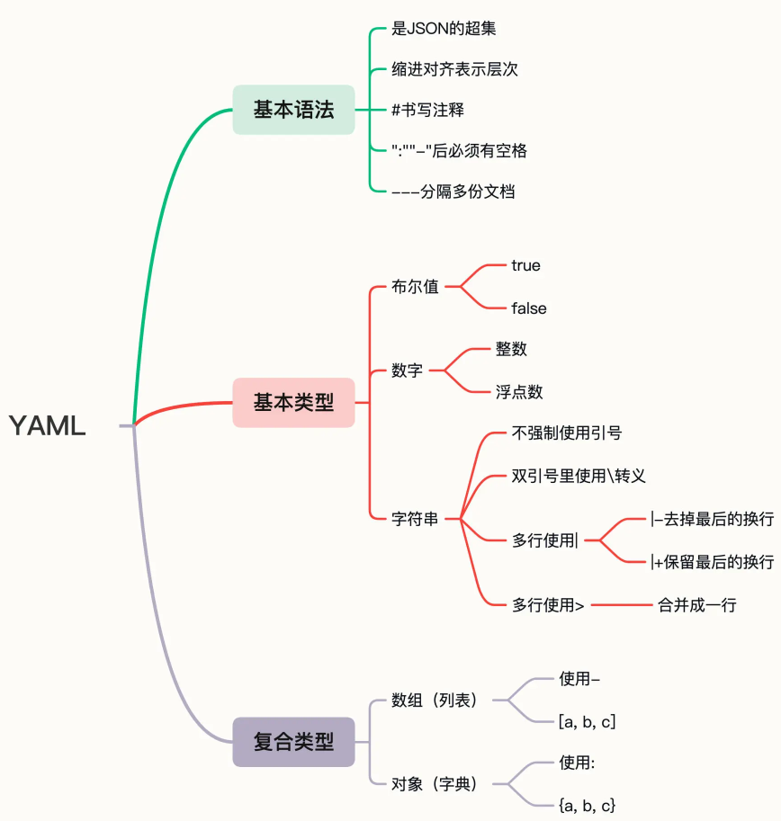

# YAML文件
## 什么是 YAML
[YAML官网](https://yaml.org/)  

YAML 语言创建于 2001 年，比 XML 晚了三年。YAML 虽然在名字上模仿了 XML，但实质上与 XML 完全不同，更适合人类阅读，计算机解析起来也很容易。  

YAML 是 JSON 的超集，支持整数、浮点数、布尔、字符串、数组和对象等数据类型。  
也就是说，任何合法的 JSON 文档也都是 YAML 文档，如果你了解 JSON，那么学习 YAML 会容易很多。  
但和 JSON 比起来，YAML 的语法更简单，形式也更清晰紧凑，比如：  
- 使用空白与缩进表示层次
- 缩进不允许使用tab，只能用空格，
- 缩进空格数多少无所谓，只要保证同一层级空格数一样多，即左对齐
- 使用 # 书写注释
- 对象（字典）的格式与 JSON 基本相同，但 Key 不需要使用双引号。
- 数组（列表）是使用 - 开头的清单形式（有点类似 MarkDown）。
- 表示对象的 : 和表示数组的 - 后面都必须要有空格。
- 可以使用 --- 在一个文件里分隔多个 YAML 对象。

## YAML示例
```yaml
# YAML数组(列表)
OS:
  - linux
  - macOS
  - Windows

## 对应json是这样的：
{"OS":["linux","macOS","Windows"]}
```
```yaml
# YAML对象(字典)
Kubernetes:
  master: 1
  worker: 3

## 对应json是这样：
{“Kubernetes":{"master":1,"worker":3}}
```
```yaml
# 复杂的例子，组合数组和对象
Kubernetes:
  master:
    - apiserver: running
    - etcd: running
  node:
    - kubelet: running
    - kube-proxy: down
    - container-runtime: [docker, containerd, cri-o]
```
用一张图来总结YAML  



