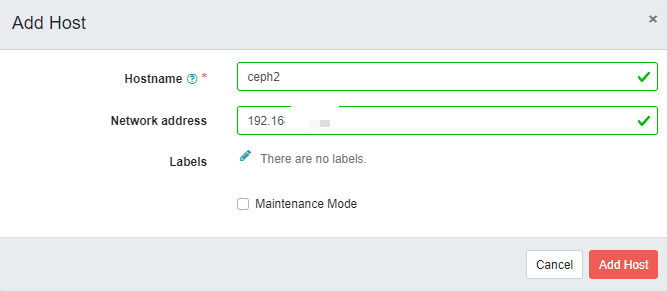
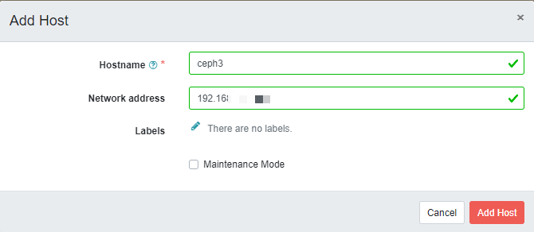
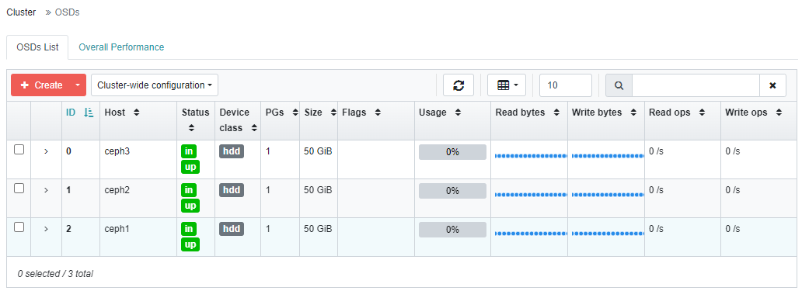
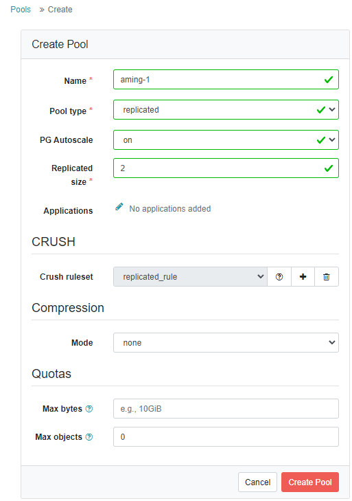
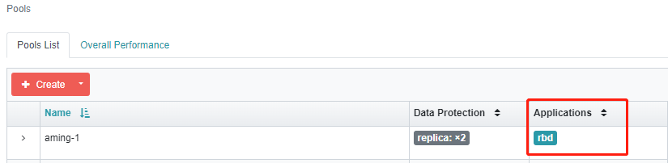

# 存储
存储持久化相关三个概念：
- PersistentVolume（PV）  
是对具体存储资源的描述，比如NFS、Ceph、GlusterFS等，通过PV可以访问到具体的存储资源；

+ PersistentVolumeClaim（PVC）  
Pod想要使用具体的存储资源需要对接到PVC，PVC里会定义好Pod希望使用存储的属性，通过PVC再去申请合适的存储资源（PV），匹配到合适的资源后PVC和PV会进行绑定，它们两者是一一对应的；

- StorageClass（SC）  
PV可以手动创建，也可以自动创建，当PV需求量非常大时，如果靠手动创建PV就非常麻烦了，SC可以实现自动创建PV，并且会将PVC和PV绑定。

SC会定义两部分内容：  
① pv的属性，比如存储类型、大小；  
② 创建该PV需要用到的存储插件（provisioner），这个provisioner是实现自动创建PV的关键。  

## API资源对象PV和PVC
### PV YAML示例：
```yaml
vim testpv.yaml

apiVersion: v1
kind: PersistentVolume
metadata:
  name: testpv

spec:
  storageClassName: test-storage
  accessModes:
  - ReadWriteOnce
  capacity:
    storage: 500Mi  ##提供500Mi空间
  hostPath:
    path: /tmp/testpv/      ##本地存储路径
```
说明：
- storageClassName：  定义存储类名称，PV和PVC中都会有该字段，目的是为了方便两者匹配绑定在一起
- accessModes：定义该pv的访问权限模式，有三种：
    - ReadWriteOnce：存储卷可读可写，但只能被一个节点上的 Pod 挂载;
    - ReadOnlyMany：存储卷只读不可写，可以被任意节点上的 Pod 多次挂载;
    - ReadWriteMany：存储卷可读可写，也可以被任意节点上的 Pod 多次挂载;
- capacity： 定义该存储大小。
- hostPath： 定义该存储访问路径，这里指的是本地的磁盘。

### PVC  YAML示例：
```yaml
vim testpvc.yaml

apiVersion: v1
kind: PersistentVolumeClaim
metadata:
  name: testpvc

spec:
  storageClassName: test-storage
  accessModes:
    - ReadWriteOnce
  resources:
    requests:
      storage: 100Mi  ##期望申请100Mi空间
```
```bash
# 应用pv和pvc的YAML
kubectl apply -f testpv.yaml -f testpvc.yaml

# 查看状态
kubectl get pv,pvc
```

### PV和PVC匹配规则
PV创建好后，会等待PVC与其进行绑定，PVC一旦找到合适的PV就会绑定。如果有多个PV时，PVC又是如何匹配PV的呢？它有如下一些规则：  
① 访问模式和存储类匹配：Kubernetes会筛选出访问模式（accessModes）和存储类（storageClassName）与PVC相匹配的PV。如果没有匹配的PV，PVC将保持未绑定状态。  
② 资源大小：在满足访问模式和存储类匹配的PV中，Kubernetes会选择资源大小大于或等于PVC请求大小的PV。  
③ 最佳匹配：在满足访问模式、存储类和资源大小的PV中，Kubernetes会选择资源大小最接近PVC请求大小的PV。如果有多个PV具有相同的资源大小，Kubernetes会选择其中一个进行绑定。  
④ 避免重复绑定：一个PV在任何时候只能被一个PVC绑定。一旦PV被绑定到一个PVC，它将不再可用于其他PVC。  

------------------

## 本地存储
本地存储类型的PV是Kubernetes中一种比较特殊的持久化存储，它允许将节点上的本地磁盘或目录用作PV。与其他PV类型（例如NFS、Ceph或云存储）不同，本地存储类型的PV直接使用节点上的存储资源，因此具有更低的延迟和更高的性能。

使用本地存储类型的PV时，需注意以下几个关键点：
- 节点特性：  
本地存储类型的PV与特定的节点绑定，因为它直接使用节点上的存储资源。这意味着当创建PV时，需要指定与之关联的节点。可以在PV的spec部分设置nodeAffinity来实现的。
    ```yaml
    nodeAffinity:  ##定义节点亲和性
        required:
        nodeSelectorTerms:
        - matchExpressions:
            - key: kubernetes.io/hostname
            operator: In
            values:
            - node-name
    ```

- 数据持久性：  
由于本地存储类型的PV与特定节点关联，当该节点发生故障时，存储在PV中的数据可能无法访问。因此，在使用本地存储类型的PV时，请确保采取适当的数据备份策略，以防止节点故障导致的数据丢失。
- 调度限制：  
Pod使用本地存储类型的Persistent Volume Claim（PVC）时，Kubernetes会尝试将Pod调度到关联PV的节点上。如果节点上的资源不足以运行Pod，Pod将无法启动。因此，在使用本地存储类型的PV时，请确保关联的节点有足够的资源来运行Pod。
- 回收策略：  
当PVC被删除时，PV的回收策略将决定如何处理关联的本地存储。对于本地存储类型的PV，建议使用Retain或Delete回收策略。
    - Retain策略：表示保留存储和数据，以便手动清理和管理；
    - Delete策略：表示删除存储和数据。需要注意的是，Recycle策略并不适用于本地存储类型的PV。
    ```yaml
    persistentVolumeReclaimPolicy: Retain
    ```

完整示例：
```bash
# 首先，确保在每个要使用本地存储的节点上创建一个本地目录。例如，在节点上创建/mnt/local-storage目录
mkdir -p /mnt/local-storage

# 然后，创建一个PV资源配置文件，例如local-pv.yaml
vim local-pv.yaml
apiVersion: v1
kind: PersistentVolume
metadata:
  name: local-pv
  labels:
    type: local
spec:
  storageClassName: local-storage
  capacity:
    storage: 5Gi
  accessModes:
    - ReadWriteOnce
  persistentVolumeReclaimPolicy: Retain
  local:
    path: /mnt/local-storage
  nodeAffinity:
    required:
      nodeSelectorTerms:
      - matchExpressions:
        - key: kubernetes.io/hostname  #这是内置的节点标签，表示节点的主机名
          operator: In
          values:
          - k8s2  #只有k8s2这个主机节点才满足要求

# 应用PV资源配置文件
kubectl apply -f local-pv.yaml


# 再创建一个PVC资源配置文件，例如local-pvc.yaml
vim local-pvc.yaml
apiVersion: v1
kind: PersistentVolumeClaim
metadata:
  name: local-pvc
spec:
  storageClassName: local-storage
  accessModes:
    - ReadWriteOnce
  resources:
    requests:
      storage: 5Gi

# 应用PVC资源配置文件
kubectl apply -f local-pvc.yaml

# Kubernetes会自动将PVC与PV绑定。创建好的PVC可以在Pod中使用，将本地存储挂载到容器中。

# 最后，创建一个Pod资源配置文件，例如local-pod.yaml
vim local-pod.yaml
apiVersion: v1
kind: Pod
metadata:
  name: local-pod
spec:
  containers:
  - name: local-container
    image: nginx:1.21.0
    volumeMounts:
    - name: local-storage
      mountPath: /data
  volumes:
  - name: local-storage
    persistentVolumeClaim:
      claimName: local-pvc

# 应用Pod资源配置文件
kubectl apply -f local-pod.yaml

# 检查Pod状态
kubectl get pods

# 现在，local-pod中的local-container已经挂载了本地存储。所有写入/data目录的数据都将持久化在本地存储中。
```

-------------------

## NFS存储
需要单独一台（k8s节点外）机器来部署NFS，具体步骤参考[NFS部署](../NFS.md)  

NFS作为常用的网络文件系统，在多机之间共享文件的场景下用途广泛，毕竟NFS配置方便，而且稳定可靠。  
NFS同样也有一些缺点：① 存在单点故障的风险；② 不方便扩容；③ 性能一般。  
NFS比较适合一些简单的、对存储要求不高的场景，比如测试环境、开发环境。  


首先部署好NFS服务，并且保证所有Kubernetes节点可以顺利挂载
```bash
# 服务端和客户端都安装nfs工具
yum install -y nfs-utils

# 节点测试连接NFS
showmount -e 192.168.1.136
```

k8s配置
```bash
# 定义基于NFS的PV
vim nfs-pv.yaml 

apiVersion: v1
kind: PersistentVolume
metadata:
  name: nfs-pv
spec:
  capacity:
    storage: 5Gi
  accessModes:
    - ReadWriteMany
  persistentVolumeReclaimPolicy: Retain
  storageClassName: nfs-storage
  nfs:
    path: /data/nfs
    server: 192.168.1.136

# 定义PVC
vim nfs-pvc.yaml

apiVersion: v1
kind: PersistentVolumeClaim
metadata:
  name: nfs-pvc
spec:
  storageClassName: nfs-storage
  accessModes:
    - ReadWriteMany
  resources:
    requests:
      storage: 5Gi

# 定义Pod
vim nfs-pod.yaml

apiVersion: v1
kind: Pod
metadata:
  name: nfs-pod
spec:
  containers:
  - name: nfs-container
    image: nginx:1.21.0
    volumeMounts:
    - name: nfs-storage
      mountPath: /data
  volumes:
  - name: nfs-storage
    persistentVolumeClaim:
      claimName: nfs-pvc

# 应用pv,pvc,pod
kubectl apply -f nfs-pv.yaml -f nfs-pvc.yaml -f nfs-pod.yaml

# 删除
kubectl delete -f nfs-pv.yaml -f nfs-pvc.yaml -f nfs-pod.yaml

# 查看它们的状态
kubectl get pv,pvc,pod

# 在NFS服务目录创建文件后，登陆pod查看
[root@linyi ~]# kubectl exec -it nfs-pod -- bash
root@nfs-pod:/# ls /data/
test1  test2
```

----------------------------

## API资源对象StorageClass
SC的主要作用在于，自动创建PV，从而实现PVC按需自动绑定PV。  
下面我们通过创建一个基于NFS的SC来演示SC的作用。  
要想使用NFS的SC，还需要安装一个NFS provisioner，provisioner里会定义NFS相关的信息（服务器IP、共享目录等）  
github地址： https://github.com/kubernetes-sigs/nfs-subdir-external-provisioner  

NFS服务提前准备，[参考NFS安装](../NFS.md)

```bash
# 将源码下载下来
git clone https://github.com/kubernetes-sigs/nfs-subdir-external-provisioner

cd nfs-subdir-external-provisioner/deploy

# 修改命名空间为kube-system
sed -i 's/namespace: default/namespace: kube-system/' rbac.yaml

# 创建rbac授权
kubectl apply -f rbac.yaml

# 修改命名空间为kube-system
sed -i 's/namespace: default/namespace: kube-system/' deployment.yaml

# 编辑deployment.yaml
vim deployment.yaml

   spec:
      serviceAccountName: nfs-client-provisioner
      containers:
        - name: nfs-client-provisioner
          image: chronolaw/nfs-subdir-external-provisioner:v4.0.2  ##改为dockerhub地址
          volumeMounts:
            - name: nfs-client-root
              mountPath: /persistentvolumes
          env:
            - name: PROVISIONER_NAME
              value: k8s-sigs.io/nfs-subdir-external-provisioner
            - name: NFS_SERVER
              value: 192.168.1.136  ##nfs服务器地址
            - name: NFS_PATH
              value: /data/nfs2  ##nfs共享目录。（记得提前创建nfs2，这里用sc会自动在nfs2目录下创建新的目录并挂载）
      volumes:
        - name: nfs-client-root
          nfs:
            server: 192.168.1.136  ##nfs服务器地址
            path: /data/nfs2  ##nfs共享目录


# 应用deployment，class
kubectl apply -f deployment.yaml -f class.yaml
```

### SC YAML示例
```yaml
vim class.yaml

apiVersion: storage.k8s.io/v1
kind: StorageClass
metadata:
  name: nfs-client
provisioner: k8s-sigs.io/nfs-subdir-external-provisioner # or choose another name, must match deployment's env PROVISIONER_NAME'
parameters:
  archiveOnDelete: "false"  ##自动回收存储空间
```
有了SC，还需要一个PVC

### PVC
```yaml
vim nfs-Pvc.yaml

apiVersion: v1
kind: PersistentVolumeClaim
metadata:
  name: nfspvc

spec:
  storageClassName: nfs-client    ##指定SC
  accessModes:
    - ReadWriteMany

  resources:
    requests:
      storage: 500Mi
```

### pod
下面创建一个pod，来使用pvc：
```yaml
vim nfs-Pod.yaml

apiVersion: v1
kind: Pod
metadata:
  name: nfspod
spec:
  containers:
  - name: nfspod
    image: nginx:1.23.2
    volumeMounts:
    - name: nfspv
      mountPath: "/usr/share/nginx/html"
  volumes:
  - name: nfspv
    persistentVolumeClaim:
      claimName: nfspvc
```
```bash
# 应用它两
kubectl apply -f nfs-Pvc.yaml -f nfs-Pod.yaml
```

### 验证

```bash
# 此时在NFS服务器查看，发现多了一个共享目录
[root@lwz3 ~]# ls /data/nfs2/
default-nfspvc-pvc-e1c16ac4-0577-4b54-bf58-d5d152a589c1

# 共享目录下，创建文件
[root@lwz3 ~]# echo "lwz123" > /data/nfs2/default-nfspvc-pvc-e1c16ac4-0577-4b54-bf58-d5d152a589c1/1.html

# k8s中查看pod ip地址
[root@linyi deploy]# kubectl get po -o wide
nfspod                       1/1     Running            0                5m35s   10.18.219.10   k8s3   <none>           <none>

# 访问
[root@linyi deploy]# curl 10.18.219.10/1.html
lwz123
```
**总结：**  
pod想使用共享存储 ---> PVC (定义具体需求属性） --->SC （定义Provisioner）---> Provisioner（定义具体的访问存储方法） ---> NFS-server  --->  自动创建PV

---------------------------

## Ceph存储
Kubernetes使用Ceph作为存储，有两种方式，一种是将Ceph部署在Kubernetes里，需要借助一个工具rook；另外一种就是使用外部的Ceph集群，也就是说需要单独部署Ceph集群。  

这里使用单独部署Ceph集群。

### 搭建Ceph集群

| 主机名 | IP地址 | 角色 |
| :---: | :---: | :---: |
| lwz1 | 192.168.1.152 | ceph1 |
| lwz2 | 192.168.1.156 | ceph2 |
| lwz3 | 192.168.1.136 | ceph3 |

[关闭selinux、firewalld，配置hostname以及/etc/hosts](../MySQL/Cluster%E9%AB%98%E5%8F%AF%E7%94%A8.md)  
**为每一台机器都额外准备至少一块未格式化的磁盘。**

所有机器操作：
```bash
# 所有机器安装时间同步服务chrony
yum install -y chrony
systemctl start chronyd 
systemctl enable chronyd

# 所有机器安装docker-ce（ceph使用docker形式部署）
yum install -y yum-utils  

# 配置Docker官方的yum仓库，如果做过，可以跳过
yum-config-manager \
    --add-repo \
    https://download.docker.com/linux/centos/docker-ce.repo

# 安装docker-ce
yum install -y docker-ce
# 启动docker
systemctl start docker
systemctl enable docker

# 所有机器安装python3、lvm2（三台都做）
yum install -y python3  lvm2
```
ceph1操作：
```bash
# 设置yum源
vim /etc/yum.repos.d/ceph.repo

[ceph]
name=ceph
baseurl=http://mirrors.aliyun.com/ceph/rpm-pacific/el8/x86_64/
gpgcheck=0
priority =1
[ceph-noarch]
name=cephnoarch
baseurl=http://mirrors.aliyun.com/ceph/rpm-pacific/el8/noarch/
gpgcheck=0
priority =1
[ceph-source]
name=Ceph source packages
baseurl=http://mirrors.aliyun.com/ceph/rpm-pacific/el8/SRPMS
gpgcheck=0
priority=1

# 安装cephadm
yum install -y cephadm

# 使用cephadm部署ceph
cephadm  bootstrap --mon-ip 192.168.1.152
##注意：会输出访问链接、账号、密码
# 登陆链接，更改密码

# 增加host
## 首先进入ceph shell
cephadm shell
## 生成ssh密钥对儿
ceph cephadm get-pub-key > ~/ceph.pub
## 配置到另外两台机器免密登录
ssh-copy-id -f -i ~/ceph.pub root@ceph2
ssh-copy-id -f -i ~/ceph.pub root@ceph3
## 到浏览器里，增加主机，见下图
```
  
  
```bash
# 创建OSD（ceph shell模式下，在ceph1上操作）
ceph shell
## 假设三台机器上新增的新磁盘为/dev/sdb
ceph orch daemon add osd ceph1:/dev/sdb
ceph orch daemon add osd ceph2:/dev/sdb
ceph orch daemon add osd ceph3:/dev/sdb

# 查看磁盘列表
ceph orch device ls
```
此时dashboard上也可以看到  
  

创建pool  
  
```bash
# 查看集群状态
ceph -s

# 针对aming-1 pool启用rbd application
ceph osd pool application enable  aming-1 rbd
```
  
```bash
# 初始化pool
rbd pool init aming-1
```

### k8s使用ceph
#### 获取ceph集群信息和admin用户的key（ceph那边）
```bash
ceph shell
# 获取集群信息
[ceph: root@ceph1 /]# ceph mon dump
epoch 3
fsid 2f8f283c-f84a-11ed-983f-000c29dd2163   ##这一串一会儿用
last_changed 2023-05-22T04:08:00.684893+0000
created 2023-05-22T02:44:15.871443+0000
min_mon_release 16 (pacific)
election_strategy: 1
0: [v2:192.168.1.152:3300/0,v1:192.168.1.152:6789/0] mon.ceph1
1: [v2:192.168.1.156:3300/0,v1:192.168.1.156:6789/0] mon.ceph2
2: [v2:192.168.1.136:3300/0,v1:192.168.1.136:6789/0] mon.ceph3
dumped monmap epoch 3

# 获取admin用户key
[ceph: root@ceph1 /]# ceph auth get-key client.admin ; echo
AQD/1mpkHaTTCxAAqETAy48Z/aChnMso92d+ug==   #这串一会用
```
#### 下载并导入镜像  
将用到的镜像先下载下来，避免启动容器时，镜像下载太慢或者无法下载  
可以下载到其中某一个节点上，然后将镜像拷贝到其它节点  
**k8s1下操作**
```bash
# 下载镜像（其中一个节点）
wget -P /tmp/ https://d.frps.cn/file/tools/ceph-csi/k8s_1.24_ceph-csi.tar

# 拷贝
scp /tmp/k8s_1.24_ceph-csi.tar  lwz2:/tmp/
scp /tmp/k8s_1.24_ceph-csi.tar  lwz3:/tmp/

# 导入镜像（所有k8s节点）
ctr -n k8s.io i import k8s_1.24_ceph-csi.tar
```
#### 建ceph的 provisioner
**k8s1下操作**
```bash
# 创建ceph目录，后续将所有yaml文件放到该目录下
mkdir ceph
cd ceph

# 创建secret.yaml
vim secret.yaml

apiVersion: v1
kind: Secret
metadata:
  name: csi-rbd-secret
  namespace: default
stringData:
  userID: admin
  userKey: AQBnanBkRTh0DhAAJVBdxOySVUasyOJiMAibYQ==  #这串上面已经获取 

# 创建config-map.yaml
vim csi-config-map.yaml

apiVersion: v1
kind: ConfigMap
metadata:
  name: "ceph-csi-config"
data:
  config.json: |-
    [
      {
        "clusterID": "0fd45688-fb9d-11ed-b585-000c29dd2163", 
        "monitors": [
          "192.168.1.152:6789",
          "192.168.1.156:6789",
          "192.168.1.136:6789"
        ]
      }
    ]

# 创建ceph-conf.yaml
vim ceph-conf.yaml

apiVersion: v1
kind: ConfigMap
data:
  ceph.conf: |
    [global]
    auth_cluster_required = cephx
    auth_service_required = cephx
    auth_client_required = cephx

  # keyring is a required key and its value should be empty
  keyring: |
metadata:
  name: ceph-config

# 创建csi-kms-config-map.yaml（该config内容为空）
vim csi-kms-config-map.yaml

---
apiVersion: v1
kind: ConfigMap
data:
  config.json: |-
    {}
metadata:
  name: ceph-csi-encryption-kms-config

# 下载其余rbac以及provisioner相关yaml
wget  https://d.frps.cn/file/tools/ceph-csi/csi-provisioner-rbac.yaml
wget  https://d.frps.cn/file/tools/ceph-csi/csi-nodeplugin-rbac.yaml

wget https://d.frps.cn/file/tools/ceph-csi/csi-rbdplugin.yaml
wget https://d.frps.cn/file/tools/ceph-csi/csi-rbdplugin-provisioner.yaml

# 应用所有yaml（注意，当前目录是在ceph目录下）
cd ceph

for f in `ls *.yaml`; do echo $f; kubectl apply -f $f; done

# 检查provisioner的pod，状态为running才对
kubectl get po
```
#### 创建storageclass
在k8s上创建ceph-sc.yaml
```yaml
vim ceph-sc.yaml

apiVersion: storage.k8s.io/v1
kind: StorageClass
metadata:
   name: csi-rbd-sc     #storageclass名称
provisioner: rbd.csi.ceph.com   #驱动器
parameters:
   clusterID: 0fd45688-fb9d-11ed-b585-000c29dd2163    #ceph集群id
   pool: aming-1      #pool空间
   imageFeatures: layering   #rbd特性
   csi.storage.k8s.io/provisioner-secret-name: csi-rbd-secret
   csi.storage.k8s.io/provisioner-secret-namespace: default
   csi.storage.k8s.io/controller-expand-secret-name: csi-rbd-secret
   csi.storage.k8s.io/controller-expand-secret-namespace: default
   csi.storage.k8s.io/node-stage-secret-name: csi-rbd-secret
   csi.storage.k8s.io/node-stage-secret-namespace: default
reclaimPolicy: Delete   #pvc回收机制
allowVolumeExpansion: true   #对扩展卷进行扩展
mountOptions:           #StorageClass 动态创建的 PersistentVolume 将使用类中 mountOptions 字段指定的挂载选项
   - discard

# 应用yaml
kubectl apply -f ceph-sc.yaml 
```
#### 创建pvc
在k8s上创建ceph-pvc.yaml
```yaml
vim ceph-pvc.yaml

apiVersion: v1
kind: PersistentVolumeClaim
metadata:
  name: ceph-pvc     #pvc名称
spec:
  accessModes:
    - ReadWriteOnce     #访问模式
  resources:
    requests:
      storage: 1Gi      #存储空间
  storageClassName: csi-rbd-sc
EOF

# 应用yaml
kubectl apply -f ceph-pvc.yaml

# 查看pvc状态，STATUS必须为Bound
kubectl get pvc
```
#### 创建pod使用ceph存储
```yaml
vim ceph-pod.yaml

apiVersion: v1
kind: Pod
metadata:
  name: ceph-pod
spec:
  containers:
  - name: ceph-ng
    image: nginx:1.23.2
    volumeMounts:
    - name: ceph-mnt
      mountPath: /mnt
      readOnly: false
  volumes:
  - name: ceph-mnt
    persistentVolumeClaim:
      claimName: ceph-pvc

# 应用
kubectl apply -f ceph-pod.yaml

# 查看pv
kubectl get pv

NAME                                       CAPACITY   ACCESS MODES   RECLAIM POLICY   STATUS   CLAIM              STORAGECLASS   REASON   AGE
pvc-a952fbf2-0f3f-4d69-b7bd-afc58f2e0402   1Gi        RWO            Delete           Bound    default/ceph-pvc   csi-rbd-sc              1h
```
```bash
# 在ceph这边查看rbd
[ceph: root@ceph1 /]# rbd ls aming-1
aming-img1
csi-vol-ca03a97d-f985-11ed-ab20-9e95af1f105a
```
```bash
# 在pod里查看挂载情况
kubectl exec -it ceph-pod -- df

Filesystem     1K-blocks     Used Available Use% Mounted on
overlay         18375680 11418696   6956984  63% /
tmpfs              65536        0     65536   0% /dev
tmpfs             914088        0    914088   0% /sys/fs/cgroup
/dev/rbd0         996780       24    980372   1% /mnt
/dev/sda3       18375680 1141866   6956984  63% /etc/hosts
shm                65536        0     65536   0% /dev/shm
tmpfs            1725780       12   1725768   1% /run/secrets/kubernetes.io/serviceaccount
tmpfs             914088        0    914088   0% /proc/acpi
tmpfs             914088        0    914088   0% /proc/scsi
tmpfs             914088        0    914088   0% /sys/firmware
```
