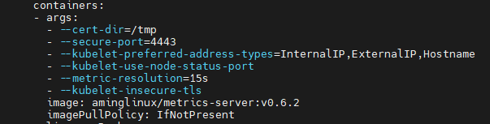

# 水平自动扩容和缩容HPA
（本部分操作适合K8s版本>=1.23.x)

HPA全称是Horizontal Pod Autoscaler，翻译成中文是POD水平自动伸缩，HPA可以基于CPU利用率对replication、controller、deployment和replicaset中的pod数量进行自动扩缩容（除了CPU利用率也可以基于其他应程序提供的度量指标custom metrics进行自动扩缩容）。  
pod自动缩放不适用于无法缩放的对象，比如DaemonSets。

HPA由Kubernetes API资源和控制器实现。资源决定了控制器的行为。控制器会周期性的获取目标资源指标（如，平均CPU利用率），并与目标值相比较后来调整Pod副本数量。

创建测试Deployment  
```yaml
vim php-apache.yaml

apiVersion: apps/v1
kind: Deployment
metadata:
  name: php-apache
spec:
  selector:
    matchLabels:
      run: php-apache
  replicas: 1
  template:
    metadata:
      labels:
        run: php-apache
    spec:
      containers:
      - name: php-apache
        image: aminglinux/hpa-example
        ports:
        - containerPort: 80
        resources:
          limits:
            cpu: 500m  ##限制Pod CPU资源最多使用500m
          requests:
            cpu: 200m  ##K8s要保证Pod使用的最小cpu资源为200m
---
apiVersion: v1
kind: Service
metadata:
  name: php-apache
  labels:
    run: php-apache
spec:
  ports:
  - port: 80
  selector:
    run: php-apache
```

安装merics-server（通过它才能获取到具体的资源使用情况）
```bash
# 下载yaml文件
wget https://github.com/kubernetes-sigs/metrics-server/releases/latest/download/high-availability-1.21+.yaml

# 修改YAML文件
vim high-availability-1.21+.yaml

将image: k8s.gcr.io/metrics-server/metrics-server:v0.6.2 修改为 image: aminglinux/metrics-server:v0.6.2 
在image: 这行上面增加一行: - --kubelet-insecure-tls 
##见下图
```
  
```bash
# 应用此YAML文件
kubectl apply -f high-availability-1.21+.yaml
```
创建HPA
```yaml
vim  hpa-php-apache.yaml
apiVersion: autoscaling/v2
kind: HorizontalPodAutoscaler
metadata:
  name: php-apache
spec:
  scaleTargetRef:
    apiVersion: apps/v1
    kind: Deployment
    name: php-apache
  minReplicas: 1  ##最小Pod数为1
  maxReplicas: 10  ##最大Pod数为10
  metrics:
  - type: Resource
    resource:
      name: cpu
      target:
        type: Utilization
        averageUtilization: 50  ##当Pod的CPU使用率超过50%时，需要自动扩容
```
```bash
# 应用YAML
kubectl apply -f hpa-php-apache.yaml
```
模拟php-apache Pod CPU使用率增加
```bash
# 再开一个终端，执行
kubectl run -i --tty load-generator --rm --image=busybox:1.28 --restart=Never -- /bin/sh -c "while sleep 0.01; do wget -q -O- http://php-apache; done"

# 回到原来终端查看hap和po
kubectl get deployment,po,hpa |egrep 'NAME|php-apache'
##php-apache Pod副本会逐渐增加，hpa的TARGETS列CPU使用率会越来越高，当超过50%就会自动生成新的Pod副本
```
