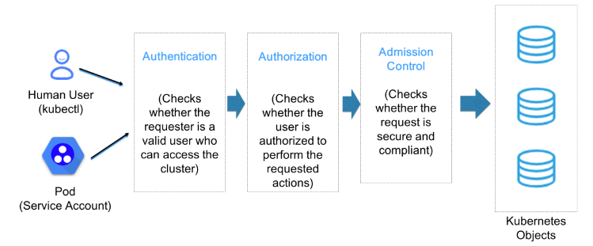
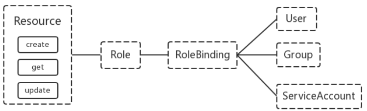

# 用户安全控制
## 安全控制三阶段
三阶段： 认证（Authentication）、授权（Authorization）、准入控制（Admission Control）  
  
① 所谓认证，就是先验证用户的身份是否合法，比如看看其证书是否合法有效，看看其Token是否正确；  
② 所谓授权，就是看看这个用户是否有权限来访问或者操作K8s的资源；  
③ 所谓准入控制，就是检查对应客户端的请求是否符合对应请求或操作API规范，检查传递参数是否是正确的。比如创建Pod，它会检查提交的信息是否符合创建Pod的规范，如果不符合规范就拒绝。另外，准入控制还会帮助我们把我们没有明确指定的字段信息，通过默认值的方式把对应的字段填充到客户端请求中，然后把填充好的信息一并由APIserver把客户端请求更新到对应资源在etcd中的对应信息上。

### K8s认证（Authentication）
两种认证方式：  
① Kubeconfig 这种是基于https ca证书认证，咱们命令行管理K8s用的就是这种认证  
② Token 这种通过一个Token来识别用户，比如前面我们讲dashboard时，有创建一个serviceaccount，然后再获取其token

### K8s授权（Authorization）
授权模式：
- AlwaysDeny：表示拒绝所有的请求，一般用于测试
- AlwaysAllow：允许接收所有请求，如果集群不需要授权流程，则可以采用该策略
- ABAC（Attribute-Based Access Control）：基于属性的访问控制，表示使用用户配置的授权规则对用户请求进行匹配和控制（老版本采用的方式，也就是定义属性的访问类型，如果用户拥有这个属性就能访问对应的资源。需要定义一长串的属性，并且ABAC修改完之后并不能生效，现在淘汰了）
- Webbook：通过调用外部 REST 服务对用户进行授权（在集群外部对集群鉴权）
- RBAC（Role-Based Access Control）：基于角色的访问控制，现行的默认规则（拥有角色就代表拥有访问资源某些权限）
```bash
# 查看K8s授权模式
[root@linyi ~]# cat /etc/kubernetes/manifests/kube-apiserver.yaml |grep authorization-mode
    - --authorization-mode=Node,RBAC
```
#### RBAC 授权模式
RBAC（Role-Based Access Control）基于角色的访问控制，在 Kubernetes 1.5 中引入，现行版本成为默认标准。相对其它访问控制方式，拥有以下优势：
- 对集群中的资源（pod deploy cpu…）和非资源（元信息如pod状态）均拥有完整的覆盖
- 整个 RBAC 完全由几个 API 对象完成，同其它 API 对象一样，可以用 kubectl 或 API 进行操作
- 可以在运行时进行调整，无需重启API Server即可生效  

**RBAC的API资源对象说明**  
RBAC资源对象：Subject（包括：User, Group, ServiceAccount）Role（角色）、ClusterRole（集群角色）、RoleBinding（角色绑定）、ClusterRoleBinding（集群角色绑定）
- 主体（subject）
    - User：用户
    - Group：用户组
    - ServiceAccount：服务账号

+ 角色
    + Role：授权特定命名空间的访问权限
    + ClusterRole：授权所有命名空间的访问权限

- 角色绑定
    - RoleBinding：将角色绑定到主体（即subject）
    - ClusterRoleBinding：将集群角色绑定到主体
  

### K8s准入控制（Adminssion Control）
Adminssion Control实际上是一个准入控制器插件列表，发送到API Server的请求都需要经过这个列表中的每个准入控制器插件的检查，检查不通过，则拒绝请求。
```bash
# 查看可以启用的准入控制器列表：
kubectl exec kube-apiserver-linyi -n kube-system -- kube-apiserver -h | grep '    --enable-admission-plugins'

# 查看当前K8s启用的准入控制器：
grep 'admission' /etc/kubernetes/manifests/kube-apiserver.yaml
#或者 
ps aux|grep apiserver|grep admission

# 更改准入控制器：
vi /etc/kubernetes/manifests/kube-apiserver.yaml
#找到--enable-admission-plugins那一行，直接修改。多个用逗号分隔
--enable-admission-plugins=NodeRestriction,SecurityContextDeny
```

**以下为admission控制器列表以及说明**  

- AlwaysPullImages：强制要求每个容器始终从镜像仓库拉取最新的镜像。
- DenyEscalatingExec：防止容器执行特权操作，例如以root用户执行exec命令。
- ExtendedResourceToleration：允许 Pod 通过指定容忍性来请求使用扩展资源，如GPU。
- InitialResources：自动为 Pod 分配初始资源，例如 CPU 和内存。
- LimitPodHardAntiAffinityTopology：在同一拓扑域中，强制对 Pod 应用硬亲和度规则，以保证高可用性和冗余性。
- LimitRanger：实现资源限制（如 CPU、内存、存储等）的默认值和最大值，限制 Pod 和容器的资源使用。
- MutatingAdmissionWebhook：在资源提交到 API Server 之前，用于对请求进行修改，例如注入辅助容器、自动挂载存储等。
- NamespaceLifecycle：管理命名空间的生命周期，拦截 Kubernetes API 服务器对命名空间的创建、删除和更新请求，并在进行处理之前进行验证和审查。
- NodeRestriction：用于保护节点安全，限制 Pod 的访问权限以确保节点的安全性。
- PodNodeSelector：强制将 Pod 调度到与其节点选择器匹配的节点上。
- PodPreset：在创建 Pod 时，从预定义的资源清单中注入额外的容器配置或环境变量。
- PodSecurityPolicy：通过定义 Pod 所允许的行为，帮助管理员确保容器在运行时遵守安全最佳实践。
- Priority：通过定义优先级，帮助 Kubernetes 确定 Pod 调度顺序。
- ReplicaSet：对 ReplicaSet 资源的请求进行验证和审查，例如确保模板的正确性和匹配标签选择器。
- ResourceQuota：管理 Kubernetes 中的资源配额，限制命名空间中的资源使用量。
- SecurityContextDeny：防止 Pod 和容器在启动时执行不安全的操作，例如使用特权模式、访问主机网络等。
- ServiceAccount：用于自动为每个命名空间创建默认的 ServiceAccount，并为 ServiceAccount 分配适当的权限。
- ServiceAccountTTL：为 ServiceAccount 指定生存期，以避免积累不需要的 ServiceAccount。
- ValidatingAdmissionWebhook：在资源提交到 API Server 之前，用于对请求进行验证和审查，以确保符合预期的策略和规则。
- ValidatingPodWebhook：在 Pod 提交到 API Server 之前， 用于对 Pod 对象进行验证和审查。例如审查Pod 的标签、注释、容器规范和卷规范等，以确保它们符合预期和安全性最佳实践。
- VolumeBinding：强制在调度期间将 Pod 中的所有卷绑定到可用的节点上，以确保卷的可用性。
- VolumeSubpath：允许将子路径添加到 Pod 中的卷，从而更灵活地控制卷的使用方式。
- ValidatingMutation：在资源提交到 API Server 之前，用于对请求进行验证和修改。相较于 MutatingAdmissionWebhook，该插件不仅可以修改请求，还可以拒绝它。
- PodOverhead：允许 Kubernetes 在计算 Pod 资源使用量时考虑它们的开销。
- PodSecurityPolicyReview：在 PodSecurityPolicy 中增加了 Review 操作。可以使用 kubectl create、apply 和 delete 命令，以进行审计和测试。
- RuntimeClass：允许运行时类别动态定义 Kubernetes 节点上容器运行的属性和配置。
- VolumeSnapshotDataSource：允许使用 Snapshot 数据源创建 PV，以简化卷恢复过程。
- CertificateApproval：允许批准和拒绝凭证签发请求，确保凭证的安全性和正确性。
- Certificates.k8s.io：提供了一组用于管理和创建证书和私钥的 API，例如 CertificateSigningRequest 和 CertificateSigningRequestApproval。
- CSI：允许扩展 Kubernetes 的存储解决方案。CSI（Container Storage Interface）为存储厂商提供了一种通用的接口，从而简化了存储插件的开发和部署。
- ImagePolicyWebhook：在拉取镜像之前，用于对镜像进行验证和审查，以确保它们符合安全最佳实践和策略。
- PodDisruptionBudget：确保在进行计划性维护、故障排除和升级时，Pod 可以正常运行，防止应用程序的不可用。
- PodPresets
允许在创建 Pod 时注入容器配置和环境变量。
- ValidatingResourceQuota：允许管理员创建规则以确保 Kubernetes 中的资源分配和使用符合预期。
- ValidatingSecurityContext：在 Pod 提交到 API Server 之前，用于对安全上下文进行验证和审查，以确保 Pod 与集群中其他资源的安全性相匹配。
- ValidatingVolumeMounts：验证 Pod 中的卷是否正确挂载。

## 创建普通用户示例
需求1：创建一个Role和ServiceAccount并把他们绑定起来。ServiceAccount有get、list、watch的权限
```yaml
# 创建YAML文件
cat  > testsa.yaml <<EOF
apiVersion: v1
kind: ServiceAccount
metadata:
  name: testsa

---
apiVersion: rbac.authorization.k8s.io/v1
kind: Role
metadata:
  name: testsa-role
rules:
- apiGroups:  # api组，例如apps组，空值表示是核心API组，像namespace、pod、service、pv、pvc都在里面
  - ""
  resources: # 资源名称（复数），例如pods, deployments, services
  - pods
  verbs: # 允许的操作，这里允许get, list, watch
  - get
  - list
  - watch

---
apiVersion: rbac.authorization.k8s.io/v1
kind: RoleBinding
metadata:
  name: testsa-rolebinding
roleRef:
  apiGroup: rbac.authorization.k8s.io
  kind: Role
  name: testsa-role
subjects:
- kind: ServiceAccount
  name: testsa
EOF


# 应用此YAML
kubectl apply -f testsa.yaml

# 生成token
kubectl create token testsa
```

需求2：给user1用户授权lwz命名空间Pod读取权限

① 生成ca证书
```bash
cd /etc/kubernetes/pki/

openssl genrsa -out user1.key 2048
openssl req -new -key user1.key -out user1.csr -subj "/CN=user1"
openssl x509 -req -in user1.csr -CA ca.crt -CAkey ca.key -CAcreateserial -out user1.crt -days 3650
```
② 生成kubeconfig授权文件
```bash
# 设置集群
kubectl config set-cluster myk8s \
--certificate-authority=/etc/kubernetes/pki/ca.crt \
--embed-certs=true \
--server=https://192.168.1.132:6443 \
--kubeconfig=/root/user1.kubecfg

# 查看user1配置，users和context都为空
kubectl config view --kubeconfig=/root/user1.kubecfg

# 设置客户端认证
kubectl config set-credentials user1 \
--client-key=user1.key \
--client-certificate=user1.crt \
--embed-certs=true \
--kubeconfig=/root/user1.kubecfg

# 查看user1配置，users有内容了
kubectl config view --kubeconfig=/root/user1.kubecfg

# 设置context
kubectl config set-context user1@myk8s \
--cluster=myk8s \
--user=user1 \
--kubeconfig=/root/user1.kubecfg

# 查看user1配置，context已经有内容了
kubectl config view --kubeconfig=/root/user1.kubecfg

# 切换context
kubectl config use-context user1@myk8s --kubeconfig=/root/user1.kubecfg
```
③ 创建角色
```yaml
cat > user1-role.yaml <<EOF
apiVersion: rbac.authorization.k8s.io/v1
kind: Role
metadata:
  namespace: lwz
  name: user1-role
rules:
- apiGroups:  
  - ""
  resources:  
  - pods
  verbs: 
  - get
  - list
  - watch
EOF

# 应用此YAML
kubectl apply -f user1-role.yaml

# 报错没有lwz这个namespace，则
kubectl create namespace lwz
```

④ 将用户与角色绑定
```yaml
cat > user1-rolebinding.yaml <<EOF
apiVersion: rbac.authorization.k8s.io/v1
kind: RoleBinding
metadata:
  name: user1-rolebinding
  namespace: lwz
roleRef:
  apiGroup: rbac.authorization.k8s.io
  kind: Role
  name: user1-role
subjects:
- kind: User
  name: user1
  apiGroup: rbac.authorization.k8s.io
EOF

# 应用此YAML
kubectl apply -f user1-rolebinding.yaml
```

⑤ 创建系统用户并使用user1的配置
```bash
useradd lwz
mkdir /home/lwz/.kube
cp /root/user1.kubecfg /home/lwz/.kube/config
chown -R lwz.lwz /home/lwz/.kube/
```
⑥ 切换到普通用下并访问k8s
```bash
su - lwz

kubectl get po
# 只有这条会成功
kubectl get po -n lwz
kubectl get deploy -n lwz
```
