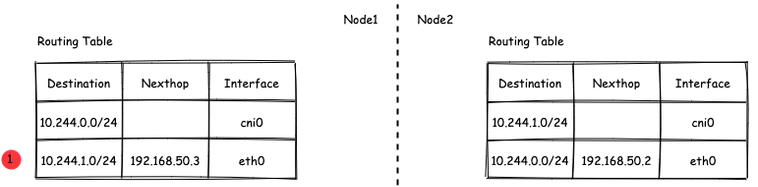

# 网络

## Pod网络
在K8S集群里，多个节点上的Pod相互通信，要通过网络插件来完成，比如Calico网络插件。  
使用kubeadm初始化K8S集群时，有指定一个参数--pod-network-cidr=10.18.0.0/16 它用来定义Pod的网段。  
而我们在配置Calico的时候，同样也有定义一个CALICO_IPV4POOL_CIDR的参数，它的值同样也是Pod的网段。

容器网络尤其是在跨主机容器间的网络是非常复杂的。目前主流的容器网络模型主要有Docker公司提出的Container Network Model（CNM）模型和CoreOS公司提出的Container Network Interface（CNI）模型，而Kubernetes采用了由CoreOS公司提出的CNI模型。

### CNI
首先我们介绍一下什么是 CNI，它的全称是 Container Network Interface，即容器网络的 API 接口。

CNI本身并不能提供网络服务，它只是定义了对容器网络进行操作和配置的规范。CNI仅关注在创建容器时分配网络资源，和在销毁容器时删除网络资源，这使得CNI规范非常轻巧、易于实现，得到了广泛的支持。

而真正实现和落地这些规范的是CNI插件。常见的CNI插件包括Calico、flannel、Terway、Weave Net 以及 Contiv。

### K8S如何使用CNI插件
K8s 通过 CNI 配置文件来决定使用什么 CNI。

CNI 配置文件通常存放在 /etc/cni/net.d/ 目录下。  

比如，我们使用的Calico 插件的配置文件是 `/etc/cni/net.d/10-calico.conflist`。
```bash
[root@linyi pki]# ll /etc/cni/net.d/
总用量 8
-rw-r--r-- 1 root root  656 5月   9 17:30 10-calico.conflist
-rw------- 1 root root 2712 5月  13 05:20 calico-kubeconfig
```
安装了CNI插件后，配置文件中所对应的二进制文件也会被安装到/opt/cni/bin/目录下
```bash
[root@linyi pki]# ls /opt/cni/bin/
bandwidth  calico       dhcp   firewall  host-device  install  loopback  portmap  sbr     tuning  v
bridge     calico-ipam  dummy  flannel   host-local   ipvlan   macvlan   ptp      static  vlan
```
在当前节点上创建 Pod 之后，Kubelet 就会根据 CNI 配置文件执行前两步所安装的 CNI 插件；

具体的流程如下图所示：  
  
在集群里面创建一个 Pod 的时候，首先会通过 apiserver 将 Pod 的配置写入。apiserver 的一些管控组件（比如 Scheduler）会调度到某个具体的节点上去。Kubelet 监听到这个 Pod 的创建之后，会在本地进行一些创建的操作。当执行到创建网络这一步骤时，它首先会读取刚才我们所说的配置目录中的配置文件，配置文件里面会声明所使用的是哪一个插件，然后去执行具体的 CNI 插件的二进制文件，再由 CNI 插件进入 Pod 的网络空间去配置 Pod 的网络。配置完成之后，Kuberlet 也就完成了整个 Pod 的创建过程，这个 Pod 就在线了。

### 基于Calico的Pod网络
  
tunl0起到封装和解封装作用
  

## Service网络
在介绍Service这个api资源对象时，我们已经汇总过Service的几个type：ClusterIP、NodePort、LoadeBalancer，除了这三个还有其它的类型，在本章节我们暂且不去讨论。

这三种类型的Service，LoadBalancer依赖NodePort，而NodePort通常要和ClusterIP一起使用，如果在Service的yaml文件里定义type为LoadBalancer，则它会自动创建NodePort，而NodePort也会自动创建ClusterIP。  
  

下面，再来演绎一下从Pod到Service的网络变化情况：  
① 单个Pod之间通信    
单个Pod和Pod之间通信只能通过Pod的IP和Port来通信，如下图  
  

② Pod有多个  
当引入了Deployment，并为Pod设置多个副本时，那么提供某一个服务（如Nginx服务）的Pod就不止一个了，此时即使知道了这些Pod的IP，那访问起来也并不方便。所以，这里需要有一个统一入口，其它Pod通过这个统一入口去请求该服务（Nginx）对应的所有Pod。 这时就有了Service这个资源对象，它主要作用就是用来提供统一入口，也就是说只需要一个IP就能访问所有的Pod，而这个入口IP就是ClusterIP，也就是Service的IP。  
  

③ 外部资源访问内部Pod  
有了Service，的确可以很方便为内部的Pod提供入口，但是在集群外面访问这个内部的资源就没办法了。于是，就有了这个NodePort，使用Service的NodePort类型，可以将Service的ClusterIP对应的Port映射到每一个Node的IP上，映射出去的Port范围为30000~32767
  

④ 借助公有云的负载均衡器  
使用这个NodePort并不方便，毕竟它带着一个长长的端口号，而且还有一个非常尴尬的问题，就是访问时还得带着Node的IP，如果这个Node挂掉，那么就无法访问此资源，虽然可以通过另外一个Node去访问，但这样太麻烦了！所以，此时的解决方案是：借助三方的负载均衡器，将请求分发到所有的Node上，其底层还是NodePort。
  

总结：  
Service为内部Pod的统一入口，内部资源之间可以通过最简单的ClusterIP进行通信，而外部资源访问需要借助NodePort的形式，但是带着长长端口不方便，于是又衍生了LoadBalancer的形式，这种形式需要借助三方的负载均衡器，将请求分发到每一个NodePort上。

##  网络插件Calico
[参考文档](https://www.cnblogs.com/goldsunshine/p/10701242.html)

### Calico是什么
Calico 是一个用于容器、虚拟机和主机的开源网络和网络安全解决方案。它是一个纯三层（L3）解决方案，利用 BGP（Border Gateway Protocol）协议为容器或虚拟机提供 IP 地址，并提供网络安全功能，包括网络策略和加密。  

Calico 通过将网络策略应用于标签和选择器，提供了一种简单而强大的方法来保护容器或虚拟机之间的通信，并限制容器或虚拟机可以访问的网络资源。它还支持基于 Kubernetes 和 OpenStack 等平台的网络自动化和集成。  

Calico 的另一个重要特点是其可扩展性。它使用了基于 BGP 的路由技术，这使得它能够轻松地扩展到非常大规模的网络中，而不会降低性能。  

由于Calico是一种纯三层的方案，因此可以避免与二层方案相关的数据包封装的操作，中间没有任何的NAT，没有任何的overlay，所以它的转发效率是所有方案中最高的，因为它的包直接走原生TCP/IP的协议栈，它的隔离也因为这个栈而变得好做。因为TCP/IP的协议栈提供了一整套的防火墙的规则，所以它可以通过IPTABLES的规则达到比较复杂的隔离逻辑。 

### Calico架构
    
- 各组件介绍：
    - Felix：  
    Calico Agent，跑在K8S集群中的每台节点上，主要负责管理和维护该节点上的网络和安全策略，如 网络接口管理和监听、路由、ARP 管理、ACL 管理和同步、状态上报等；
    - Etcd：  
    分布式键值存储，用来存储网络元数据、安全策略以及节点的状态信息，确保Calico网络状态的一致性和准确性，可以和K8S的etcd合用；
    - BGP Client（BIRD）：  
    跟Felix一样，每一个节点上都会部署BGP Client，主要负责把Felix写入Kernel的路由信息分发到当前Calico网络，确保各节点间的通信的有效性；
    - BGP Route Reflector（BIRD）：  
    在大型网络规模中，如果仅仅使用BGP Client 形成mesh全网互联的方案就会导致规模限制，因为所有节点之间俩俩互联，需要 N^2 个连接，为了解决这个规模问题，可以采用 BGP 的 Router Reflector 的方法，使所有BGP Client仅与特定RR节点互联并做路由同步，从而大大减少连接数大规模部署时使用。

+ 关键点：
    + Felix会定期查询Etcd数据库，从而获取到IP变化信息，比如说用户在这台机器上创建了一个容器，增加了一个IP等。当它发现数据变更后，比如用户创建pod后，Felix负责将其网卡、IP、MAC都设置好，然后在内核的路由表里面写一条，注明这个IP应该到这张网卡。同样如果用户制定了隔离策略，Felix同样会将该策略创建到ACL中，以实现隔离。
    + BIRD是一个标准的路由程序，它会从内核里面获取哪一些IP的路由发生了变化，然后通过标准BGP的路由协议扩散到整个其他的宿主机上，让外界都知道这个IP在这里，你们路由的时候得到这里来。

### calico三种网络工作模式
- VXLAN模式：
    - 说明：  
    封包， 在vxlan设备上将pod发来的数据包源、目的mac替换为本机vxlan网卡和对端节点vxlan网卡的mac。外层udp目的ip地址根据路由和对端vxlan的mac查fdb表获取
    - 特点：  
    只要k8s节点间三层互通， 可以跨网段， 对主机网关路由没有特殊要求。各个node节点通过vxlan设备实现基于三层的“二层”互通, 三层即vxlan包封装在udp数据包中， 要求udp在k8s节点间三层可达；二层即vxlan封包的源mac地址和目的mac地址是自己的vxlan设备mac和对端vxlan设备mac。
+ IPIP模式：  
    + 说明：  
    封包，在tunl0设备上将pod发来的数据包的mac层去掉，留下ip层封包。 外层数据包目的ip地址根据路由得到。相当于建立了隧道，把两个本来不通的节点网络通过点对点连接起来。
    + 特点：  
    只要k8s节点间三层互通， 可以跨网段， 对主机网关路由没有特殊要求。解包、封包都会造成一定的资源损耗。 适用于互相访问的pod不在同一个网段中、跨网段访问的场景。外层封装的ip能够解决跨网段的路由问题。
- BGP模式：  
    - 说明：  
    边界网关协议（Border Gateway Protocol, BGP）是互联网上一个核心的去中心化自治路由协议。通俗的讲就是讲接入到机房的多条线路（如电信、联通、移动等）融合为一体，实现多线单IP
    - 特点：  
    不用封包解包，通过bgp协议可实现pod网络在主机间的三层可达， k8s节点不跨网段时和flannel的host-gw相似，支持跨网段，跨网段时，需要主机网关路由也充当BGP Speaker能够学习到pod子网路由并实现pod子网路由的转发。总之bgp适用于大规模网络场景。

### IPIP模式说明
默认网络模式即IPIP模式，在所有节点上查看网卡，会有tunl0网卡。

节点2  
  
节点3  
  

查看路由  
节点2  
  
节点3  
  

查看pod  
  

分析：  
① ng-deploy-7f9cb667d5-v69sn 在aminglinux03上，它的IP为10.18.68.139  
② 如果68.139要访问另外一个pod ng-deploy-7f9cb667d5-xcmnd，其IP为10.18.206.211  
③ 它会找路由 10.18.206.192/26 via 192.168.222.102 dev tunl0 proto bird onlink，这条路由对应着aminglinux02的节点IP 192.168.222.102,所以它通过这个IP就能找到10.18.206.211

以上可以说明，IPIP模式就是将节点与节点之间建立了一条隧道，并且建立了对应的路由信息，Pod之间通信时只需要知道目标IP所对应的路由就可以直接访问到对应的节点IP，从而达到对方的Pod。  
  

### BGP模式说明
将IPIP模式改为BGP  
```bash
# 更改calico-node配置
#进入vim编辑模式
kubectl edit ds calico-node -n kube-system
##搜索下面两行
        - name: CALICO_IPV4POOL_IPIP
          value: Always
##在它的下面增加：
        - name: CALICO_AUTODETECTION_METHOD
          value: interface=eth0
```
```bash
# 更改ippool，保存即可生效
#进入vim编辑模式
kubectl edit ippool
##搜索 ipipMode
将ipipMode: Always 改为 ipipMode: Never
```
```bash
# 任意节点查看ip，会发现tunl0都没有ip了
3: tunl0@NONE: <NOARP,UP,LOWER_UP> mtu 1480 qdisc noqueue state UNKNOWN group default qlen 1000
    link/ipip 0.0.0.0 brd 0.0.0.0

# 再查看route，使用BGP模式不再显示tunl0
[root@linyi ~]# ip route
default via 192.168.1.1 dev eth0 proto static metric 100
10.18.109.64/26 via 192.168.1.172 dev eth0 proto bird
blackhole 10.18.192.0/26 proto bird
10.18.219.0/26 via 192.168.1.173 dev eth0 proto bird
192.168.1.0/24 dev eth0 proto kernel scope link src 192.168.1.132 metric 100

# 使用IPIP模式时，是有tunl0的
[root@linyi ~]# ip route
default via 192.168.1.1 dev eth0 proto static metric 100
10.18.109.64/26 via 192.168.1.172 dev tunl0 proto bird onlink
blackhole 10.18.192.0/26 proto bird
10.18.219.0/26 via 192.168.1.173 dev tunl0 proto bird onlink
192.168.1.0/24 dev eth0 proto kernel scope link src 192.168.1.132 metric 100
```
如果使用BGP模式，68.188访问206.193时，它的路由是10.18.206.192/26 via 192.168.222.102 dev ens33 proto bird  
但此时并不需要借助tunl0了，而是直接通过ens33来。
  

## 网络插件Flannel
[参考文档1](https://blog.yingchi.io/posts/2020/8/k8s-flannel.html)  
[参考文档2](https://juejin.cn/post/6994825163757846565)  

### Flannel简介
Flannel也是一个CNI插件，它的功能跟Calico一样，为K8S集群中的Pod提供网络支撑。

Flannel是CoreOS团队针对Kubernetes设计的一个网络规划服务。

Flannel的设计目的就是为集群中的所有节点重新规划IP地址的使用规则，从而使得不同节点上的Pod能够获得“同属一个内网”且”不重复的”IP地址，并让属于不同节点上的Pod能够直接通过内网IP通信。简单来说，它的功能是让集群中的不同节点主机创建的Pod都具有全集群唯一的虚拟IP地址。

Flannel实质上是一种“覆盖网络(overlaynetwork)”，也就是将TCP数据包装在另一种网络包里面进行路由转发和通信，目前已经支持udp、vxlan、host-gw、aws-vpc、gce和alloc路由等数据转发方式。

核心关键点：
- 网络配置：Flannel 配置存储在etcd中。Flannel节点会从etcd中读取这些配置信息，并根据配置创建和管理网络。
- 子网分配：Flannel会为每个节点分配一个不重叠的子网，以便在节点上运行的Pod可以使用该子网内的IP。这样，集群内的每个Pod都将具有唯一的IP地址。
- 数据包封装与转发：Flannel使用数据包封装技术（例如 VXLAN、UDP 等）将Pod之间的通信封装为跨节点的通信。当一个节点上的Pod 需要与另一个节点上的Pod通信时，源节点上的Flannel程序会将数据包封装，添加上目标子网信息，并将封装后的数据包发送到目标节点。目标节点上的Flannel程序会解封装数据包，并将其转发给目标Pod。
- 兼容性：Flannel可以与k8s中的其他网络插件（如 Calico）一起使用，以实现更复杂的网络功能。这使得Flannel可以很好地适应不同的集群环境和需求。

工作模式：
- UDP 模式：使用设备 flannel.0 进行封包解包，不是内核原生支持，频繁地内核态用户态切换，性能非常差，目前官方不建议使用了；
- VxLAN 模式：使用 flannel.1 进行封包解包，内核原生支持，性能较强；
- host-gw 模式：无需 flannel.1 这样的中间设备，直接宿主机当作子网的下一跳地址，性能最强；

### Flannel架构
Flannel在底层实现上要比Calico简单。

- Flannel 最主要的两个组件是flanneld跟 flannel.1：
    - flanneld：控制面，运行在用户态，负责为宿主机分配子网，并监听Etcd，维护宿主机的FDB/ARP跟路由表
    - flannel.1：数据面，运行在内核态，作为VTEP，VXLAN 数据包的封包跟解包  

  

### VxLAN模式：
VxLAN的设计思想是： 在现有的三层网络之上，“覆盖”一层虚拟的、由内核VxLAN模块负责维护的二层网络，使得连接在这个VxLAN二层网络上的“主机”（虚拟机或容器都可以），可以像在同一个局域网（LAN）里那样自由通信。    
为了能够在二层网络上打通“隧道”，VxLAN会在宿主机上设置一个特殊的网络设备作为“隧道”的两端，叫VTEP：VxLAN Tunnel End Point（虚拟隧道端点）

VXLAN是Flannel默认和推荐的模式。当我们使用默认配置安装Flannel时，它会为每个节点分配一个24位子网，并在每个节点上创建两张虚机网卡： cni0 和 flannel.1 。
- cni0 是一个网桥设备，节点上所有的Pod都通过veth pair的形式与cni0相连。 
- flannel.1 则是一个VXLAN类型的设备，充当VTEP的角色，实现对VXLAN报文的封包解包。

同一个节点内的Pod之间通信，只需要通过cni0即可，而我们要讨论的重点是跨节点通信。  
假设两个节点Node1和Node2，两个节点上分别有两个Pod：PodA和PodB，现在Node1上的PodA要和Node2上的PodB通信，通信过程如下：  
   
  
大致概括一下整个过程：
- 发送端：在PodA中发起 ping 10.244.1.21 ，ICMP 报文经过 cni0 网桥后交由 flannel.1 设备处理。 Flannel.1 设备是一个VXLAN类型的设备，负责VXLAN封包解包。 因此，在发送端，flannel.1 将原始L2报文封装成VXLAN UDP报文，然后从 eth0 发送。
- 接收端：Node2收到UDP报文，发现是一个VXLAN类型报文，交由 flannel.1 进行解包。根据解包后得到的原始报文中的目的IP，将原始报文经由 cni0 网桥发送给PodB。  

路由：  
Flanneld 从 etcd 中可以获取所有节点的子网情况，以此为依据为各节点配置路由，将属于非本节点的子网IP都路由到 flannel.1 处理，本节点的子网路由到 cni0 网桥处理。
```bash
[root@Node1 ~]# ip route
10.244.0.0/24 dev cni0 proto kernel scope link src 10.244.0.1 # Node1子网为10.224.0.0/24， 本机PodIP都交由cni0处理
10.244.1.0/24 via 10.244.1.0 dev flannel.1 onlink # Node2子网为10.224.1.0/24，Node2的PodID都交由flannel.1处理
```

### host-gw网络模式
跟VxLAN不同，host-gw模式下没有flannel.1虚拟网卡，无需建立VxLAN隧道。但它有个缺点，必须要保证各Node在同一个网段。  
   
  
Flanneld 模式的工作原理，就是将每个Flannel子网的下一跳，设置成了该子网对应的宿主机的 IP 地址，也就是说，宿主机（host）充当了这条容器通信路径的“网关”（Gateway），这正是 host-gw 的含义。  
所有的子网和主机的信息，都保存在 Etcd 中，flanneld 只需要 watch 这些数据的变化 ，实时更新路由表就行了。   
核心是IP包在封装成桢的时候，使用路由表的“下一跳”设置上的MAC地址，这样可以经过二层网络到达目的宿主机
```bash
[root@Node1 ~]# ip r
...
10.244.0.0/24 dev cni0 proto kernel scope link src 10.244.0.1
10.244.1.0/24 via 192.168.50.3 dev eth0 # Node2子网的下一跳地址指向Node2的public ip。
...
```
由于没有封包解包带来的消耗，host-gw是性能最好的。不过一般在云环境下，都不支持使用host-gw的模式，在私有化部署的场景下，可以考虑。

## Kubernetes里的DNS
K8s集群内有一个自带的DNS服务：
```bash
[root@linyi ~]# kubectl get svc -n kube-system |grep dns
kube-dns   ClusterIP   10.15.0.10   <none>        53/UDP,53/TCP,9153/TCP   53d
```
测试：
```bash
# 在节点1安装bind-utils,目的是安装dig命令
yum install -y bind-utils

# 解析外网域名
[root@linyi ~]# dig @10.15.0.10 www.baidu.com

; <<>> DiG 9.11.36-RedHat-9.11.36-11.el8_9.1 <<>> @10.15.0.10 www.baidu.com
; (1 server found)
;; global options: +cmd
;; Got answer:
;; ->>HEADER<<- opcode: QUERY, status: NOERROR, id: 8293
;; flags: qr rd ra; QUERY: 1, ANSWER: 3, AUTHORITY: 0, ADDITIONAL: 1

;; OPT PSEUDOSECTION:
; EDNS: version: 0, flags:; udp: 4096
; COOKIE: fe017428625da21f (echoed)
;; QUESTION SECTION:
;www.baidu.com.			IN	A

;; ANSWER SECTION:
www.baidu.com.		30	IN	CNAME	www.a.shifen.com.
www.a.shifen.com.	30	IN	A	183.2.172.185
www.a.shifen.com.	30	IN	A	183.2.172.42

;; Query time: 4 msec
;; SERVER: 10.15.0.10#53(10.15.0.10)
;; WHEN: 一 5月 13 17:08:11 CST 2024
;; MSG SIZE  rcvd: 161

# 解析内部域名
[root@linyi ~]# dig @10.15.0.10 ngx-svc.default.svc.cluster.local

; <<>> DiG 9.11.36-RedHat-9.11.36-11.el8_9.1 <<>> @10.15.0.10 ngx-svc.default.svc.cluster.local
; (1 server found)
;; global options: +cmd
;; Got answer:
;; WARNING: .local is reserved for Multicast DNS
;; You are currently testing what happens when an mDNS query is leaked to DNS
;; ->>HEADER<<- opcode: QUERY, status: NXDOMAIN, id: 42598
;; flags: qr aa rd; QUERY: 1, ANSWER: 0, AUTHORITY: 1, ADDITIONAL: 1
;; WARNING: recursion requested but not available

;; OPT PSEUDOSECTION:
; EDNS: version: 0, flags:; udp: 4096
; COOKIE: 93f9e3dab297967d (echoed)
;; QUESTION SECTION:
;ngx-svc.default.svc.cluster.local. IN	A

;; AUTHORITY SECTION:
cluster.local.		30	IN	SOA	ns.dns.cluster.local. hostmaster.cluster.local. 1715246666 7200 1800 86400 30

;; Query time: 1 msec
;; SERVER: 10.15.0.10#53(10.15.0.10)
;; WHEN: 一 5月 13 17:11:29 CST 2024
;; MSG SIZE  rcvd: 167
```
说明： ngx-svc为service name，service完整域名为service.namespace.svc.cluster.local

还可以解析Pod，Pod的域名有点特殊，格式为`<pod-ip>.<namespace>.pod.<clusterdomain>`，例如
```bash
[root@linyi ~]# dig @10.15.0.10 10-18-206-93.default.pod.cluster.local

; <<>> DiG 9.11.36-RedHat-9.11.36-11.el8_9.1 <<>> @10.15.0.10 10-18-206-93.default.pod.cluster.local
; (1 server found)
;; global options: +cmd
;; Got answer:
;; WARNING: .local is reserved for Multicast DNS
;; You are currently testing what happens when an mDNS query is leaked to DNS
;; ->>HEADER<<- opcode: QUERY, status: NOERROR, id: 15686
;; flags: qr aa rd; QUERY: 1, ANSWER: 1, AUTHORITY: 0, ADDITIONAL: 1
;; WARNING: recursion requested but not available

;; OPT PSEUDOSECTION:
; EDNS: version: 0, flags:; udp: 4096
; COOKIE: edfb1a857f08b58c (echoed)
;; QUESTION SECTION:
;10-18-206-93.default.pod.cluster.local.	IN A

;; ANSWER SECTION:
10-18-206-93.default.pod.cluster.local.	30 IN A	10.18.206.93

;; Query time: 1 msec
;; SERVER: 10.15.0.10#53(10.15.0.10)
;; WHEN: 一 5月 13 17:13:30 CST 2024
;; MSG SIZE  rcvd: 133
```
对应的pod为coredns：
```bash
[root@linyi ~]# kubectl get po -n kube-system -o wide | grep coredns
coredns-7f8cbcb969-cdx6j                   1/1     Running   0            53d     10.18.109.67    k8s2    <none>    <none>
coredns-7f8cbcb969-vxgmj                   1/1     Running   0            53d     10.18.109.66    k8s2    <none>    <none>

[root@linyi ~]# kubectl get po coredns-7f8cbcb969-cdx6j -n kube-system
NAME                       READY   STATUS    RESTARTS   AGE
coredns-7f8cbcb969-cdx6j   1/1     Running   0          53d
```
查看linyi命名空间Pod里的/etc/resolv.conf
```bash
[root@linyi ~]# kubectl exec -it ngx-pod -n linyi -- cat /etc/resolv.conf
search linyi.svc.cluster.local svc.cluster.local cluster.local
nameserver 10.15.0.10
options ndots:5
```
解释：
- nameserver: 定义DNS服务器的IP，其实就是kube-dns那个service的IP。
- search:  定义域名的查找后缀规则，查找配置越多，说明域名解析查找匹配次数越多。集群匹配有 default.svc.cluster.local、svc.cluster.local、cluster.local 3个后缀，最多进行8次查询 (IPV4和IPV6查询各四次) 才能得到正确解析结果。不同命名空间，这个参数的值也不同。
- option: 定义域名解析配置文件选项，支持多个KV值。例如该参数设置成ndots:5，说明如果访问的域名字符串内的点字符数量超过ndots值，则认为是完整域名，并被直接解析；如果不足ndots值，则追加search段后缀再进行查询。

### DNS配置
可以通过查看coredns的configmap来获取DNS的配置信息：
```bash
[root@linyi ~]# kubectl describe cm coredns -n kube-system
Name:         coredns
Namespace:    kube-system
Labels:       <none>
Annotations:  <none>

Data
====
Corefile:
----
.:53 {
    errors
    health {
       lameduck 5s
    }
    ready
    kubernetes cluster.local in-addr.arpa ip6.arpa {
       pods insecure
       fallthrough in-addr.arpa ip6.arpa
       ttl 30
    }
    prometheus :9153
    forward . /etc/resolv.conf {
       max_concurrent 1000
    }
    cache 30
    loop
    reload
    loadbalance
}


BinaryData
====

Events:  <none>
```
说明：  
- errors：错误信息到标准输出。
- health：CoreDNS自身健康状态报告，默认监听端口8080，一般用来做健康检查。您可以通过`curl http://10.18.109.67:8080/health`获取健康状态。（10.18.109.67为coredns其中一个Pod的IP）
- ready：CoreDNS插件状态报告，默认监听端口8181，一般用来做可读性检查。可以通过`curl http://10.18.109.67:8181/ready`获取可读状态。当所有插件都运行后，ready状态为200。
- kubernetes：CoreDNS kubernetes插件，提供集群内服务解析能力。
- prometheus：CoreDNS自身metrics数据接口。可以通过`curl http://10.15.0.10:9153/metrics`获取prometheus格式的监控数据。（10.15.0.10为kube-dns service的IP）
- forward（或proxy）：将域名查询请求转到预定义的DNS服务器。默认配置中，当域名不在kubernetes域时，将请求转发到预定义的解析器（宿主机的/etc/resolv.conf）中，这是默认配置。
- cache：DNS缓存时长，单位秒。
- loop：环路检测，如果检测到环路，则停止CoreDNS。
- reload：允许自动重新加载已更改的Corefile。编辑ConfigMap配置后，请等待两分钟以使更改生效。
- loadbalance：循环DNS负载均衡器，可以在答案中随机A、AAAA、MX记录的顺序。


