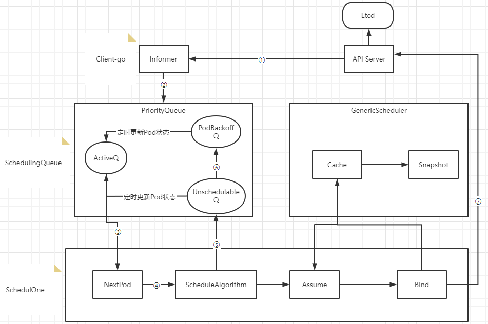

# 高级调度

## Kubernetes调度
K8S调度器Kube-schduler的主要作用是将新创建的Pod调度到集群中的合适节点上运行。kube-scheduler的调度算法非常灵活，可以根据不同的需求进行自定义配置，比如资源限制、亲和性和反亲和性等。
### kube-scheduler的工作原理如下（重要）
- 监听API Server：  
kube-scheduler会监听API Server上的Pod对象，以获取需要被调度的Pod信息。它会通过API Server提供的REST API接口获取Pod的信息，例如Pod的标签、资源需求等信息。
- 筛选可用节点：  
kube-scheduler会根据Pod的资源需求和约束条件（例如Pod需要的特定节点标签）筛选出可用的Node节点。它会从所有注册到集群中的Node节点中选择符合条件的节点。
- 计算分值：  
kube-scheduler会为每个可用的节点计算一个分值，以决定哪个节点是最合适的。分值的计算方式可以通过调度算法来指定，例如默认的算法是将节点资源利用率和距离Pod的网络延迟等因素纳入考虑。
- 选择节点：    
kube-scheduler会选择分值最高的节点作为最终的调度目标，并将Pod绑定到该节点上。如果有多个节点得分相等，kube-scheduler会随机选择一个节点。
- 更新API Server：   
kube-scheduler会更新API Server上的Pod对象，将选定的Node节点信息写入Pod对象的spec字段中，然后通知Kubelet将Pod绑定到该节点上并启动容器。
### Kube-scheduler调度器内部流转过程（了解）
   
① Scheduler通过注册client-go的informer handler方法监听api-server的pod和node变更事件，获取pod和node信息缓存到Informer中  
② 通过Informer的handler将事件更新到ActiveQ（ActiveQ、UnschedulableQ、PodBackoffQ为三个Scheduling队列，ActiveQ是一个维护着Pod优先级的堆结构，调度器在调度循环中每次从堆中取出优先级最高的Pod进行调度）  
③ 调度循环通过NextPod方法从ActiveQ中取出待调度队列  
④ 使用调度算法针对Node和Pod进行匹配和打分确定调度目标节点  
⑤ 如果调度器出错或失败，会调用shed.Error将Pod写入UnschedulableQ里  
⑥ 当不可调度时间超过backoff的时间，Pod会由Unschedulable转换到Podbackoff，也就是说Pod信息会写入到PodbackoffQ里  
⑦ Client-go向Api Server发送一个bind请求，实现异步绑定  

调度器在执行绑定操作的时候是一个异步过程，调度器会先在缓存中创建一个和原来Pod一样的Assume Pod对象用模拟完成节点的绑定，如将Assume Pod的Nodename设置成绑定节点名称，同时通过异步执行绑定指令操作。在Pod和Node绑定之前，Scheduler需要确保Volume已经完成绑定操作，确认完所有绑定前准备工作，Scheduler会向Api Server 发送一个Bind 对象，对应节点的Kubelet将待绑定的Pod在节点运行起来。

### 为节点计算分值
节点分值计算是通过调度器算法实现的，而不是固定的。默认情况下，kube-scheduler采用的是DefaultPreemption算法，其计算分值的方式包括以下几个方面：
- 节点的资源利用率   
kube-scheduler会考虑每个节点的CPU和内存资源利用率，将其纳入节点分值的计算中。资源利用率越低的节点得分越高。
- 节点上的Pod数目   
kube-scheduler会考虑每个节点上已经存在的Pod数目，将其纳入节点分值的计算中。如果节点上已经有大量的Pod，新的Pod可能会导致资源竞争和拥堵，因此节点得分会相应降低。
- Pod与节点的亲和性和互斥性   
kube-scheduler会考虑Pod与节点的亲和性和互斥性，将其纳入节点分值的计算中。如果Pod与节点存在亲和性，例如Pod需要特定的节点标签或节点与Pod在同一区域，节点得分会相应提高。如果Pod与节点存在互斥性，例如Pod不能与其他特定的Pod共存于同一节点，节点得分会相应降低。
- 节点之间的网络延迟   
kube-scheduler会考虑节点之间的网络延迟，将其纳入节点分值的计算中。如果节点之间的网络延迟较低，节点得分会相应提高。
- Pod的优先级   
kube-scheduler会考虑Pod的优先级，将其纳入节点分值的计算中。如果Pod具有高优先级，例如是关键业务的部分，节点得分会相应提高。  

这些因素的相对权重可以通过kube-scheduler的命令行参数或者调度器配置文件进行调整。需要注意的是，kube-scheduler的算法是可扩展的，可以根据需要编写自定义的调度算法来计算节点分值。

### 调度策略
- 默认调度策略（DefaultPreemption）：   
默认调度策略是kube-scheduler的默认策略，其基本原则是为Pod选择一个未满足需求的最小代价节点。如果无法找到这样的节点，就会考虑使用预选，即将一些已经调度的Pod驱逐出去来为新的Pod腾出空间。
- 带优先级的调度策略（Priority）：   
带优先级的调度策略基于Pod的优先级对节点进行排序，优先选择优先级高的Pod。该策略可以通过设置Pod的PriorityClass来实现。
- 节点亲和性调度策略（NodeAffinity）：   
节点亲和性调度策略基于节点标签或其他条件，选择与Pod需要的条件相匹配的节点。这可以通过在Pod定义中使用NodeAffinity配置实现。
- Pod 亲和性调度策略（PodAffinity）：   
Pod 亲和性调度策略根据Pod的标签和其他条件，选择与Pod相似的其他Pod所在的节点。这可以通过在Pod定义中使用PodAffinity配置实现。
- Pod 互斥性调度策略（PodAntiAffinity）：   
Pod 互斥性调度策略选择与Pod不相似的其他Pod所在的节点，以避免同一节点上运行相似的Pod。这可以通过在Pod定义中使用PodAntiAffinity配置实现。
- 资源限制调度策略（ResourceLimits）：   
资源限制调度策略选择可用资源最多的节点，以满足Pod的资源需求。这可以通过在Pod定义中使用ResourceLimits配置实现。

------------------

## 节点选择器NodeSelector
节点选择器是一种调度策略，它可以根据指定的标签选择器来选择符合条件的节点。在调度时，kube-scheduler会根据节点选择器来选择合适的节点来运行Pod。

```bash
# 配置yaml文件
cat > nodeselector.yaml <<EOF
apiVersion: v1
kind: Pod
metadata:
  name: nginx-ssd
spec:
  containers:
  - name: nginx-ssd
    image: nginx:1.23.2
    imagePullPolicy: IfNotPresent
    ports:
    - containerPort: 80
  nodeSelector:
    disktype: ssd
EOF

# 给Node2打标签
kubectl label node k8s2 disktype=ssd

# 应用yaml
kubectl apply -f nodeselector.yaml

# 查看Pod状态
kubectl describe po nginx-ssd

# 查看Node label 便签
[root@linyi ~]# kubectl get node --show-labels
NAME    STATUS   ROLES           AGE   VERSION   LABELS
k8s2    Ready    <none>          54d   v1.25.4   beta.kubernetes.io/arch=amd64,beta.kubernetes.io/os=linux,disktype=ssd,kubernetes.io/arch=amd64,kubernetes.io/hostname=k8s2,kubernetes.io/os=linux
k8s3    Ready    <none>          54d   v1.25.4   beta.kubernetes.io/arch=amd64,beta.kubernetes.io/os=linux,kubernetes.io/arch=amd64,kubernetes.io/hostname=k8s3,kubernetes.io/os=linux
linyi   Ready    control-plane   54d   v1.25.4   beta.kubernetes.io/arch=amd64,beta.kubernetes.io/os=linux,kubernetes.io/arch=amd64,kubernetes.io/hostname=linyi,kubernetes.io/os=linux,node-role.kubernetes.io/control-plane=,node.kubernetes.io/exclude-from-external-load-balancers=

# 查看pod信息，根据标签选择后运行在node2
[root@linyi ~]# kubectl describe po nginx-ssd |grep -i node
Node:             k8s2/192.168.1.172
Node-Selectors:              disktype=ssd
Tolerations:                 node.kubernetes.io/not-ready:NoExecute op=Exists for 300s
                             node.kubernetes.io/unreachable:NoExecute op=Exists for 300s
```

----------------------

## 节点亲和性NodeAffinity
如果选择用NodeAffinity则不需要再使用NodeSelector，已经包含在内了。

节点亲和性调度策略可以根据节点的标签和其他条件，选择与节点相似的其他节点。这可以通过在Pod定义中使用NodeAffinity配置实现。

也是针对Node，目的是把Pod部署到符合要求的Node上。  
关键词:  
- ① requiredDuringSchedulingIgnoredDuringExecution：表示强匹配，必须要满足
- ② preferredDuringSchedulingIgnoredDuringExecution：表示弱匹配，尽可能满足，但不保证
```yaml
# 示例文本展示
apiVersion: v1
kind: Pod
metadata:
  name: with-node-affinity
spec:
  affinity:
    nodeAffinity:
      requiredDuringSchedulingIgnoredDuringExecution:  ##必须满足下面匹配规则
        nodeSelectorTerms:
        - matchExpressions:
          - key: env
            operator: In  ##逻辑运算符支持：In,NotIn,Exists,DoesNotExist,Gt,Lt
            values:
            - test
            - dev
      preferredDuringSchedulingIgnoredDuringExecution: ##尽可能满足，但不保证
      - weight: 1
        preference:
          matchExpressions:
          - key: project
            operator: In
            values:
            - aminglinux
  containers:
  - name: with-node-affinity
    image: redis:6.0.6
```
说明：  
匹配逻辑：  
① 同时指定Node Selector和Node Affinity，两者必须同时满足；  
② Node Affinity中指定多组nodeSelectorTerms，只需要一组满足就可以；  
③ 当在nodeSelectorTerms中包含多组matchExpressions，必须全部满足才可以；  

演示示例：
```bash
# 编辑yaml文件
cat > nodeAffinity.yaml << EOF
apiVersion: v1
kind: Pod
metadata:
  name: node-affinity
spec:
  containers:
    - name: my-container
      image: nginx:1.23.2
  affinity:
    nodeAffinity:
      requiredDuringSchedulingIgnoredDuringExecution:
        nodeSelectorTerms:
          - matchExpressions:
              - key: special-node
                operator: Exists
EOF

# 给节点3定义标签
kubectl label nodes k8s3 special-node=true

# 生效Pod yaml
kubectl apply -f nodeAffinity.yaml

# 检查Pod所在node
kubectl get po -o wide
```

----------------------------------------

## Pod亲和性
针对对象为Pod，目的是实现新建Pod和目标Pod调度到一起，在同一个Node上。例如lnmp架构，需要把nginx和php尽量调度到一个node上会好一些。

```yaml
vim testpod01.yaml

apiVersion: v1
kind: Pod
metadata:
  name: testpod01
  labels:
    app: myapp01
    env: test1
spec:
  containers:
  - name: testpod01
    image: nginx:1.23.2

#---为分隔符，可以理解为分成两个文件
---
apiVersion: v1
kind: Pod
metadata:
  name: testpod02
  labels:
    app: myapp02
    env: test2
spec:
  affinity:
    podAffinity:        ## 针对Pod亲和性
      requiredDuringSchedulingIgnoredDuringExecution:  ##必须满足下面匹配规则
      - labelSelector:
          matchExpressions:
          - key: app
            operator: In  
            values:
            - myapp01  ## app=myapp01, 指定为上面pod的标签
        topologyKey: "kubernetes.io/hostname"
  containers:
  - name: testpod02
    image: redis:6.2
```
```bash
# 应用
kubectl apply -f testpod01.yaml

# 检查Pod所在node
kubectl get po -o wide
```

---------------------------------------

## Pod反亲和性
和上面相反。针对对象为Pod，目的是实现新建Pod和目标Pod不要调度到一起，不在同一个Node上。
```yaml
vim testpod02.yaml

apiVersion: v1
kind: Pod
metadata:
  name: testpod01
  labels:
    app: myapp01
    env: test1
spec:
  containers:
  - name: testpod01
    image: nginx:1.23.2

---
apiVersion: v1
kind: Pod
metadata:
  name: testpod02
  labels:
    app: myapp02
    env: test2
spec:
  affinity:
    podAntiAffinity:        ## 针对Pod反亲和性
      requiredDuringSchedulingIgnoredDuringExecution:  ##必须满足下面匹配规则
      - labelSelector:
          matchExpressions:
          - key: app
            operator: In  
            values:
            - myapp01  ## app=myapp01, 上面的Pod是符合要求的
        topologyKey: "kubernetes.io/hostname"
  containers:
  - name: testpod02
    image: redis:6.2
```
```bash
# 删掉testpod01创建的pod
kubectl delete -f testpod01.yaml

# 应用testpod02
kubectl apply -f testpod02.yaml

# 再次查看，两个pod一定不在同个node下
kubectl get po -o wide
```

----------------------------------

## 污点与容忍度

污点（Taint）针对节点来说，和节点亲和性正好相对，节点亲和性使Pod被吸引到一类特定的节点，而污点则使节点能够排斥一类特定的Pod。

容忍度（Toleration）应用于Pod上，它用来允许调度器调度带有对应污点的节点。 容忍度允许调度但并不保证调度：作为其功能的一部分， 调度器也会评估其他参数。

污点和容忍度（Toleration）相互配合，可以避免Pod被分配到不合适的节点上。 每个节点上都可以应用一个或多个污点，这表示对于那些不能容忍这些污点的Pod， 是不会被该节点接受的。

### 污点命令格式：
```bash
# 增加污点
kubectl taint node [node名字] key=value:[effect]
# 清除污点
kubectl taint node [node名字] key:[effect]-

# 示例
kubectl taint node k8s2 name=linyi:NoSchedule

# 查看污点
kubectl describe node k8s2 | grep Taints -A 10
```
说明：
- 其中[effect] 可取值：`NoSchedule` `PreferNoSchedule` `NoExecute`，默认为`NoSchedule`
    - NoSchedule ：一定不能被调度，已经在运行中的Pod不受影响。
    - PreferNoSchedule：尽量不要调度，实在没有节点可调度再调度到此节点。
    - NoExecute：不仅不会调度，还会驱逐Node上已有的Pod。

### 设置容忍度的几种规则：
```yaml
# 完全匹配
tolerations:
- key: "taintKey"      #和污点的key名字保持一致
  operator: "Equal"    #匹配类型，Equal表示匹配污点的所有值
  value: "taintValue"  #和污点key的值保持一致
  effect: "NoSchedule" #污点类型
## 说明：
Pod 的 Toleration 声明中的key和effect需要与Taint的设置保持一致。
Operator如果设置为Equal，则key和value，要和Taint的设置保持一致。


# 不完全匹配
tolerations:
- key: "taintKey"      #和污点的key名字保持一致
  operator: "Exists"   #匹配类型，只要符合污点设置的key即可
  effect: "NoSchedule" #污点的类型
## 说明：
Operator如果设置为Exists，则不需要指定value，只看key名字


# 大范围匹配
tolerations:
- key: "taintKey"      #和污点的key名字保持一致
  operator: "Exists"   
## 说明：
如果不设置effect，则只需要看key名字即可，不管Taint里的effect设置为什么都会匹配到


# 匹配所有
tolerations:
- operator: "Exists"  
## 说明：
如果省略key和effect，则匹配所有Taint， 在k8s中的daemonsets资源默认情况下是容忍所有污点的。


# 驱逐延缓时间设置
tolerations:
- key: "key1"
  operator: "Equal"
  value: "value1"
  effect: "NoExecute"
  tolerationSeconds: 3600
## 说明：
如果这个Pod 正在运行，那么Pod还将继续在节点上运行3600秒，然后被驱逐。 如果在此之前上述污点被删除了，则Pod不会被驱逐。
```

### 完整Pod YAML示例
```yaml
vim toleration.yaml

apiVersion: v1
kind: Pod
metadata:
  name: ng
  labels:
    env: dev
spec:
  containers:
  - name: ng
    image: nginx:1.21.0
  tolerations:
  - key: name
    operator: Exists
    effect: NoSchedule
```
```bash
# 配置k8s2节点为污点
kubectl taint node k8s2 name=linyi:NoSchedule

# 应用
kubectl apply -f toleration.yaml

# 查看，应该会调度到k8s3节点上
kubectl get po -o wide
```
