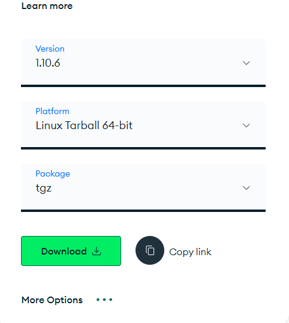

# MongoDB shell命令行
[官网下载地址](https://www.mongodb.com/try/download/shell)


```bash
# 下载、解压
wget https://downloads.mongodb.com/compass/mongosh-1.10.6-linux-x64.tgz
tar zxf mongosh-1.10.6-linux-x64.tgz -C /usr/local/
mv /usr/local/mongosh-1.10.6-linux-x64/bin/* /usr/local/mongodb/bin/

# 用mongosh连接MongoDB
mongosh 192.168.1.152:27017
```
> mongodb/bin径路已经做过path，将mongosh移动到mongodb/bin下就可以直接全局使用了。

## 用户和角色
角色列表：
- **read**：
读取当前数据库中的任何集合的数据
- **readWrite**：
可以读写当前数据库中的任何集合，读写包括插入、删除、更新文档以及创建、重命名、删除集合
- **readAnyDatabase**：
可以读取任何数据库的任何集合的数据
- **readWriteAnyDatabase**：
可以读写任何数据库中的任何集合
- **dbAdmin**：
读写当前数据库以及清理、修改、压缩、获取统计信息和执行检查
- **dbAdminAnyDatabase**：
可以读写任何数据库以及清理、修改、压缩、获取统计信息和执行检查
- **dbOwner**：
数据库所有者，拥有该库所有操作权限，包括dbAdmin、readWrite、userAdmin
- **userAdmin**：
当前库创建、修改用户信息的权限
- **userAdminAnyDatabase**：
所有库创建、修改用户信息的权限
- **clusterManager**：
提供集群的管理和监视操作。具有此角色的用户可以访问、配置和访问本地数据库，它们分别用于分片和复制中。
- **clusterMonitor**：
提供对监视工具的只读访问权限，比如MongoDB Cloud Manager和Ops Manager
- **clusterAdmin**：
让用户能够管理MongoDB，包括连接、集群、复制、列出数据库、创建数据库、和删除数据库
- **hostManager**：
提供监视和管理服务器的能力
- **backup**：
提供备份数据所需的最小权限。 该角色有足够的权限使用MongoDB Cloud Manager、Ops Manager的备用代理或者使用mongodump
- **restore**：
提供对非系统集合的转换。提供从备份中恢复数据所需的特权，这些备份不会对数据进行重新配置。当还原数据时，此角色足够。
- **root**：
提供对所有资源的访问权限。集合了readWriteAnyDatabase、dbAdminAnyDatabase、userAdminAnyDatabase、clusterAdmin、backup这些角色的所有权限

### 创建用户
如下操作在mongosh终端下执行`mongosh 192.168.1.152:27017`
```mongosh
# 创建一个root权限的用户
use admin
db.createUser({user:"root",pwd:"123123",roles:["root"]})

# 删除用户
db.dropUser("root")
```
> 注意：创建完用户，需要修改配置文件开启认证，才能使用用户名密码登陆：   
>    ```
>    vi /usr/local/mongodb/conf/mongodb.conf
>    ##开启用户认证。最后面增加如下安全配置
>    security:
>      authorization: enabled
>    
>    # 重启mongodb服务
>    systemctl restart mongodb
>    ```

```
# 再次登陆
mongosh
> use admin
> db.auth("root","123123")
{ ok: 1 }

# 也可以直接使用用户名密码登陆，需要手动输入密码
mongosh mongodb://root@192.168.1.152/admin
```
```mongosh
# 针对某一个库，创建用户，并指定客户端ip
> use testdb
> db.createUser(
   {
     user: "user1",
     pwd: "123123",
     roles: [ {role: 'dbOwner', db: 'testdb'} ],
     authenticationRestrictions: [ {
        clientSource: ["192.168.1.0/24"],
        serverAddress: ["192.168.1.0/24"]
     } ]
   }
)

# 测试连接
> mongosh mongodb://user1@192.168.1.152/testdb
Enter password: 123123
```
> user=用户名，pwd=密码，roles=角色，authenticationRestrictions=认证限制，clientSource=允许哪些客户端ip连接进来，serverAddress=允许连接到哪些服务端ip

----------------------------------------

# 常用操作
以下内容在mongosh中执行  
登陆mongosh`mongosh mongodb://root@192.168.1.152/admin`
```bash
# 查看所有库
show dbs
或
show databases

# 切换数据库
use testdb

# 查看集合
show collections

# 创建库
##mongo中创建数据库采用的也是use命令，如果use后面跟的数据库名不存在，那么mongo将会新建该数据库。不过，实际上只执行use命令后，mongo是不会新建该数据库的，只有创建了集合才会显示
# 创建testdb库，此时还没有testdb库
use testdb
# 创建集合，再查看所有库就能看到testdb库了
db.createCollection("testcol")

# 删除库，只能删除当前所在的库，所以先进入库，再执行删除
lwz> use testdb
testdb> db.dropDatabase()
{ ok: 1, dropped: 'testdb' }
```
```bash
# 新建集合collection
db.createCollection("testcol")

## 插入一个对象
db.testcol.insert({"name":"linyi"})

## 查看对象
db.testcol.find()

# 重命名集合
db.testcol.renameCollection("testcol2")

# 删除集合
db.testcol2.drop()

# 集合中插入数据（由于之前没有user集合，所以会自动创建user集合，并插入数据）
db.user.insert({'name':'Gal Gadot','gender':'female','age':28,'salary':11000})

# 查看集合中的数据
> db.user.find()
[
  {
    _id: ObjectId("65e59b2c4e64d45b7351a132"),
    name: 'Gal Gadot',
    gender: 'female',
    age: 28,
    salary: 11000
  }
]
```

```bash
# 根据条件查看数据

## age为28
db.user.find({"age":28})

## salary大于10000
db.user.find({salary:{$gt:10000}})

## salary大于10000且小于12000
db.user.find({salary:{$gt:10000,$lt:12000}})

## salary小于10000
db.user.find({salary:{$lt:10000}})

## 两个条件为或
db.user.find({$or:[{salary:{$gt:10000}},{age:{$lt:25}}]})

## 两个条件为与
db.user.find({$and:[{salary:{$gt:10000}},{age:{$lt:25}}]})

## 只显示指定字段
db.user.find({},{name:1,salary:1})

## 显示指定行
db.user.find().limit(2)

## 显示行数
db.user.find().count()
```
```bash
# 集合删除操作

## 根据条件删除，删除test集合中的name
db.test.remove({"name":'linyi'})

## 将salary大于10000的数据删除
db.user.remove({salary:{$gt:10000}})


# 更新操作

##两对{}，前面的为条件，后面为执行操作
db.user.updateMany({name:'Gal Gadot'},{$set:{age:29}})

## 更新操作，如果条件不满足，则插入数据
db.user.update({name:'Gal Gadot'},{$set:{age:29}},{upsert:true})
```

