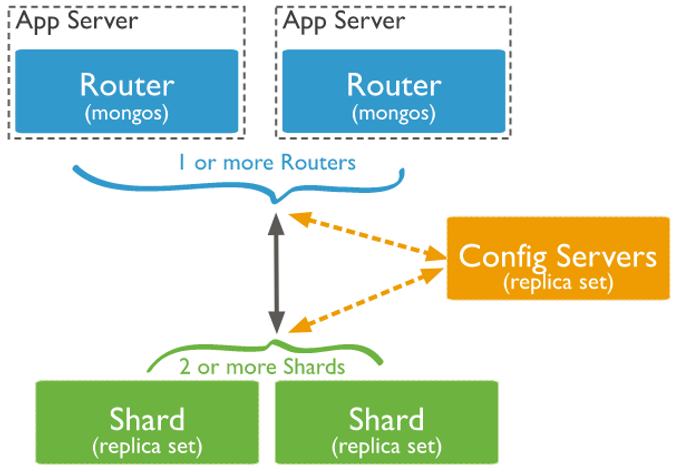
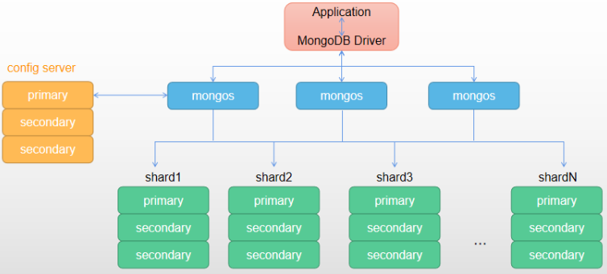

# MongoDB分片集群

## 介绍
副本集帮助我们解决读请求扩展、高可用等问题。随着业务场景进一 步增长，可能会出现以下问题：
- 存储容量超出单机磁盘容量
- 活跃数据集超出单机内存容量：很多读请求需要从磁盘读取
- 写入量超出单机 IOPS 上限  

解决此问题，有两个途径：1）扩展服务器硬件性能，比如增加磁盘和内存；2）增加服务器数量

从成本和便捷性上考虑，肯定是第2个更加合适。

而Mongodb分片技术就是基于第2个途径来解决以上问题的。

MongoDB 分片集群（Sharded Cluster）是对数据进行水平扩展的一种方式，分片集群用来支持大数据集和高吞吐量的业务场景。  
本质上，Mongodb的分片技术就是将数据按预定的算法均匀地分布到不同的节点上，类似于磁盘的raid5。只不过它的每个节点都是一组一组的副本集。

## 分片集群架构
分片集群由3个组件组成：  
  
1. 路由(mongos)  
    数据库集群请求的入口，所有的请求都通过mongos进行协调，不需要在应用程序添加一个路由选择器，mongos自己就是一个请求分发中心，它负责把对应的数据请求请求转发到对应的shard服务器上。在生产环境通常有多mongos作为请求的入口，防止其中一个挂掉所有的mongodb请求都没有办法操作。
2. 配置服务器(config servers)  
    存储所有数据库元信息（路由、分片）的配置。  
    mongos本身没有物理存储分片服务器和数据路由信息，只是缓存在内存里，配置服务器则实际存储这些数据。  
    mongos第一次启动或者关掉重启就会从config server加载配置信息，以后如果配置服务器信息变化会通知到所有的mongos更新自己的状态，这样mongos就能继续准确路由。  
    在生产环境通常有多个 config server 配置服务器，因为它存储了分片路由的元数据，防止数据丢失！
3. 分片(shard)  
    存储用户数据，不同shard保存不同用户数据。  
    存储了一个集合部分数据的MongoDB实例，每个分片是单独的mongodb服务或者副本集，在生产环境中，所有的分片都应该是副本集。

## 分片集群搭建  
  

### 机器规划

| 节点 | 主机名 | IP地址 | 角色 |
|------|--------|--------|------|
| 节点1 | lwz1 | 192.168.1.152 | mongos、config server、shard1主节点、shard2从节点、shard3从节点 |
| 节点2 | lwz2 | 192.168.1.156 | mongos、config server、shard1从节点、shard2从节点、shard3主节点 |
| 节点3 | lwz3 | 192.168.1.136 | mongos、config server、shard1从节点、shard2主节点、shard3从节点 |

### 端口划分

| 角色 | 端口号 |
| ------ | ------ |
| mongos | 20000 |
| config server | 21000 |
| shard1 | 27001 |
| shard2 | 27002 |
| shard3 | 27003 |

### 准备工作
三个节点分别执行：
```bash
# 修改各自的主机名
sudo hostnamectl set-hostname lwz1
sudo hostnamectl set-hostname lwz2
sudo hostnamectl set-hostname lwz3

# 修改hosts文件，每台加入以下全部内容
cat >> /etc/hosts <<EOF
192.168.1.152   lwz1
192.168.1.156   lwz2
192.168.1.136   lwz3
EOF

# 关闭防火墙和selinux
sudo systemctl stop firewalld
sudo systemctl disable firewalld
sudo sed -i 's/SELINUX=enforcing/SELINUX=disabled/' /etc/selinux/config
sudo setenforce 0
```

### 安装mongodb
[参考mongodb单机版安装](./%E5%8D%95%E6%9C%BA%E7%89%88%E5%AE%89%E8%A3%85.md)

如果mongodb有旧数据，需要先删除旧数据，再进行分片集群搭建：
**三个节点都执行**
```bash
# 停止服务、删除旧数据
systemctl stop mongodb
rm -rf /data/mongodb/*
```
**三台节点执行**
```bash
# 创建分片集群所需目录
mkdir -p /data/mongodb/{mongos,config,shard1,shard2,shard3}
chown -R mongodb /data/mongodb/
```

### 配置config server
**节点1执行**
```bash
# 创建config server配置文件
vi /usr/local/mongodb/conf/config.conf
##加入如下内容
systemLog:
  #MongoDB发送所有日志输出的目标指定为文件
  destination: file
  #mongod或mongos应向其发送所有诊断日志记录信息的日志文件的路径
  path: "/usr/local/mongodb/logs/configsvr.log"
  #当mongos或mongod实例重新启动时，mongos或mongod会将新条目附加到现有日志文件的末尾
  logAppend: true
storage:
  #mongod实例存储其数据的目录。storage.dbPath设置仅适用于mongod
  dbPath: "/data/mongodb/config"
  journal:
    #启用或禁用持久性日志以确保数据文件保持有效和可恢复。
    enabled: true
processManagement:
  #启用在后台运行mongos或mongod进程的守护进程模式。
  fork: true
  #指定用于保存mongos或mongod进程的进程ID的文件位置，其中mongos或mongod将写入其PID
  pidFilePath: "/usr/local/mongodb/logs/configsvr.pid"
  #从中加载时区数据库的完整路径
  timeZoneInfo: /usr/share/zoneinfo
net:
  #服务实例绑定所有IP，有副作用，副本集初始化的时候，节点名字会自动设置为本地域名，而不是ip
  #bindIpAll: true
  #服务实例绑定的IP,0.0.0.0让所有机器都能连接。
  bindIp: 0.0.0.0
  #bindIp
  #绑定的端口
  port: 21000
# 安全配置
#security:
  # 配置密码文件
  #keyFile: /usr/local/mongodb/conf/keyfile
replication:
  #副本集的名称
  replSetName: "config"
sharding:
  clusterRole: configsvr
```
```bash
# 将节点1中的config.conf文件复制到其他节点
scp /usr/local/mongodb/conf/config.conf lwz2:/usr/local/mongodb/conf/config.conf
scp /usr/local/mongodb/conf/config.conf lwz3:/usr/local/mongodb/conf/config.conf
```
```bash
# 创建systemd服务脚本
vi /lib/systemd/system/configsvr.service

[Unit]
Description=mongodb
After=network.target remote-fs.target nss-lookup.target

[Service]
User=mongodb
Type=forking
ExecStart=/usr/local/mongodb/bin/mongod --config /usr/local/mongodb/conf/config.conf
ExecReload=/bin/kill -s HUP $MAINPID
ExecStop=/bin/kill -QUIT $MAINPID
PrivateTmp=true

[Install]
WantedBy=multi-user.target
```
```bash
# 复制到其他节点
scp /lib/systemd/system/configsvr.service lwz2:/lib/systemd/system/configsvr.service
scp /lib/systemd/system/configsvr.service lwz3:/lib/systemd/system/configsvr.service
```
三台节点启动服务
```bash
systemctl daemon-reload
systemctl start configsvr.service
systemctl enable configsvr.service
```
#### 登陆**节点1**，初始化副本集  
需要使用mongosh，安装请参考[mongosh安装](./MongoDB%20shell.md)

```bash
# 登陆节点1
mongosh lwz1:21000

# 初始化副本集
rs.initiate(
   {
      _id: "config",
      version: 1,
      members: [
         { _id: 0, host : "lwz1:21000" },
         { _id: 1, host : "lwz2:21000"},
         { _id: 2, host : "lwz3:21000" }
      ]
   }
)
##输出如下则成功
{ ok: 1, lastCommittedOpTime: Timestamp({ t: 1709694974, i: 1 }) }
```

### 配置shard
**三个节点都要**配置shard1、shard2、shard3。  
以下内容以配置shard1为例，shard2和shard3需要注意修改关键字：shard1改为shard2和shard3，端口号27001改为27002和27003  

**节点1执行**
```bash
# 创建shard配置文件（注意修改）
vi /usr/local/mongodb/conf/shard1.conf
##加入如下内容
systemLog:
  #MongoDB发送所有日志输出的目标指定为文件
  destination: file
  #mongod或mongos应向其发送所有诊断日志记录信息的日志文件的路径
  path: "/usr/local/mongodb/logs/shard1.log"
  #当mongos或mongod实例重新启动时，mongos或mongod会将新条目附加到现有日志文件的末尾
  logAppend: true
storage:
  #mongod实例存储其数据的目录。storage.dbPath设置仅适用于mongod
  dbPath: "/data/mongodb/shard1"
  journal:
    #启用或禁用持久性日志以确保数据文件保持有效和可恢复。
    enabled: true
processManagement:
  #启用在后台运行mongos或mongod进程的守护进程模式。
  fork: true
  #指定用于保存mongos或mongod进程的进程ID的文件位置，其中mongos或mongod将写入其PID
  pidFilePath: "/usr/local/mongodb/logs/shard1.pid"
  #从中加载时区数据库的完整路径
  timeZoneInfo: /usr/share/zoneinfo
net:
  #服务实例绑定所有IP，有副作用，副本集初始化的时候，节点名字会自动设置为本地域名，而不是ip
  #bindIpAll: true
  #服务实例绑定的IP,0.0.0.0让所有机器都能连接。
  bindIp: 0.0.0.0
  #bindIp
  #绑定的端口
  port: 27001
# 安全配置
#security:
  # 配置密码文件
  #keyFile: /usr/local/mongodb/conf/keyfile
replication:
  #副本集的名称
  replSetName: "shard1"
sharding:
  clusterRole: shardsvr
```
```bash
# 创建systemd服务脚本（注意修改）
vi /lib/systemd/system/shard1.service

[Unit]
Description=mongodb
After=network.target remote-fs.target nss-lookup.target

[Service]
User=mongodb
Type=forking
ExecStart=/usr/local/mongodb/bin/mongod --config /usr/local/mongodb/conf/shard1.conf
ExecReload=/bin/kill -s HUP $MAINPID
ExecStop=/bin/kill -QUIT $MAINPID
PrivateTmp=true

[Install]
WantedBy=multi-user.target
```
```bash
# 在节点1上复制配置文件到其他节点（注意修改）
scp /usr/local/mongodb/conf/shard1.conf lwz2:/usr/local/mongodb/conf/
scp /usr/local/mongodb/conf/shard1.conf lwz3:/usr/local/mongodb/conf/

scp /lib/systemd/system/shard1.service lwz2:/lib/systemd/system/shard1.service
scp /lib/systemd/system/shard1.service lwz3:/lib/systemd/system/shard1.service

# 启动服务（三台节点都启动）
systemctl daemon-reload
systemctl start shard1.service
systemctl enable shard1.service
```
**节点1执行，shard1副本集**
```bash
# 登陆节点1
mongosh lwz1:27001

# 初始化副本集
rs.initiate(
   {
      _id: "shard1",
      version: 1,
      members: [
         { _id: 0, host : "lwz1:27001", priority:3},
         { _id: 1, host : "lwz2:27001", priority:2},
         { _id: 2, host : "lwz3:27001", priority:1}
      ]
   }
)
```
**节点3执行，shard2副本集**
```bash
# 登陆节点3
mongosh lwz3:27002

# 初始化副本集
rs.initiate(
   {
      _id: "shard2",
      version: 1,
      members: [
         { _id: 0, host : "lwz3:27002", priority:3 },
         { _id: 1, host : "lwz1:27002", priority:2},
         { _id: 2, host : "lwz2:27002", priority:1}
      ]
   }
)
```
**节点2执行，shard3副本集**
```bash
# 登陆节点2
mongosh lwz2:27003

# 初始化副本集
rs.initiate(
   {
      _id: "shard3",
      version: 1,
      members: [
         { _id: 0, host : "lwz2:27003", priority:3 },
         { _id: 1, host : "lwz3:27003", priority:2},
         { _id: 2, host : "lwz1:27003", priority:1}
      ]
   }
)
```

### 配置路由
**节点1执行**
```bash
# 创建mongos配置文件
vi /usr/local/mongodb/conf/mongos.conf
##加入内容如下
systemLog:
  #MongoDB发送所有日志输出的目标指定为文件
  destination: file
  #mongod或mongos应向其发送所有诊断日志记录信息的日志文件的路径
  path: "/usr/local/mongodb/logs/mongos.log"
  #当mongos或mongod实例重新启动时，mongos或mongod会将新条目附加到现有日志文件的末尾
  logAppend: true
processManagement:
  #启用在后台运行mongos或mongod进程的守护进程模式。
  fork: true
  #指定用于保存mongos或mongod进程的进程ID的文件位置，其中mongos或mongod将写入其PID
  pidFilePath: "/usr/local/mongodb/logs/mongos.pid"
  #从中加载时区数据库的完整路径
  timeZoneInfo: /usr/share/zoneinfo
net:
  #服务实例绑定所有IP，有副作用，副本集初始化的时候，节点名字会自动设置为本地域名，而不是ip
  #bindIpAll: true
  #服务实例绑定的IP,0.0.0.0让所有机器都能连接。
  bindIp: 0.0.0.0
  #bindIp
  #绑定的端口
  port: 20000
# 安全配置
#security:
  # 配置密码文件
  #keyFile: /usr/local/mongodb/conf/keyfile
sharding:
  configDB: config/lwz1:21000,lwz2:21000,lwz3:21000
```
```bash
# 创建systemd服务脚本
vi /lib/systemd/system/mongos.service

[Unit]
Description=mongos
After=network.target remote-fs.target nss-lookup.target

[Service]
User=mongodb
Type=forking
ExecStart=/usr/local/mongodb/bin/mongos --config /usr/local/mongodb/conf/mongos.conf
ExecReload=/bin/kill -s HUP $MAINPID
ExecStop=/bin/kill -QUIT $MAINPID
PrivateTmp=true

[Install]
WantedBy=multi-user.target
```
```bash
# 节点1上复制配置文件到其他节点
scp /usr/local/mongodb/conf/mongos.conf lwz2:/usr/local/mongodb/conf/
scp /usr/local/mongodb/conf/mongos.conf lwz3:/usr/local/mongodb/conf/

scp /lib/systemd/system/mongos.service lwz2:/lib/systemd/system/
scp /lib/systemd/system/mongos.service lwz3:/lib/systemd/system/

# 三台节点上启动服务
systemctl daemon-reload
systemctl start mongos.service
systemctl enable mongos.service
```

### 启用分片
任意节点连接mongos，执行命令
```bash
# 连接mongos
mongosh lwz1:20000

# 启用分片
sh.addShard("shard1/lwz1:27001,lwz2:27001,lwz3:27001")
sh.addShard("shard2/lwz1:27002,lwz2:27002,lwz3:27002")
sh.addShard("shard3/lwz1:27003,lwz2:27003,lwz3:27003")

# 查看状态
[direct: mongos] test> sh.status()
shardingVersion
{
  _id: 1,
  minCompatibleVersion: 5,
  currentVersion: 6,
  clusterId: ObjectId("65e7e008746e390958c192ad")
}
---
shards
[
  {
    _id: 'shard1',
    host: 'shard1/lwz1:27001,lwz2:27001,lwz3:27001',
    state: 1,
    topologyTime: Timestamp({ t: 1709706208, i: 5 })
  },
  {
    _id: 'shard2',
    host: 'shard2/lwz1:27002,lwz2:27002,lwz3:27002',
    state: 1,
    topologyTime: Timestamp({ t: 1709706250, i: 5 })
  },
  {
    _id: 'shard3',
    host: 'shard3/lwz1:27003,lwz2:27003,lwz3:27003',
    state: 1,
    topologyTime: Timestamp({ t: 1709706255, i: 5 })
  }
]
---
active mongoses
[ { '6.0.1': 3 } ]
---
autosplit
{ 'Currently enabled': 'yes' }
---
balancer
{
  'Currently enabled': 'yes',
  'Failed balancer rounds in last 5 attempts': 0,
  'Currently running': 'no',
  'Migration Results for the last 24 hours': 'No recent migrations'
}
---
databases
[
  {
    database: { _id: 'config', primary: 'config', partitioned: true },
    collections: {}
  }
]
```

### 开启认证(安全措施)
**任意节点**执行：
```bash
# 连接mongos，创建root用户
mongosh lwz1:20000

use admin
db.createUser({user:"root",pwd:"123123",roles:["root"]})
```
**节点1**终端执行，创建keyfile：
```bash
openssl rand -base64 20 > /usr/local/mongodb/conf/keyfile
chmod 400 /usr/local/mongodb/conf/keyfile
chown mongodb /usr/local/mongodb/conf/keyfile

# keyfile复制到其他节点
scp /usr/local/mongodb/conf/keyfile lwz2:/usr/local/mongodb/conf/keyfile
scp /usr/local/mongodb/conf/keyfile lwz3:/usr/local/mongodb/conf/keyfile
```
**节点2**和**节点3**终端执行，修改keyfile权限：
```bash
chmod 400 /usr/local/mongodb/conf/keyfile
chown mongodb /usr/local/mongodb/conf/keyfile
```
**三个节点**都执行：
```bash
# 将所有配置security（安全认证）那部分配置前面的#删除掉
cd /usr/local/mongodb/conf
sed -i -e 's/#security/security/' -e 's/#keyFile/keyFile/' *.conf

# 重启所有服务
for s in configsvr shard1 shard2 shard3 mongos ; do systemctl restart $s; done

# 查看服务状态（端口是否都启动）
netstat -lntp|grep mongo
```

### 测试分片
**任意节点**执行：
```bash
# 连接mongos
mongosh lwz1:20000

use admin
db.auth("root", "123123")

use testdb
## 指定要分片的数据库
sh.enableSharding("testdb")

## 指定数据库里需要分片的集合和片键
sh.shardCollection("testdb.table1", {id: "hashed"} )

## 插入测试数据(10000条，服务器性能不好就1000条)
for (var i = 1; i <= 10000; i++) db.table1.insert({id:i*123,uid:i})

## 查看table1状态
db.table1.stats()

## 查看table1数据
db.table1.find()
### 注意：如果数据量很大，需要执行it查看更多信息
```
