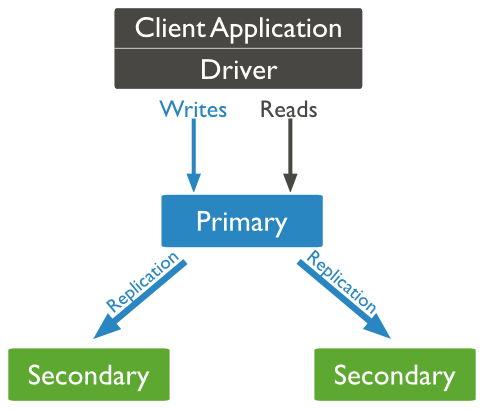

# MongoDB副本集
为了解决Mongodb数据高可用，官方提供了副本集机制，Mongodb副本集至少需要三个节点，其中一个是主节点，负责处理客户端请求，其余的都是从节点，负责复制主节点上的数据，两个从节点中也可以让其中一个节点做仲裁，不存数据。  
Mongodb各个节点常见的搭配方式为：一主一从、一主多从。副本集中只有主能写，其余的从只能读。  
主节点记录在其上的所有操作oplog，从节点定期轮询主节点获取这些操作，然后对自己的数据副本执行，这些操作，从而保证从节点的数据与主节点一致。

Mongodb副本集结构图如下所示：


当主节点发生故障后，其中一个从节点会成为新的主。
  
MongoDB副本集在主从复制基础上实现了故障转移的功能，也就是当主节点宕机时，某一台副本节点会自动提升为新主节点。

## 副本集搭建

### 机器准备

| 节点 | 主机名 | IP地址 | 角色 |
| --- | --- | --- | --- |
| 节点1 | lwz1 | 192.168.1.152 | 主节点 |
| 节点2 | lwz2 | 192.168.1.156 | 从节点 |
| 节点3 | lwz3 | 192.168.1.136 | 从节点 |

三个节点分别执行：
```bash
# 修改各自的主机名
sudo hostnamectl set-hostname lwz1
sudo hostnamectl set-hostname lwz2
sudo hostnamectl set-hostname lwz3

# 修改hosts文件，每台加入以下全部内容
sudo vim /etc/hosts

192.168.1.152   lwz1
192.168.1.156   lwz2
192.168.1.136   lwz3

# 关闭防火墙和selinux
sudo systemctl stop firewalld
sudo systemctl disable firewalld
sudo sed -i 's/SELINUX=enforcing/SELINUX=disabled/' /etc/selinux/config
sudo setenforce 0
```

### 节点1安装MongoDB
[参考MongoDB单机版安装](./%E5%8D%95%E6%9C%BA%E7%89%88%E5%AE%89%E8%A3%85.md)  

> 注意：如果mongodb数据目录下有旧的数据，需要先删除，否则后面启动会报错。
> ```bash
> # 删除旧数据，重新创建
> rm -rf /data/mongodb/
> mkdir -p /data/mongodb/
> chown -R mongodb /data/mongodb  /usr/local/mongodb
> ```

安装完成后，增加如下配置：
```bash
# 创建keyfile (副本集各成员之间认证）
openssl rand -base64 20 > /usr/local/mongodb/conf/keyfile 
chmod 400 /usr/local/mongodb/conf/keyfile

# 编辑配置文件
vi /usr/local/mongodb/conf/mongodb.conf
##配置文件最后追加或修改
security:
  #注释掉authorization: enabled
  #配置密码文件
  keyFile: /usr/local/mongodb/conf/keyfile
replication:
  #副本集的名称
  replSetName: "linyi"
```

### 节点2和节点3安装MongoDB
直接在**节点1**上将mongodb相关文件拷贝到另外两个节点：
```bash
scp -r /usr/local/mongodb lwz2:/usr/local/
scp -r /usr/local/mongodb lwz3:/usr/local/

scp /lib/systemd/system/mongodb.service lwz2:/lib/systemd/system/
scp /lib/systemd/system/mongodb.service lwz3:/lib/systemd/system/

scp /etc/profile.d/mongodb.sh lwz2:/etc/profile.d/
scp /etc/profile.d/mongodb.sh lwz3:/etc/profile.d/
```
在**节点2**、**节点3**执行：
```bash
# 刷新环境变量配置
source /etc/profile.d/mongodb.sh

# 创建目录、创建用户、修改权限
mkdir -p /data/mongodb
useradd -s /sbin/nologin mongodb
chown -R mongodb /data/mongodb  /usr/local/mongodb

# 加载、启动服务
systemctl daemon-reload
systemctl start mongodb
systemctl enable mongodb
```

### 节点1上创建用户
```bash
# 编辑配置文件
vi  /usr/local/mongodb/conf/mongodb.conf
##注释掉下面几行
#security:
  #authorization: enabled
  # 配置密码文件
  #keyFile: /usr/local/mongodb/conf/keyfile
#replication:
  #副本集的名称
  #replSetName: "linyi"


# 重启服务
systemctl restart mongodb
```
[mongosh工具下载参考](./MongoDB%20shell.md)  
用mongosh工具连接mongodb：
```bash
mongosh 192.168.1.152:27017

# 创建用户
test> use admin
switched to db admin
admin> db.createUser({user:"root",pwd:"123123",roles:["root"]})
{ ok: 1 }
```
```bash
# 再次编辑配置文件，取消注释
vi  /usr/local/mongodb/conf/mongodb.conf

security:
  #authorization: enabled
  # 配置密码文件
  keyFile: /usr/local/mongodb/conf/keyfile
replication:
  #副本集的名称
  replSetName: "linyi"


# 重启服务
systemctl restart mongodb
```
### 节点1上初始化副本集
```bash
# 连接mongodb
mongosh 192.168.1.152:27017

# 认证
test> use admin
switched to db admin
admin> db.auth("root","123123")
{ ok: 1 }

# 副本集初始化
rs.initiate(
   {
      _id: "linyi",
      version: 1,
      members: [
         { _id: 0, host : "lwz1:27017" },
         { _id: 1, host : "lwz2:27017", arbiterOnly: true },
         { _id: 2, host : "lwz3:27017" }
      ]
   }
)
```
```bash
# 查看副本集状态
use admin

db.auth("root","123123")

linyi [direct: primary] admin> rs.status()
{
  set: 'linyi',
  date: ISODate("2024-03-05T08:42:29.262Z"),
  myState: 1,
  term: Long("1"),
  syncSourceHost: '',
  syncSourceId: -1,
  heartbeatIntervalMillis: Long("2000"),
  majorityVoteCount: 2,
  writeMajorityCount: 2,
  votingMembersCount: 3,
  writableVotingMembersCount: 2,
  optimes: {
    lastCommittedOpTime: { ts: Timestamp({ t: 1709628141, i: 1 }), t: Long("1") },
    lastCommittedWallTime: ISODate("2024-03-05T08:42:21.708Z"),
    readConcernMajorityOpTime: { ts: Timestamp({ t: 1709628141, i: 1 }), t: Long("1") },
    appliedOpTime: { ts: Timestamp({ t: 1709628141, i: 1 }), t: Long("1") },
    durableOpTime: { ts: Timestamp({ t: 1709628141, i: 1 }), t: Long("1") },
    lastAppliedWallTime: ISODate("2024-03-05T08:42:21.708Z"),
    lastDurableWallTime: ISODate("2024-03-05T08:42:21.708Z")
  },
  lastStableRecoveryTimestamp: Timestamp({ t: 1709628131, i: 1 }),
  electionCandidateMetrics: {
    lastElectionReason: 'electionTimeout',
    lastElectionDate: ISODate("2024-03-05T08:24:31.602Z"),
    electionTerm: Long("1"),
    lastCommittedOpTimeAtElection: { ts: Timestamp({ t: 1709627060, i: 1 }), t: Long("-1")},
    lastSeenOpTimeAtElection: { ts: Timestamp({ t: 1709627060, i: 1 }), t: Long("-1") },
    numVotesNeeded: 2,
    priorityAtElection: 1,
    electionTimeoutMillis: Long("10000"),
    numCatchUpOps: Long("0"),
    newTermStartDate: ISODate("2024-03-05T08:24:31.645Z"),
    wMajorityWriteAvailabilityDate: ISODate("2024-03-05T08:24:32.558Z")
  },
  members: [
    {
      _id: 0,
      name: 'lwz1:27017',
      health: 1,
      state: 1,
      stateStr: 'PRIMARY',
      uptime: 1424,
      optime: { ts: Timestamp({ t: 1709628141, i: 1 }), t: Long("1") },
      optimeDate: ISODate("2024-03-05T08:42:21.000Z"),
      lastAppliedWallTime: ISODate("2024-03-05T08:42:21.708Z"),
      lastDurableWallTime: ISODate("2024-03-05T08:42:21.708Z"),
      syncSourceHost: '',
      syncSourceId: -1,
      infoMessage: '',
      electionTime: Timestamp({ t: 1709627071, i: 1 }),
      electionDate: ISODate("2024-03-05T08:24:31.000Z"),
      configVersion: 1,
      configTerm: 1,
      self: true,
      lastHeartbeatMessage: ''
    },
    {
      _id: 1,
      name: 'lwz2:27017',
      health: 1,
      state: 7,
      stateStr: 'ARBITER',
      uptime: 1088,
      lastHeartbeat: ISODate("2024-03-05T08:42:28.144Z"),
      lastHeartbeatRecv: ISODate("2024-03-05T08:42:28.147Z"),
      pingMs: Long("0"),
      lastHeartbeatMessage: '',
      syncSourceHost: '',
      syncSourceId: -1,
      infoMessage: '',
      configVersion: 1,
      configTerm: 1
    },
    {
      _id: 2,
      name: 'lwz3:27017',
      health: 1,
      state: 2,
      stateStr: 'SECONDARY',
      uptime: 1088,
      optime: { ts: Timestamp({ t: 1709628141, i: 1 }), t: Long("1") },
      optimeDurable: { ts: Timestamp({ t: 1709628141, i: 1 }), t: Long("1") },
      optimeDate: ISODate("2024-03-05T08:42:21.000Z"),
      optimeDurableDate: ISODate("2024-03-05T08:42:21.000Z"),
      lastAppliedWallTime: ISODate("2024-03-05T08:42:21.708Z"),
      lastDurableWallTime: ISODate("2024-03-05T08:42:21.708Z"),
      lastHeartbeat: ISODate("2024-03-05T08:42:28.144Z"),
      lastHeartbeatRecv: ISODate("2024-03-05T08:42:29.161Z"),
      pingMs: Long("0"),
      lastHeartbeatMessage: '',
      syncSourceHost: 'lwz1:27017',
      syncSourceId: 0,
      infoMessage: '',
      configVersion: 1,
      configTerm: 1
    }
  ],
  ok: 1,
  '$clusterTime': {
    clusterTime: Timestamp({ t: 1709628141, i: 1 }),
    signature: {
      hash: Binary(Buffer.from("de6722565e03cbf45b5c05442ad4eaa16d3dfa35", "hex"), 0),
      keyId: Long("7342792358301270022")
    }
  },
  operationTime: Timestamp({ t: 1709628141, i: 1 })
}
```

### 故障模拟
```bash
# 节点1停掉
systemctl stop mongodb

# 节点3查看状态，发现主节点已经切换到其他节点，节点1显示断开
use admin
db.auth("root","123123")
rs.status()

# 节点1上线后会变成从（secondary）
systemctl start mongodb
```

## 更详细参考
[副本集](https://zhuanlan.zhihu.com/p/98451473)