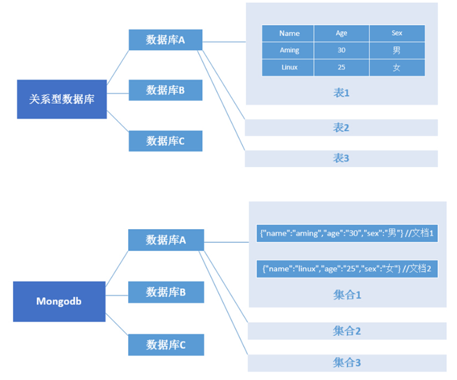

# MongoDB介绍
MongoDB为分布式文档数据库，属于一种NoSQL，它是最像关系型数据库的NoSQL。
MongoDB 将数据存储为一个文档，数据结构由键值(key=>value)对组成。MongoDB 文档类似于 JSON 对象。字段值可以包含其他文档、数组及文档数组。

## NoSQL介绍
NoSQL(NoSQL = Not Only SQL )，意即"不仅仅是SQL"。   
NoSQL主要是区分关系型数据库的一种数据库，关系型数据库典型代表就是MySQL，一个库里的多张表是有关系的，举个例子，对于电商网站来讲（就像淘宝），你购买一个商品  
，这个行为涉及到的表不止一个，比如商品表、订单表、仓储表、物流表等等，那么这些表彼此之间是有关联关系的，比如这些表里都有商品id。

而NoSQL就不存在这种错综复杂的关联关系，它的结构非常简单，就是单纯的类似key-value这样的形态。我们之前学过的Redis就属于NoSQL。

NoSQL数据库有一些特性：  
可扩展、分布式计算、低成本、架构灵活、关系简单

## MongoDB的应用场景
- 游戏场景：
使用 MongoDB 存储游戏用户信息，用户的装备、积分等直接以内嵌文档的形式存储，方便查询、更新
- 物流场景：使用 MongoDB 存储订单信息，订单状态在运送过程中会不断更新，以 MongoDB 内嵌数组的形式存储，一次查询就可以获得订单的当前状态
- 社交场景：使用 MongoDB 存储用户信息，记录用户的交友动态，使用 Map/Reduce 进行好友推荐，使用 MongoDB 结构存储动态数据，使用 map/reduce 进行数据统计
- 物联网场景：使用 MongoDB 存储所有接入的智能设备信息，以及设备汇报的日志信息，并对这些信息进行多维度的分析
- 视频直播：使用 MongoDB 存储用户信息、礼物信息等，使用 MongoDB 数据库的复制功能，实现实时直播的礼物排行榜

总之，只要满足不使用关系型数据库的数据存储场景都可以用MongoDB代替。  
如果你还在为是否应该使用 MongoDB，不如来做几个选择题来辅助决策

| 应用特征 | Yes/No |
| :------ | :------: |
| 应用不需要事务及复杂 join 支持 | Yes |
| 新应用，需求会变，数据模型无法确定，想快速迭代开发 | ? |
| 应用需要2000-3000以上的读写QPS（更高也可以） | ? |
| 应用需要TB甚至 PB 级别数据存储 | ? |
| 应用发展迅速，需要能快速水平扩展 | ? |
| 应用要求存储的数据不丢失 | ? |
| 应用需要99.999%高可用 | ? |
| 应用需要大量的地理位置查询、文本查询 | ? |

如果你的应用符合以上任意一条，都可以考虑使用 MongoDB。2个及以上的 Yes，选择MongoDB绝不会后悔。

## MongoDB和SQL对比

| SQL术语/概念 | MongoDB术语/概念 | 解释/说明 |
| :------ | :------: | :------: |
| database | database | 数据库 |
| table | collection | 数据库表/集合 |
| row | document | 数据记录行/文档 |
| column | field | 数据字段/域 |
| index | index | 索引 |
| table joins |  | 表连接,MongoDB不支持 |
| primary key | primary key | 主键,MongoDB自动将_id字段设置为主键 |

