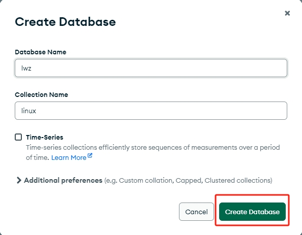

# 单机版安装
```bash
# 下载、解压并修改路径
wget  https://fastdl.mongodb.org/linux/mongodb-linux-x86_64-rhel80-6.0.1.tgz
tar zxf mongodb-linux-x86_64-rhel80-6.0.1.tgz -C /usr/local
mv /usr/local/mongodb-linux-x86_64-rhel80-6.0.1  /usr/local/mongodb
```
> 说明：一定要选择对系统版本，因为下载的包为二进制包，可以直接运行的
> 这里选择的是rhel8系统，支持centos8和rocky8。

```bash
# 定义path
vi /etc/profile.d/mongodb.sh
##添加以下内容
export PATH=$PATH:/usr/local/mongodb/bin

# 生效
source /etc/profile
```
```bash
# 创建相应目录
mkdir  /usr/local/mongodb/{conf,logs}
mkdir  -p /data/mongodb

# 创建配置文件
vi /usr/local/mongodb/conf/mongodb.conf
##添加如下内容，注意有缩进
systemLog:
  #MongoDB发送所有日志输出的目标指定为文件
  destination: file
  #mongod或mongos应向其发送所有诊断日志记录信息的日志文件的路径
  path: "/usr/local/mongodb/logs/mongodb.log"
  #当mongos或mongod实例重新启动时，mongos或mongod会将新条目附加到现有日志文件的末尾
  logAppend: true
storage:
  #mongod实例存储其数据的目录。storage.dbPath设置仅适用于mongod
  dbPath: "/data/mongodb"
  journal:
    #启用或禁用持久性日志以确保数据文件保持有效和可恢复。
    enabled: true
processManagement:
  #启用在后台运行mongos或mongod进程的守护进程模式。
  fork: true
  #指定用于保存mongos或mongod进程的进程ID的文件位置，其中mongos或mongod将写入其PID
  pidFilePath: "/usr/local/mongodb/logs/mongod.pid"
  #从中加载时区数据库的完整路径
  timeZoneInfo: /usr/share/zoneinfo
net:
  #服务实例绑定所有IP，有副作用，副本集初始化的时候，节点名字会自动设置为本地域名，而不是ip
  #bindIpAll: true
  #服务实例绑定的IP,0.0.0.0让所有机器都能连接。
  bindIp: 0.0.0.0
  #bindIp
  #绑定的端口
  port: 27017
```
```bash
# 编辑systemd服务管理脚本
vi  /lib/systemd/system/mongodb.service
##写入如下内容
[Unit]
Description=mongodb
After=network.target remote-fs.target nss-lookup.target

[Service]
User=mongodb
Type=forking
ExecStart=/usr/local/mongodb/bin/mongod --config /usr/local/mongodb/conf/mongodb.conf
ExecReload=/bin/kill -s HUP $MAINPID
ExecStop=/bin/kill -QUIT $MAINPID
PrivateTmp=true

[Install]
WantedBy=multi-user.target
```
```bash
# 创建用户，修改权限
useradd -s /sbin/nologin  mongodb
chown -R mongodb /data/mongodb  /usr/local/mongodb

# 启动
systemctl daemon-reload
systemctl start mongodb
systemctl enable mongodb

# 检测
ps aux |grep mongo
netstat -lntp |grep 27017
```

-------------------------------------
# 安装Compass可视化
MongoDB Compass是可视化的MongoDB操作工具，通常不会安装在服务器上，而是安装在我们个人电脑上，所以通常选择安装MacOS版本或者Windows版本，根据个人的开发环境选择即可。

[官网下载地址](https://www.mongodb.com/try/download/compass)


选择对应的版本下载即可。

连接实例(**mongodb://本机ip:27017**)：


创建数据库：




创建集合：


