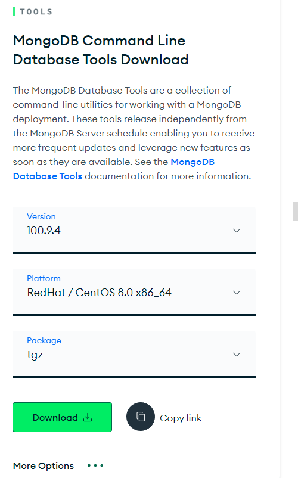

# mongodump(备份恢复)
## 工具下载
[官网下载地址](https://www.mongodb.com/try/download/database-tools)  
  

```bash
# 下载、解压
wget https://fastdl.mongodb.org/tools/db/mongodb-database-tools-rhel80-x86_64-100.9.4.tgz
tar zxf mongodb-database-tools-rhel80-x86_64-100.9.4.tgz -C /usr/local/
mv /usr/local/mongodb-database-tools-rhel80-x86_64-100.9.4/bin/* /usr/local/mongodb/bin/
```

## 备份
使用mongodump备份mongodb数据
```bash
# 备份指定库mydb
mongodump --host 127.0.0.1 --port 20000 -u root --authenticationDatabase admin -d mydb -o /tmp/mongobak
##会在/tmp/目录下生成一个mydb的目录

# 备份所有库
mongodump --host 127.0.0.1 --port 20000  -u root --authenticationDatabase admin -o /tmp/mongobak/alldatabase

# 指定备份集合
mongodump --host 127.0.0.1 --port 20000  -u root --authenticationDatabase admin -d mydb -c mycollection -o /tmp/mongobak/mycollection

# 导出集合为json文件
mongoexport --host 127.0.0.1 --port 20000  -u root --authenticationDatabase admin -d mydb -c mycollection -o /tmp/mongobak/mycollection.json
```

## 恢复
如果有用户认证，还需要加上`--authenticationDatabase admin`
```bash
# 恢复所有库
mongorestore -h 127.0.0.1 --port 20000 /tmp/mongobak/alldatabase

# 恢复指定库
mongorestore -d mydb /tmp/mongobak/mydb

# 恢复集合
mongorestore -d mydb -c mycollection /tmp/mongobak/mycollection

# 导入集合
mongoimport -d mydb -c mycollection --file /tmp/mongobak/mycollection.json
```
