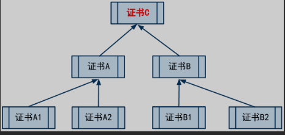
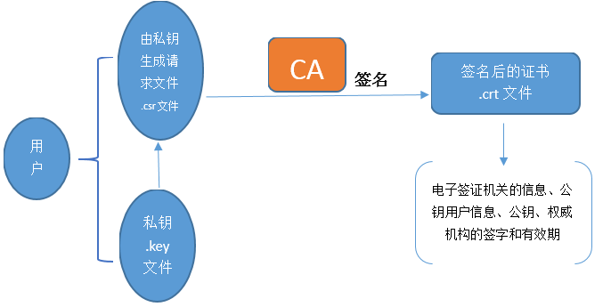
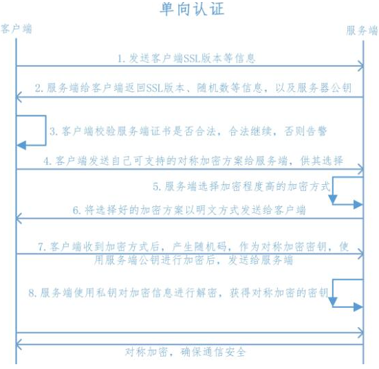
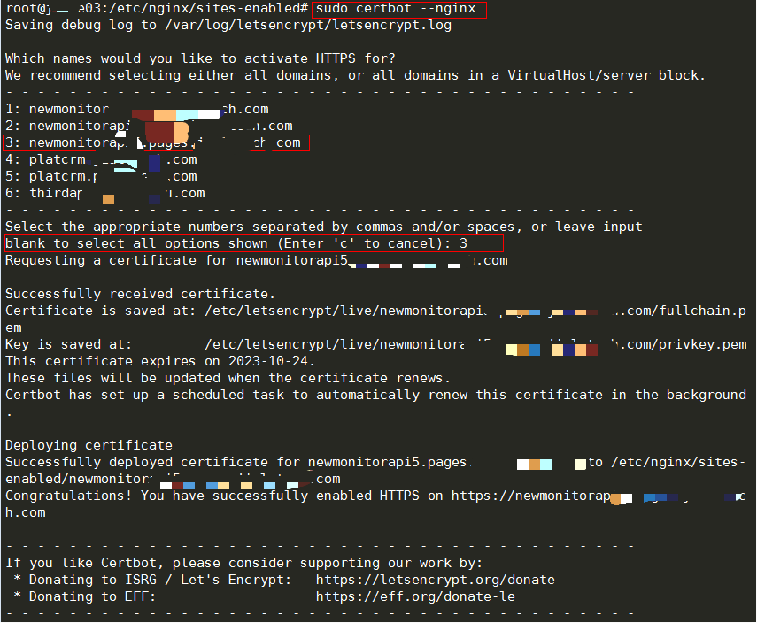
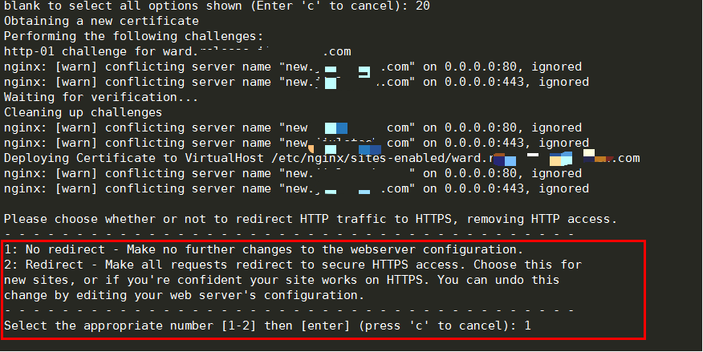

# HTTPS与SSL配置及CA证书

## CA证书
**什么是证书**  
证书，英文也叫“digital certificate”或“public key certificate”。  
它是用来证明某某东西确实是某某的东西，通俗地说，证书就好比例子里面的公章。通过公章，
可以证明该介绍信确实是对应的公司发出的。  
理论上，人人都可以找个证书工具，自己做一个证书。那如何防止坏人自己制作证书出来骗人呢？  

**什么是CA**  
CA 是“Certificate Authority”的缩写，也叫“证书授权中心”。它是负责管理和签发证书的第三方机构，
就好比例子里面的中介C公司。  
一般来说，CA必须是所有行业和所有公众都信任的、认可的。因此它必须具有足够的权威性。  
就好比A、B两公司都必须信任C公司，才会找C公司作为公章的中介。  

**什么是CA证书**  
CA证书，顾名思义，就是CA颁发的证书。

前面已经说了，人人都可以找工具制作证书。但是你一个小破孩制作出来的证书是没啥用处的。  
因为你不是权威的CA机关，你自己搞的证书不具有权威性。
这就好比上述的例子里，某个坏人自己刻了一个公章，盖到介绍信上。但是别人一看，
不是受信任的中介公司的公章，就不予理睬。  

**什么是证书之间的信任关系**  
在开篇的例子里谈到，引入中介后，业务员要同时带两个介绍信。第一个介绍信包含了两个公章，并注明，公章C信任公章A。  
证书间的信任关系，就和这个类似。就是用一个证书来证明另一个证书是真实可信滴。

**什么是证书信任链**  
实际上，证书之间的信任关系，是可以嵌套的。  
比如，C信任A1，A1信任A2，A2信任A3......这个叫做证书的信任链。  
只要你信任链上的头一个证书，那后续的证书，都是可以信任滴。

**什么是根证书**  
根证书的英文叫“root certificate”，为了说清楚根证书是咋回事，再来看个稍微复杂点的例子。  
假设C证书信任A和B；然后A信任A1和A2；B信任B1和B2。则它们之间，构成如下的一个树形关系（一个倒立的树）。  
  
处于最顶上的树根位置的那个证书，就是“根证书”。除了根证书，其它证书都要依靠上一级的证书，来证明自己。  
那谁来证明“根证书”可靠呢？  
实际上，根证书自己证明自己是可靠滴（或者换句话说，根证书是不需要被证明滴）。  
聪明的同学此刻应该意识到了：根证书是整个证书体系安全的根本。  
所以，如果某个证书体系中，根证书出了问题（不再可信了），那么所有被根证书所信任的其它证书，也就不再可信了。  

**证书有啥用**  
CA证书的作用有很多，只列出常用的几个。
- 验证网站是否可信（针对HTTPS）：  
通常，我们如果访问某些敏感的网页（比如用户登录的页面），其协议都会使用HTTPS而不是HTTP,因为HTTP协议是明文的，
一旦有坏人在偷窥你的网络通讯，他/她就可以看到网络通讯的内容（比如你的密码、银行帐号、等）。  
而 HTTPS 是加密的协议，可以保证你的传输过程中，坏蛋无法偷窥。  
但是，千万不要以为，HTTPS协议有了加密，就可高枕无忧了。  
假设有一个坏人，搞了一个假的网银的站点，然后诱骗你上这个站点。  
假设你又比较单纯，一不留神，就把你的帐号，口令都输入进去了。那这个坏蛋的阴谋就得逞了。  
为了防止坏人这么干，HTTPS 协议除了有加密的机制，还有一套证书的机制。通过证书来确保，某个站点确实就是某个站点。  
有了证书之后，当你的浏览器在访问某个HTTPS网站时，会验证该站点上的CA证书（类似于验证介绍信的公章）。  
如果浏览器发现该证书没有问题（证书被某个根证书信任、证书上绑定的域名和该网站的域名一致、证书没有过期），
那么页面就直接打开，否则的话，浏览器会给出一个警告，告诉你该网站的证书存在某某问题，是否继续访问该站点。
- 验证文件是否可信

## SSL原理
要想弄明白SSL认证原理，首先要对CA有有所了解，它在SSL认证过程中有非常重要的作用。  
说白了，CA就是一个组织，专门为网络服务器颁发证书的，国际知名的CA机构有VeriSign、Symantec，国内的有GlobalSign。  
每一家CA都有自己的根证书，用来对它所签发过的服务器端证书进行验证。

如果服务器提供方想为自己的服务器申请证书，它就需要向CA机构提出申请。  
服务器提供方向CA提供自己的身份信息，CA判明申请者的身份后，就为它分配一个公钥，
并且CA将该公钥和服务器身份绑定在一起，并为之签字，这就形成了一个服务器端证书。

如果一个用户想鉴别另一个证书的真伪，他就用CA的公钥对那个证书上的签字进行验证，一旦验证通过，该证书就被认为是有效的。  
证书实际是由证书签证机关（CA）签发的对用户的公钥的认证。

证书的内容包括：电子签证机关的信息、公钥用户信息、公钥、权威机构的签字和有效期等等。  
目前，证书的格式和验证方法普遍遵循X.509国际标准。

### 申请证书流程
  
首先要有一个CA根证书，然后用CA根证书来签发用户证书。
用户进行证书申请：
1. 先生成一个私钥
2. 用私钥生成证书请求(证书请求里应含有公钥信息)
3. 利用证书服务器的CA根证书来签发证书  

这样最终拿到一个由CA根证书签发的证书，其实证书里仅有公钥，而私钥是在用户手里的。

### SSL工作流程（单向）
  
1. 客户端say hello 服务端
2. 服务端将证书、公钥等发给客户端
3. 客户端CA验证证书，成功继续、不成功弹出选择页面
4. 客户端告知服务端所支持的加密算法
5. 服务端选择最高级别加密算法明文通知客户端
6. 客户端生成随机对称密钥key，使用服务端公钥加密发送给服务端
7. 服务端使用私钥解密，获取对称密钥key
8. 后续客户端与服务端使用该密钥key进行加密通信

### SSL工作流程（双向）
单向认证，仅仅是客户端需要检验服务端证书是否是正确的，而服务端不会检验客户端证书是否是正确的。双向认证，指客户端验证服务器端证书，而服务器也需要通过CA的公钥证书来验证客户端证书。

双向验证的过程：
1. 客户端say hello 服务端
2. 服务端将证书、公钥等发给客户端
3. 客户端CA验证证书，成功继续、不成功弹出选择页面
4. 客户端将自己的证书和公钥发送给服务端
5. 服务端验证客户端证书，如不通过直接断开连接
6. 客户端告知服务端所支持的加密算法
7. 服务端选择最高级别加密算法使用客户端公钥加密后发送给客户端
8. 客户端收到后使用私钥解密并生成随机对称密钥key，使用服务端公钥加密发送给服务端
9. 服务端使用私钥解密，获取对称密钥key
10. 后续客户端与服务端使用该密钥key进行加密通信

## 自生成CA证书
### 生成CA根证书
```bash
[root@rocky]# cd /etc/pki/
[root@rocky ca_test]#mkdir ca_test
[root@rocky ca_test]#mkdir root server client newcerts
[root@rocky ca_test]#echo 01 > serial
[root@rocky ca_test]#echo 01 > crlnumber
[root@rocky ca_test]#touch index.txt
[root@rocky ca_test]#vi tls/openssl.cnf
# 生成私钥
[root@rocky ca_test]#openssl genrsa -out /etc/pki/ca_test/root/ca.key
# 生成请求文件
[root@rocky ca_test]#openssl req -new -key /etc/pki/ca_test/root/ca.key -out /etc/pki/ca_test/root/ca.csr
You are about to be asked to enter information that will be incorporated
into your certificate request.
What you are about to enter is what is called a Distinguished Name or a DN.
There are quite a few fields but you can leave some blank
For some fields there will be a default value,
If you enter '.', the field will be left blank.
-----
Country Name (2 letter code) [XX]:
State or Province Name (full name) []:SC
Locality Name (eg, city) [Default City]:SC
Organization Name (eg, company) [Default Company Ltd]:rocky
Organizational Unit Name (eg, section) []:rocky
Common Name (eg, your name or your servers hostname) []:aming.com
Email Address []:123@123.com

Please enter the following 'extra' attributes
to be sent with your certificate request
A challenge password []:123456
An optional company name []:rockylinux.com
#生成CA根证书
[root@rocky ca_test]#openssl x509 -req -days 365 -in /etc/pki/ca_test/root/ca.csr -signkey /etc/pki/ca_test/root/ca.key -out /etc/pki/ca_test/root/ca.crt
Signature ok
subject=C = XX, ST = SC, L = SC, O = rocky, OU = rocky, CN = aming.com, emailAddress = 123@123.com
Getting Private key
```

### 生成server端证书
```bash
[root@rocky ca_test]# cd /etc/pki/ca_test/server/
[root@rocky server]# openssl genrsa -out server.key
Generating RSA private key, 2048 bit long modulus (2 primes)
.........+++++
...................................................+++++
e is 65537 (0x010001)
[root@rocky server]# openssl req -new -key server.key -out server.csr
You are about to be asked to enter information that will be incorporated
into your certificate request.
What you are about to enter is what is called a Distinguished Name or a DN.
There are quite a few fields but you can leave some blank
For some fields there will be a default value,
If you enter '.', the field will be left blank.
-----
Country Name (2 letter code) [XX]:
State or Province Name (full name) []:SC
Locality Name (eg, city) [Default City]:SC
Organization Name (eg, company) [Default Company Ltd]:rocky
Organizational Unit Name (eg, section) []:linux
Common Name (eg, your name or your servers hostname) []:server.com
Email Address []:server.com

Please enter the following 'extra' attributes
to be sent with your certificate request
A challenge password []:123456
An optional company name []:server
[root@rocky server]# openssl ca -in server.csr -cert /etc/pki/ca_test/root/ca.crt -keyfile /etc/pki/ca_test/root/ca.key -out server.crt -days 3560
Using configuration from /etc/pki/tls/openssl.cnf
Check that the request matches the signature
Signature ok
Certificate Details:
        Serial Number: 1 (0x1)
        Validity
            Not Before: Aug 27 04:15:31 2022 GMT
            Not After : May 26 04:15:31 2032 GMT
        Subject:
            countryName               = XX
            stateOrProvinceName       = SC
            organizationName          = rocky
            organizationalUnitName    = linux
            commonName                = server.com
            emailAddress              = server.com
        X509v3 extensions:
            X509v3 Basic Constraints:
                CA:FALSE
            Netscape Comment:
                OpenSSL Generated Certificate
            X509v3 Subject Key Identifier:
                F1:16:FD:35:18:4D:E6:04:A9:14:92:95:76:2B:A8:55:56:CF:34:A1
            X509v3 Authority Key Identifier:
                DirName:/C=XX/ST=SC/L=SC/O=rocky/OU=rocky/CN=aming.com/emailAddress=123@123.com
                serial:72:D4:E2:96:5F:B1:30:25:E9:67:6F:B8:48:38:AC:2B:B6:A9:B2:E5

Certificate is to be certified until May 26 04:15:31 2032 GMT (3560 days)
Sign the certificate? [y/n]:y

1 out of 1 certificate requests certified, commit? [y/n]y
Write out database with 1 new entries
Data Base Updated
```

### 生成客户端证书
```bash
[root@rocky ca_test]# cd client/
[root@rocky client]# openssl genrsa -out client.key
Generating RSA private key, 2048 bit long modulus (2 primes)
................+++++
...............................................................................+++++
e is 65537 (0x010001)
[root@rocky client]# openssl req -new -key client.key -out client.csr
You are about to be asked to enter information that will be incorporated
into your certificate request.
What you are about to enter is what is called a Distinguished Name or a DN.
There are quite a few fields but you can leave some blank
For some fields there will be a default value,
If you enter '.', the field will be left blank.
-----
Country Name (2 letter code) [XX]:
State or Province Name (full name) []:SC
Locality Name (eg, city) [Default City]:CD
Organization Name (eg, company) [Default Company Ltd]:rocky
Organizational Unit Name (eg, section) []:client
Common Name (eg, your name or your servers hostname) []:client.com
Email Address []:

Please enter the following 'extra' attributes
to be sent with your certificate request
A challenge password []:123456
An optional company name []:linuxclient.com
[root@rocky client]# openssl ca -in client.csr -cert /etc/pki/ca_test/root/ca.crt -keyfile /etc/pki/ca_test/root/ca.key -out client.crt -days 3650
Using configuration from /etc/pki/tls/openssl.cnf
Check that the request matches the signature
Signature ok
Certificate Details:
        Serial Number: 2 (0x2)
        Validity
            Not Before: Aug 27 04:20:09 2022 GMT
            Not After : Aug 24 04:20:09 2032 GMT
        Subject:
            countryName               = XX
            stateOrProvinceName       = SC
            organizationName          = rocky
            organizationalUnitName    = client
            commonName                = client.com
        X509v3 extensions:
            X509v3 Basic Constraints:
                CA:FALSE
            Netscape Comment:
                OpenSSL Generated Certificate
            X509v3 Subject Key Identifier:
                E6:64:B9:21:56:FE:56:D0:DE:0C:DD:E4:87:CD:B6:25:2C:CD:06:AE
            X509v3 Authority Key Identifier:
                DirName:/C=XX/ST=SC/L=SC/O=rocky/OU=rocky/CN=aming.com/emailAddress=123@123.com
                serial:72:D4:E2:96:5F:B1:30:25:E9:67:6F:B8:48:38:AC:2B:B6:A9:B2:E5

Certificate is to be certified until Aug 24 04:20:09 2032 GMT (3650 days)
Sign the certificate? [y/n]:y

1 out of 1 certificate requests certified, commit? [y/n]y
Write out database with 1 new entries
Data Base Updated
```


## certbot生成证书配置HTTPS
免费ssl证书申请网站：
- [freessl.cn](https://freessl.cn/)
    - [freessl命令行工具部署证书](https://docs.certcloud.cn/docs/installation/auto/cmcli/)
- [Let’s Encrypt证书](https://certbot.eff.org/instructions?ws=nginx&os=centosrhel7)

使用certbot工具自动生成Let’s Encrypt证书  
证书有效期为90天，到期自动续期  

### 安装snap
(Centos、Rocky通用)
```bash
sudo yum install epel-release
sudo yum upgrade
sudo yum install snapd

sudo systemctl enable --now snapd.socket
sudo ln -s /var/lib/snapd/snap /snap
```
### 使用snap安装certbot
(Centos、Rocky通用)
```bash
sudo snap install --classic certbot
sudo ln -s /snap/bin/certbot /usr/bin/certbot

# 配置https证书
sudo certbot --nginx	

# 测试自动续订
sudo certbot renew --dry-run
```

### 使用
```bash
sudo certbot --nginx
```
> 注意：
> 1. 有时候即使在root用户下执行也会报错，需要加上`sudo`
> 2. certbot是根据nginx项目配置的server块筛选的，server_name后面的域名不要有特殊符号。
> 3. 域名需要解析到互联网。



  
是否将http重定向到https
1. 无重定向
2. 重定向，访问域名将默认跳转到https

## 配置SSL
### 配置单向SSL
```
server {
    listen       443 ssl;
    server_name  www.123.com;
    index index.html;
    root /data/wwwroot/server.com;

    ssl_certificate /etc/pki/ca_test/server/server.crt;
    ssl_certificate_key /etc/pki/ca_test/server/server.key;
    ssl_protocols TLSv1 TLSv1.1 TLSv1.2;
    ssl_ciphers ALL:!DH:!EXPORT:!RC4:+HIGH:+MEDIUM:!eNULL;
    ssl_prefer_server_ciphers on;
}
```
### 配置双向SSL
```bash
server
{
    listen 443 ssl;
    server_name  www.123.com;
    index index.html;
    root /data/wwwroot/server.com;

    ssl_certificate /etc/pki/ca_test/server/server.crt;
    ssl_certificate_key /etc/pki/ca_test/server/server.key;
    ssl_protocols TLSv1 TLSv1.1 TLSv1.2;
    ssl_ciphers ALL:!DH:!EXPORT:!RC4:+HIGH:+MEDIUM:!eNULL;
    ssl_prefer_server_ciphers on;
    ssl_client_certificate /etc/pki/ca_test/root/ca.crt;
    ssl_verify_client on;
}
```
### 配置解析
- `443 ssl`：监听443端口，使用ssl协议
- `ssl_certificate`：证书文件路径
- `ssl_certificate_key`：私钥文件路径
- `ssl_protocols`：指定ssl协议版本，TLSv1和TLSv1.1有安全隐患，建议去掉
- `ssl_ciphers`：指定加密套件，多个套件用冒号分隔，`ALL`表示全部，`!`表示不启用，`+`表示将该套件排到最后
- `ssl_prefer_server_ciphers`：如果不指定默认为off，当为on时，在使用SSLv3和TLS协议时，服务器加密算法将优于客户端加密算法。
- `ssl_client_certificate`：客户端证书文件路径
- `ssl_verify_client`：是否验证客户端证书，on表示验证，off表示不验证

