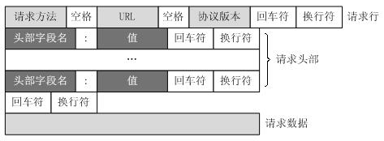

# HTTP与curl
## HTTP介绍
参考文档：  
[Http协议详解(深入理解)](https://blog.csdn.net/weixin_38087538/article/details/82838762?spm=1001.2101.3001.6650.3&utm_medium=distribute.pc_relevant.none-task-blog-2%7Edefault%7ECTRLIST%7ERate-3-82838762-blog-90045869.pc_relevant_multi_platform_whitelistv4&depth_1-utm_source=distribute.pc_relevant.none-task-blog-2%7Edefault%7ECTRLIST%7ERate-3-82838762-blog-90045869.pc_relevant_multi_platform_whitelistv4&utm_relevant_index=6)  
[HTTP介绍](https://blog.csdn.net/James_Kevin/article/details/123855370?ops_request_misc=%257B%2522request%255Fid%2522%253A%2522166264618416782395336919%2522%252C%2522scm%2522%253A%252220140713.130102334..%2522%257D&request_id=166264618416782395336919&biz_id=0&utm_medium=distribute.pc_search_result.none-task-blog-2~all~sobaiduend~default-1-123855370-null-null.142^v47^control,201^v3^control_2&utm_term=http%E4%BB%8B%E7%BB%8D&spm=1018.2226.3001.4187)  
[HTTP详解-工作原理](https://blog.csdn.net/hguisu/article/details/8680808?ops_request_misc=%257B%2522request%255Fid%2522%253A%2522166269501516782388075887%2522%252C%2522scm%2522%253A%252220140713.130102334..%2522%257D&request_id=166269501516782388075887&biz_id=0&utm_medium=distribute.pc_search_result.none-task-blog-2~all~baidu_landing_v2~default-4-8680808-null-null.142^v47^control,201^v3^control_2&utm_term=http%E5%B7%A5%E4%BD%9C%E5%8E%9F%E7%90%86&spm=1018.2226.3001.4187)

### HTTP协议发展简史
HTTP协议是Hyper Text Transfer Protocol（超文本传输协议）的缩写，是用于从万维网（WWW:World Wide Web ）服务器传输超文本到本地浏览器的传送协议。 HTTP 是基于 TCP/IP 协议的应用层协议。它不涉及数据包（packet）传输，主要规定了客户端和服务器之间的通信格式，默认使用80端口。

HTTP/0.9版本
- 1991年发布0.9版本，该版本只有一个GET命令。
- 仅支持html格式。
- 服务器不支持长连接，当客户端和服务端通信完后就会关闭连接，一次连接一个请求。

HTTP/1.0版本
- 1996年5月发布1.0版本，有很大改进。
- 支持了更多文件格式，比如图片、视频、二进制文件，使得网页内容更加丰富。
- 支持了更多的方法：GET、POST、HEAD。
- 增加了包头信息（HTTP header）、状态码、缓存、权限等功能。
- 和0.9版本一样，服务器不支持长连接，当客户端和服务端通信完后就会关闭连接，一次连接一个请求。

HTTP/1.1版本
- 1997年1月发布1.1版本，目前主流依然是1.1
- 支持了持久连接，一个连接可以发送多个请求，并且支持一个连接同时发送多个请求（服务器端需要按顺序返回结果）
- 支持了更多的方法：PUT、PATCH、DELETE、OPTIONS
- 客户端请求头信息增加Host字段，指定服务器的域名，这样服务器上支持了虚拟主机，即一台机器多个站点

HTTP/2 版本
- 2015年发布，目前还未正式大规模使用，但大多浏览器已经支持HTTP/2
- 在之前版本HTTP header必须是文本（ASCII编码）格式，body部分可以是文本也可以是二进制，但在HTTP/2，无论是header还是body都是二进制数据
- HTTP/2支持了在一个连接里，客户端和服务端同时发送多个请求
- 因为支持了在一个连接里同时发送多个请求和多个回应，为了区分它们就需要对数据做标记，每个请求或回应的所有数据包为一个数据流（stream），每个数据流都有一个唯一的ID，客户端发送的请求ID为奇数，服务端返回的为偶数
- HTTP/2支持header压缩，并且支持header信息索引（客户端和服务端有一张相同的索引表，不同的header对应不同的索引号，发送请求时不会再发header，而是发索引号）
- HTTP/2支持服务端主动推送功能，如果一个网页中含有大量的静态资源（js、css、图片等），之前版本是当该网页传输完成后解析所有html代码，然后再去传输网页中包含的资源，HTTP/2版本可以在网页没有传输完之前就主动把该网页中包含的静态资源推送到客户端，这样省去了客户端再次发请求的过程。

HTTP/3版本
- 2018年发布，基于谷歌的QUIC，底层使用udp代码tcp协议。
- 使用stream进一步扩展HTTP2.0 的多路复用，传输多少文件就可以产生多少stream，若发生丢包，只需要传输丢失的stream
- 基于UDP，提高了传输效率，降低延迟
- 通过引入 Connection ID，使得 HTTP/3 支持连接迁移以及 NAT 的重绑定
- HTTP/3 含有一个包括验证、加密、数据及负载的 built-in 的 TLS 安全机制

```bash
# 查看某个网站使用的哪个版本的HTTP协议
[root@lwz1 local]# curl -I www.baidu.com
HTTP/1.1 200 OK
```

### HTTP协议相关概念
HTTP协议是Hyper Text Transfer Protocol（超文本传输协议）的缩写，是用于从万维网（WWW:World Wide Web ）服务器传输超文本到本地浏览器的传送协议。 HTTP 是基于 TCP/IP 协议的应用层协议。它不涉及数据包（packet）传输，主要规定了客户端和服务器之间的通信格式，默认使用80端口。

#### 请求方法  
这个方法指的是，客户端向服务端发起请求时的动作。 常见方法如下：

| HTTP方法 | 说明 |
| :- | :- |
| GET | 最常见的方法，客户端向服务端请求某个资源，并返回实际主体，例如请求图片、html等 |
| POST | 客户端向服务端提交指定数据，例如提交表单 |
| HEAD | 类似于get请求，只不过返回的响应中没有具体的内容，只有头部信息 |
| PUT | 类似于POST，也是向服务端提交数据，不过PUT有指定数据存储位置 |
| DELETE | 请求服务器删除指定的页面 |
| OPTIONS | 获取服务端支持的方法，它还可以查看服务端的性能 |
| TRACE | 回显服务器收到的请求，主要用于测试或诊断 |
| CONNECT | 把请求连接转换到透明的TCP/IP通道 |

#### HTTP状态码
客户端发送请求到服务端，然后服务端会回应结果给客户端，回应的数据会包含一个三位数字的状态码，用来标识该请求是否成功，比如是正常还是错误等。 HTTP/1.1中状态码可以分为五大类。

| 状态码 | 说明 |
| :- | :- |
| 1** | 信息，服务器收到请求，需要请求者继续执行操作 |
| 2** | 成功，操作被成功接收并处理 |
| 3** | 重定向，需要进一步的操作以完成请求 |
| 4** | 客户端错误，请求包含语法错误或无法完成请求 |
| 5** | 服务器错误，服务器在处理请求的过程中发生了错误 |

以下是几个常见的状态码

| 状态码 | 英文名称 | 说明 |
| :- | :- | :- |
| 200 | OK | 表示成功客户端成功接收到了服务端返回的数据，<br/>这是最常见的状态码 |
| 206 | Partial Content | 客户端发完请求后，服务端只是返回了<br/>部分数据，就会出现该状态码，例如当下载一个很大的文件时，<br/>在没有下载完成前就会出现该状态码 |
| 301 | moved permanently | 永久移动。请求的资源已被永久的移动到新URI，<br/>返回信息会包括新的URI，浏览器会自动定向到新URI。<br/>用作域名重定向 |
| 302 | Moved Temporarily | 临时移动。与301类似，URI被移动到了一个新的地址，<br/>但资源只是临时被移动，无论是301还是302对于客户端来说<br/>结果是一样的，这两个状态码针对搜索引擎来说是<br/>有差异的，考虑SEO的话，要使用301 |
| 400 | Bad Request | 客户端请求语法错误，服务端无法理解
| 401 | Unauthorized | 服务端如果开启了用户认证，<br/>而客户端没有提供正确的验证信息就会返回该状态码 |
| 403 | Forbidden | 服务端不允许客户端访问 |
| 404 | Not Found | 客户端请求的资源不存在 |
| 413 | Request Entity Too Large | 客户端向服务端上传一个比较大的文件时，<br/>如果文件大小超过了服务端的限制就会出现该状态码 |
| 500 | Internal Server Error | 服务端出现了内部错误 |
| 502 | Bad Gateway | 服务器充当代理角色时，后端被代理的<br/>服务器不可用或者没有正常回应，如，<br/>在nginx+php-fpm的环境中，如果php-fpm服务出现故障，<br/>nginx就会出现该状态码 |
| 503 | Service Unavailable | 服务当前不可用，由于超载或系统维护，<br/>服务器暂时的无法处理客户端的请求，如，<br/>当nginx限速后，客户端请求超过限制就会收到该状态码 |
| 504 | Gateway Time-out | 和502类似，充当代理角色时，<br/>后端的服务期没有按时返回数据，超时了 |

#### HTTP Request
从客户端发往服务端的HTTP报文叫做HTTP Request Message。 HTTP请求报文由请求行、请求头部（header)、空行、请求数据几个部分组成， 如下所示：
  
使用curl命令可以获取Request头信息 curl -v
```bash
GET /123.jpg HTTP/1.1   # 请求行
Host    img.123.com     # 请求头部
User-Agent  Mozilla/5.0 (Windows NT 10.0; WOW64) AppleWebKit/537.36 (KHTML, like Gecko) Chrome/51.0.2704.106 Safari/537.36  # 请求头部
Accept  image/webp,image/*,*/*;q=0.8    # 请求头部
Referer http://www.aminglinux.com/      # 请求头部
Accept-Encoding gzip, deflate, sdch     # 请求头部
Accept-Language zh-CN,zh;q=0.8      # 请求头部
# 空行
# 请求数据
```

#### HTTP Response
从服务端回应的HTTP报文叫做HTTP Response Message。 HTTP响应也由四个部分组成，分别是：状态行、消息报头、空行和响应正文。 示例：
```bash
HTTP/1.1 200 OK     # 状态行
Server: nginx/1.12.2    # 消息报头
Date: Tue, 03 Jul 2018 07:28:58 GMT     # 消息报头
Content-Type: text/html; charset=UTF-8      # 消息报头
Connection: keep-alive      # 消息报头
X-Powered-By: PHP/5.6.10    # 消息报头
# 空行
# 响应正文
```

#### HTTP工作原理
- 客户端连接到Web服务器，一个HTTP客户端，通常是浏览器，与Web服务器的HTTP端口（默认为80）建立一个TCP套接字连接。

- 通过TCP套接字，客户端向Web服务器发送一个文本的请求报文。

- Web服务器解析请求，定位请求资源。服务器将资源复本写到TCP套接字，由客户端读取。

- 若connection模式为close，则服务器主动关闭TCP连接，客户端被动关闭连接，释放TCP连接;若connection 模式为keepalive，则该连接会保持一段时间，在该时间内可以继续接收请求。

- 客户端浏览器首先解析状态行，查看表明请求是否成功的状态代码。然后解析每一个响应头，响应头告知以下为若干字节的HTML文档和文档的字符集。客户端浏览器读取响应数据HTML，根据HTML的语法对其进行格式化，并在浏览器窗口中显示。
    - 例如：在浏览器地址栏键入URL，按下回车之后会经历以下流程：
        - 浏览器向 DNS 服务器请求解析该 URL 中的域名所对应的 IP 地址;
        - 解析出 IP 地址后，根据该 IP 地址和默认端口 80，和服务器建立TCP连接;
        - 浏览器发出读取文件(URL 中域名后面部分对应的文件)的HTTP 请求，该请求报文作为 TCP 三次握手的第三个报文的数据发送给服务器;
        - 服务器对浏览器请求作出响应，并把对应的 html 文本发送给浏览器;
        - 释放 TCP连接;
        - 浏览器将该 html 文本并显示内容;

#### URI和URL
URI，是uniform resource identifier，统一资源标识符，用来唯一的标识一个资源。 Web上可用的每种资源如HTML文档、图像、视频片段、程序等都是用一个URI来定位的。 URI一般由三部组成：

- 访问资源的命名机制，如http://, ftp://, rsync://等
- 存放资源的主机名，如www.aminglinux.com
- 资源自身的名称，由路径表示，着重强调于资源，如html/01/2018/0701.html
- 一个完整的URI示例：http://www.aminglinux.com/html/01/2018/0701.html  

URL是uniform resource locator，统一资源定位器，它是一种具体的URI，即URL可以用来标识一个资源，而且还指明了如何定位这个资源。 URL是Internet上用来描述信息资源的字符串，主要用在各种WWW客户程序和服务器程序上。 采用URL可以用一种统一的格式来描述各种信息资源。 URL一般由三部组成：

- 协议(或称为服务方式)
- 存有该资源的主机IP地址(有时也包括端口号)
- 主机资源的具体地址。如目录和文件名等

## curl工具
curl是一个命令行工具，通过指定的URL来上传或下载数据，并将数据展示出来。curl中的c表示client，而URL，就是URL。

不带有任何参数时，curl 就是发出 GET 请求。 curl https://www.example.com，如：
```bash
[root@lwz1 ~]# curl lwz.com
lwz.com test!   # 返回网站内容

# -I 参数向服务器发出 HEAD 请求，然会将服务器返回的 HTTP 标头打印出来
[root@lwz1 ~]# curl -I lwz.com
HTTP/1.1 200 OK
Server: nginx/1.23.1
Date: Mon, 11 Mar 2024 03:52:02 GMT
Content-Type: text/html
Content-Length: 14
Last-Modified: Tue, 05 Mar 2024 03:39:09 GMT
Connection: keep-alive
ETag: "65e693dd-e"
Accept-Ranges: bytes

# -v 参数可以显示一次http通信的整个过程，包括端口连接和http请求头信息等
[root@lwz1 ~]# curl -v lwz.com
* Rebuilt URL to: lwz.com
*   Trying 127.0.0.1...
* TCP_NODELAY set
* Connected to lwz.com (127.0.0.1) port 80 (#0)
> GET / HTTP/1.1

# -o 参数将服务器的回应保存成文件，等同于wget命令；
## -o：下载后支持改名
[root@lwz1 ~]# curl -o 1.html lwz.com/lwz.html
## -O：原封不动下载
[root@lwz1 ~]# curl -O lwz.com/lwz.html

# -x 参数指定代理服务器的主机名和端口，用代理服务器来发送请求
[root@lwz1 ~]# curl -x 192.168.1.10:1080 lwz.com

# -H 指定ip
[root@lwz1 ~]# curl -H "Host:lwz.com" 192.168.1.10/1.html

# -A 参数指定客户端的用户代理标头，即User-Agent。(curl 的默认用户代理字符串是curl/[version]。)
curl -A 'Chrome/57' 'https://www.baidu.com'
curl -A 'Safari/537.36' 'https://www.baidu.com'

# -e 参数用来设置 HTTP 的标头Referer，表示请求的来源。
[root@lwz1 ~]# curl -e 'lwz.com' 'www.baidu.com'

# -d 参数用来向服务器提交(POST)数据。
curl -d 'a=1&b=2' -X POST http://www.example.com/aa
```
