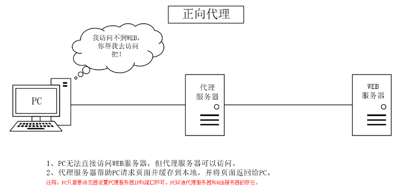
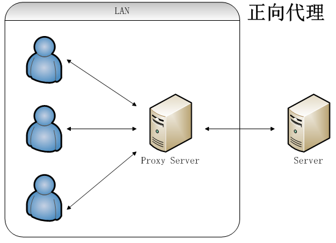
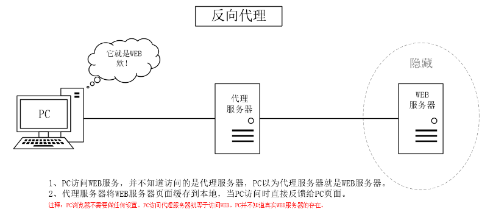
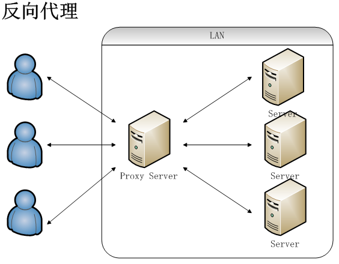

# 正、反向代理和四层代理

## 正向代理
  

正向代理，客户端和代理服务器可以看成一个整体


### 需求场景
Nginx正向代理使用场景并不多见。  
需求场景1：  
如果在机房中，只有一台机器可以联网，其他机器只有内网，内网的机器想使用yum安装软件包，在能联网的机器上配置一个正向代理即可。

### 配置文件
说明： 以下配置文件为nginx官方提供，该方法只能实现针对http的网站的访问，如果是https就会有问题。要想实现https的正向代理，可以使用一个三方模块，后面介绍。
```bash
server {
    listen 80 default_server;
    resolver 119.29.29.29;
    location /
    {
        proxy_pass http://$host$request_uri;
    }
}
```
配置说明：
- resolver 119.29.29.29;   
指定DNS服务器地址，这个DNS服务器地址可以是本地的，也可以是公网的，这里使用的是公网的DNS服务器地址。国内通用的DNS 119.29.29.29为dnspod公司提供。 国际通用DNS 8.8.8.8或者8.8.4.4为google提供。  
其他可以参考 http://dns.lisect.com/
- default_server；  
之所以要设置为默认虚拟主机，是因为这样就不用设置server_name了，任何域名解析过来都可以正常访问。
- proxy_pass http://$host$request_uri;  
将请求转发到http://$host$request_uri，$host表示请求的域名，$request_uri表示请求的URI。  
该指令用来设置要代理的目标url，正向代理服务器设置就保持该固定值即可。
```bash
server {
        listen 80 default_server;
        resolver 119.29.29.29;
        location / {
                proxy_pass http://$host$request_uri;
        }
}

[root@lwz1 vhost]# !curl
curl -x127.0.0.1:80 www.baidu.com -I
HTTP/1.1 200 OK
Server: nginx/1.23.1
Date: Tue, 19 Mar 2024 06:12:29 GMT
Content-Type: text/html
Content-Length: 277
Connection: keep-alive
Accept-Ranges: bytes
Cache-Control: private, no-cache, no-store, proxy-revalidate, no-transform
Etag: "575e1f71-115"
Last-Modified: Mon, 13 Jun 2016 02:50:25 GMT
Pragma: no-cache
```

### 正向代理支持https
下载三方模块ngx_http_proxy_connect_module  
github地址：https://github.com/chobits/ngx_http_proxy_connect_module  
（注意，不同的Nginx版本，还需要下载不同的patch包。）

下面的例子，以1.23.1为例
```bash
# 下载模块
cd /usr/local/src/
wget https://codeload.github.com/chobits/ngx_http_proxy_connect_module/zip/refs/heads/master
mv master ngx_http_proxy_connect_module.zip
unzip ngx_http_proxy_connect_module.zip

# 使用patch工具打补丁，选择对应nginx版本的模块
cd ../nginx-1.23.1
yum install -y patch
patch -p1 < ../ngx_http_proxy_connect_module-master/patch/proxy_connect_rewrite_102101.patch

./configure --prefix=/usr/local/nginx --add-module=/usr/local/src/echo-nginx-module --with-http_v2_module --add-module=../ngx_http_proxy_connect_module-master; 
make 

systemctl stop nginx; 
mv /usr/local/nginx/sbin/nginx{,.bak.2}; 
cp objs/nginx /usr/local/nginx/sbin/
systemctl start nginx
```
```bash
# 配置文件
server {
     listen                         3128;

     # dns resolver used by forward proxying
     resolver                       119.29.29.29;

     # forward proxy for CONNECT request
     proxy_connect;
     proxy_connect_allow            80 443 3000 9070 9074;
     proxy_connect_connect_timeout  10s;
     proxy_connect_read_timeout     10s;
     proxy_connect_send_timeout     10s;

     # forward proxy for non-CONNECT request
     location / {
         proxy_pass http://$host;
         proxy_set_header Host $host;
     }
}
```
```bash
# 测试
[root@lwz1 vhost]# curl -x127.0.0.1:3128 https://www.baidu.com
<!DOCTYPE html>
<!--STATUS OK--><html> <head><meta http-equiv=content-type content=text/html;charset=utf-8><meta http-equiv=X-UA-Compatible content=IE=Edge><meta content=always name=referrer><link rel=stylesheet type=text/css href=https://ss1.bdstatic.com/5eN1bjq8AAUYm2zgoY3K/r/www/cache/bdorz/baidu.min.css><title>百度一下，你就知道</title></head> <body link=#0000cc> <div id=wrapper> <div id=head> <div class=head_wrapper> <div class=s_form> <div class=s_form_wrapper> <div id=lg> <img hidefoc
```

## 反向代理
  

服务器和代理服务器看成一个整体  



使用场景：
- 不想暴露真实服务器的地址
- 通过代理服务器，访问速度慢的网站
- 域名没有备案，可以把域名解析到香港一台云主机上，在香港云主机做个代理，而网站数据是在大陆的服务器上。
```bash
# 配置反向代理
server
{
  listen 80;
  server_name www.test.com;
  location /
  {
        proxy_pass http://127.0.0.1:8080/;
        proxy_set_header Host   $host;
        proxy_set_header X-Real-IP      $remote_addr;
        proxy_set_header X-Forwarded-For $proxy_add_x_forwarded_for;
  }
}

# 配置真实服务器
server
{
  listen 8080;
  server_name 127.0.0.1;
  location /
  {
      echo "www.test.com:8080";
  }
}
```

### 基本用法配置
通过访问rocky的443端口去访问ubuntu的80页面  

rocky
```
$ vim 123.com.conf

    server {
        listen       443 ssl;
        server_name  www.123.com;
        error_log /usr/local/nginx/logs/123.error.log notice;
        access_log /usr/local/nginx/logs/123.access.log main;
        ssl_certificate ssl/server.crt;
        ssl_certificate_key ssl/server.key;
        ssl_protocols TLSv1 TLSv1.1 TLSv1.2;
        ssl_ciphers ALL:!DH:!EXPORT:!RC4:+HIGH:+MEDIUM:!eNULL;
        ssl_prefer_server_ciphers on;

        location / {
        proxy_pass http://192.168.119.201/;
        proxy_set_header Host   $host;
        proxy_set_header X-Real-IP      $remote_addr;
        proxy_set_header X-Forwarded-For $proxy_add_x_forwarded_for;
        }
   }
```
解析:
- `proxy_pass http://192.168.119.201/`：真正服务器的IP地址
- `proxy_set_header Host $host`：$host就是域名server_name www.123.com
- `proxy_set_header X-Real-IP $remote_addr`：客户端的真实IP地址
- `proxy_set_header X-Forwarded-For $proxy_add_x_forwarded_for`：代理服务器的IP地址
- `proxy_set_header X-Real-IP $remote_addr`和`proxy_set_header X-Forwarded-For $proxy_add_x_forwarded_for`这两条配合真实服务器`combined_realip`日志格式，方便查看真实请求进来的ip地址

ubuntu中  
可在`nginx.conf`中定义[combined_realip格式的访问日志](https://linyi.readthedocs.io/zh/latest/%E6%9C%8D%E5%8A%A1/Nginx/%E6%97%A5%E5%BF%97%E6%96%87%E4%BB%B6.html#id3)，然后在server块中指定，以获取客户端的真实IP地址。

### proxy_pass
- 格式：proxy_pass URL;
  - URL: URL包含传输协议（http://, https://等）、主机名（域名或者IP:PORT）、uri。
  ```bash
  proxy_pass http://www.aminglinux.com/;
  proxy_pass http://192.168.200.101:8080/uri;
  proxy_pass unix:/tmp/www.sock;
  ```

proxy_pass的几种情况：
```bash
# 示例一
location /linyi/
{
    proxy_pass http://192.168.1.10;
    ...
}

#当请求http://www.lwz.com/linyi/a.html时，结果是
http://192.168.1.10/linyi/a.html


# 示例二
location /linyi/
{
    proxy_pass http://192.168.1.10/;
    ...
}

#当请求http://www.lwz.com/linyi/a.html的时候，结果是
http://192.168.1.10/a.html


# 示例三
location /linyi/
{
    proxy_pass http://192.168.1.10/linux/;
    ...
}

#当请求http://www.lwz.com/linyi/a.html的时候，结果是
http://192.168.1.10/linux/a.html


# 示例四
location /linyi/
{
    proxy_pass http://192.168.1.10/linux;
    ...
}

#当请求http://www.lwz.com/linyi/a.html的时候，结果是
http://192.168.1.10/linuxa.html     #这里并没有写错，请求结果会报错404


# 验证配置
[root@rocky vhosts]# cat default.com.conf
server
{
  listen 8080;
  server_name 127.0.0.1;
#  location /
#  {
#     echo "default:8080";
#  }
  location /pass/
  {
     echo "pass";
  }
  location /linux/
  {
     echo "linux";
  }
}
```

### proxy_set_header
proxy_set_header用来设定真实服务器接收到的header信息。

- 语法：`proxy_set_header field value;`
    - field为要更改的项目，也可以理解为变量的名字，比如host
    - value为变量的值
    - 如果不设置proxy_set_header，则默认host的值为proxy_pass后面跟的那个域名或者IP（一般写IP），  
    比如示例四，请求到后端的服务器上时，完整请求uri为：http://192.168.1.10/linux/a.html
    - 如果设置proxy_set_header，如 `proxy_set_header host $host;`  
    比如示例四，请求到后端的服务器完整uri为：http://www.aminglinux.com/linux/a.html
    - `proxy_set_header X-Real-IP $remote_addr;`和`proxy_set_header X-Forwarded-For $proxy_add_x_forwarded_for;`  
    用来设置真实端接收到的远程客户端IP，如果不设置，则header信息中并不会透传远程真实客户端的IP地址。

示例：
```bash
# 代理服务器(192.168.1.156)配置
[root@lwz2 vhost]# cat fg.com
server
{
  listen 80;
  server_name www.test.com;
  location /pass/
  {
        proxy_pass http://192.168.1.152:8080/linux/;
        proxy_set_header Host   $host;
        proxy_set_header X-Real-IP      $remote_addr;
        proxy_set_header X-Forwarded-For $proxy_add_x_forwarded_for;
  }
}

# 真实服务器配置(192.168.1.152)
[root@lwz1 vhost]# cat lwz.com
server
{
  listen 8080;
  server_name 127.0.0.1;
  access_log logs/default_server_access.log main;

  location /pass/
  {
     echo "pass";
  }
  location /linux/
  {
     echo $host;
     echo $remote_addr;
     echo $proxy_add_x_forwarded_for;
  }
}

# 在客户端(192.168.1.136)上请求，查看三个变量分别代表什么
[root@lwz3 ~]# curl -x192.168.1.156:80 www.test.com/pass/a.html
www.test.com        # $host
192.168.1.156       # $remote_addr
192.168.1.136, 192.168.1.156    # $proxy_add_x_forwarded_for

# 查看真实服务器的日志，已经包含了客户端ip
[root@lwz1 vhost]# tail -f !$
tail -f ../../logs/default_server_access.log
192.168.1.156 - - [20/Mar/2024:11:12:25 +0800] "GET /linux/a.html HTTP/1.0" 200 56 "-" "curl/7.61.1" "192.168.1.136"
192.168.1.156 - - [20/Mar/2024:11:18:57 +0800] "GET /linux/a.html HTTP/1.0" 200 56 "-" "curl/7.61.1" "192.168.1.136"
192.168.1.156 - - [20/Mar/2024:11:19:02 +0800] "GET /linux/b.html HTTP/1.0" 200 56 "-" "curl/7.61.1" "192.168.1.136"
```

### proxy_redirect(解决返回301问题)
该指令用来修改真实服务器返回的响应头中的Location头域和“refresh”头域。  
语法结构为：  
```bash
proxy_redirect redirect replacement;
proxy_redirect default;
proxy_redirect off;
```
请求代理时，返回301的条件为：
- location后面必须是/;
- proxy_pass后面的URL不能加uri,只能是IP或者IP:port结尾，并不能以/结尾；
- 访问的uri必须是一个真实存在的目录，如，这里的aming必须是存在的
- 访问的时候，不能以/结尾，只能是 www.linyi.com/linyi

如下所示：
```bash
# 代理服务器配置
[root@lwz2 vhost]# cat fg.com
server
{
  listen 80;
  server_name www.test.com;
  location /
  {
        proxy_pass http://192.168.1.152:8080;
        proxy_set_header Host   $host;
        proxy_set_header X-Real-IP      $remote_addr;
        proxy_set_header X-Forwarded-For $proxy_add_x_forwarded_for;
  }
}

# 真实服务器配置
[root@lwz1 vhost]# cat lwz.com
server
{
  listen 8080;
  server_name 127.0.0.1;
  root /data/www;
  access_log logs/default_server_access.log main;
}

# 客户端请求
[root@lwz3 ~]# curl -x192.168.1.156:80 www.test.com/lwz -I
HTTP/1.1 301 Moved Permanently
Server: nginx/1.23.1
Date: Wed, 20 Mar 2024 05:55:37 GMT
Content-Type: text/html
Content-Length: 169
Connection: keep-alive
Location: http://www.test.com:8080/lwz/
```

这4个条件挺苛刻，但确实会遇到类似的请求。解决方法是，加一行`proxy_redirect http://$host:8080/ /;`
```bash
# 代理服务器配置改为如下
server
{
  listen 80;
  server_name www.test.com;
  location /
  {
        proxy_pass http://192.168.1.152:8080;
        proxy_set_header Host   $host;
	    proxy_redirect http://$host:8080/ /;
        proxy_set_header X-Real-IP      $remote_addr;
        proxy_set_header X-Forwarded-For $proxy_add_x_forwarded_for;
  }
}
```

### proxy_buffering
proxy_buffering主要是实现真实服务器的数据和客户端的请求异步。  
为了方便理解，我们定义三个角色，A为客户端，B为代理服务器，C为真实服务器：  
当proxy_buffering开启，A发起请求到B，B再到C，C反馈的数据先到B的buffer上，然后B会根据proxy_busy_buffer_size来决定什么时候开始把数据传输给A。在此过程中，如果所有的buffer被写满，数据将会写入到temp_file中。
相反，如果proxy_buffering关闭，C反馈的数据实时地通过B传输给A。

#### proxy_buffering配置
以下配置，都是针对每一个http请求的。
```bash
1. proxy_buffering  on;
该参数设置是否开启proxy的buffer功能，参数的值为on或者off。
如果这个设置为off，那么proxy_buffers和proxy_busy_buffers_size这两个指令将会失效。 
但是无论proxy_buffering是否开启，proxy_buffer_size都是生效的

2. proxy_buffer_size  4k;
该参数用来设置一个特殊的buffer大小的。
从真实服务器（C）上获取到的第一部分响应数据内容到代理服务器（B）上，通常是header，就存到了这个buffer中。 
如果该参数设置太小，会出现502错误码，这是因为这部分buffer不够存储header信息。建议设置为4k。

3. proxy_buffers  8  4k;
这个参数设置存储真实服务器上的数据所占用的buffer的个数和每个buffer的大小。
所有buffer的大小为这两个数字的乘积。

4. proxy_busy_buffer_size 16k;
在所有的buffer里，我们需要规定一部分buffer把自己存的数据传给A，这部分buffer就叫做busy_buffer。
proxy_busy_buffer_size参数用来设置处于busy状态的buffer有多大。

对于B上buffer里的数据何时传输给A，我个人的理解是这样的：
1）如果完整数据大小小于busy_buffer大小，当数据传输完成后，马上传给A；
2）如果完整数据大小不少于busy_buffer大小，则装满busy_buffer后，马上传给A；

5. proxy_temp_path
语法：proxy_temp_path  path [level1 level2 level3]
定义proxy的临时文件存在目录以及目录的层级。
例：proxy_temp_path /usr/local/nginx/proxy_temp 1 2;
其中/usr/local/nginx/proxy_temp为临时文件所在目录，1表示层级1的目录名为一个数字(0-9),2表示层级2目录名为2个数字(00-99)

6. proxy_max_temp_file_size
设置临时文件的总大小，例如 proxy_max_temp_file_size 100M;

7. proxy_temp_file_wirte_size
设置同时写入临时文件的数据量的总大小。通常设置为8k或者16k。
```
#### proxy_buffer示例
```bash
    server
    {
        listen 80;
        server_name www.linyi.com;
        proxy_buffering on;
        proxy_buffer_size 4k;
        proxy_buffers 2 4k;
        proxy_busy_buffers_size 4k;
        proxy_temp_path /tmp/nginx_proxy_tmp 1 2;
        proxy_max_temp_file_size 20M;
        proxy_temp_file_write_size 8k;
    
        location /
        {
            proxy_pass      http://192.168.1.152:8080/;
            proxy_set_header Host   $host;
            proxy_set_header X-Real-IP      $remote_addr;
            proxy_set_header X-Forwarded-For $proxy_add_x_forwarded_for;
        }
    }
```

### proxy_cache
proxy_cache将从真实服务器上获取到的数据根据预设规则存放到代理服务器上（内存+磁盘）留着备用，
客户端请求代理服务器时，代理服务器会把缓存的这些数据直接给客户端，而不需要再去向真实服务器去获取。

proxy_cache相关功能生效的前提是，需要设置`proxy_buffering on;`

#### proxy_cache主要参数
```
1. proxy_cache
语法：proxy_cache zone|off

默认为off，即关闭proxy_cache功能，zone为用于存放缓存的内存区域名称。
例：proxy_cache my_zone;

从nginx 0.7.66版本开始，proxy_cache机制开启后会检测被代理端的HTTP响应头中的"Cache-Control"、"Expire"头域。
如，Cache-Control为no-cache时，是不会缓存数据的。

2. proxy_cache_bypass 
语法：proxy_cache_bypass string;

该参数设定，什么情况下的请求不读取cache而是直接从后端的服务器上获取资源。
这里的string通常为nginx的一些变量。

例：proxy_cahce_bypass $cookie_nocache $arg_nocache$arg_comment;
意思是，如果$cookie_nocache $arg_nocache$arg_comment这些变量的值只要任何一个不为0或者不为空时，
则响应数据不从cache中获取，而是直接从后端的服务器上获取。

3. proxy_no_cache
语法：proxy_no_cache string;

该参数和proxy_cache_bypass类似，用来设定什么情况下不缓存。

例：proxy_no_cache $cookie_nocache $arg_nocache $arg_comment;
表示，如果$cookie_nocache $arg_nocache $arg_comment的值只要有一项不为0或者不为空时，不缓存数据。

4. proxy_cache_key
语法：proxy_cache_key string;

定义cache key，如： proxy_cache_key $scheme$proxy_host$uri$is_args$args; （该值为默认值，一般不用设置）

5. proxy_cache_path
语法：proxy_cache_path path [levels=levels] keys_zone=name:size  [inactive=time] [max_size=size] 

path设置缓存数据存放的路径；

levels设置目录层级，如levels=1:2，表示有两级子目录,第一个目录名取md5值的倒数第一个值，第二个目录名取md5值的第2和3个值。如下图：
```

#### proxy_cache示例
```bash
http 
{
    ...;
    
    proxy_cache_path /data/nginx_cache/ levels=1:2 keys_zone=my_zone:10m inactive=300s max_size=5g;
    
    ...;
    
    server
    {
        listen 80;
        server_name www.aminglinux.com;
        proxy_buffering on;
    	proxy_buffer_size 4k;
        proxy_buffers 2 4k;
        proxy_busy_buffers_size 4k;
        proxy_temp_path /tmp/nginx_proxy_tmp 1 2;
    	proxy_max_temp_file_size 20M;
    	proxy_temp_file_write_size 8k;
	
	
	
	    location /
	    {
	        proxy_cache my_zone;
	        proxy_pass      http://192.168.10.110:8080/;
            proxy_set_header Host   $host;
            proxy_set_header X-Real-IP      $remote_addr;
            proxy_set_header X-Forwarded-For $proxy_add_x_forwarded_for;

	    }

    }
}

# 说明：核心配置为proxy_cache_path那一行。
```

## 四层代理
nginx 从1.9.0版本开始支持四层代理，但做四层代理时 编译需要添加 --with-stream模块
```bash
root@lwz1 vhost]# nginx -V
nginx version: nginx/1.23.1
built by gcc 8.5.0 20210514 (Red Hat 8.5.0-4) (GCC)
configure arguments: --prefix=/usr/local/nginx --add-module=/usr/local/src/echo-nginx-module --with-http_v2_module --add-module=../ngx_http_proxy_connect_module-master

# 添加模块
./configure --prefix=/usr/local/nginx --add-module=/usr/local/src/echo-nginx-module --with-http_v2_module --add-module=../ngx_http_proxy_connect_module-master --with-stream

make

systemctl stop nginx
mv /usr/local/nginx/sbin/nginx{,.bak.3}
cp objs/nginx /usr/local/nginx/sbin/nginx
systemctl start nginx
```

## TCP代理
```bash
# 主配置文件添加
vim /usr/local/nginx/conf/nginx.conf

http {
    ......
}

## stram模块 和http模块是一同级别
stream {    
      upstream app_server{
          server 127.0.0.1:22;
          #server 192.168.0.15:8028;
      }
      
      server {
          listen 8028;                          #8028端口将以4层TCP协议方式转发至后端app_sever;
          proxy_pass app_server;
      }
}
```
```bash
# 测试
nginx -s reload

[root@lwz1 vhost]# ssh -p 8028 localhost
The authenticity of host '[localhost]:8028 ([127.0.0.1]:8028)' can't be established.
ECDSA key fingerprint is SHA256:s6uasEQqNrz1/UmFa0jvHEvcb29nh30SfGHN0zpR0So.
Are you sure you want to continue connecting (yes/no/[fingerprint])? yes
Warning: Permanently added '[localhost]:8028' (ECDSA) to the list of known hosts.
root@localhost's password:
Last login: Wed Apr  3 16:43:31 2024 from 192.168.1.110

[root@lwz1 ~]# w
 17:22:37 up 50 min,  2 users,  load average: 0.59, 0.32, 0.36
USER     TTY      FROM             LOGIN@   IDLE   JCPU   PCPU WHAT
root     pts/0    192.168.1.110    16:43    0.00s  0.09s  0.01s ssh -p 8028 localhost
root     pts/1    127.0.0.1        17:22    0.00s  0.00s  0.00s w
```

## UDP代理
```bash
# 配置文件添加
##可以插入上面的配置中
stream {
      upstream app_server{
          server 127.0.0.1:22;
          #server 192.168.0.15:8028;
      }

      server {
          listen 8028;                          #8028端口将以4层TCP协议方式转发至后端app_sever;
          proxy_pass app_server;
      }

      server {
          listen 5353 udp;
          proxy_pass 127.0.0.1:53;
      }
}

##也可以单独配置
stream {         
    upstream dns {                 
        server 127.0.0.1:53;                      
    }          
    
    server {                 
        listen 5353 udp;                 
        proxy_pass dns;                 
        proxy_timeout 5s;                     
    } 
}
```
```bash
nginx -s reload

# 安装测试dns的工具
yum install -y dnsmasq
yum install -y bind-utils

# 测试
## 直接访问，默认53
[root@lwz1 vhost]# dig @127.0.0.1 www.qq.com

; <<>> DiG 9.11.26-RedHat-9.11.26-6.el8 <<>> @127.0.0.1 www.qq.com
; (1 server found)
;; global options: +cmd
;; Got answer:
;; ->>HEADER<<- opcode: QUERY, status: NOERROR, id: 43260
;; flags: qr rd ra; QUERY: 1, ANSWER: 3, AUTHORITY: 0, ADDITIONAL: 1

;; OPT PSEUDOSECTION:
; EDNS: version: 0, flags:; udp: 4096
;; QUESTION SECTION:
;www.qq.com.			IN	A

;; ANSWER SECTION:
www.qq.com.		169	IN	CNAME	ins-r23tsuuf.ias.tencent-cloud.net.
ins-r23tsuuf.ias.tencent-cloud.net. 169	IN A	58.49.216.194
ins-r23tsuuf.ias.tencent-cloud.net. 169	IN A	58.49.216.230

;; Query time: 0 msec
;; SERVER: 127.0.0.1#53(127.0.0.1)
;; WHEN: 三 4月 03 17:37:06 CST 2024
;; MSG SIZE  rcvd: 119


## 访问5353端口
[root@lwz1 vhost]# dig @127.0.0.1 -p5353 www.qq.com

; <<>> DiG 9.11.26-RedHat-9.11.26-6.el8 <<>> @127.0.0.1 -p5353 www.qq.com
; (1 server found)
;; global options: +cmd
;; Got answer:
;; ->>HEADER<<- opcode: QUERY, status: NOERROR, id: 16933
;; flags: qr rd ra; QUERY: 1, ANSWER: 3, AUTHORITY: 0, ADDITIONAL: 1

;; OPT PSEUDOSECTION:
; EDNS: version: 0, flags:; udp: 4096
;; QUESTION SECTION:
;www.qq.com.			IN	A

;; ANSWER SECTION:
www.qq.com.		146	IN	CNAME	ins-r23tsuuf.ias.tencent-cloud.net.
ins-r23tsuuf.ias.tencent-cloud.net. 146	IN A	58.49.216.230
ins-r23tsuuf.ias.tencent-cloud.net. 146	IN A	58.49.216.194

;; Query time: 0 msec
;; SERVER: 127.0.0.1#5353(127.0.0.1)
;; WHEN: 三 4月 03 17:37:29 CST 2024
;; MSG SIZE  rcvd: 119
```