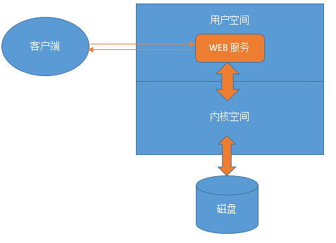
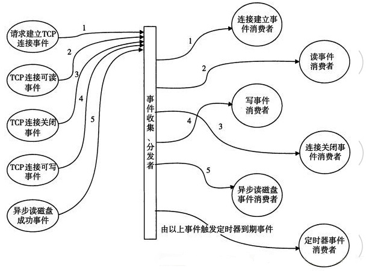
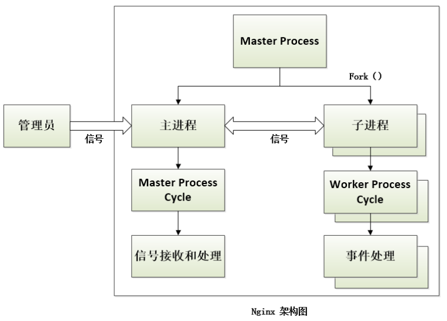
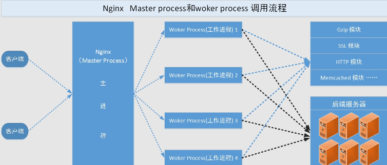

# 结构分析

## Nginx模块化
- Nginx基于模块化设计，每个模块是一个功能实现，分布式开发，团队协作
- Nginx涉及到的模块分为核心模块、标准HTTP模块、可选HTTP模块、邮件服务模块以及第三方模块等五大类。
- 编译后的源码目录objs/ngx_modules.c

[参考文档](https://github.com/aminglinux/nginx/blob/master/4z/module.md)

- **核心模块**  
核心模块是指Nginx服务器正常运行时必不可少的模块，它们提供了Nginx最基本最核心的服务，如进程管理、权限控制、错误日志记录等。  
主要包含对两类功能的支持，一类是主体功能，包括进程管理、权限控制、错误日志记录、配置解析等，
另一类是用于响应请求事件必需的功能，包括事件驱动机制、正则表达式解析等。
+ **标准HTTP模块**  
标准HTTP模块是编译Nginx后包含的模块，其支持Nginx服务器的标准HTTP功能。
- **可选HTTP模块**  
可选HTTP模块主要用于扩展标准的HTTP功能，使其能够处理一些特殊的HTTP请求。在编译Nginx时，如果不指定这些模块，默认是不会安装的。
* **邮件服务模块**  
邮件服务模块主要用于实现邮件服务功能，如SMTP代理服务器、POP3代理服务器等。
- **第三方模块**  
并非有Nginx官方提供，而是由第三方机构或者个人开发的模块，用于实现某种特殊功能。  
echo-nginx-module 支持在Nginx配置文件中使用echo、sleep、time以及exec等类shell命令  
lua-nginx-module 使Nginx支持lua脚本语言

## Nginx的web请求机制
  
并行处理：多进程、多线程、异步

- **同步机制**  
同步、异步发生在当客户端发起请求后，服务端处理客户端的请求时。  
同步机制，是指客户端发送请求后，需要等待服务端（内核）返回信息后，再继续发送下一个请求。  
在同步机制中，所有的请求在服务器端得到同步，即发送方和接收方对请求的处理步调是一致的。

- **异步机制**  
异步机制，是指客户端发出一个请求后，不等待服务端（内核）返回信息，就继续发送下一个请求。  
在异步机制中，所有来自发送方的请求形成一个队列，接收方处理完后再通知发送方。  
    举例：
    - 一家酒店前台，在旺季的高峰时间段会接很多预定酒席的电话。  
    - 如果是同步机制情况下，前台每接一个电话后先不挂掉电话，而是去查询有无剩余酒席，查到结果后，告诉客户。  
    - 如果是异步机制情况下，前台每接一个预定电话直接回复客户，一会回复，此时前台把查询这件事情交给了另外的同事，
    - 该前台挂掉电话后，继续处理其他客户的事情，当另外的同事查询到结果后再通知给前台，前台再通知客户。

+ **阻塞**  
阻塞与非阻塞发生在IO调度中，比如内核到磁盘IO。  
阻塞方式下，进程/线程在获取最终结果之前，被系统挂起了，也就是所谓的阻塞了，在阻塞过程中该进程什么都干不了，直到最终结果反馈给它时，它才恢复运行状态。
+ **非阻塞**  
非阻塞方式和阻塞相反，进程/线程在获取最终结果之前，并没有进入被挂起的状态，而是该进程可以继续执行新的任务。  
当有最终结果反馈给该进程时，它再把结果交给客户端。
    举例：
    - 依然是酒店前台接待预定酒席电话的案例。
    - 此时角色不再是前台，而是她的查询有无剩余酒席的同事。如果是阻塞方式，该同事在查询有无剩余酒席的过程中，需要傻傻地
    - 等待酒店管理系统给他返回结果，在此期间不能做其他事情。
    - 如果是非阻塞，该同事在等待酒店管理系统给他返回结果这段时间，可以做其他事情，比如可以通知前台剩余酒席的情况。
* **Nginx的请求机制**  
Nginx之所以可以支持高并发，是因为Nginx用的是异步非阻塞的机制，而Nginx是靠事件驱动模型来实现这种机制的。  
在Nginx的事件驱动模型下，客户端发起的所有请求在服务端都会被标记为一个事件，Nginx会把这些事件收集到“事件收集器”里，然后再把这些事件交给内核去处理。

## Nginx事件驱动模型
- **事件驱动模型**    
事件驱动模型是实现异步非阻塞的一个手段。事件驱动模型中，一个进程（线程）就可以了。  
对于web服务器来说，客户端A的请求连接到服务端时，服务端的某个进程（Nginx worker process）会处理该请求，
此进程在没有返回给客户端A结果时，它又去处理了客户端B的请求。  
服务端把客户端A以及客户端B发来的请求作为事件交给了“事件收集器”，
而“事件收集器”再把收集到的事件交由“事件发送器”发送给“事件处理器”进行处理。  
最后“事件处理器”处理完该事件后，通知服务端进程，服务端进程再把结果返回给客户端A、客户端B。  
在这个过程中，服务端进程做的事情属于用户级别的，而事件处理这部分工作属于内核级别的。  
也就是说这个事件驱动模型是需要操作系统内核来作为支撑的。  
* **Nginx的事件驱动模型**  
  
Nginx的事件驱动模型，支持select、poll、epoll、rtsig、kqueue、/dev/poll、eventport等。  
最常用的是前三种，其中kqueue模型用于支持BSD系列平台的事件驱动模型。  
kqueue是poll模型的一个变种，本质上和epoll一样。  
/dev/poll是Unix平台的事件驱动模型，其主要在Solaris7及以上版本、HP/UX11.22及以上版本、IRIX6.5.15及以上版本、
Tru64 Unix 5.1A及以上版本的平台使用。  
eventport是用于支持Solaris10及以上版本的事件驱动模型。
    - **select模型**  
    Linux和Windows都支持，使用select模型的步骤是：
        - 创建所关注事件的描述符集合，对于一个描述符，可以关注其上面的读(Read)事件、写(Write)事件以及异常发生(Exception)事件。  
        在select模型中，要创建这3类事件描述符集合。
        - 调用底层提供的select()函数，等待事件发生。
        - 轮询所有事件描述符集合中的每一个事件描述符，检查是否有相应的事件发生，如果有就进行处理。
    - **poll模型**  
    poll模型是Linux平台上的事件驱动模型，在Linux2.1.23中引入的，Windows平台不支持该模型。  
    poll模型和select模型工作方式基本相同，区别在于，select模型创建了3个描述符集合，而poll模型只创建一个描述符集合。
    - **epoll模型**  
    epoll模型属于poll模型的变种，在Linux2.5.44中引入。epoll比poll更加高效，原因在于它不需要轮询整个描述符集合，而是Linux内核会关注事件集合，当有变动时，内核会发来通知。

## 设计架构概览
Nginx基于模块化设计、基于事件驱动模型处理请求、主进程和工作进程

- **Nginx架构**  
Nginx服务器使用 master/worker 多进程模式。  
主进程(Master process)启动后，会接收和处理外部信号；  
主进程启动后通过fork() 函数产生一个或多个子进程(work process)，每个子进程会进行进程初始化、
模块调用以及对事件的接收和处理等工作。  
  
    - **主进程**  
    主要功能是和外界通信和对内部其他进程进行管理，具体来说有以下几点：
        - 读取Nginx配置文件并验证其有效性和正确性
        - 建立、绑定和关闭socket
        - 按照配置生成、管理工作进程
        - 接收外界指令，比如重启、关闭、重载服务等指令
        - 日志文件管理
    - **子进程（worker process)**  
    是由主进程生成，生成数量可以在配置文件中定义。该进程主要工作有：
        - 接收客户端请求
        - 将请求依次送入各个功能模块进行过滤处理
        - IO调用，获取响应数据
        - 与后端服务器通信，接收后端服务器处理结果
        - 数据缓存，访问缓存索引，查询和调用缓存数据
        - 发送请求结果，响应客户端请求
        - 接收主进程指令，如重启、重载、退出等

  
