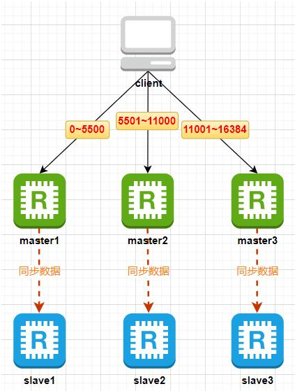

# Cluster模式
**什么是Redis Cluster**     
Redis Cluster是官方提供的一种分布式解决方案，它最少需要3组一主一从（6个节点）。它的每一个master节点都可以提供写服务，每个master节点中存储的数据都不一样，这些数据通过数据分片的方式被自动分割到不同的master节点上，从而可以通过增加master来支撑越来越多的数据。

Redis Cluster每一个master至少需要一个slave，当某个master故障时，它会自动将该组中的其中一个slave切换为master来继续提供服务。

Redis Cluster的master节点个数至少3个，而且最好是奇数个，因为当其中1个master故障后，剩下的master节点会重新选举出新的master节点，但是这里需要超过一半的master节点都认为该master故障才会重新选举。如果就2个master，剩下1个，无法做到1>（2/2）。

Redis Cluster模式下，每一个master都可以处理客户端的请求，如果该master上没有请求的数据，它就会将该请求转发出去。

**Redis Cluster架构原理**   
数据分片    
Redis集群中引入了哈希槽的概念，Redis集群有16384个哈希槽，进行set操作时，每个key会通过CRC16校验后再对16384取模来决定放置在哪个槽，搭建Redis集群时会先给集群中每个master节点分配一部分哈希槽。假如集群有3个master节点，master1节点包含0~5500号哈希槽，master2节点包含5501~11000号哈希槽，master3节点包含11001~16384号哈希槽，当我们执行“set key value”时，假如 CRC16(key) % 16384 = 777，那么这个key就会被分配到master1节点上，如下图：



Redis Cluster使用哈希槽，可以让在集群中添加和移除节点非常容易。     
例如，如果我想添加第四个master节点，只需要从前三个节点移动一些哈希槽到该节点。同样地，如果我想从集群中移除某一个节点，只需要移动该节点的哈希槽其它节点。 当该节点变成空的以后，就可以从集群中彻底删除它。 因为从一个节点向另一个节点移动哈希槽并不需要停止操作，所以添加和移除节点，或者改变节点持有的哈希槽百分比，都不需要任何停机时间。

Redis架构  

所有的redis节点彼此互联(PING-PONG 机制)，内部使用二进制协议优化传输速度和带宽

客户端与redis节点直连，不需要中间proxy层，客户端不需要连接集群所有节点，连接集群中任何一个可用节点即可，redis-cluster首先会把所有的物理节点预先映射到[0-16383]slot 上，然后当建立key的时候，会通过CRC16校验决定该key对应的value存储到哪个slot上，所以当客户端请求该key时，也会自动计算出对应的slot，也就知道了物理节点。


Redis哨兵解决了高可用，但是没有解决海量数据和大并发的问题，而Redis Cluster可以实现横向扩容，可以支撑更多数据量和更大并发。


## 搭建CLuster

| 主机名 | IP地址 | 角色 | 端口 |
| ---- | ---- | ---- | ---- |
| lwz1 | 192.168.1.152 | master1,slave2 | master1(6379),slave2(6479) |
| lwz2 | 192.168.1.156 | master2,slave3 | master2(6379),slave3(6479) |
| lwz3 | 192.168.1.136 | master3,slave1 | master3(6379),slave1(6479) |

6个节点，3组一主一从，3台物理机

### 定义配置文件

定义6379端口配置文件（三个节点同样操作）
```
vi /usr/local/redis/conf/redis_6379.conf
# 添加如下内容
protected-mode yes
port 6379
tcp-backlog 511
timeout 0
tcp-keepalive 300
daemonize yes
pidfile "/usr/local/redis/log/redis_6379.pid"
loglevel warning
logfile "/usr/local/redis/log/redis_6379.log"
databases 16
always-show-logo no
set-proc-title yes
proc-title-template "{title} {listen-addr} {server-mode}"
stop-writes-on-bgsave-error yes
rdbcompression yes
rdbchecksum yes
dbfilename "dump_6379.rdb"
rdb-del-sync-files no
dir "/data/redis"
save 3600 1
save 300 100
save 60 10000
replica-serve-stale-data yes
replica-read-only yes
repl-diskless-sync yes
repl-diskless-sync-delay 5
repl-diskless-sync-max-replicas 0
repl-diskless-load disabled
repl-disable-tcp-nodelay no
replica-priority 100
acllog-max-len 128
requirepass "123123"
lazyfree-lazy-eviction no
lazyfree-lazy-expire no
lazyfree-lazy-server-del no
replica-lazy-flush no
lazyfree-lazy-user-del no
lazyfree-lazy-user-flush no
oom-score-adj no
oom-score-adj-values 0 200 800
disable-thp yes
appendonly no
appendfilename "appendonly_6379.aof"
appenddirname "appendonlydir"
appendfsync everysec
no-appendfsync-on-rewrite no
auto-aof-rewrite-percentage 100
auto-aof-rewrite-min-size 64mb
aof-load-truncated yes
aof-use-rdb-preamble yes
aof-timestamp-enabled no
slowlog-log-slower-than 10000
slowlog-max-len 128
latency-monitor-threshold 0
notify-keyspace-events ""
hash-max-listpack-entries 512
hash-max-listpack-value 64
list-max-listpack-size -2
list-compress-depth 0
set-max-intset-entries 512
zset-max-listpack-entries 128
zset-max-listpack-value 64
hll-sparse-max-bytes 3000
stream-node-max-bytes 4kb
stream-node-max-entries 100
activerehashing yes
client-output-buffer-limit normal 0 0 0
client-output-buffer-limit replica 256mb 64mb 60
client-output-buffer-limit pubsub 32mb 8mb 60
hz 10
dynamic-hz yes
aof-rewrite-incremental-fsync yes
rdb-save-incremental-fsync yes
jemalloc-bg-thread yes
cluster-enabled yes
cluster-config-file nodes-6379.conf
masterauth  123123
```
```
# 推送到节点一和节点二
scp /usr/local/redis/conf/redis_6379.conf root@192.168.1.156:/usr/local/redis/conf/
scp /usr/local/redis/conf/redis_6379.conf root@192.168.1.136:/usr/local/redis/conf/
```

定义6479端口配置文件（三个节点同样操作）
```
vi /usr/local/redis/conf/redis_6479.conf
# 添加如下内容
protected-mode yes
port 6479
tcp-backlog 511
timeout 0
tcp-keepalive 300
daemonize yes
pidfile "/usr/local/redis/log/redis_6479.pid"
loglevel warning
logfile "/usr/local/redis/log/redis_6479.log"
databases 16
always-show-logo no
set-proc-title yes
proc-title-template "{title} {listen-addr} {server-mode}"
stop-writes-on-bgsave-error yes
rdbcompression yes
rdbchecksum yes
dbfilename "dump_6479.rdb"
rdb-del-sync-files no
dir "/data/redis"
save 3600 1
save 300 100
save 60 10000
replica-serve-stale-data yes
replica-read-only yes
repl-diskless-sync yes
repl-diskless-sync-delay 5
repl-diskless-sync-max-replicas 0
repl-diskless-load disabled
repl-disable-tcp-nodelay no
replica-priority 100
acllog-max-len 128
requirepass "123123"
lazyfree-lazy-eviction no
lazyfree-lazy-expire no
lazyfree-lazy-server-del no
replica-lazy-flush no
lazyfree-lazy-user-del no
lazyfree-lazy-user-flush no
oom-score-adj no
oom-score-adj-values 0 200 800
disable-thp yes
appendonly no
appendfilename "appendonly_6479.aof"
appenddirname "appendonlydir"
appendfsync everysec
no-appendfsync-on-rewrite no
auto-aof-rewrite-percentage 100
auto-aof-rewrite-min-size 64mb
aof-load-truncated yes
aof-use-rdb-preamble yes
aof-timestamp-enabled no
slowlog-log-slower-than 10000
slowlog-max-len 128
latency-monitor-threshold 0
notify-keyspace-events ""
hash-max-listpack-entries 512
hash-max-listpack-value 64
list-max-listpack-size -2
list-compress-depth 0
set-max-intset-entries 512
zset-max-listpack-entries 128
zset-max-listpack-value 64
hll-sparse-max-bytes 3000
stream-node-max-bytes 4kb
stream-node-max-entries 100
activerehashing yes
client-output-buffer-limit normal 0 0 0
client-output-buffer-limit replica 256mb 64mb 60
client-output-buffer-limit pubsub 32mb 8mb 60
hz 10
dynamic-hz yes
aof-rewrite-incremental-fsync yes
rdb-save-incremental-fsync yes
jemalloc-bg-thread yes
cluster-enabled yes
cluster-config-file nodes-6479.conf
masterauth  123123
```
```
# 推送到节点一和节点二
scp /usr/local/redis/conf/redis_6479.conf root@192.168.1.156:/usr/local/redis/conf/
scp /usr/local/redis/conf/redis_6479.conf root@192.168.1.136:/usr/local/redis/conf/
```

定义systemd启动脚本
```
# 6379启动脚本
vi /lib/systemd/system/redis_6379.service
# 添加如下内容
[Unit]
Description=redis
After=network.target
[Service]
User=redis
Type=forking
TimeoutSec=0
PIDFile=/usr/local/redis/log/redis_6379.pid
ExecStart=/usr/local/redis/bin/redis-server /usr/local/redis/conf/redis_6379.conf
ExecReload=/bin/kill -s HUP $MAINPID
ExecStop=/bin/kill -s QUIT $MAINPID
PrivateTmp=true
[Install]
WantedBy=multi-user.target


# 6479启动脚本
vi /lib/systemd/system/redis_6479.service
# 添加如下内容
[Unit]
Description=redis
After=network.target
[Service]
User=redis
Type=forking
TimeoutSec=0
PIDFile=/usr/local/redis/log/redis_6479.pid
ExecStart=/usr/local/redis/bin/redis-server /usr/local/redis/conf/redis_6479.conf
ExecReload=/bin/kill -s HUP $MAINPID
ExecStop=/bin/kill -s QUIT $MAINPID
PrivateTmp=true
[Install]
WantedBy=multi-user.target


# 推送到节点一和节点二
scp /lib/systemd/system/redis_6379.service root@192.168.1.156:/lib/systemd/system/
scp /lib/systemd/system/redis_6479.service root@192.168.1.156:/lib/systemd/system/
scp /lib/systemd/system/redis_6379.service root@192.168.1.136:/lib/systemd/system/
scp /lib/systemd/system/redis_6479.service root@192.168.1.136:/lib/systemd/system/

# 启动6个节点
systemctl daemon-reload
systemctl start redis_6379
systemctl start redis_6479

# 查看进程
ps -ef | grep redis

# 如果发现节点一和节点二的6379进程后面没有带[cluster]，可能是因为与已经启动redis服务冲突了，停掉旧的redis再重启服务就好
systemctl stop redis ; systemctl stop redis-sentinel
# 再cluster服务
systemctl restart redis_6379
systemctl restart redis_6479
```

### 创建cluster集群
```
# 创建集群
/usr/local/redis/bin/redis-cli -a 123123 --cluster create 192.168.1.152:6379 192.168.1.152:6479 192.168.1.156:6379 192.168.1.156:6479 192.168.1.136:6379 192.168.1.136:6479 --cluster-replicas 1

# 如下为输出信息
Warning: Using a password with '-a' or '-u' option on the command line interface may not be safe.
>>> Performing hash slots allocation on 6 nodes...
Master[0] -> Slots 0 - 5460
Master[1] -> Slots 5461 - 10922
Master[2] -> Slots 10923 - 16383
Adding replica 192.168.1.156:6479 to 192.168.1.152:6379
Adding replica 192.168.1.136:6479 to 192.168.1.156:6379
Adding replica 192.168.1.152:6479 to 192.168.1.136:6379
M: 920ac2bf4e7f59d82973399138c53933e59ad221 192.168.1.152:6379
   slots:[0-5460] (5461 slots) master
S: cd0b4d9a4fb1b12bb0cff71181d68dc1dfbc91cc 192.168.1.152:6479
   replicates 2c4bd0264c81dab9fe85fc528ced39b8480d1071
M: 65e3c154bbf7b9e7d05a17ec1cb6adf8dddac339 192.168.1.156:6379
   slots:[5461-10922] (5462 slots) master
S: e9c342ba433d9b5faa2a16c53c07dc7988badeb0 192.168.1.156:6479
   replicates 920ac2bf4e7f59d82973399138c53933e59ad221
M: 2c4bd0264c81dab9fe85fc528ced39b8480d1071 192.168.1.136:6379
   slots:[10923-16383] (5461 slots) master
S: 5911bde551a234ec29bc82339eb683d11f610329 192.168.1.136:6479
   replicates 65e3c154bbf7b9e7d05a17ec1cb6adf8dddac339
Can I set the above configuration? (type 'yes' to accept): yes
>>> Nodes configuration updated
>>> Assign a different config epoch to each node
>>> Sending CLUSTER MEET messages to join the cluster
Waiting for the cluster to join
.
>>> Performing Cluster Check (using node 192.168.1.152:6379)
M: 920ac2bf4e7f59d82973399138c53933e59ad221 192.168.1.152:6379
   slots:[0-5460] (5461 slots) master
   1 additional replica(s)
S: 5911bde551a234ec29bc82339eb683d11f610329 192.168.1.136:6479
   slots: (0 slots) slave
   replicates 65e3c154bbf7b9e7d05a17ec1cb6adf8dddac339
S: e9c342ba433d9b5faa2a16c53c07dc7988badeb0 192.168.1.156:6479
   slots: (0 slots) slave
   replicates 920ac2bf4e7f59d82973399138c53933e59ad221
S: cd0b4d9a4fb1b12bb0cff71181d68dc1dfbc91cc 192.168.1.152:6479
   slots: (0 slots) slave
   replicates 2c4bd0264c81dab9fe85fc528ced39b8480d1071
M: 65e3c154bbf7b9e7d05a17ec1cb6adf8dddac339 192.168.1.156:6379
   slots:[5461-10922] (5462 slots) master
   1 additional replica(s)
M: 2c4bd0264c81dab9fe85fc528ced39b8480d1071 192.168.1.136:6379
   slots:[10923-16383] (5461 slots) master
   1 additional replica(s)
[OK] All nodes agree about slots configuration.
>>> Check for open slots...
>>> Check slots coverage...
[OK] All 16384 slots covered.
```
> `--cluster-replicas 1`表示每个master有1个slave节点

```
# 如果创建集群报错，可能和旧redis遗留的数据有冲突，需要先将数据目录清空
systemctl stop redis_6379 ; systemctl stop redis_6479
rm -rf /data/redis/*
systemctl start redis_6379 ; systemctl start redis_6479

# 再次创建集群
```
```
# 查看集群状态，（任意节点查看都可）
# -c：表示以集群模式连接
/usr/local/redis/bin/redis-cli -h 127.0.0.1 -p 6379 -a 123123 -c

127.0.0.1:6379> cluster nodes
5911bde551a234ec29bc82339eb683d11f610329 192.168.1.136:6479@16479 slave 65e3c154bbf7b9e7d05a17ec1cb6adf8dddac339 0 1708668021836 3 connected
e9c342ba433d9b5faa2a16c53c07dc7988badeb0 192.168.1.156:6479@16479 slave 920ac2bf4e7f59d82973399138c53933e59ad221 0 1708668022842 1 connected
920ac2bf4e7f59d82973399138c53933e59ad221 192.168.1.152:6379@16379 myself,master - 0 1708668021000 1 connected 0-5460
cd0b4d9a4fb1b12bb0cff71181d68dc1dfbc91cc 192.168.1.152:6479@16479 slave 2c4bd0264c81dab9fe85fc528ced39b8480d1071 0 1708668021000 5 connected
65e3c154bbf7b9e7d05a17ec1cb6adf8dddac339 192.168.1.156:6379@16379 master - 0 17086680200003 connected 5461-10922
2c4bd0264c81dab9fe85fc528ced39b8480d1071 192.168.1.136:6379@16379 master - 0 17086680208315 connected 10923-16383
```

## 故障测试
创造故障
```
# 关闭lwz2上的master
systemctl stop redis_6379

# 再次查看集群状态
127.0.0.1:6379> cluster nodes
5911bde551a234ec29bc82339eb683d11f610329 192.168.1.136:6479@16479 slave 65e3c154bbf7b9e7d05a17ec1cb6adf8dddac339 0 1708669732683 3 connected
e9c342ba433d9b5faa2a16c53c07dc7988badeb0 192.168.1.156:6479@16479 slave 920ac2bf4e7f59d82973399138c53933e59ad221 0 1708669734000 1 connected
920ac2bf4e7f59d82973399138c53933e59ad221 192.168.1.152:6379@16379 myself,master - 0 1708669734000 1 connected 0-5460
cd0b4d9a4fb1b12bb0cff71181d68dc1dfbc91cc 192.168.1.152:6479@16479 slave 2c4bd0264c81dab9fe85fc528ced39b8480d1071 0 1708669736721 5 connected
65e3c154bbf7b9e7d05a17ec1cb6adf8dddac339 192.168.1.156:6379@16379 master - 1708669734702 1708669730000 3 disconnected 5461-10922
2c4bd0264c81dab9fe85fc528ced39b8480d1071 192.168.1.136:6379@16379 master - 0 1708669735000 5 connected 10923-16383

127.0.0.1:6379> cluster nodes
5911bde551a234ec29bc82339eb683d11f610329 192.168.1.136:6479@16479 master - 0 1708669757917 7 connected 5461-10922
e9c342ba433d9b5faa2a16c53c07dc7988badeb0 192.168.1.156:6479@16479 slave 920ac2bf4e7f59d82973399138c53933e59ad221 0 1708669756000 1 connected
920ac2bf4e7f59d82973399138c53933e59ad221 192.168.1.152:6379@16379 myself,master - 0 1708669754000 1 connected 0-5460
cd0b4d9a4fb1b12bb0cff71181d68dc1dfbc91cc 192.168.1.152:6479@16479 slave 2c4bd0264c81dab9fe85fc528ced39b8480d1071 0 1708669755899 5 connected
65e3c154bbf7b9e7d05a17ec1cb6adf8dddac339 192.168.1.156:6379@16379 master,fail - 1708669734702 1708669730000 3 disconnected
2c4bd0264c81dab9fe85fc528ced39b8480d1071 192.168.1.136:6379@16379 master - 0 1708669756908 5 connected 10923-16383
```
> 可以发现192.168.1.136:6479@16479由slave变成了master

恢复故障
```
# 启动lwz2的原master
systemctl start redis_6379

# 再次查看集群状态
127.0.0.1:6379> cluster nodes
5911bde551a234ec29bc82339eb683d11f610329 192.168.1.136:6479@16479 master - 0 1708670155587 7 connected 5461-10922
e9c342ba433d9b5faa2a16c53c07dc7988badeb0 192.168.1.156:6479@16479 slave 920ac2bf4e7f59d82973399138c53933e59ad221 0 1708670154000 1 connected
920ac2bf4e7f59d82973399138c53933e59ad221 192.168.1.152:6379@16379 myself,master - 0 1708670157000 1 connected 0-5460
cd0b4d9a4fb1b12bb0cff71181d68dc1dfbc91cc 192.168.1.152:6479@16479 slave 2c4bd0264c81dab9fe85fc528ced39b8480d1071 0 1708670157597 5 connected
65e3c154bbf7b9e7d05a17ec1cb6adf8dddac339 192.168.1.156:6379@16379 slave 5911bde551a234ec29bc82339eb683d11f610329 0 1708670156592 7 connected
2c4bd0264c81dab9fe85fc528ced39b8480d1071 192.168.1.136:6379@16379 master - 0 1708670155000 5 connected 10923-16383
```
> 注：此时它变成了新晋master(192.168.1.136:6479)的slave，由于我们只用了三台物理机来做测试，每台物理机上有两个redis节点，需要保证每台物理机有master又有slave，但目前lwz2上为两个slave，而lwz3上有两个master，这明显不合理。  
> 因此，需要登陆到lwz2(192.168.1.156:6379)节点上，它本应该是master，但现在是slave，需要手动还原为master。   
> 还原方法：
>    > 1. 登陆lwz2master节点：执行`/usr/local/redis/bin/redis-cli -h 127.0.0.1 -p 6379 -a 123123 -c`   
>    > 2. 切换为master：执行`cluster failover` 
>    > 3. 再次查看集群状态：执行`cluster nodes`查看已经恢复    
> 如果用6台物理机搭建6个节点，就不需要手动切换。

## Cluster增加节点
为了方便测试，我们再增加两个节点，分别位于lwz1和lwz2上启一个6579端口。  

### 定义6579端口配置文件
```
vi /usr/local/redis/conf/redis_6579.conf
# 添加如下内容
protected-mode yes
port 6579
tcp-backlog 511
timeout 0
tcp-keepalive 300
daemonize yes
pidfile "/usr/local/redis/log/redis_6579.pid"
loglevel warning
logfile "/usr/local/redis/log/redis_6579.log"
databases 16
always-show-logo no
set-proc-title yes
proc-title-template "{title} {listen-addr} {server-mode}"
stop-writes-on-bgsave-error yes
rdbcompression yes
rdbchecksum yes
dbfilename "dump_6579.rdb"
rdb-del-sync-files no
dir "/data/redis"
save 3600 1
save 300 100
save 60 10000
replica-serve-stale-data yes
replica-read-only yes
repl-diskless-sync yes
repl-diskless-sync-delay 5
repl-diskless-sync-max-replicas 0
repl-diskless-load disabled
repl-disable-tcp-nodelay no
replica-priority 100
acllog-max-len 128
requirepass "123123"
lazyfree-lazy-eviction no
lazyfree-lazy-expire no
lazyfree-lazy-server-del no
replica-lazy-flush no
lazyfree-lazy-user-del no
lazyfree-lazy-user-flush no
oom-score-adj no
oom-score-adj-values 0 200 800
disable-thp yes
appendonly no
appendfilename "appendonly_6579.aof"
appenddirname "appendonlydir"
appendfsync everysec
no-appendfsync-on-rewrite no
auto-aof-rewrite-percentage 100
auto-aof-rewrite-min-size 64mb
aof-load-truncated yes
aof-use-rdb-preamble yes
aof-timestamp-enabled no
slowlog-log-slower-than 10000
slowlog-max-len 128
latency-monitor-threshold 0
notify-keyspace-events ""
hash-max-listpack-entries 512
hash-max-listpack-value 64
list-max-listpack-size -2
list-compress-depth 0
set-max-intset-entries 512
zset-max-listpack-entries 128
zset-max-listpack-value 64
hll-sparse-max-bytes 3000
stream-node-max-bytes 4kb
stream-node-max-entries 100
activerehashing yes
client-output-buffer-limit normal 0 0 0
client-output-buffer-limit replica 256mb 64mb 60
client-output-buffer-limit pubsub 32mb 8mb 60
hz 10
dynamic-hz yes
aof-rewrite-incremental-fsync yes
rdb-save-incremental-fsync yes
jemalloc-bg-thread yes
cluster-enabled yes
cluster-config-file nodes-6579.conf
masterauth  123123
```

定义6579的systemd服务启动脚本
```
vi  /lib/systemd/system/redis_6579.service
# 添加如下内容
[Unit]
Description=redis
After=network.target
[Service]
User=redis
Type=forking
TimeoutSec=0
PIDFile=/usr/local/redis/log/redis_6579.pid
ExecStart=/usr/local/redis/bin/redis-server /usr/local/redis/conf/redis_6579.conf
ExecReload=/bin/kill -s HUP $MAINPID
ExecStop=/bin/kill -s QUIT $MAINPID
PrivateTmp=true
[Install]
WantedBy=multi-user.target
```
启动6579的redis服务
```
# 推送文件到lwz2节点
scp /usr/local/redis/conf/redis_6579.conf root@192.168.1.156:/usr/local/redis/conf/
scp /lib/systemd/system/redis_6579.service root@192.168.1.156:/lib/systemd/system/

# 启动redis服务
systemctl daemon-reload
systemctl start redis_6579.service
```

### 新增节点加入集群
```
# 在lwz2上连接集群
/usr/local/redis/bin/redis-cli -h 127.0.0.1 -p 6379 -a 123123 -c

# 加入两个新节点
127.0.0.1:6379> cluster meet 192.168.1.152 6579
OK
127.0.0.1:6379> cluster meet 192.168.1.156 6579
OK
```
```
# 此时两个节点全部为master，且slot(槽)为0
127.0.0.1:6379> cluster nodes
920ac2bf4e7f59d82973399138c53933e59ad221 192.168.1.152:6379@16379 master - 0 1708672499747 1 connected 0-5460
05819f07092b5e8e88908fea744ba100dabb9af8 192.168.1.152:6579@16579 master - 0 1708672501000 9 connected
65e3c154bbf7b9e7d05a17ec1cb6adf8dddac339 192.168.1.156:6379@16379 myself,master - 0 1708672499000 8 connected 5461-10922
e65309b45dce13b9f76f31b46af58609f02c40f9 192.168.1.156:6579@16579 master - 0 1708672497000 0 connected
2c4bd0264c81dab9fe85fc528ced39b8480d1071 192.168.1.136:6379@16379 master - 0 1708672501757 5 connected 10923-16383
5911bde551a234ec29bc82339eb683d11f610329 192.168.1.136:6479@16479 slave 65e3c154bbf7b9e7d05a17ec1cb6adf8dddac339 0 1708672500752 8 connected
e9c342ba433d9b5faa2a16c53c07dc7988badeb0 192.168.1.156:6479@16479 slave 920ac2bf4e7f59d82973399138c53933e59ad221 0 1708672498000 1 connected
cd0b4d9a4fb1b12bb0cff71181d68dc1dfbc91cc 192.168.1.152:6479@16479 slave 2c4bd0264c81dab9fe85fc528ced39b8480d1071 0 1708672502000 5 connected
```
分配slot(槽)，在lwz1上执行
```bash
# 分配slot
/usr/local/redis/bin/redis-cli -a 123123 --cluster reshard 127.0.0.1:6379

# 如下为交互式输出内容
How many slots do you want to move (from 1 to 16384)? 4096  ##总slot为16384，现在一共4台master节点，所以平均每个节点为4096个

What is the receiving node ID? e65309b45dce13b9f76f31b46af58609f02c40f9     ##这个id为新增的其中一个节点id

Source node #1: all   ##这里写all，表示从其它所有节点迁移slot
```
```
# 查看slot分配情况
127.0.0.1:6379> cluster nodes
920ac2bf4e7f59d82973399138c53933e59ad221 192.168.1.152:6379@16379 master - 0 1708673338663 1 connected 1365-5460
05819f07092b5e8e88908fea744ba100dabb9af8 192.168.1.152:6579@16579 master - 0 1708673337000 9 connected
65e3c154bbf7b9e7d05a17ec1cb6adf8dddac339 192.168.1.156:6379@16379 myself,master - 0 1708673334000 8 connected 6827-10922
e65309b45dce13b9f76f31b46af58609f02c40f9 192.168.1.156:6579@16579 master - 0 1708673336000 10 connected 0-1364 5461-6826 10923-12287
2c4bd0264c81dab9fe85fc528ced39b8480d1071 192.168.1.136:6379@16379 master - 0 1708673338000 5 connected 12288-16383
5911bde551a234ec29bc82339eb683d11f610329 192.168.1.136:6479@16479 slave 65e3c154bbf7b9e7d05a17ec1cb6adf8dddac339 0 1708673337000 8 connected
e9c342ba433d9b5faa2a16c53c07dc7988badeb0 192.168.1.156:6479@16479 slave 920ac2bf4e7f59d82973399138c53933e59ad221 0 1708673339667 1 connected
cd0b4d9a4fb1b12bb0cff71181d68dc1dfbc91cc 192.168.1.152:6479@16479 slave 2c4bd0264c81dab9fe85fc528ced39b8480d1071 0 1708673338000 5 connected
```

将另外一台节点设置为刚才分配slot节点的slave.    
```
# 登陆没有slot的节点
/usr/local/redis/bin/redis-cli -a 123123 -h 192.168.1.152 -p 6579 -c

# 设置为新增节点的slave
192.168.1.152:6579> cluster replicate  e65309b45dce13b9f76f31b46af58609f02c40f9
OK
```
