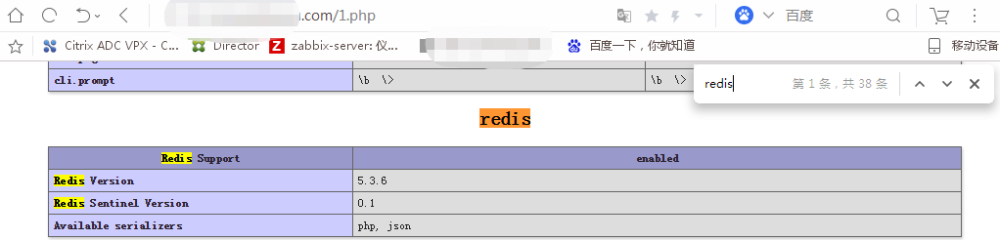

# php安装Redis扩展
 
* php7.0安装的redis-5.0.0扩展  
* php7.2安装的redis-5.3.6扩展
* php7.4安装的redis-5.3.6扩展  

## 编译安装扩展
> 目前已在`ubuntu16.04` `ubuntu18.04` `Centos7`完成安装

    $ cd /usr/local/src
    $ sudo wget http://pecl.php.net/get/redis-5.0.0.tgz     # 更换版本号5.3.6即可
    $ sudo tar -zxvf redis-5.0.0.tgz
    $ cd redis-5.0.0
    $ sudo /usr/bin/phpize   # 根据PHP版本，选择合适的phpize命令以及phpize命令所在路径
    $ sudo ./configure --with-php-config=/usr/bin/php-config    # 填写自己服务器的php-config所在路径
    $ sudo make && make install
- 如果找不到phpize，则需要安装php-dev。在命令行输入php-dev直接回车可查看需要安装的版本。
```
$ sudo apt-get install php-dev -y   # ubuntu*
$ sudo yum install php-dev -y   # centos*
```
- php-dev安装报错，则更新源
``` 
$ sudo apt-get update   # ubuntu*
$ sudo yum update   # centos*
```

#### 配置redis.so扩展

    $ sudo vim /etc/php/7.0/mods-available/redis.ini
    # 添加如下内容
    extension=redis.so
    # 执行以下命令，使配置生效
    $ sudo ln -s /etc/php/7.0/mods-available/redis.ini /etc/php/7.0/cli/conf.d/25-redis.ini   

- `php --ini` 查看conf.d路径以及ini文件
- `php -m` 查看已加载的扩展

> 注意：`25-redis.ini` 文件前面的数字至少要比`20-json.ini`要大，否则会报错。
数字越小，则该扩展越先加载。

> 如果结合nginx使用，需要了解nginx和php的监听方式:
> * 9000端口对应`/etc/php/7.0/cli/`路径。
> * php-fpm.sock对应`/etc/php/7.0/fpm/`路径。

#### 查看redis.so扩展是否生效
在域名对应的项目目录下创建一个1.php文件，浏览器打开。

    $ vim 1.php
    <?php
    phpinfo();
    ?>

如果出现redis.so，则说明安装成功。


