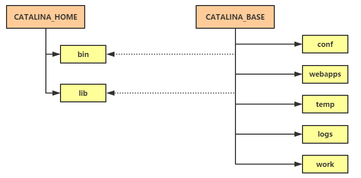
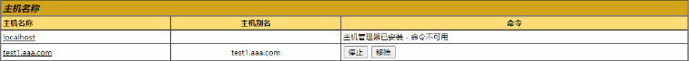

# 进阶

## 普通用户身份运行tomcat
```
# 编辑服务管理脚本
vi /lib/systemd/system/tomcat.service
##在[service]行下面增加
User=tomcat


# 增加tomcat用户
useradd tomcat

# kill掉之前tomcat进程
ps aux |grep tomcat|awk '{print $2}' |xargs kill

# 重新加载服务、修改用户权限、启动服务
systemctl daemon-reload
chown -R tomcat  /usr/local/apache-tomcat-10.1.18
systemctl start  tomcat

# 查看是否为tomcat用户启动
ps aux |grep tomcat
```

## 重定向WEB应用程序目录
所谓重定向WEB应用程序目录指的是，将Tomcat程序目录（比如bin、lib等目录）和配置文件、应用目录（webapps）分离开。这样做的好处是，如果Tomcat程序有升级，可以直接替换老的目录使用新的目录，而配置文件之类的目录都不用动。另外，也可以实现一个非常实用的功能：一台服务器跑多个Tomcat实例（多个端口，这个和虚拟主机有所不同）。


如上图，将CATALINA_HOME和CATALINA_BASE分离开，就可以实现重定向WEB应用程序的效果。具体操作过程如下：
```bash
# 定义目录
mkdir  -p /data/tomcat-instance/www.aaa.com
cd /data/tomcat-instance/www.aaa.com
cp -r /usr/local/apache-tomcat-10.0.23/conf ./
mkdir -p ./{logs,temp,webapps,work}
cp -r /usr/local/apache-tomcat-10.0.23/webapps/*  ./webapps/
chown -R tomcat ./

# 定义systemd服务管理tomcat_aaa脚本
vi /lib/systemd/system/tomcat_aaa.service

[Unit]
Description=Apache Tomcat Web Application Container
After=syslog.target network.target remote-fs.target nss-lookup.target

[Service]
User=tomcat
Type=forking
Environment='JAVA_HOME=/usr/local/jdk-18.0.2.1/'
Environment='CATALINA_HOME=/usr/local/apache-tomcat-10.0.23'
Environment='CATALINA_BASE=/data/tomcat-instance/www.aaa.com'
ExecStart=/usr/local/apache-tomcat-10.0.23/bin/startup.sh
ExecReload=/bin/kill -s HUP $MAINPID
ExecStop=/bin/kill -s QUIT $MAINPID
PrivateTmp=true

[Install]
WantedBy=multi-user.target


# 启动tomcat_aaa
##先停止之前的tomcat服务
systemctl stop tomcat  
systemctl daemon-reload
systemctl start tomcat_aaa.service
ps aux |grep tomcat

# 测试
curl localhost:8080
```
继续创建第二个实例
```bash
# 创建www.bbb.com目录
mkdir  -p /data/tomcat-instance/www.bbb.com
cd /data/tomcat-instance/www.bbb.com

# 拷贝配置文件
cp -r /usr/local/apache-tomcat-10.0.23/conf ./ 

# 创建必要目录
mkdir -p ./{logs,temp,webapps,work}

# 拷贝应用目录 
cp -r /usr/local/apache-tomcat-10.0.23/webapps/*  ./webapps/

# 更改用户属主
chown -R tomcat ./

# 创建www.bbb.com实例的服务管理脚本
vi /lib/systemd/system/tomcat_bbb.service

[Unit]
Description=Apache Tomcat Web Application Container
After=syslog.target network.target remote-fs.target nss-lookup.target

[Service]
User=tomcat
Type=forking
Environment='JAVA_HOME=/usr/local/jdk-18.0.2.1/'
Environment='CATALINA_HOME=/usr/local/apache-tomcat-10.0.23'
Environment='CATALINA_BASE=/data/tomcat-instance/www.bbb.com'
ExecStart=/usr/local/apache-tomcat-10.0.23/bin/startup.sh
ExecReload=/bin/kill -s HUP $MAINPID
ExecStop=/bin/kill -s QUIT $MAINPID
PrivateTmp=true

[Install]
WantedBy=multi-user.target


# 更改配置文件
## 为了不让端口冲突，所以第二个实例不能使用跟前面实例相同的端口
sed -i -e 's/8080/8081/' -e 's/8005/8006/' /data/tomcat-instance/www.bbb.com/conf/server.xml

# 启动服务tomcat_bbb
systemctl daemon-reload
systemctl start tomcat_bbb

# 查看进程和端口
ps aux |grep tomcat
netstat -ltnp |grep java
#有8081和8006
```

## Tomcat的host-manager

配置host-manager，使其可以被访问    
先用浏览器访问默认页


点击右侧的 "Host Manager" 就可以进入host-manager页面    


默认是403，被拒绝访问，根据提示，我们可以修改tomcat-user.xml配置文件，如下所示
```bash
vi  /data/tomcat-instance/www.aaa.com/conf/tomcat-users.xml
## 在</tomcat-users>上面增加
<role rolename="admin-gui"/>
<role rolename="admin-script"/>
<user username="tomcat" password="123123" roles="admin-gui,admin-script"/>
```
> 说明： admin-gui和admin-script为两个角色，tomcat为该角色里的一个用户，其密码为123123

另外，还需要更改一个配置文件，如下
```bash
vi /data/tomcat-instance/www.aaa.com/webapps/host-manager/META-INF/context.xml
##在allow那一行增加白名单IP，如果是网段用*表示，例如192.168.222.*
allow="127\.\d+\.\d+\.\d+|::1|0:0:0:0:0:0:0:1|192.168.222.*"

## 重启tomcat
systemctl restart  tomcat_aaa
```
再次到浏览器刷新，出现登录提示框，输入用户名tomcat和它的密码，点击登陆就可以看到如下页面：


也可通过curl来列出所有的host
```bash
curl -u tomcat:aminglinux.com  http://localhost:8080/host-manager/text/list
```
增加虚拟主机--通过浏览器管理页面


点击添加后，可以在上面看到多出来一个虚拟主机


**持久化**  

此时该虚拟机只是临时添加，重启服务会消失，需要做一个持久化操作    
```bash
# 配置StoreConfig
vi /data/tomcat-instance/www.aaa.com/conf/server.xml
##在 <Server 那行下面增加
<!-- Enable Persistence --> 
<Listener className="org.apache.catalina.storeconfig.StoreConfigLifecycleListener"/>


vi /data/tomcat-instance/www.aaa.com/webapps/host-manager/WEB-INF/manager.xml
##在allow那一行增加白名单IP，如果是网段用*表示，例如192.168.222.*
allow="127\.\d+\.\d+\.\d+|::1|0:0:0:0:0:0:0:1|192.168.222.*"

# 重启tomcat_aaa
systemctl  restart   tomcat_aaa
```
管理页面点击“持久化配置”下面的“全部”按钮就可以配置持久化。此时再去查看`server.xml`配置文件多出一段：
```
      <Host appBase="test1.aaa.com" name="test1.aaa.com">
        <Alias>test1.aaa.com</Alias>
      </Host>
```

## Tomcat的manager
其实在host-manager界面里，点击右侧的"Server Status"按钮就会跳转到Manager界面里，要想成功访问同样需要配置`tomcat-user.xml`以及`webapps/manager/META-INF/context.xml`两个配置文件：
```bash
vi conf/tomcat-users.xml
##增加或更改如下
  <role rolename="manager-gui"/>
  <role rolename="manager-script"/>
  <role rolename="manager-jmx"/>
  <role rolename="manager-status"/>
  <user username="tomcat2" password="123123" roles="manager-gui,manager-scripts,manager-jmx,manager-status"/>   #这里使用了区别于上面host-manager用到的用户
```
其中manager-gui用于控制manager页面的访问，manager-script 用于控制以简单的文本的形式进行访问manager，manager-jmx用于控制jmx访问，manager-status用于控制服务器状态的查看。然后编辑`webapps/manager/META-INF/context.xml`：
```bash
vi webapps/manager/META-INF/context.xml
##在allow那一行增加白名单IP，如果是网段用*表示，例如192.168.100.*
allow="127\.\d+\.\d+\.\d+|::1|0:0:0:0:0:0:0:1|192.168.222.*"


# 重启tomcat_aaa
systemctl  restart   tomcat_aaa
```
可以通过http://ip:8080/manager/html 访问，弹出用户认证提示框，输入tomcat2和其密码，页面如下


你可以在这个网页里，在无需关闭或重启整个容器的情况下，部署新的Web应用或取消现有应用的部署，或者在Tomcat配置文件中没有指定reloadable的情况下，也可以请求重新加载现有应用。

## JVM基础
本部分内容偏开发范畴，所以这里只简单了解基础的概念。

JVM是JAVA虚拟机，所有的JAVA应用（比如，Tomcat）都是跑在这个JVM里面，所以它的性能好坏直接关系着Tomcat能否顺畅运行。

### 堆（heap）和栈（stack）
- 栈是运行时的单位，而堆是存储单位。
- 栈解决程序运行时如何处理数据，而堆解决的是数据存储问题，即数据怎么放以及放到哪里。
- 在java中一个线程会相应有一个线程栈与之对应，而堆是所有线程共享。
- 栈里面存储的信息都是跟当前线程有关的，比如变量、程序运行状态、方法返回值等，而堆只负责存储对象信息。

### JAVA GC（垃圾回收，即堆内的对象回收）算法
JVM的性能好坏跟JAVA GC有很大的关系，你可以设想，如果没有GC则堆内的对象会一直存着，一直把内存沾满。一台计算机如果内存跑满了，你觉得我们还能愉快地玩耍么？以下为常见的几个GC算法。
- 引用计数，对象计数器，引用一次就加1，引用失效就减1，回收那些计数器为0的对象，无法处理循环引用 标记-清除 ，两个阶段，先根据根搜素算法标记引用的对象，再遍历所有对象把未标记的清除，需暂停应用，并产生内存碎片。
- 复制，把内存分为相等的两部分，只是用一个区域，垃圾回收时，遍历所有对象，把使用的对象复制到另外一个区域里，不会产生内存碎片，但是浪费空间。
- 标记-整理，两个阶段，先标记被引用的对象，再遍历所有对象，清除未标记的并且把标记的对象集中搞到堆的其中一块空间去，按顺序排放。这样避免了内存碎片，并且节省了内存空间。
- 增量收集、分代收集、串行收集、并行收集、并发收集。

### JVM中的代
这里所谓的代，指的是JVM堆里面的一块内存区域。之所以划分代，是为了让这些对象更加科学、高效地实现GC。

- 年轻代（young generation），所有新生成的对象都要放在年轻代中，年轻代的目的是尽可能快速的收集掉那些生命周期短的对象。年轻代分为三个区，一个Eden区，两个Survivor区，大部分对象在Eden区，当Eden区满时，还存活的对象将被复制到Survivor区（两个中的一个），当这个Survivor区满时，此区的存活对象将被复制到另外一个Survivor区，当这个Survivor区也满了的时候，从第一个Survivor区复制过来的并且此时还存活的对象，将被复制“年老区(Tenured)”。

> 需要注意，Survivor的两个区是对称的，没先后关系，所以同一个区中可能同时存在从Eden复制过来 对象，和从前一个Survivor复制过来的对象，而复制到年老区的只有从第一个Survivor去过来的对象。而且，Survivor区总有一个是空的。同时，根据程序需要，Survivor区是可以配置为多个的（多于两个），这样可以增加对象在年轻代中的存在时间，减少被放到年老代的可能。

- 年老代（old generation），也叫tenured space，内存在年轻代中经历了N次垃圾回收后仍然存活的对象，就会放到年老代。 
- 持久代（permanent generation），用于存放静态文件，如java类、方法等。

### 触发GC的条件
- Scavenge GC ，一般情况下，当新对象生成，并且在Eden申请空间失败时，就会触发Scavenge GC，对Eden区域进行GC，清除非存活对象，并且把尚且存活的对象移动到Survivor区。然后整理Survivor的两个区。这种方式的GC是对年轻代的Eden区进行，不会影响到年老代。因为大部分对象都是从Eden区开始的，同时Eden区不会分配的很大，所以Eden区的GC会频繁进行。因而，一般在这里需要使用速度快、效率高的算法，使Eden去能尽快空闲出来。
- Full GC，对整个堆进行整理，包括Young、Tenured和Perm。Full GC因为需要对整个对进行回收，所以比Scavenge GC要慢，因此应该尽可能减少Full GC的次数。在对JVM调优的过程中，很大一部分工作就是对于FullGC的调节。

## JVM参数调整
常见的JVM参数有：
- -Xms：设置JVM启动时，堆使用内存大小
- -Xmx：设置堆可使用的最大内存
- -Djava.security.debug=all：打开所有的调试输出
- -Xmn：年轻代大小，不熟悉最好保留默认值
- -Xss：每个线程的栈大小，不熟悉最好保留默认值
- -XX:NewSize：设置年轻代的默认大小
- -XX:MaxNewSize：设置年轻代的最大大小
更多参数请参考[JVM参数](https://www.cnblogs.com/redcreen/archive/2011/05/04/2037057.html)

在Tomcat里如何定义JVM参数：
```
# 定义JAVA_OPTS，如
vi /usr/local/apache-tomcat-10.0.23/bin/catalina.sh
JAVA_OPTS="$JAVA_OPTS -Xms384M -Xmx384M -Djava.protocol.handler.pkgs=org.apache.catalina.webresources" 

##示例：1G内存的服务器，JVM设置参考 
JAVA_OPTS="-server -Xms800m -Xmx800m -Djava.protocol.handler.pkgs=org.apache.catalina.webresources" 
```
## jvm性能监测工具
- jps：查看java进程id
    - -q：只显示pid，不显示class名称,jar文件名和传递给main()函数的参数
    - -m：输出传递给main()函数的参数
    - -l：输出应用程序main类的完整package名 或者 应用程序的jar文件完整路径名
    - -v：查看java具体参数
- jstat：jstack主要用来查看某个Java进程内的线程堆栈信息；jstack可以定位到线程堆栈，根据堆栈信息我们可以定位到具体代码，所以它在JVM性能调优中使用得非常多。  
    **示例**：
    - `top`命令查找cpu使用率最高的进程(某个java），比如pid为2201
    - `top -Hp 2201`继续找耗费CPU最高的线程，比如线程id为2202
    - `jstack 2201  |grep  -A10 2202`这样就可以找到线程id 2202相关的堆信息
- jstat：jstat（Java Virtual Machine Statistics Monitoring Tool）是JDK提供的一个可以监控Java虚拟机各种运行状态信息的命令行工具。它可以显示Java虚拟机中的类加载、内存、垃圾收集、即时编译等运行状态的信息。
    - `jstat -class pid`：显示加载class的数量，及所占空间等信息。
        **示例**
        ```bash
        jstat -class 2749
        Loaded  Bytes  Unloaded  Bytes     Time
        3329  6919.7        0     0.0       5.46

        #说明：
        Loaded: 已加载类的数量.
        Bytes: 已加载的内存数量，单位：kBs
        Unloaded: 已卸载类的数量.
        Bytes:已卸载的内存数量，单位：kBs
        Time: 类加载和卸载的总时间.
        ```
    - `jstat -compiler pid`：显示VM实时编译的数量等信息。
        **示例**
        ```bash
        jstat -compiler 2749
        Compiled Failed Invalid   Time   FailedType FailedMethod
            2621      0       0     7.46          0

        说明：
        Compiled: 编译任务的数量
        Failed: 编译任务失败的数量.
        Invalid: 无效的编译任务数量
        Time: 所有编译任务所花时间总和.
        FailedType: 最新一次失败编译任务的类型.
        FailedMethod: 最新一次失败编译任务中的类名和方法
        ```
    - `jstat -gc pid`：可以显示gc的信息，查看gc的次数，及时间。中最后五项，分别是young gc的次数，young gc的时间，full gc的次数，full gc的时间，gc的总时间。
        **示例**
        ```bash
        # 监控的程序pid为2749 ，每1000ms输出一次，一共5次
        jstat -gc  2749 1000 5

        说明：
        S0C: 当前幸存者区0的容量 (kB).
        S1C: 当前幸存者区1的容量(kB).
        S0U: 幸存者区0已用内存 (kB).
        S1U: 幸存者区1已用内存 (kB).
        EC: 伊甸园区容量 (kB).
        EU: 伊甸园区已用内存 (kB).
        OC: 当前老旧区容量 (kB).
        OU: 老旧区已用内存 (kB).
        MC: 元数据区容量 (kB).
        MU: 元数据区已用内存 (kB).
        CCSC: 类压缩区容量 (kB).
        CCSU: 类压缩区已用内存 (kB).
        YGC: 新生垃圾回收事件数量.
        YGCT: 新生垃圾回收时间.
        FGC: 垃圾回收事件总和.
        FGCT: 完整的一次垃圾回收时间.
        GCT: 所有的垃圾回收时间.
        ```

## Tomcat配置JMX
JMX是Java Management Extensions的简写，翻译为Java管理扩展。JMX是Java官方提供的一套用于监控Java程序和JVM运行时状态的标准API，通过JMX我们可以监控服务器的硬件资源（CPU、内存等）、JVM内存使用情况、JVM线程情况、JVM中的类的情况等指标。总之，一句话JMX主要用来帮助我们监控JVM。

今天我们的主角是Tomcat，那么JMX和Tomcat是什么关系？其实，它俩倒没啥关系，JMX是在JDK当中用的，但是Tomcat在启动的时候可以顺便把JMX启开（简单讲就是监听了一个端口）。也就是说，不管你是用Tomcat，还是用Jboss或者Weblogic都可以开启JMX。

### 开启JMX
```bash
# 编辑catalina.sh
vim /usr/local/apache-tomcat-10.0.23/bin/catalina.sh
##在#!/bin/bash下面增加：
export CATALINA_OPTS="$CATALINA_OPTS -Dcom.sun.management.jmxremote -Djava.rmi.server.hostname=192.168.222.128 -Dcom.sun.management.jmxremote.port=9999 -Dcom.sun.management.jmxremote.ssl=false -Dcom.sun.management.jmxremote.authenticate=false"

# 重启、监听端口
systemctl restart  tomcat_aaa.service
netstat -ltnp |grep 9999
```
配置文件说明：
- CATALINA_OPTS="$CATALINA_OPTS -Dcom.sun.management.jmxremote #启用JMX远程监控。
- -Dcom.sun.management.jmxremote.ssl=false #是否使用SSL。
- -Dcom.sun.management.jmxremote.authenticate=false #是否开启认证，还支持开启认证，需要定义用户名、密码。
- -Djava.rmi.server.hostname=192.168.222.128  #Tomcat所在服务器IP。
- -Dcom.sun.management.jmxremote.port=9999 #定义监听端口。

提醒：如果不使用认证，则一定要做一个安全策略，比如针对JMX端口（本例为9999）做一个iptables策略，只允许连接JMX的IP（比如，zabbix）放行。

JMX开启后，我们再到windows上安装一个Jconsole，其实安装JDK就有Jconsole了，到Oracle官网下载JDK（地址   https://www.oracle.com/java/technologies/downloads/#jdk18-windows） 先点击"Accept License Agreement"，然后点击Windows X64就会自动下载了，下载后双击进行安装。

安装后，找到jdk安装路径，进入bin文件夹，然后找到jconsole.exe文件双击就可以运行起来了。


输入JMX的IP:Port连接，如下图：


然后点击“不安全的连接”，进入Jconsole界面，这样可以看到内存、线程、类等信息：

