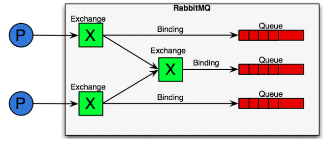

# RabbitMQ介绍

## 简介
RabbitMQ是部署最广泛的开源消息队列中间件。拥有数以万计的用户，从T-Mobile 到Runtastic，RabbitMQ 在全球范围内用于小型初创公司和大型企业。  
RabbitMQ是轻量级的，易于在本地和云端部署。它支持多种消息传递协议。RabbitMQ 可以部署在分布式和联邦（federated ）配置中，以满足大规模、高可用性的要求。  
RabbitMQ基于Erlang开发，天生拥有高并发能力。

## 相关概念
- **生产者 Producer**：产生消息的进程或服务
- **消费者 consumer**：接收消息的进程或服务
- **队列 queue**：RabbitMQ是消息队列中间件，而真正储存消息数据的就是队列，队列可以有很多。
- **交换器  exchange**：类似于网络设备交换机，它可以根据不同的关键字，将消息发送到不同的队列。
- **绑定 binding**：它的作用是将交换器和队列按照路由规则建立关联关系
- **虚拟主机 vhost**：虚拟主机类似于Nginx的虚拟主机，如果没有虚拟主机，当RabbitMQ中的数据越来越庞大，队列越来越多，随之而来的是令人头痛的管理问题，比如队列、交换器命名冲突，它们相互影响等等。虚拟主机能够解决这些问题，而不需要我们部署多个RabbitMQ来负责不同的业务。  
虚拟主机提供了资源的逻辑分组和分隔，每一个虚拟主机本质上是mini版的RabbitMQ服务器，他们有用自己的连接、队列、绑定、交换器，更重要的是有用自己的权限机制，这有点类似服务器和运行在服务器上的虚拟机一样。

## 使用流程
消息在producer中产生，发送到MQ的exchange上，exchange根据配置的路由方式发到相应的Queue上，Queue又将消息发送给consumer，消息从queue到consumer有push和pull两种方式。 消息队列的使用过程大概如下：
1. 客户端连接到消息队列服务器，打开一个channel（客户端连接服务端的通道）。
2. 客户端声明一个exchange，并设置相关属性。
3. 客户端声明一个queue，并设置相关属性。
4. 客户端使用routing key，在exchange和queue之间建立好binding关系。
5. 客户端投递消息到exchange。  

exchange接收到消息后，就根据消息的key和已经设置的binding，进行消息路由，将消息投递到一个或多个队列里。 exchange也有几个类型，完全根据key进行投递的叫做Direct交换机，例如，绑定时设置了routing key为"abc"，那么客户端提交的消息，只有设置了key为"abc"的才会投递到队列。