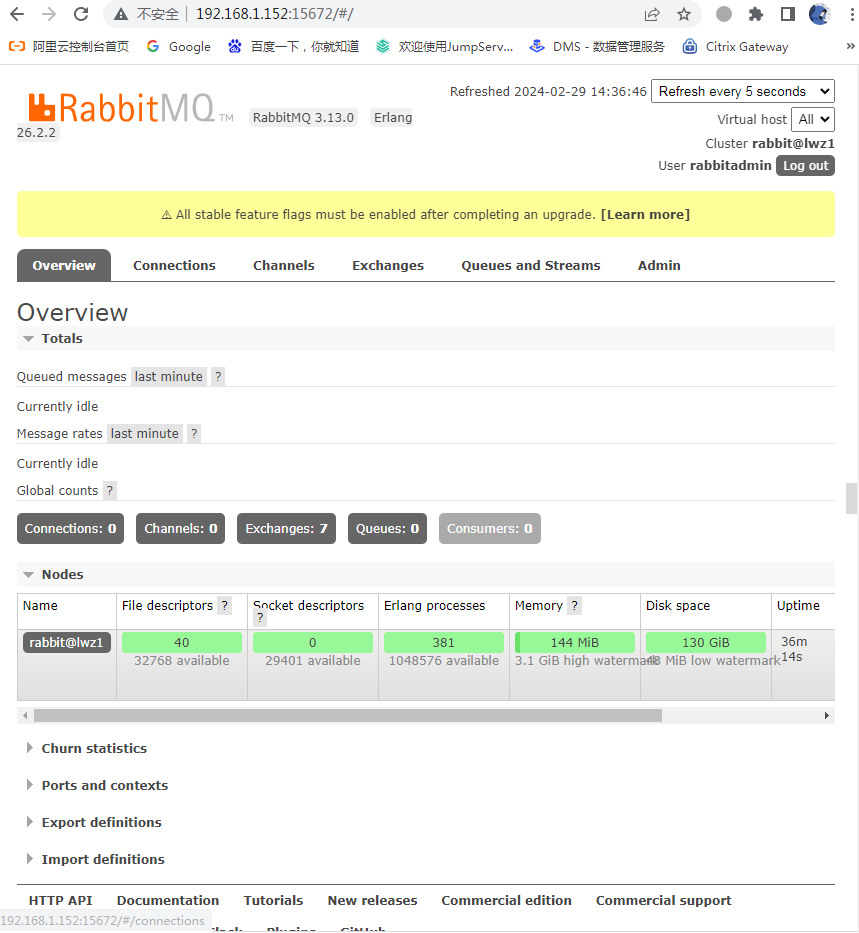

# RabbitMQ单机版安装
[官网安装文档参考](https://www.rabbitmq.com/install-rpm.html)  
(以下安装以Rocky8为例)
```bash
# 安装erlang
curl -s https://packagecloud.io/install/repositories/rabbitmq/erlang/script.rpm.sh | sudo bash
yum install -y erlang

# 安装RabbitMQ
curl -s https://packagecloud.io/install/repositories/rabbitmq/rabbitmq-server/script.rpm.sh | sudo bash
yum install -y rabbitmq-server

# 启动RabbitMQ
systemctl start rabbitmq-server
systemctl enable rabbitmq-server

# 检查服务和端口
ps aux |grep rabbitmq
##进程名为beam.smp，这是erlang的可执行文件
netstat -lnp |grep 5672
##5672是RabbitMQ的默认端口，25672是Erlang的默认端口

# 开启web管理控制台（默认端口15672）
rabbitmq-plugins enable rabbitmq_management

# 设置登陆管理员用户和密码
##添加用户rabbitmqadmin，密码123123
rabbitmqctl add_user rabbitadmin "123123"
##设置用户角色为管理员
rabbitmqctl set_user_tags rabbitadmin administrator
##设置用户权限（所有权限）
rabbitmqctl set_permissions -p / rabbitadmin '.*' '.*' '.*'
##删掉默认用户guest
rabbitmqctl delete_user guest
```
访问web管理界面：`http://服务器IP:15672`


-------------------------------------
# RabbitMQ常用命令

## 虚拟主机管理
```bash
# 列出所有的虚拟主机
rabbitmqctl list_vhosts

# 创建虚拟主机
##如：rabbitmqctl add_vhost  lwz #创建lwz虚拟主机
rabbitmqctl add_vhost <虚拟主机名字>

# 删除虚拟主机
rabbitmqctl delete_vhost <虚拟主机名字>
```

## 用户管理
```bash
# 创建用户
##如：rabbitmqctl add_user lwz 123123 #创建用户lwz，密码123123
rabbitmqctl add_user <用户名> <密码>

# 列出所有用户
rabbitmqctl list_users

# 更改用户密码
rabbitmqctl change_password lwz <新密码>

# 删除用户
rabbitmqctl delete_user <用户名>

# 清除用户密码
rabbitmqctl clear_password <用户名>
```
```bash
# 赋予用户lwz为角色management
rabbitmqctl set_user_tags lwz managemnet

# 同时赋予lwz1为多个角色
rabbitmqctl set_user_tags lwz1 management monitoring
```
**用户角色说明：**
- **超级管理员(administrator)**：可登陆管理控制台(启用management plugin的情况下)，可查看所有的信息，并且可以对用户，策略(policy)进行操作。
- **监控者(monitoring)**：可登陆管理控制台(启用management plugin的情况下)，同时可以查看rabbitmq节点的相关信息(进程数，内存使用情况，磁盘使用情况等)
- **策略制定者(policymaker)**：可登陆管理控制台(启用management plugin的情况下), 同时可以对policy进行管理。但无法查看节点的相关信息。
- **普通管理者(management)**：仅可登陆管理控制台(启用management plugin的情况下)，无法看到节点信息，也无法对策略进行管理。
- **其他**：无法登陆管理控制台，通常就是普通的生产者和消费者。
```bash
# 给用户设置权限命令格式
rabbitmqctl set_permissions -p <vhostname> <username> <conf> <write> <read>
##设置用户lwz1在linyi这个虚拟主机的配置权限为可配置，写权限，读权限
rabbitmqctl set_permissions -p linyi lwz1 ".*" ".*" ".*"

# 列出某用户的权限，即该用户对哪个虚拟主机有权限
rabbitmqctl list_user_permissions <用户名>

# 列出指定虚拟主机下所有用户的权限，即哪些用户对该虚拟主机有权限
rabbitmqctl list_permissions -p <虚拟主机名>

# 清除某用户在指定虚拟机上的授权
rabbitmqctl clear_permissions -p <虚拟主机名> <用户名>
```
> **权限影响说明**：用户权限指的是用户对exchange，queue的操作权限，包括配置权限，读写权限。配置权限会影响到exchange，queue的声明和删除。读写权限影响到从queue里取消息，向exchange发送消息以及queue和exchange的绑定(bind)操作。例如： 将queue绑定到某exchange上，需要具有queue的可写权限，以及exchange的可读权限；向exchange发送消息需要具有exchange的可写权限；从queue里取数据需要具有queue的可读权限。

## 插件管理
```bash
# 获取RabbitMQ插件列表
rabbitmq-plugins list

# 安装RabbitMQ插件
rabbitmq-plugins enable <插件名字>

# 卸载某个插件
rabbitmq-plugins disable <插件名字>
```

## 虚拟主机限制
```bash
# 设置虚拟主机的最大连接数256个
rabbitmqctl set_vhost_limits -p <虚拟主机名> '{"max-connections": 256}'

# 不允许客户端连接虚拟主机
rabbitmqctl set_vhost_limits -p <虚拟主机名> '{"max-connections": 0}'

# 不限制连接数
rabbitmqctl set_vhost_limits -p <虚拟主机名> '{"max-connections": -1}'

# 限制虚拟主机里最大的队列数
rabbitmqctl set_vhost_limits -p <虚拟主机名> '{"max-queues": 1024}'

# 不限制队列数
rabbitmqctl set_vhost_limits -p <虚拟主机名> '{"max-queues": -1}'
```

## 其他
```bash
# 列出所有的交换器
rabbitmqctl list_exchanges

# 列出所有的绑定，即把exchange和queue按照路由规则绑定起来
rabbitmqctl list_bindings

# 分别查看当前系统种存在的Exchange和Exchange上绑定的Queue信息。
rabbitmqctl list_queues

# 查看运行信息
rabbitmqctl status

# 查看集群状态
rabbitmqctl cluster_status
```
