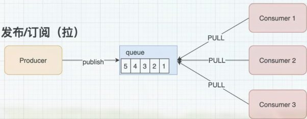

# 消息队列扫盲
案例：  
假设工厂有一道工序，需要给瓶子拧盖子然后贴商标。工人A擅长拧盖子，工人B擅长贴商标，所以此道工序由A和B配合完成。
一开始A拧完盖子后交给B再去贴商标，如果A已经拧完盖子交给B时，B还在贴商标，那么此时A只能等着B，只有B上一次的贴商标动作完成后，A才能把这次的瓶子交给B，然后继续拧下一个。
这种配合需要A和B的工作节奏完全一致才能不会浪费时间。

老板很聪明，他做了一个可以自动旋转的瓶子架，圆盘形状，最多可以同时放10个瓶子，A和B分别坐在圆盘的相对面，他要求让A拧完盖子后将瓶子放到架子上，然后B再从架子上去拿A已经拧完的瓶子。
这样做，就不用担心A比B快的问题了，那反过来如果B比A快，那就需要先让B休息一会，让A先多拧几个瓶子，B再开始工作。

这样一番操作，老板发现效率并没有提升，只是把A或者B休息的时间延长了。此时老板的解决方法是，如果A比B快，则当A将10个瓶盖子都拧完时，先帮着B贴标签（增加B），反之，B帮A拧盖子（增加A）。

## 什么是消息队列
消息队列其实就是一个存放消息的容器（对比上面的案例，消息队列其实就是老板设计的自动旋转瓶子架），我们可以把消息放在消息队列中（拧完盖子后放到架子上），当需要消息时，再从消息队列中取出消息处理（B拿拧完盖子的瓶子去贴商标）。

消息队列是分布式系统中的重要组件，使用消息队列主要是为了通过异步处理提高系统性能和削峰、降低系统的耦合性。

## 为什么要使用消息队列
1. 解耦     
    所谓解耦，就是将一个事务的多个动作进行拆分，就比如上例中，本来一道工序包括了拧瓶盖（A）和贴商标（B），一开始两个动作是耦合在一起的，耦合在一起意味着A慢或者B慢都会影响到整个工序的效率。那么现在将A和B拆分，A可以只关注拧瓶盖，拧完放到架子上（消息队列里），而B只需要从架子上（消息队列里）去拿即可。只要这个架子容量足够大，那么A和B都不会被对方影响。

    再回到消息队列，A和B分别为两个模块，A模块有一个消息生产者，B模块有一个消息消费者。A和B两个模块就是由这个消息队列来完成的解耦合。

2. 异步     
    异步，就是要将本来串联的多个操作拆分开，让它们不再相互等待。比如，上例中，A拧完瓶盖不需要等着B是否空闲，他只管拧瓶盖，然后将已经拧好瓶盖的瓶子放到架子上即可，而B也只管从架子上去拿拧好瓶盖的瓶子来贴商标，A和B就是异步的，异步的实现要借助这个消息队列。

    再举个实际的例子，一个审计系统，需要将手机客户端上的图片、音频、视频上传到服务器上进行审核，这个过程中有一个步骤是需要将视频、音频进行转码的，转码的目的是为了让多媒体文件更小，让浏览器可以直接播放。上传音频和视频的操作非常频繁并且量很大，如果每上传一个文件就直接转码，那么这不仅会消耗服务器资源，还会直接降低了服务器处理速度。所以，我们的做法是，让它异步。上传和转码分开，不串行，甚至可以让某一台服务器单独处理转码的操作。那么这个实现就需要借助消息队列，把转码任务以及转码关键参数放到消息队列里，而转码服务器再去通过从消息队列里取这些信息从而再去转码。当然，之所以设计为异步有一个前提条件，就是这个转码的操作并不是很紧迫，不需要一上传文件就马上转码。

3. 削峰     
    依然是上面的例子，有一天老板接了很多订单，所以他号召一家老小都来工作，但是大家对贴商标不怎么在行，都去拧瓶盖了，所以一上午的时间一下子拧了1w个瓶盖，并放到架子上（假设老板搞了一个非常大的架子）如果按正常工序，肯定需要很多贴比商标的人，才能快速消化掉这1w个拧好瓶盖的瓶子，但老板没有那么多员工。最终，只能是让贴商标的工人多加会班慢慢消化这些瓶子。

    现实生产环境中，这个非常大的架子就是消息队列服务，它可以应对突发情况，可以将突然陡增的业务需求先暂时放到消息队列里，然后再慢慢地消费（处理），这就是削峰。12306的抢票就是这种场景。

## 引入消息队列的弊端
1. 增加了不稳定因素，毕竟增加了一个服务，意味着出现问题的可能性增加了，可用性降低了，而且也增加了整个系统架构的复杂性和可维护性。
2. 增加了额外的容错成本     
    1. 消息存在丢失的情况，比如在内存里的消息还没有来得及刷到磁盘里，此时服务宕机了;
    2. 消费者消费一条消息后需要给到消息队列一个确认，消息队列这边才会将那条消息去除，消费者拿走了消息，也发了确认，但是真正处理该消息时发生了逻辑异常，没有真正成功处理该消息，那么这条消息就相当于丢失了； 
    3. 如果消费者拿走了队列数据，但是还没有来得及发确认就被重启了，那么此时消息队列里还是有那个消息的，所以就造成了消息的重复；
    4. 还有一种情况，本来消息应该是有顺序性的，就是说先生产的消息，先消费，但如果因为某个消费者效率慢，导致排在它后面的消息先消费了，就会有顺序错乱的问题。
3. 不一致问题，如果是异步的场景，那么A和B两个模块并不存在相互校验的过程，就比如上面那个转码的案例，虽然上传成功了视频，但该视频并不一定就被成功转码。

## 消息队列通信模式
- 点对点模式：  
点对点模式通常是基于拉取或者轮询的消息传送模型，这个模型的特点是发送到队列的消息被一个且只有一个消费者进行处理。生产者将消息放入消息队列后，由消费者主动的去拉取消息进行消费。点对点模型的的优点是消费者拉取消息的频率可以由自己控制。但是消息队列是否有消息需要消费，在消费者端无法感知，所以在消费者端需要额外的线程去监控。

- 发布/订阅模式：  
发布订阅模式是一个基于消息推送的消息传送模型，该模型可以有多种不同的订阅者。生产者将消息放入消息队列后，队列会将消息推送给订阅过该类消息的消费者（类似微信公众号）。由于是消费者被动接收推送，所以无需感知消息队列是否有待消费的消息！但是consumer1、consumer2、consumer3由于机器性能不一样，所以处理消息的能力也会不一样，但消息队列却无法感知消费者消费的速度！所以推送的速度成了发布订阅模模式的一个问题！假设三个消费者处理速度分别是8M/s、5M/s、2M/s，如果队列推送的速度为5M/s，则consumer3无法承受！如果队列推送的速度为2M/s，则consumer1、consumer2会出现资源的极大浪费！

