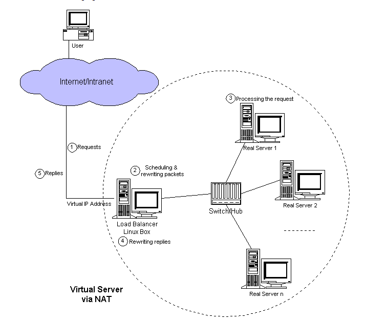
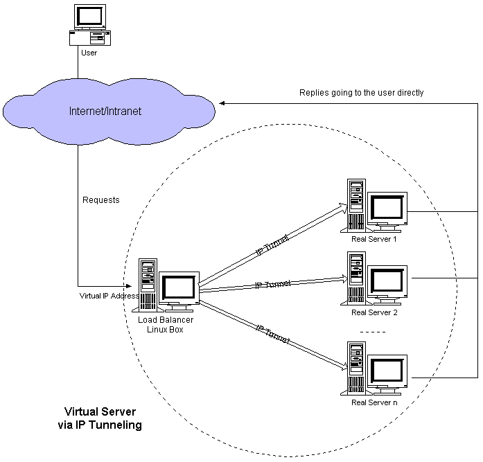
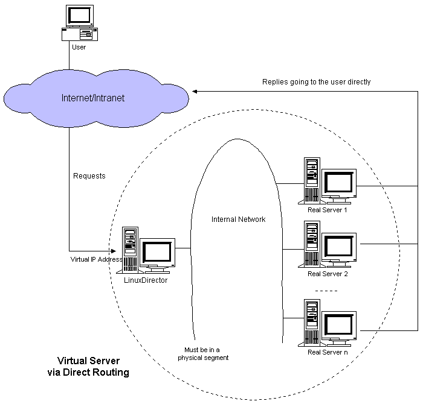

# LVS 负载均衡

## LVS介绍
[官网](http://www.linuxvirtualserver.org/)  

基于4层的负载均衡技术，它是Linux内核的一个模块。

### 四种模式：    
#### NAT模式 
客户端访问LVS时，LVS通过重写请求报文的目标地址，且根据预设的调度算法，将请求分派给后端真实服务器，真实服务器接收到请求处理后，发出响应报文也需要通过LVS返回，返回时需要修改报文的源地址，然后返回给客户，完成整个负载调度过程

DNAT：目标地址转换，改变的是目标地址  
SNAT：源地址转换，改变的是源地址  

NAT 模式就是使用 SNAT 和 DNAT 技术完成报的转发，NAT 方式可支持任何的操作系统，以及私有网络，并且只需一个 Internet IP 地址，非常节省成本，但是整个系统的性能受到限制。因为执行 NAT 每次需要重写数据包，有一定的延迟，另外，大部分应用有 80%的数据是从服务器流向客户机，也就是用户的请求非常短，而服务器的回应非常大，对LVS形成很大压力，容易成为瓶颈



#### IP TUN模式
IP TUN（IP Tunneling 即 IP隧道）当 LVS 分配请求到不同的 real server，real server 处理请求后直接回应给用户，这样 LVS 仅处理客户机与服务器的一半连接。IP TUN 技术极大地提高了 LVS 的调度处理能力，同时也极大地提高了系统能容纳的最大节点数，可以超过 100 个节点。real server 可以在任何 LAN 或 WAN 上运行，这意味着允许地理上的分布，这在灾难恢复中有重要意义。但此模式要求所有服务器必须支持 IP 隧道协议，因此只能在 linux 下使用，在 windows 无法使用

此模式下，关键步骤：LB会重新封装从客户端发来的包，封装后的包目标IP为其中一个Real Server。



#### DR模式
DR（即 Direct Routing 直接路由）与 IP TUN 类似，负载均衡器仅处理一半的连接，避免了新的性能瓶颈，同样增加了系统的可伸缩性，DR 与 IP TUN 相比，没有 IP 封装的开销，但由于采用物理层（修改 MAC地址）技术，所有服务器都必须在同一个局域网  

DR 和 IP TUN 的区别：  
DR 与 IP TUN 相比，没有 IP 封装的开销，但由于采用数据链路层（修改 MAC地址）技术，所有服务器都必须在一个物理网段。

此模式下，关键步骤：LB会修改从客户端发过来的包里的MAC地址，将MAC地址修改为其中某一个Real Server的mac地址。



#### Full NAT模式
这种模式为NAT模式的升级版。  
传统的NAT模式，LB和RS必须在同一个VLAN下，否则LB无法作为RS的网关。

这引发的两个问题是：
1. 同一个 VLAN的限制导致运维不方便，跨VLAN的RS无法接入。
2. 当RS横向扩容时，总有一天其上的单点LB会成为瓶颈。

Full-NAT解决的是LB和RS跨VLAN的问题，而跨VLAN问题解决后，LB和RS不再存在VLAN上的从属关系，可以做到多个LB对应多个RS，解决水平扩容的问题。  

Full-NAT相比NAT的主要改进是，在SNAT/DNAT的基础上，加上另一种转换，转换过程如下：  
在包从LB转到 RS 的过程中，源地址从客户端IP被替换成了LVS 的内网IP。内网IP之间可以通过多个交换机跨VLAN通信。  
当RS处理完接受到的包，返回时，会将这个包返回给LB的内网IP，这一步也不受限于 VLAN。  
LB收到包后，在NAT模式修改源地址的基础上，再把RS发来的包中的目标地址从LB内网IP改为客户端的 IP。  
Full-NAT主要的思想是把网关和其下机器的通信，改为了普通的网络通信，从而解决了跨VLAN 的问题。采用这种方式，LB和RS的部署在VLAN上将不再有任何限制，大大提高了运维部署的便利性。

### 十种调度算法
LVS的调度算法分为静态与动态两类。

#### 静态调度算法（4种）
只根据算法进行调度 而不考虑后端服务器的实际连接情况和负载情况

- RR（轮叫调度，Round Robin）  
调度器通过”轮叫”调度算法将外部请求按顺序轮流分配到集群中的真实服务器上，它均等地对待每一台服务器，而不管服务器上实际的连接数和系统负载｡

+ WRR（权重轮询调度，Weighted Round Robin）  
调度器通过“加权轮叫”调度算法根据真实服务器的不同处理能力来调度访问请求。这样可以保证处理能力强的服务器处理更多的访问流量。调度器可以自动问询真实服务器的负载情况,并动态地调整其权值。

- DH（目标地址散列调度，Destination Hashing）  
根据请求的目标IP地址，作为散列键(HashKey)从静态分配的散列表找出对应的服务器，若该服务器是可用的且未超载，将请求发送到该服务器，否则返回空。

+ SH（源地址散列调度，Source Hashing）  
根据请求的源IP地址，作为散列键(HashKey)从静态分配的散列表找出对应的服务器，若该服务器是可用的且未超载，将请求发送到该服务器，否则返回空｡

#### 动态算法（6种）
前端的调度器会根据后端真实服务器的实际连接情况来分配请求
- LC（最小连接调度，Least Connections）  
动态地将网络请求调度到已建立的链接数最少的服务器上。如果集群系统的真实服务器具有相近的系统性能，采用”最小连接”调度算法可以较好地均衡负载。

+ WLC（加权最小连接调度，Weighted Least Connections）（默认采用的就是这种）  
在集群系统中的服务器性能差异较大的情况下，调度器采用“加权最少链接”调度算法优化负载均衡性能，具有较高权值的服务器将承受较大比例的活动连接负载｡调度器可以自动问询真实服务器的负载情况,并动态地调整其权值。

- SED（最短期望延迟调度，Shortest Expected Delay）  
在WLC基础上改进，Overhead = （ACTIVE+1）*256/加权，不再考虑非活动状态，把当前处于活动状态的数目+1来实现，数目最小的，接受下次请求，+1的目的是为了考虑加权的时候，非活动连接过多缺陷：当权限过大的时候，会导致空闲服务器一直处于无连接状态。

+ NQ（永不排队/最少队列调度，Never Queue Scheduling）  
无需队列。如果有台 realserver的连接数＝0就直接分配过去，不需要再进行sed运算，保证不会有一个主机很空间。在SED基础上无论+几，第二次一定给下一个，保证不会有一个主机不会很空闲着，不考虑非活动连接，才用NQ，SED要考虑活动状态连接，对于DNS的UDP不需要考虑非活动连接，而httpd的处于保持状态的服务就需要考虑非活动连接给服务器的压力。

- LBLC（基于局部性的最少链接调度，Locality-Based Least Connections Scheduling）  
基于局部性的最少链接调度算法是针对目标IP地址的负载均衡，目前主要用于Cache集群系统｡该算法根据请求的目标IP地址找出该目标IP地址最近使用的服务器，若该服务器是可用的且没有超载，将请求发送到该服务器;若服务器不存在，或者该服务器超载且有服务器处于一半的工作负载，则用“最少链接”的原则选出一个可用的服务器，将请求发送到该服务器｡

+ LBLCR（带复制的基于局部性最少链接调度，Locality-Based Least Connections With Replication Scheduling）  
带复制的基于局部性最少链接”调度算法也是针对目标IP地址的负载均衡，目前主要用于Cache集群系统｡它与LBLC算法的不同之处是它要维护从一个目标IP地址到一组服务器的映射，而LBLC算法维护从一个目标IP地址到一台服务器的映射｡该算法根据请求的目标IP地址找出该目标IP地址对应的服务器组，按”最小连接”原则从服务器组中选出一台服务器，若服务器没有超载，将请求发送到该服务器；若服务器超载，则按“最小连接”原则从这个集群中选出一台服务器，将该服务器加入到服务器组中，将请求发送到该服务器｡同时，当该服务器组有一段时间没有被修改，将最忙的服务器从服务器组中删除，以降低复制的程度。

## keepalived配置LVS

### NAT模式

| 主机名 | ip（NAT） | ip（LAN区段） | 角色 |
| :----: | :----: | :----: | :----: |
| lwz1 | 192.168.1.152 | 10.16.200.1 | keepalived |
| lwz2 | 192.168.1.156 | 10.16.200.2 | nginx1 |
| lwz3 | 192.168.1.136 | 10.16.227.168 | nginx2 |
| | | 192.168.1.200 | vip |

#### 安装配置keepalived
**lwz1执行**
```bash
yum install -y keepalived
```
```bash
# 配置keepalived
vi /etc/keepalived/keepalived.conf 

global_defs {
   router_id LVS_DEVEL
}

vrrp_instance VI_1 {
    state MASTER
    interface eth1
    virtual_router_id 51
    priority 100
    advert_int 1
    authentication {
        auth_type PASS
        auth_pass 123123
    }
    virtual_ipaddress {
        10.16.200.200
    }
}

virtual_server 10.16.200.200 80 {
    delay_loop 6
    ## 算法为wrr
    lb_algo wrr
    ## LVS模式为NAT模式
    lb_kind NAT
    #persistence_timeout 50
    protocol TCP

    real_server 10.16.200.2 80 {
        weight 3        # 请求次数
        HTTP_GET {
            url {
              path /
            }
            connect_timeout 3
            retry 3
            delay_before_retry 3
        }
    }
    real_server 10.16.227.168 80 {
        weight 1
        HTTP_GET {
            url {
              path /
            }
            connect_timeout 3
            retry 3
            delay_before_retry 3
        }
    }
}
```
```bash
# 打开路由转发
echo  "net.ipv4.ip_forward = 1"  >>  /etc/sysctl.conf
sysctl -p

# 启动keepalived
systemctl start keepalived
```
**lwz2和lwz3执行**   
[安装nginx](../Nginx/%E5%AE%89%E8%A3%85.md)

```bash
# 配置默认路由（route由net-tools包提供）
route add default gw 10.16.200.1
```
**lwz1上测试**请求vip
```bash
curl 10.16.200.200
```

### DR模式

| 主机名 | IP地址 | 角色 |
|:---:|:---:|:---:|
| lwz1 | 192.168.1.152 | keepalived |
| lwz2 | 192.168.1.156 | nginx1 |
| lwz3 | 192.168.1.136 | nginx2 |
| | 10.16.200.200 | vip |

> 注意：生成环境中，keepalived需要至少两台，做高可用，避免单点故障。

如果做过NAT模式测试，需要先还原配置：
```bash
# 关闭keepalived
systemctl stop keepalived

# 停掉第二块网卡
ifconfig eth1 down

# 关闭路由转发
sed -i 's/net.ipv4.ip_forward = 1/net.ipv4.ip_forward = 0/' /etc/sysctl.conf
sysctl -p
```

#### 安装配置keepalived
**lwz1执行**
```bash
yum install -y keepalived
```
```bash
# 配置keepalived
vi /etc/keepalived/keepalived.conf 

global_defs {
   router_id LVS_DEVEL
}

vrrp_instance VI_1 {
    state MASTER
    interface eth0
    virtual_router_id 51
    priority 100
    advert_int 1
    authentication {
        auth_type PASS
        auth_pass 123123
    }
    virtual_ipaddress {
        192.168.1.200
    }
}

virtual_server 192.168.1.200 80 {
    delay_loop 6
    ## 算法为wrr
    lb_algo wrr
    ## LVS模式为DR模式
    lb_kind DR
    #persistence_timeout 50
    protocol TCP

    real_server 192.168.1.156 80 {
        weight 3        # 请求次数
        HTTP_GET {
            url {
              path /
            }
            connect_timeout 3
            retry 3
            delay_before_retry 3
        }
    }
    real_server 192.168.1.136 80 {
        weight 1
        HTTP_GET {
            url {
              path /
            }
            connect_timeout 3
            retry 3
            delay_before_retry 3
        }
    }
}
```
```bash
# 启动keepalived
systemctl start keepalived
```
**lwz2和lwz3执行**  
[安装nginx](../Nginx/%E5%AE%89%E8%A3%85.md)  
```bash
# 编辑脚本
vi /usr/local/sbin/lvs_rs.sh 

#/bin/bash
vip=192.168.1.200
#把vip绑定在lo上，是为了实现rs直接把结果返回给客户端
ifconfig lo:0 $vip broadcast $vip netmask 255.255.255.255 up
route add -host $vip lo:0
#以下操作为更改arp内核参数，目的是为了让rs顺利发送mac地址给客户端
echo "1" >/proc/sys/net/ipv4/conf/lo/arp_ignore
echo "2" >/proc/sys/net/ipv4/conf/lo/arp_announce
echo "1" >/proc/sys/net/ipv4/conf/all/arp_ignore
echo "2" >/proc/sys/net/ipv4/conf/all/arp_announce


# 执行脚本
sh  /usr/local/sbin/lvs_rs.sh
```

测试：浏览器访问vip或者再开启一台虚拟机访问 
```bash
[root@centos03 ~]# curl 192.168.1.200
lwz2
[root@centos03 ~]# curl 192.168.1.200
lwz2
[root@centos03 ~]# curl 192.168.1.200
lwz2
[root@centos03 ~]# curl 192.168.1.200
lwz3
```
