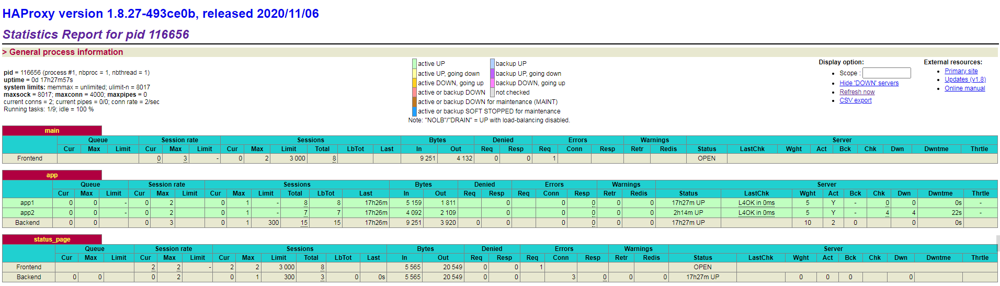

# Haproxy 负载均衡

## Haproxy介绍
[官网](https://www.haproxy.org/)

Haproxy是一款开源、高效、可靠的反向代理软件，可以代理TCP、HTTP，它主要功能用来提供负载均衡。它特别适用于高并发的场景。  
和Nginx比起来，优势在于它支持更多负载均衡算法。

### 核心功能
- 负载均衡
- 健康检查
- 会话保持
- ssl
- http重定向
- 监控与统计

### 关键特性
- 性能强  
采用单线程、事件驱动、非阻塞模型，减少上下文切换的消耗，能在1ms内处理数百个请求。并且每个会话只占用数KB的内存。单个HAProxy进程的处理能力可突破10万请求/秒

+ 稳定  
HAProxy的大部分工作都是在操作系统内核完成的，所以只要Linux操作系统稳定，它就很稳定。按照作者的说法，HAProxy在13年间从未出现过一个会导致其崩溃的BUG，HAProxy一旦成功启动，除非操作系统或硬件故障，否则就不会崩溃。

## 安装Haproxy
直接yum/dnf安装即可，版本偏低，但是稳定。如果想要最新版本，需要到官方下载源码，编译安装。
```bash
yum install -y haproxy
```

## 配置Haproxy
Haproxy的配置文件是`/etc/haproxy/haproxy.cfg`
```bash
cp /etc/haproxy/haproxy.cfg /etc/haproxy/haproxy.cfg.default
```

### http负载均衡
```bash
vi /etc/haproxy/haproxy.cfg

#---------------------------------------------------------------------
# Global settings
#---------------------------------------------------------------------
global

    log         127.0.0.1 local2    # 配置日志输出格式

    chroot      /var/lib/haproxy    # 工作目录
    pidfile     /var/run/haproxy.pid
    maxconn     4000                # 最大连接数
    user        haproxy
    group       haproxy
    daemon                          # 以后台形式运行

# 默认配置
defaults
    mode                    http
    log                     global
    option                  httplog
    option                  dontlognull
    option http-server-close
    option forwardfor       except 127.0.0.0/8
    option                  redispatch
    retries                 3
    timeout http-request    10s
    timeout queue           1m
    timeout connect         10s
    timeout client          1m
    timeout server          1m
    timeout http-keep-alive 10s
    timeout check           10s
    maxconn                 3000

frontend main
    bind *:80
    default_backend             app     # 默认后端，app为自定义名称

backend app
    balance     roundrobin  ##负载均衡算法 rr
    server  app1 192.168.1.156:80 check  cookie 1 weight 5 check inter 2000 rise 1 fall 1
    server  app2 192.168.1.136:80 check  cookie 1 weight 5 check inter 2000 rise 1 fall 1
    ##chech：检测后端服务器是否存活，如果后端服务器挂了，则从负载均衡池中剔除
    ##cookie：为每个请求生成一个唯一的cookie，并将该cookie发送给后端服务器，后端服务器根据cookie来识别是哪个客户端
    ##weight：权重，默认为1，权重越大，负载的权重越大
    ##check inter：检测间隔时间，单位为毫秒，默认为2000
    ##rise：检测成功多少次后，将后端服务器标记为健康状态，默认为2
    ##fall：检测失败多少次后，将后端服务器标记为不健康状态，默认为2
```
```bash
# 配置状态页，可以追加到上面配置文件中
listen status_page  ##这一行是顶格的
    bind 192.168.1.152:8888   ##可以监听一个额外的端口，这样更加安全
    stats enable
    stats uri /haproxy-status
    stats auth    admin:123123
```
> 配置完后可通过浏览器：`http://192.168.1.152:8888/haproxy-status`可视化查看  
  
```bash
# 启动haproxy
systemctl start haproxy

# 查看日志
journalctl -u haproxy
```
### haproxy实现动静分离
```bash
vi /etc/haproxy/haproxy.cfg

#---------------------------------------------------------------------
# Global settings
#---------------------------------------------------------------------
global

    log         127.0.0.1 local2    # 配置日志输出格式

    chroot      /var/lib/haproxy    # 工作目录
    pidfile     /var/run/haproxy.pid
    maxconn     4000                # 最大连接数
    user        haproxy
    group       haproxy
    daemon                          # 以后台形式运行

# 默认配置
defaults
    mode                    http
    log                     global
    option                  httplog
    option                  dontlognull
    option http-server-close
    option forwardfor       except 127.0.0.0/8
    option                  redispatch
    retries                 3
    timeout http-request    10s
    timeout queue           1m
    timeout connect         10s
    timeout client          1m
    timeout server          1m
    timeout http-keep-alive 10s
    timeout check           10s
    maxconn                 3000

frontend main
    bind *:80
    ##判断url是否以/static, /images, /javascript, /stylesheets开头
    acl url_static       path_beg       -i /static /images /javascript /stylesheets
    ##判断url是否以.jpg .gif .png .css .js结尾
    acl url_static       path_end       -i .jpg .gif .png .css .js
    ##判断域名是否包含img, att, video
    acl host_static hdr_beg(host) -i img. att. video.

    ##如果url_static或者host_static为true则走static
    use_backend static          if url_static or host_static

    default_backend             app     # 默认，app为自定义名称

backend static
    balance     roundrobin
    server      static 127.0.0.1:8080 check

backend app
    balance     roundrobin  ##负载均衡算法 rr
    server  app1 192.168.1.156:80 check  cookie 1 weight 5 check inter 2000 rise 1 fall 1
    server  app2 192.168.1.136:80 check  cookie 1 weight 5 check inter 2000 rise 1 fall 1
```
也可以通过这种方式区分其他请求，如pc端和移动端，原理都是一样的，通过判断来区分。
### haproxy实现tcp负载均衡
```bash
vi /etc/haproxy/haproxy.cfg

#---------------------------------------------------------------------
# Global settings
#---------------------------------------------------------------------
global

    log         127.0.0.1 local2    # 配置日志输出格式

    chroot      /var/lib/haproxy    # 工作目录
    pidfile     /var/run/haproxy.pid
    maxconn     4000                # 最大连接数
    user        haproxy
    group       haproxy
    daemon                          # 以后台形式运行

# 默认配置
defaults
    mode                    tcp     ##tcp模式
    log                     global
    option                  httplog
    option                  dontlognull
    option http-server-close
    option forwardfor       except 127.0.0.0/8
    option                  redispatch
    retries                 3
    timeout http-request    10s
    timeout queue           1m
    timeout connect         10s
    timeout client          1m
    timeout server          1m
    timeout http-keep-alive 10s
    timeout check           10s
    maxconn                 3000

frontend main
    bind *:2222              ##监听2222端口
    default_backend             app     # 默认，app为自定义名称

backend app
    balance     roundrobin  ##负载均衡算法 rr
    server  app1 192.168.1.156:22 check  cookie 1 weight 5 check inter 2000 rise 1 fall 1
    server  app2 192.168.1.136:22 check  cookie 1 weight 5 check inter 2000 rise 1 fall 1
```
