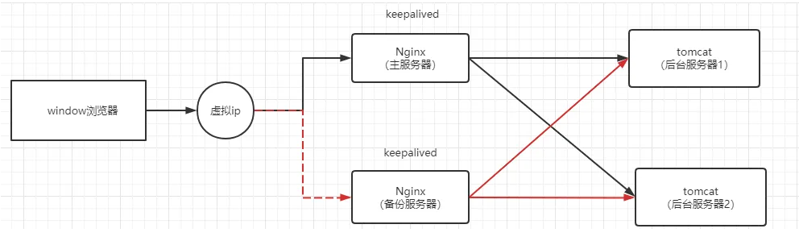
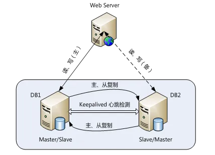
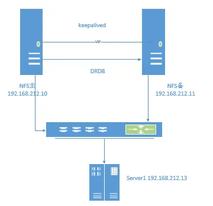

# keepalived 高可用集群

## keepalived介绍
keepalived通过VRRP（Virtual Router Redundancy Protocl）来实现高可用。

在这个协议里会将多台功能相同的路由器组成一个小组，这个小组里会有1个master角色和N（N>=1）个backup角色。

master会通过组播的形式向各个backup发送VRRP协议的数据包，当backup收不到master发来的VRRP数据包时，就会认为master宕机了。此时就需要根据各个backup的优先级来决定谁成为新的mater。

Keepalived要有三个模块，分别是core、check和vrrp。其中core模块为keepalived的核心，负责主进程的启动、维护以及全局配置文件的加载和解析，check模块负责健康检查，vrrp模块是来实现VRRP协议的

### keepalived高可用场景举例
keepalived + nginx  
  

keepalived + mysql
  

keepalived + NFS
  

## keepalived + Nginx搭建

| 节点 | IP | 角色 |
| :----: | :----: | :----: |
| lwz1 | 192.168.1.152 | keepalived1、nginx1 |
| lwz2 | 192.168.1.156 | keepalived2、nginx2 |
|  | 10.16.200.200 | vip |

### 安装nginx
**所有节点安装**  

[参考nginx安装](../Nginx/%E5%AE%89%E8%A3%85.md)

### 安装keepalived
**所有节点安装**
```bash
yum install -y keepalived
```

### 配置keepalived
**lwz1执行**
```bash
# 备份源配置文件
mv  /etc/keepalived/keepalived.conf  /etc/keepalived/keepalived.conf.default


# 定义新配置文件（lwz1）
vi /etc/keepalived/keepalived.conf

! Configuration File for keepalived
global_defs {
    router_id linyi
    script_user root    ## 监控脚本执行用户
    enable_script_security
}
vrrp_script chk_ng {
    ## 定义监测服务是否正常的监控脚本
    script "/etc/keepalived/checkng.sh"
    ## 每隔10秒执行一次，超过5秒判定为超时
    interval 10
    fall 5
}
vrrp_instance VI_NG {
    ## 这里定义成BACKUP，目的是为了配置成非抢占模式，即一旦切换到从，即使主状态恢复，也不自动切回来。（建议配置此模式）
    state BACKUP
    nopreempt
    ## 定义VRRP协议通信网卡
    interface eth1
    virtual_router_id 76
    ## 权重高
    priority 100
    advert_int 2
    authentication {
        auth_type PASS
        ##8位字符串
        auth_pass dWc4Tddl      ## 密码
    }
    virtual_ipaddress {
        ## 定义vip以及绑定vip的网卡
        10.16.200.200 dev eth1 label eth1:1
    }
    unicast_src_ip 192.168.1.152    ## 本机ip
    unicast_peer {
        192.168.1.156           ## 对方ip
    }
    track_script {
        chk_ng
    }
}
```

**lwz2执行**
```bash
# 备份源配置文件
mv  /etc/keepalived/keepalived.conf  /etc/keepalived/keepalived.conf.default


# 定义新配置文件（lwz2）
vi /etc/keepalived/keepalived.conf

! Configuration File for keepalived
global_defs {
    router_id linyi
    script_user root
    enable_script_security
}
vrrp_script chk_ng {
    ## 定义监测nginx是否正常的监控脚本
    script "/etc/keepalived/checkng.sh"
    interval 10
    fall 5
}
vrrp_instance VI_NG {
    ##这里定义成BACKUP，目的是为了配置成非抢占模式，即一旦切换到从，当主状态恢复时，不自动切回来
    state BACKUP
    nopreempt
    ##定义VRRP协议通信网卡
    interface eth1
    virtual_router_id 76
    ##权重低
    priority 90         ## 注意修改
    advert_int 2
    authentication {
        auth_type PASS
        ##8位字符串
        auth_pass dWc4Tddl
    }
    virtual_ipaddress {
        ## 这里的eth1为内网ip
        10.16.200.200 dev eth1 label eth1:1
    }
    unicast_src_ip 192.168.1.156    ## 注意修改
    unicast_peer {
        192.168.1.152       ## 注意修改
    }
    track_script {
        chk_ng
    }
}
```

### 定义监控脚本
**所有节点执行**
```bash
vi  /etc/keepalived/checkng.sh

#!/bin/bash
ng_pid_num=$(ps -ef | grep nginx | grep -v grep | wc -l)
if [[ ${ng_pid_num} -ne 0 ]];then
    exit 0
else
    exit 1
fi
```
```bash
# 保存后，给执行权限
chmod a+x  /etc/keepalived/checkng.sh
```

### 启动并检测
```bash
# 所有节点逐行执行启动
systemctl start nginx
keepalived -t
systemctl start keepalived

# 检测（任意节点）
##查看进程
ps aux|grep keepalived

##查看vip
[root@lwz1 ~]# ip a
1: lo: <LOOPBACK,UP,LOWER_UP> mtu 65536 qdisc noqueue state UNKNOWN group default qlen 1000
    link/loopback 00:00:00:00:00:00 brd 00:00:00:00:00:00
    inet 127.0.0.1/8 scope host lo
       valid_lft forever preferred_lft forever
    inet6 ::1/128 scope host
       valid_lft forever preferred_lft forever
2: eth0: <BROADCAST,MULTICAST,UP,LOWER_UP> mtu 1500 qdisc mq state UP group default qlen 1000
    link/ether 82:11:16:f9:c4:71 brd ff:ff:ff:ff:ff:ff
    inet 192.168.1.152/24 brd 192.168.1.255 scope global noprefixroute eth0
       valid_lft forever preferred_lft forever
    inet6 fe80::4000:84f6:476:ff0d/64 scope link noprefixroute
       valid_lft forever preferred_lft forever
3: eth1: <BROADCAST,MULTICAST,UP,LOWER_UP> mtu 1500 qdisc mq state UP group default qlen 1000
    link/ether fe:0d:08:f7:58:4f brd ff:ff:ff:ff:ff:ff
    inet 10.16.200.1/16 brd 10.16.255.255 scope global dynamic noprefixroute eth1
       valid_lft 1862sec preferred_lft 1862sec
    inet 10.16.200.200/32 scope global eth1:1
       valid_lft forever preferred_lft forever
    inet6 fe80::4369:28ae:d9f4:1f69/64 scope link noprefixroute
       valid_lft forever preferred_lft forever

##查看日志
journalctl -u keepalived
```

### 验证
```bash
# lwz1上停止nginx
systemctl stop nginx

# lwz2上查看日志
journalctl -f -u keepalived.service
#等一会儿，vip会自动配置到lwz2上
```
> 另外，还可以将两台机器的nginx主页设置不一样，当vip切换的时候，可以通过直接浏览器访问vip来观察变化。

## 遇到keepalived问题，排查思路
```bash
# 看日志
journalctl -u keepalived

# 看进程
ps aux |grep keepalived

# 看脚本执行结果
sh -x /etc/keepalived/checkng.sh
```
