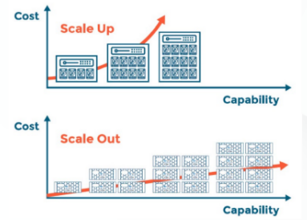

# 集群介绍
1. 什么是集群  
多台机器组成一个整体，共同提供服务支撑。

2. 集群分类  
    - 高可用集群：  
两台或多台机器，相互之间是备份关系，同一时间一台机器提供服务，另外一台备着。当提供服务的机器故障，切换到另外一台。高可用集群中，有一个角色用来实现业务存活状态监测和切换。  
高可用集群案例：redis哨兵、mysql组复制、MHA  
开源高可用集群软件：keepalived、heartbeat  
    - 负载均衡集群：  
至少两台机器，所有机器同时提供服务，每一台机器都可以处理业务请求。在负载均衡集群中有一个负载均衡角色，它负责将请求均衡地分发到每一台服务器上。  
开源负载均衡软件：Nginx、LVS、haproxy  
    - 分布式集群属于高可用+负载均衡集群综合体，案例：redis cluster、mongodb分片集群

3. 为什么要做集群
    - 解决单点故障

    - 单节点不足以支撑业务体量
        - 垂直扩容： 用更好的服务器，提高 CPU 处理核数、内存数、带宽等
        - 水平扩容： 将任务分配到多台计算机上  

  
对于不持续的业务增长，并且增长量不是很大，可以使用垂直扩容，因为单纯地增加服务器硬件更加快捷高效，甚至成本也不高。  
但反之，就需要水平扩容，即增加服务器数量。  
