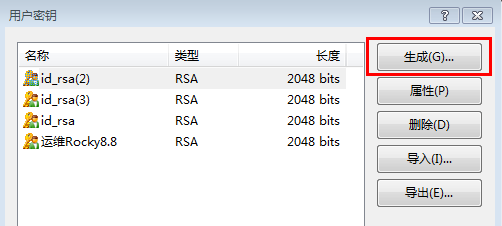
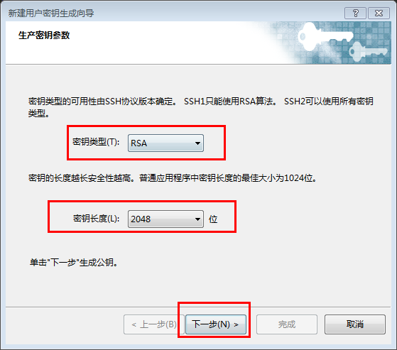
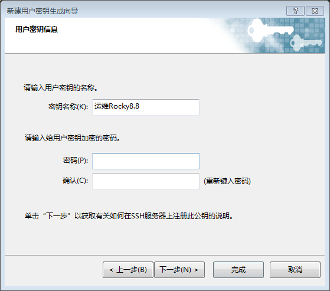
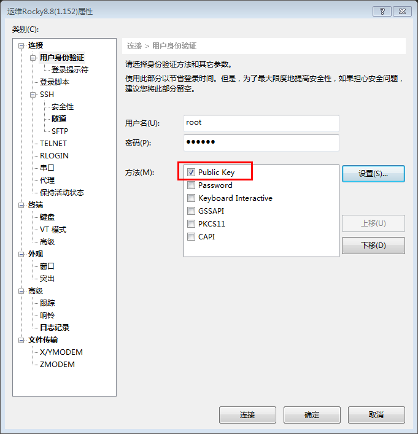

# 远程密钥登陆

1. 使用Xshell远程连接工具，选择`工具`>`用户密钥管理者`进入如下图界面，点击生成


2. 选择`RSA`类型，下一步


3. 取名，密码设不设置都可以，下一步后，完成



4. 下图界面可以在第一步中选择`属性`进入，红框中的内容等下需要写在服务器文件内


5. 进入服务器执行如下命令创建密钥文件：
```
mkdir .ssh              # 创建目录

vi .ssh/authorized_keys     # 进入文件后，将第4步红框内容复制进来，保存退出
```

6. 进入会话属性，在如下图处勾选`Public Key`后连接，选择对应的密钥文件即可。


