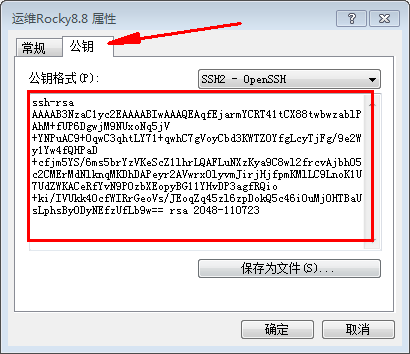

# 远程密钥登陆

## 远程工具免密
1. 使用Xshell远程连接工具，选择`工具`>`用户密钥管理者`进入如下图界面，点击生成


2. 选择`RSA`类型，下一步


3. 取名，密码设不设置都可以，下一步后，完成


4. 下图界面可以在第一步中选择`属性`进入，红框中的内容等下需要写在服务器文件内



5. 进入服务器执行如下命令创建密钥文件：
```
mkdir .ssh              # 创建目录

vi .ssh/authorized_keys     # 进入文件后，将第4步红框内容复制进来，保存退出
```

6. 进入会话属性，在如下图处勾选`Public Key`后连接，选择对应的密钥文件即可。


## 免密登陆Ubuntu22.04以上版本
**错误原因：**  
Ubuntu 22.04及以上版本无法使用RSA密钥登录，在SSH协议中，ssh-rsa签名算法是SHA1的哈希算法和RSA公钥算法的结合使用。由于目前SHA1的哈希算法容易受到攻击，OpenSSH从8.7以后版本开始默认不支持ssh-rsa签名方案。在最新版本的操作系统中，OpenSSH默认不再支持ssh-rsa（rsa/SHA1）签名算法，如果指定使用ssh-rsa（rsa/SHA1）签名算法将会登录失败。

> 默认不支持ssh-rsa签名方案并不意味着停止使用RSA密钥，密钥可以通过多种算法进行签名，RSA密钥可以使用rsa-sha2-256（rsa/SHA256）、rsa-sha2-512（rsa/SHA512）等多种签名算法来进行签名，只有ssh-rsa（rsa/SHA1）签名算法被默认禁用。

**问题定位：**
```bash
# 查看OpenSSH版本
root@ubuntu1:~/.ssh# ssh -V
OpenSSH_9.0p1 Ubuntu-1ubuntu8.5, OpenSSL 3.0.8 7 Feb 2023

# 查看 /var/log/auth.log 文件，发现有如下错误信息
2024-05-27T02:52:30.295181+00:00 ubuntu1 sshd[3385]: userauth_pubkey: signature algorithm ssh-rsa not in PubkeyAcceptedAlgorithms [preauth]
## 通过错误信息来看，填入authorized_keys文件的SSH公钥类型是 ssh-rsa 类型，属于不支持的公钥类型。应该是SSH版本高版本中增加该限制。

# 查看支持的公钥类型
root@ubuntu1:~/.ssh# sudo sshd -T | egrep "pubkey"
pubkeyauthentication yes
pubkeyacceptedalgorithms ssh-ed25519-cert-v01@openssh.com,ecdsa-sha2-nistp256-cert-v01@openssh.com,ecdsa-sha2-nistp384-cert-v01@openssh.com,ecdsa-sha2-nistp521-cert-v01@openssh.com,sk-ssh-ed25519-cert-v01@openssh.com,sk-ecdsa-sha2-nistp256-cert-v01@openssh.com,rsa-sha2-512-cert-v01@openssh.com,rsa-sha2-256-cert-v01@openssh.com,ssh-ed25519,ecdsa-sha2-nistp256,ecdsa-sha2-nistp384,ecdsa-sha2-nistp521,sk-ssh-ed25519@openssh.com,sk-ecdsa-sha2-nistp256@openssh.com,rsa-sha2-512,rsa-sha2-256
pubkeyauthoptions none
```


**解决方法：**  
被连端(Ubuntu22.04以上版本)：
```bash
# 追加如下内容。使得pubkeyacceptedalgorithms支持ssh-rsa公钥类型。
sudo echo "PubkeyAcceptedAlgorithms +ssh-rsa" >> /etc/ssh/sshd_config

# 重启sshd
sudo systemctl restart sshd
```

连接端：
```bash
# 生成密钥
ssh-keygen -t rsa
##输入空密码，确定

# 复制公钥到远程服务器
ssh-copy-id -i ~/.ssh/id_rsa.pub username@remote_server_ip
##输入客户端密码

# 测试
ssh username@remote_server_ip
```

### 允许root用户远程登陆
```bash
sudo vim /etc/ssh/sshd_config
# 找到如下内容去掉注释并修改为yes
PermitRootLogin yes

# 重启sshd
sudo systemctl restart sshd
```