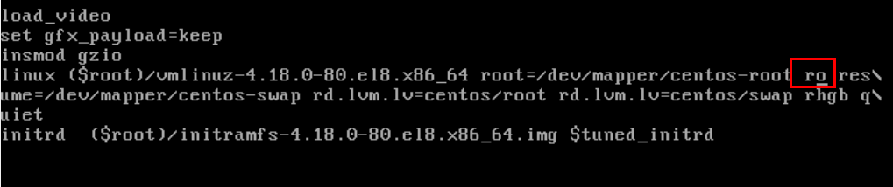

# 重置root密码

1. 重启centos服务器，通过按方向键停留在如下图内核选择的界面，按e进入


2. 将下图红框中的`ro`更改为，下下图红框中的`rw init=/sysroot/bin/sh`，按`Ctrl`+`x`保存后进入单用户模式



3. 修改密码

    ```
    chroot /sysroot

    passwd
    新密码
    确认新密码

    touch /.autorelabel
    ```
最后一条命令`reboot`没用，需要手动重启服务器后完成。
