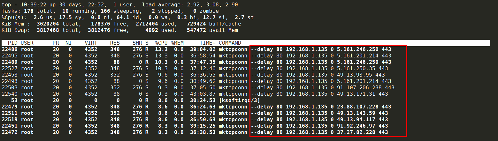

# 挖矿
内网服务器22端口，通过ikuai路由器做端口映射到外网进行测试时，被植入挖矿代码，导致服务器cpu占用100%，终端连接数达到四十万条，服务器完全无法连接，甚至ikuai路由器cpu也被占满，导致公司网络卡顿。

使用top查看进程占用情况  
  
有时候可能只有一个进程。cpu 占用越多，该进程是挖矿进程的可能性越大；

通过pid进程号，查找该程序具体位置
```bash
# /porc/{pid号}
ll /proc/26571/ | grep exe
lrwxrwxrwx 1 root root 0 May 15 11:13 exe -> /usr/bin/mktcpconn

# 将其删除
rm -f /usr/bin/mktcpconn

# 杀掉进程
kill -9 26571

# 检查是否有定时任务或开机自启
crontab -l
*	*/2	*	*	*	update-blacklist
#如果发现有可疑的任务 则编辑删掉任务（记得看下这个脚本的位置将脚本也一起删掉）
rm -f /usr/bin/update-blacklist

[root@lwz bin]# grep "mktcpconn" /* -r
/etc/scripts/dos-vvnnmm-proxy.sh:				[ -n "$pid" ] && [ "`ps -p \"$pid\" -n ] && kill "$pid"
/etc/scripts/dos-vvnnmm-proxy.sh:	if [ -z "$pid" ] || [ "`ps -p \"$pid\" -o comm=`" != mktcpcon
/etc/scripts/dos-vvnnmm-proxy.sh:		mktcpconn --delay 80 "$my_address" 0 "$a" 443 & pid=

# 删掉
[root@lwz bin]# rm -f /etc/scripts/dos-vvnnmm-proxy.sh

# 检查是否被创建了其它用户
tail -5 /etc/passwd

# 删除用户和组
userdel -r 用户名 && groupdel 用户名
```


